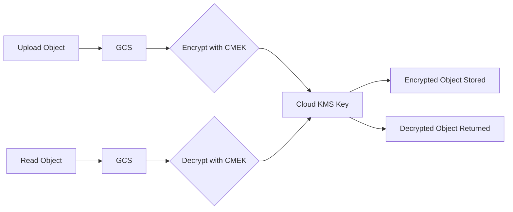

# How to Implement Server-Side Encryption with Customer-Managed Keys in Google Cloud Storage

Author: [nawazdhandala](https://www.github.com/nawazdhandala)

Tags: GCP, Google Cloud Storage, CMEK, Encryption, Cloud KMS

Description: A practical guide to implementing server-side encryption with customer-managed encryption keys (CMEK) in Google Cloud Storage using Cloud KMS.

---

Google Cloud Storage encrypts all data at rest by default using Google-managed encryption keys. For most workloads, this is perfectly fine. But when compliance requirements, security policies, or regulatory frameworks demand that you control the encryption keys yourself, Customer-Managed Encryption Keys (CMEK) give you that control. With CMEK, you create and manage the keys in Cloud KMS, and GCS uses them to encrypt your data.

This guide walks through setting up CMEK for Cloud Storage, from creating the key in Cloud KMS to configuring buckets and handling key rotation.

## How CMEK Works with Cloud Storage

When you set a CMEK on a Cloud Storage bucket:

1. Objects uploaded to the bucket are encrypted using your Cloud KMS key
2. When someone reads an object, GCS decrypts it using your key
3. If you disable or destroy the key, the objects become inaccessible
4. Key usage is logged in Cloud Audit Logs



The encryption and decryption happen transparently. Your application code does not change - it just reads and writes objects normally. The difference is that you control the key.

## Step 1: Create a Cloud KMS Key Ring and Key

First, create a key ring and a key in Cloud KMS. The key ring location should match your bucket location for best performance.

```bash
# Create a key ring in the same region as your bucket
gcloud kms keyrings create my-storage-keyring \
  --location=us-central1

# Create an encryption key within the key ring
gcloud kms keys create my-storage-key \
  --keyring=my-storage-keyring \
  --location=us-central1 \
  --purpose=encryption \
  --rotation-period=90d \
  --next-rotation-time="2026-05-17T00:00:00Z"
```

The `--rotation-period` flag sets up automatic key rotation every 90 days. The old key versions are retained so existing encrypted data can still be decrypted.

## Step 2: Grant Cloud Storage Access to the Key

Cloud Storage needs permission to use your KMS key. The Cloud Storage service account must have the `cloudkms.cryptoKeyEncrypterDecrypter` role on the key.

Find your project's Cloud Storage service account:

```bash
# Get the Cloud Storage service account
gcloud storage service-agent --project=my-project-id
```

Grant it access to the key:

```bash
# Grant the GCS service account permission to use the KMS key
gcloud kms keys add-iam-policy-binding my-storage-key \
  --keyring=my-storage-keyring \
  --location=us-central1 \
  --member="serviceAccount:service-PROJECT_NUMBER@gs-project-accounts.iam.gserviceaccount.com" \
  --role="roles/cloudkms.cryptoKeyEncrypterDecrypter"
```

## Step 3: Configure the Bucket to Use CMEK

### Set CMEK as the Default Encryption Key

```bash
# Set the CMEK as the default encryption key for a bucket
gcloud storage buckets update gs://my-secure-bucket \
  --default-encryption-key=projects/my-project-id/locations/us-central1/keyRings/my-storage-keyring/cryptoKeys/my-storage-key
```

Now all new objects uploaded to this bucket will be encrypted with your CMEK by default.

### Create a New Bucket with CMEK

```bash
# Create a bucket with CMEK from the start
gcloud storage buckets create gs://my-encrypted-bucket \
  --location=us-central1 \
  --default-encryption-key=projects/my-project-id/locations/us-central1/keyRings/my-storage-keyring/cryptoKeys/my-storage-key
```

### Verify the Encryption Configuration

```bash
# Check the default encryption key on a bucket
gcloud storage buckets describe gs://my-secure-bucket \
  --format="json(default_kms_key)"
```

## Step 4: Upload and Verify Encrypted Objects

Upload an object and check that it uses your CMEK:

```bash
# Upload a file - it will be encrypted with CMEK automatically
gcloud storage cp sensitive-data.csv gs://my-secure-bucket/data/

# Verify the encryption key used for the object
gcloud storage objects describe gs://my-secure-bucket/data/sensitive-data.csv \
  --format="json(kms_key)"
```

The output should show your Cloud KMS key path.

## Per-Object CMEK

You can also specify a different CMEK for individual objects, overriding the bucket default:

```bash
# Upload a file with a specific CMEK (different from bucket default)
gcloud storage cp top-secret.pdf gs://my-bucket/classified/ \
  --encryption-key=projects/my-project/locations/us-central1/keyRings/high-security/cryptoKeys/top-secret-key
```

## Key Rotation

Key rotation is a security best practice. When you rotate a key:

- A new key version is created and becomes the primary version
- New objects are encrypted with the new key version
- Existing objects remain encrypted with the key version that was used when they were written
- All key versions remain available for decryption until explicitly disabled or destroyed

### Setting Up Automatic Rotation

If you did not set rotation during key creation:

```bash
# Configure automatic key rotation every 90 days
gcloud kms keys update my-storage-key \
  --keyring=my-storage-keyring \
  --location=us-central1 \
  --rotation-period=90d \
  --next-rotation-time="2026-05-17T00:00:00Z"
```

### Manual Key Rotation

```bash
# Manually rotate the key (creates a new primary version)
gcloud kms keys versions create \
  --key=my-storage-key \
  --keyring=my-storage-keyring \
  --location=us-central1 \
  --primary
```

### Re-Encrypting Objects with the New Key Version

Existing objects are not automatically re-encrypted when you rotate the key. To re-encrypt them with the new key version, rewrite them:

```bash
# Rewrite an object to encrypt it with the current primary key version
gcloud storage objects update gs://my-secure-bucket/data/old-file.csv \
  --encryption-key=projects/my-project/locations/us-central1/keyRings/my-storage-keyring/cryptoKeys/my-storage-key
```

For bulk re-encryption:

```python
from google.cloud import storage

def reencrypt_all_objects(bucket_name):
    """Rewrite all objects in a bucket to use the current KMS key version."""
    client = storage.Client()
    bucket = client.bucket(bucket_name)

    blobs = bucket.list_blobs()

    for blob in blobs:
        # Rewriting the blob in place triggers re-encryption with the current key
        token = None
        while True:
            token, _, _ = blob.rewrite(blob, token=token)
            if token is None:
                break
        print(f"Re-encrypted: {blob.name}")

reencrypt_all_objects("my-secure-bucket")
```

## Disabling and Destroying Keys

This is where CMEK gives you real control. If you need to make data inaccessible:

```bash
# Disable a key version (objects encrypted with it become inaccessible)
gcloud kms keys versions disable 1 \
  --key=my-storage-key \
  --keyring=my-storage-keyring \
  --location=us-central1

# Re-enable a disabled key version
gcloud kms keys versions enable 1 \
  --key=my-storage-key \
  --keyring=my-storage-keyring \
  --location=us-central1

# Schedule a key version for destruction (24-hour waiting period)
gcloud kms keys versions destroy 1 \
  --key=my-storage-key \
  --keyring=my-storage-keyring \
  --location=us-central1
```

Warning: destroying a key version permanently makes all objects encrypted with that version unreadable. There is no recovery.

## Terraform Configuration

```hcl
# Create the KMS key ring
resource "google_kms_key_ring" "storage_keyring" {
  name     = "storage-keyring"
  location = "us-central1"
}

# Create the encryption key with automatic rotation
resource "google_kms_crypto_key" "storage_key" {
  name            = "storage-encryption-key"
  key_ring        = google_kms_key_ring.storage_keyring.id
  rotation_period = "7776000s"  # 90 days in seconds
  purpose         = "ENCRYPT_DECRYPT"
}

# Grant GCS service account access to the key
data "google_storage_project_service_account" "gcs_account" {}

resource "google_kms_crypto_key_iam_member" "gcs_encrypt_decrypt" {
  crypto_key_id = google_kms_crypto_key.storage_key.id
  role          = "roles/cloudkms.cryptoKeyEncrypterDecrypter"
  member        = "serviceAccount:${data.google_storage_project_service_account.gcs_account.email_address}"
}

# Create the bucket with CMEK
resource "google_storage_bucket" "encrypted_bucket" {
  name     = "my-cmek-bucket"
  location = "us-central1"

  encryption {
    default_kms_key_name = google_kms_crypto_key.storage_key.id
  }

  uniform_bucket_level_access = true

  depends_on = [google_kms_crypto_key_iam_member.gcs_encrypt_decrypt]
}
```

## Important Considerations

**Key location matters.** The KMS key must be in the same location as the bucket, or in a location that covers the bucket's location. A key in `us-central1` works for a bucket in `us-central1` or `US`, but not for a bucket in `europe-west1`.

**Performance impact is minimal.** CMEK adds a small amount of latency for the KMS call, but it is typically negligible for most workloads.

**Cost.** Cloud KMS charges per key version per month and per cryptographic operation. For high-volume buckets, the KMS costs are worth factoring into your budget.

**Audit logging.** Every use of the key is logged in Cloud Audit Logs, giving you a complete trail of who accessed encrypted data and when.

**CMEK and lifecycle rules work together.** Objects encrypted with CMEK can still be transitioned between storage classes or deleted by lifecycle rules.

CMEK gives you the control that compliance teams and security auditors want, while keeping the developer experience straightforward. The encryption is transparent to your applications, and you gain the ability to revoke access to data instantly by disabling the key.
