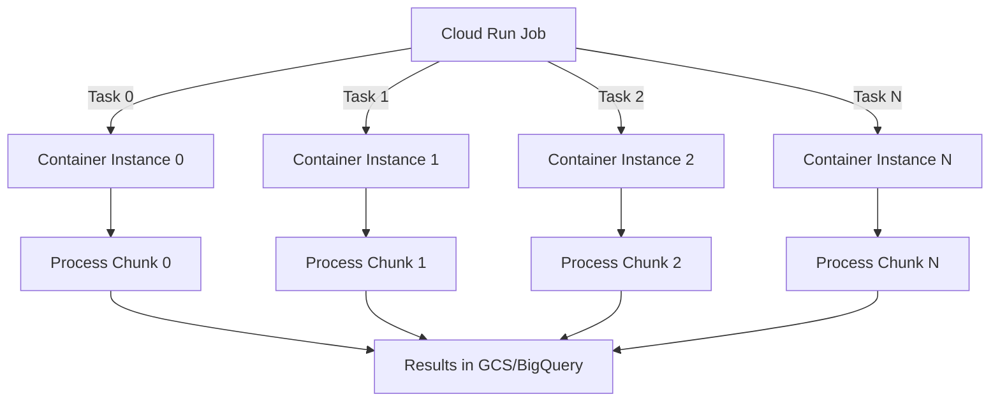

# How to Implement Serverless Batch Processing Using Cloud Run Jobs with Parallel Task Execution

Author: [nawazdhandala](https://www.github.com/nawazdhandala)

Tags: GCP, Cloud Run Jobs, Serverless, Batch Processing, Parallel Execution

Description: Learn how to implement serverless batch processing on Google Cloud using Cloud Run Jobs with parallel task execution for high-throughput workloads.

---

Batch processing is the backbone of many data pipelines. You have a large dataset, you need to process every item, and you want it done fast. Traditionally this means spinning up worker VMs, distributing work, monitoring progress, and tearing everything down when the job finishes. Cloud Run Jobs simplifies all of this by letting you run containerized batch workloads that scale to hundreds of parallel tasks with zero infrastructure management.

Cloud Run Jobs differ from Cloud Run services in an important way. Services handle HTTP requests and stay running. Jobs run to completion and exit. This makes them perfect for batch workloads like data migrations, image processing, report generation, or any task that has a clear start and end.

## How Parallel Task Execution Works

When you create a Cloud Run Job, you specify a task count and a parallelism level. The platform launches multiple instances of your container, each receiving a unique task index through environment variables. Your code uses this index to determine which chunk of work to process.



## Setting Up a Parallel Batch Job

Let's build a job that processes millions of records from BigQuery in parallel. Each task handles a distinct subset of the data.

```python
# main.py - Batch processing job with parallel task execution
import os
import logging
from google.cloud import bigquery
from google.cloud import storage

logging.basicConfig(level=logging.INFO)
logger = logging.getLogger(__name__)

# Cloud Run Jobs provides these environment variables
TASK_INDEX = int(os.environ.get("CLOUD_RUN_TASK_INDEX", 0))
TASK_COUNT = int(os.environ.get("CLOUD_RUN_TASK_COUNT", 1))
EXECUTION_ID = os.environ.get("CLOUD_RUN_EXECUTION", "local")

# Configuration
PROJECT_ID = os.environ.get("PROJECT_ID", "my-project")
DATASET = os.environ.get("DATASET", "analytics")
TABLE = os.environ.get("TABLE", "raw_events")
OUTPUT_BUCKET = os.environ.get("OUTPUT_BUCKET", "processed-results")


def get_task_range(total_rows, task_index, task_count):
    """Calculate the row range this task should process."""
    # Divide work evenly across tasks
    chunk_size = total_rows // task_count
    remainder = total_rows % task_count

    # Distribute remainder across first few tasks
    start = task_index * chunk_size + min(task_index, remainder)
    if task_index < remainder:
        chunk_size += 1
    end = start + chunk_size

    return start, end


def process_batch():
    """Main batch processing logic."""
    bq_client = bigquery.Client(project=PROJECT_ID)
    gcs_client = storage.Client(project=PROJECT_ID)

    # First, get the total number of rows
    count_query = f"SELECT COUNT(*) as total FROM `{PROJECT_ID}.{DATASET}.{TABLE}`"
    total_rows = list(bq_client.query(count_query).result())[0].total

    logger.info(f"Task {TASK_INDEX}/{TASK_COUNT}: Total rows = {total_rows}")

    # Calculate this task's range
    start, end = get_task_range(total_rows, TASK_INDEX, TASK_COUNT)
    chunk_size = end - start

    if chunk_size == 0:
        logger.info(f"Task {TASK_INDEX}: No rows to process")
        return

    logger.info(f"Task {TASK_INDEX}: Processing rows {start} to {end}")

    # Query only this task's chunk using OFFSET and LIMIT
    query = f"""
        SELECT *
        FROM `{PROJECT_ID}.{DATASET}.{TABLE}`
        ORDER BY event_id
        LIMIT {chunk_size} OFFSET {start}
    """

    results = bq_client.query(query).result()

    # Process rows and write output
    processed_records = []
    for row in results:
        processed = transform_record(dict(row))
        processed_records.append(processed)

    # Write results to GCS as a JSON file for this task
    bucket = gcs_client.bucket(OUTPUT_BUCKET)
    blob = bucket.blob(f"output/{EXECUTION_ID}/task-{TASK_INDEX:04d}.json")

    import json
    output = "\n".join(json.dumps(r) for r in processed_records)
    blob.upload_from_string(output, content_type="application/json")

    logger.info(f"Task {TASK_INDEX}: Processed {len(processed_records)} records")


def transform_record(record):
    """Apply business logic transformation to a single record."""
    # Your transformation logic here
    record["processed"] = True
    record["execution_id"] = EXECUTION_ID
    record["task_index"] = TASK_INDEX

    # Example: normalize fields, compute aggregates, enrich data
    if "timestamp" in record:
        record["date"] = str(record["timestamp"])[:10]

    return record


if __name__ == "__main__":
    try:
        process_batch()
        logger.info(f"Task {TASK_INDEX}: Completed successfully")
    except Exception as e:
        logger.error(f"Task {TASK_INDEX}: Failed with error: {e}")
        raise  # Cloud Run Jobs will mark this task as failed
```

## Containerizing the Job

Create a Dockerfile for the batch processing job.

```dockerfile
# Dockerfile - Container for the batch processing job
FROM python:3.11-slim

WORKDIR /app

# Install dependencies
COPY requirements.txt .
RUN pip install --no-cache-dir -r requirements.txt

COPY main.py .

# Cloud Run Jobs expects the container to run and exit
CMD ["python", "main.py"]
```

The requirements file lists the Google Cloud libraries needed.

```
# requirements.txt
google-cloud-bigquery==3.14.0
google-cloud-storage==2.14.0
```

Build and push the container.

```bash
# Build and push the container image to Artifact Registry
gcloud builds submit --tag us-central1-docker.pkg.dev/YOUR_PROJECT/batch-jobs/data-processor:latest
```

## Creating and Running the Job

Create the Cloud Run Job with parallel execution settings.

```bash
# Create the job with 50 parallel tasks
gcloud run jobs create data-processing-job \
  --image=us-central1-docker.pkg.dev/YOUR_PROJECT/batch-jobs/data-processor:latest \
  --region=us-central1 \
  --tasks=50 \
  --parallelism=50 \
  --task-timeout=3600s \
  --max-retries=3 \
  --memory=2Gi \
  --cpu=2 \
  --set-env-vars="PROJECT_ID=YOUR_PROJECT,DATASET=analytics,TABLE=raw_events,OUTPUT_BUCKET=processed-results"
```

Execute the job.

```bash
# Run the job and wait for completion
gcloud run jobs execute data-processing-job \
  --region=us-central1 \
  --wait
```

## Handling Task Failures and Retries

Cloud Run Jobs automatically retries failed tasks up to the configured `max-retries`. Each retry gets the same task index, so your code processes the same data chunk. To make this work reliably, your processing logic needs to be idempotent.

```python
# Idempotent output writing - check if output already exists
def write_output_idempotent(bucket_name, blob_path, data):
    """Write output only if it does not already exist."""
    client = storage.Client()
    bucket = client.bucket(bucket_name)
    blob = bucket.blob(blob_path)

    # Check if this task's output already exists from a previous attempt
    if blob.exists():
        logger.info(f"Output {blob_path} already exists, skipping write")
        return

    blob.upload_from_string(data, content_type="application/json")
    logger.info(f"Wrote output to {blob_path}")
```

## Combining Results After All Tasks Complete

Once all parallel tasks finish, you often need to merge the individual results. You can trigger a follow-up job or function.

```python
# merge_results.py - Combine all task outputs into a single file
from google.cloud import storage
import json

def merge_task_outputs(bucket_name, execution_id, output_path):
    """Merge all task output files into a single result file."""
    client = storage.Client()
    bucket = client.bucket(bucket_name)

    # List all task output files for this execution
    prefix = f"output/{execution_id}/"
    blobs = list(bucket.list_blobs(prefix=prefix))

    all_records = []
    for blob in sorted(blobs, key=lambda b: b.name):
        if blob.name.endswith(".json"):
            content = blob.download_as_text()
            for line in content.strip().split("\n"):
                if line:
                    all_records.append(json.loads(line))

    # Write merged output
    merged_blob = bucket.blob(output_path)
    merged_data = "\n".join(json.dumps(r) for r in all_records)
    merged_blob.upload_from_string(merged_data, content_type="application/json")

    print(f"Merged {len(all_records)} records from {len(blobs)} tasks")
```

## Scaling Considerations

Cloud Run Jobs can run up to 10,000 tasks per job with configurable parallelism. A few things to keep in mind when setting these values:

- Set parallelism equal to task count for maximum throughput, or lower it if your downstream services have rate limits
- Each task gets its own container instance with the CPU and memory you configure
- Task timeout applies per task, not per job - a job with 1000 tasks each timing out at 1 hour could theoretically run for 1000 hours if there is no parallelism
- The `CLOUD_RUN_TASK_INDEX` variable is zero-indexed and unique per task within an execution

## Scheduling Batch Jobs

You can schedule Cloud Run Jobs to run on a regular basis using Cloud Scheduler.

```bash
# Schedule the batch job to run every night at midnight
gcloud scheduler jobs create http nightly-data-processing \
  --location=us-central1 \
  --schedule="0 0 * * *" \
  --uri="https://us-central1-run.googleapis.com/apis/run.googleapis.com/v1/namespaces/YOUR_PROJECT/jobs/data-processing-job:run" \
  --http-method=POST \
  --oauth-service-account-email=scheduler-sa@YOUR_PROJECT.iam.gserviceaccount.com
```

## Wrapping Up

Cloud Run Jobs with parallel task execution gives you a serverless batch processing framework that scales to thousands of parallel workers. The key pattern is using the task index environment variable to partition work across containers. Combined with idempotent processing and automatic retries, you get a reliable batch system without managing any compute infrastructure. For data processing, ETL pipelines, and large-scale transformations on GCP, this is one of the simplest and most cost-effective approaches available.
