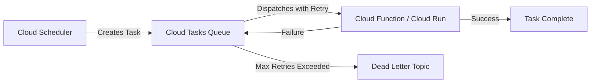

# How to Implement Serverless Cron Jobs with Error Handling Using Cloud Scheduler and Cloud Tasks

Author: [nawazdhandala](https://www.github.com/nawazdhandala)

Tags: GCP, Cloud Scheduler, Cloud Tasks, Serverless, Cron Jobs

Description: Learn how to build reliable serverless cron jobs on Google Cloud using Cloud Scheduler and Cloud Tasks with proper error handling and retry logic.

---

Running scheduled tasks is one of the most common requirements in any production system. Whether you need to send daily reports, clean up old data, or trigger periodic API calls, cron jobs are unavoidable. The traditional approach involves spinning up a VM, installing cron, and hoping nothing breaks at 3 AM. On Google Cloud, you can do much better by combining Cloud Scheduler with Cloud Tasks.

This guide walks through setting up serverless cron jobs that handle failures gracefully, retry intelligently, and scale without you managing any infrastructure.

## Why Cloud Scheduler Plus Cloud Tasks

Cloud Scheduler on its own is already a managed cron service. You define a schedule, point it at an HTTP endpoint or Pub/Sub topic, and it fires on time. But what happens when your target endpoint is down? Or when the job takes longer than expected and overlaps with the next run?

This is where Cloud Tasks enters the picture. Instead of having Cloud Scheduler call your endpoint directly, you have it push a task into a Cloud Tasks queue. The queue handles retries, rate limiting, and deduplication. Your actual job processing happens downstream, insulated from scheduling concerns.

The architecture looks like this:



## Setting Up Cloud Scheduler

First, create a Cloud Scheduler job that pushes tasks to a Cloud Tasks queue. You will need to enable the required APIs.

```bash
# Enable the necessary APIs for Cloud Scheduler and Cloud Tasks
gcloud services enable cloudscheduler.googleapis.com
gcloud services enable cloudtasks.googleapis.com
gcloud services enable cloudfunctions.googleapis.com
```

Create a Cloud Tasks queue with retry configuration.

```bash
# Create a queue with custom retry settings
# max-attempts controls how many times a failed task is retried
# min-backoff and max-backoff control the delay between retries
gcloud tasks queues create cron-job-queue \
  --location=us-central1 \
  --max-attempts=5 \
  --min-backoff=10s \
  --max-backoff=300s \
  --max-doublings=3 \
  --max-concurrent-dispatches=1 \
  --max-dispatches-per-second=1
```

The `max-concurrent-dispatches=1` setting is important for cron-style workloads. It prevents overlapping executions when a previous task is still running.

## Building the Task Handler

Now create a Cloud Function that processes the scheduled tasks. This example processes a daily cleanup job.

```python
# main.py - Cloud Function that handles the scheduled task
import functions_framework
import logging
from google.cloud import bigquery
from datetime import datetime, timedelta

logging.basicConfig(level=logging.INFO)
logger = logging.getLogger(__name__)

@functions_framework.http
def handle_cron_task(request):
    """Process the scheduled cron task with proper error handling."""
    try:
        # Parse the task payload sent from Cloud Tasks
        payload = request.get_json(silent=True) or {}
        job_type = payload.get("job_type", "cleanup")

        logger.info(f"Starting cron job: {job_type}")

        if job_type == "cleanup":
            rows_deleted = run_cleanup()
            return {"status": "success", "rows_deleted": rows_deleted}, 200
        elif job_type == "report":
            run_daily_report()
            return {"status": "success"}, 200
        else:
            # Return 200 for unknown job types to avoid retries
            logger.warning(f"Unknown job type: {job_type}")
            return {"status": "skipped", "reason": "unknown job type"}, 200

    except TransientError as e:
        # Return 500 to trigger Cloud Tasks retry
        logger.error(f"Transient error, will retry: {e}")
        return {"status": "error", "message": str(e)}, 500

    except PermanentError as e:
        # Return 200 to prevent retries for permanent failures
        logger.error(f"Permanent error, skipping retry: {e}")
        return {"status": "failed", "message": str(e)}, 200


class TransientError(Exception):
    """Errors that may resolve on retry (network issues, rate limits)."""
    pass

class PermanentError(Exception):
    """Errors that will not resolve on retry (bad data, missing permissions)."""
    pass


def run_cleanup():
    """Delete records older than 90 days from the staging table."""
    client = bigquery.Client()
    cutoff = datetime.utcnow() - timedelta(days=90)

    query = f"""
        DELETE FROM `project.dataset.staging_table`
        WHERE created_at < '{cutoff.isoformat()}'
    """

    try:
        result = client.query(query).result()
        deleted = result.num_dml_affected_rows
        logger.info(f"Cleaned up {deleted} rows")
        return deleted
    except Exception as e:
        if "rate limit" in str(e).lower():
            raise TransientError(f"BigQuery rate limited: {e}")
        raise PermanentError(f"Cleanup failed: {e}")
```

Deploy the function.

```bash
# Deploy the Cloud Function with appropriate memory and timeout
gcloud functions deploy cron-task-handler \
  --gen2 \
  --runtime=python311 \
  --region=us-central1 \
  --source=. \
  --entry-point=handle_cron_task \
  --trigger-http \
  --no-allow-unauthenticated \
  --memory=256MB \
  --timeout=540s \
  --service-account=cron-job-sa@YOUR_PROJECT.iam.gserviceaccount.com
```

## Connecting Cloud Scheduler to Cloud Tasks

Now, instead of pointing Cloud Scheduler directly at the function, create a scheduler job that pushes tasks into the queue.

```python
# create_scheduler.py - Script to set up the scheduler job
from google.cloud import scheduler_v1
from google.cloud import tasks_v2
from google.protobuf import timestamp_pb2
import json

def create_cron_scheduler(project_id, location, queue_name, function_url):
    """Create a Cloud Scheduler job that pushes to Cloud Tasks."""

    # Build the Cloud Tasks client to create tasks via HTTP target
    scheduler_client = scheduler_v1.CloudSchedulerClient()
    parent = f"projects/{project_id}/locations/{location}"

    # The scheduler job creates a Cloud Tasks HTTP request
    job = scheduler_v1.Job(
        name=f"{parent}/jobs/daily-cleanup-cron",
        description="Daily cleanup job via Cloud Tasks",
        schedule="0 2 * * *",  # Run at 2 AM daily
        time_zone="America/New_York",
        http_target=scheduler_v1.HttpTarget(
            uri=f"https://cloudtasks.googleapis.com/v2/projects/{project_id}/locations/{location}/queues/{queue_name}/tasks",
            http_method=scheduler_v1.HttpMethod.POST,
            body=json.dumps({
                "task": {
                    "http_request": {
                        "url": function_url,
                        "http_method": "POST",
                        "body": json.dumps({"job_type": "cleanup"}).encode().decode(),
                        "headers": {
                            "Content-Type": "application/json"
                        },
                        "oidc_token": {
                            "service_account_email": f"cron-job-sa@{project_id}.iam.gserviceaccount.com"
                        }
                    }
                }
            }).encode(),
            headers={
                "Content-Type": "application/json"
            },
            oauth_token=scheduler_v1.OAuthToken(
                service_account_email=f"cron-job-sa@{project_id}.iam.gserviceaccount.com"
            )
        ),
        retry_config=scheduler_v1.RetryConfig(
            retry_count=3,
            min_backoff_duration={"seconds": 5},
            max_backoff_duration={"seconds": 60},
        )
    )

    response = scheduler_client.create_job(parent=parent, job=job)
    print(f"Created scheduler job: {response.name}")
    return response
```

## Implementing a Dead Letter Queue

When a task exhausts all its retries, you want to know about it. Set up a Pub/Sub dead letter topic to catch these failures.

```bash
# Create a dead letter topic and subscription for failed tasks
gcloud pubsub topics create cron-job-dead-letters
gcloud pubsub subscriptions create cron-job-dead-letters-sub \
  --topic=cron-job-dead-letters \
  --ack-deadline=60
```

Then create an alerting function that fires when messages land in the dead letter topic.

```python
# alert_handler.py - Function triggered by dead letter messages
import functions_framework
import base64
import json
import requests

@functions_framework.cloud_event
def handle_dead_letter(cloud_event):
    """Alert when a cron job task fails all retries."""
    # Decode the Pub/Sub message
    message_data = base64.b64decode(cloud_event.data["message"]["data"])
    failed_task = json.loads(message_data)

    # Send alert to your monitoring channel
    alert_payload = {
        "text": f"Cron job failed after all retries: {json.dumps(failed_task, indent=2)}"
    }

    # Post to a Slack webhook or any alerting endpoint
    webhook_url = get_secret("slack-webhook-url")
    requests.post(webhook_url, json=alert_payload)

    print(f"Dead letter alert sent for task: {failed_task}")
```

## Error Handling Strategy

The key insight for error handling in this setup is distinguishing between transient and permanent failures. Your response codes control what happens next:

- Return HTTP 2xx: Cloud Tasks considers the task successful and removes it from the queue
- Return HTTP 5xx: Cloud Tasks considers it a failure and schedules a retry based on your queue configuration
- Return HTTP 4xx (except 429): Cloud Tasks treats this as a permanent failure and does not retry

This means your task handler should catch exceptions and decide whether to return a retryable status code or a permanent one. Network timeouts, rate limits, and temporary service outages should return 500. Invalid data, missing resources, or permission errors should return 200 with an error logged.

## Monitoring Your Cron Jobs

Set up monitoring to track the health of your scheduled tasks.

```bash
# Create an alert policy that fires when the dead letter topic receives messages
gcloud alpha monitoring policies create \
  --notification-channels=YOUR_CHANNEL_ID \
  --display-name="Cron Job Failure Alert" \
  --condition-display-name="Dead letter messages received" \
  --condition-filter='resource.type="pubsub_subscription" AND resource.labels.subscription_id="cron-job-dead-letters-sub" AND metric.type="pubsub.googleapis.com/subscription/num_undelivered_messages"' \
  --condition-threshold-value=1 \
  --condition-threshold-comparison=COMPARISON_GT
```

You should also monitor the Cloud Tasks queue itself to watch for growing backlogs.

## Preventing Duplicate Execution

One common problem with cron jobs is duplicate execution. Cloud Tasks supports task deduplication by name. If you name your tasks based on the schedule time, duplicates get rejected automatically.

```python
# When creating tasks, use a deterministic name based on schedule time
from google.cloud import tasks_v2
from datetime import datetime

def create_deduplicated_task(project, location, queue, url, payload):
    """Create a task with a name that prevents duplicates."""
    client = tasks_v2.CloudTasksClient()
    parent = client.queue_path(project, location, queue)

    # Use the current date as part of the task name for deduplication
    today = datetime.utcnow().strftime("%Y-%m-%d")
    task_name = f"{parent}/tasks/cleanup-{today}"

    task = tasks_v2.Task(
        name=task_name,
        http_request=tasks_v2.HttpRequest(
            url=url,
            http_method=tasks_v2.HttpMethod.POST,
            body=json.dumps(payload).encode(),
            oidc_token=tasks_v2.OidcToken(
                service_account_email=f"cron-job-sa@{project}.iam.gserviceaccount.com"
            ),
        ),
    )

    try:
        response = client.create_task(parent=parent, task=task)
        return response
    except Exception as e:
        if "ALREADY_EXISTS" in str(e):
            print(f"Task {task_name} already exists, skipping duplicate")
            return None
        raise
```

## Wrapping Up

Combining Cloud Scheduler with Cloud Tasks gives you a production-grade cron system that handles failures, retries intelligently, and scales without any servers to manage. The error handling pattern of classifying failures as transient or permanent keeps your retry logic clean and prevents wasted compute on unrecoverable errors.

The dead letter queue ensures you always know when something goes wrong, and task deduplication prevents the accidental double-processing that plagues many cron implementations. For teams running on GCP, this pattern replaces the fragile VM-based cron setups and gives you something you can actually trust in production.
