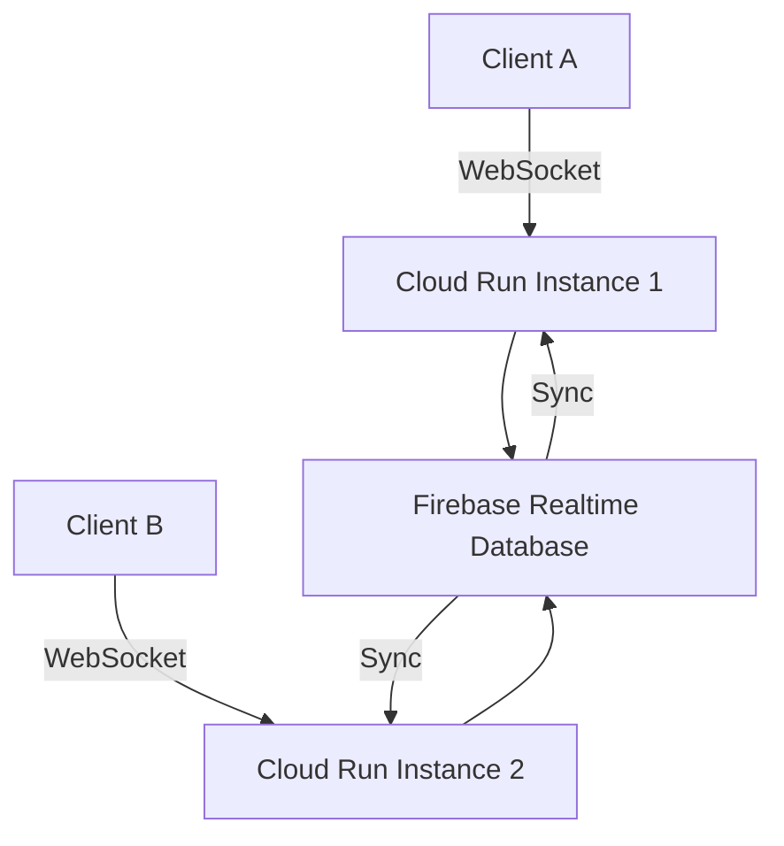

# How to Implement Serverless WebSocket Connections Using Cloud Run and Firebase Realtime Database

Author: [nawazdhandala](https://www.github.com/nawazdhandala)

Tags: GCP, WebSocket, Cloud Run, Firebase Realtime Database, Serverless, Real-time

Description: Learn how to implement real-time WebSocket connections using Cloud Run for the server and Firebase Realtime Database for state synchronization on GCP.

---

Real-time features like live chat, notifications, collaborative editing, and live dashboards typically require WebSocket connections. The challenge with serverless platforms is that WebSocket connections are long-lived, and serverless functions are designed for short-lived request-response cycles. Cloud Run bridges this gap - it supports WebSocket connections with configurable timeouts up to 60 minutes.

Combined with Firebase Realtime Database for state synchronization, you can build a real-time system that scales automatically and costs nothing when idle. This post shows how to set it up.

## The Challenge with WebSockets on Serverless

Traditional serverless functions (like Cloud Functions) handle a single request and return a response. WebSocket connections, by contrast, stay open and exchange messages over time. Cloud Run is the better fit here because it runs a full web server that can handle persistent connections, and it supports WebSocket protocol natively.

The one limitation is that Cloud Run scales instances independently, and there is no built-in way to share state between instances. If user A is connected to instance 1 and user B is connected to instance 2, how do they communicate? Firebase Realtime Database solves this by acting as a shared state layer that all instances can subscribe to.



## Step 1: Build the WebSocket Server

Here is a Node.js WebSocket server designed for Cloud Run:

```javascript
// server.js - WebSocket server with Firebase Realtime Database sync
const express = require("express");
const http = require("http");
const WebSocket = require("ws");
const admin = require("firebase-admin");

// Initialize Firebase Admin SDK
admin.initializeApp({
  databaseURL: `https://my-project-default-rtdb.firebaseio.com`,
});

const db = admin.database();
const app = express();
const server = http.createServer(app);
const wss = new WebSocket.Server({ server });

// Track connected clients per room
const rooms = new Map();

// Health check endpoint (required for Cloud Run)
app.get("/health", (req, res) => {
  res.json({
    status: "healthy",
    connections: wss.clients.size,
    rooms: rooms.size,
  });
});

wss.on("connection", (ws, req) => {
  // Extract room ID from the URL path
  const url = new URL(req.url, `http://${req.headers.host}`);
  const roomId = url.searchParams.get("room") || "default";
  const userId = url.searchParams.get("userId") || `user-${Date.now()}`;

  console.log(`Client connected: ${userId} to room ${roomId}`);

  // Add client to the room
  if (!rooms.has(roomId)) {
    rooms.set(roomId, new Set());
    // Subscribe to Firebase changes for this room
    subscribeToRoom(roomId);
  }
  rooms.get(roomId).add(ws);

  // Store connection metadata
  ws.roomId = roomId;
  ws.userId = userId;

  // Register the user in Firebase
  const userRef = db.ref(`rooms/${roomId}/users/${userId}`);
  userRef.set({
    connectedAt: admin.database.ServerValue.TIMESTAMP,
    status: "online",
  });

  // Send recent messages from Firebase
  sendRecentMessages(ws, roomId);

  // Handle incoming messages from the client
  ws.on("message", (data) => {
    try {
      const message = JSON.parse(data.toString());
      handleClientMessage(ws, message);
    } catch (err) {
      console.error("Invalid message:", err);
      ws.send(JSON.stringify({ type: "error", message: "Invalid JSON" }));
    }
  });

  // Handle disconnection
  ws.on("close", () => {
    console.log(`Client disconnected: ${userId} from room ${roomId}`);

    // Remove from local room
    const room = rooms.get(roomId);
    if (room) {
      room.delete(ws);
      if (room.size === 0) {
        rooms.delete(roomId);
        // Unsubscribe from Firebase for this room
        db.ref(`rooms/${roomId}/messages`).off();
      }
    }

    // Update user status in Firebase
    userRef.update({ status: "offline", disconnectedAt: admin.database.ServerValue.TIMESTAMP });
  });

  // Handle errors
  ws.on("error", (err) => {
    console.error(`WebSocket error for ${userId}:`, err);
  });
});


function handleClientMessage(ws, message) {
  /**
   * Handle messages from connected clients.
   * Messages are written to Firebase, which syncs to all instances.
   */
  switch (message.type) {
    case "chat":
      // Write the message to Firebase - all instances will receive it
      const messageRef = db.ref(`rooms/${ws.roomId}/messages`).push();
      messageRef.set({
        userId: ws.userId,
        text: message.text,
        timestamp: admin.database.ServerValue.TIMESTAMP,
      });
      break;

    case "typing":
      // Broadcast typing indicator via Firebase
      db.ref(`rooms/${ws.roomId}/typing/${ws.userId}`).set({
        isTyping: message.isTyping,
        timestamp: admin.database.ServerValue.TIMESTAMP,
      });
      break;

    default:
      ws.send(JSON.stringify({ type: "error", message: "Unknown message type" }));
  }
}


function subscribeToRoom(roomId) {
  /**
   * Subscribe to Firebase changes for a room.
   * When a message is written to Firebase (from any Cloud Run instance),
   * broadcast it to all locally connected clients.
   */
  const messagesRef = db.ref(`rooms/${roomId}/messages`);

  // Listen for new messages
  messagesRef.orderByChild("timestamp").limitToLast(1).on("child_added", (snapshot) => {
    const message = snapshot.val();
    if (!message) return;

    // Broadcast to all local WebSocket clients in this room
    const room = rooms.get(roomId);
    if (room) {
      const payload = JSON.stringify({
        type: "chat",
        userId: message.userId,
        text: message.text,
        timestamp: message.timestamp,
        messageId: snapshot.key,
      });

      room.forEach((client) => {
        if (client.readyState === WebSocket.OPEN) {
          client.send(payload);
        }
      });
    }
  });

  // Listen for typing indicators
  db.ref(`rooms/${roomId}/typing`).on("child_changed", (snapshot) => {
    const typing = snapshot.val();
    const room = rooms.get(roomId);
    if (room) {
      const payload = JSON.stringify({
        type: "typing",
        userId: snapshot.key,
        isTyping: typing.isTyping,
      });

      room.forEach((client) => {
        if (client.readyState === WebSocket.OPEN && client.userId !== snapshot.key) {
          client.send(payload);
        }
      });
    }
  });
}


async function sendRecentMessages(ws, roomId) {
  /**
   * Send the last 50 messages to a newly connected client.
   */
  const snapshot = await db
    .ref(`rooms/${roomId}/messages`)
    .orderByChild("timestamp")
    .limitToLast(50)
    .once("value");

  const messages = [];
  snapshot.forEach((child) => {
    messages.push({
      messageId: child.key,
      ...child.val(),
    });
  });

  ws.send(JSON.stringify({
    type: "history",
    messages: messages,
  }));
}


// Start the server
const PORT = process.env.PORT || 8080;
server.listen(PORT, () => {
  console.log(`WebSocket server running on port ${PORT}`);
});
```

## Step 2: Create the Dockerfile

```dockerfile
# Dockerfile for the WebSocket server
FROM node:20-slim

WORKDIR /app

COPY package*.json ./
RUN npm ci --only=production

COPY . .

EXPOSE 8080

CMD ["node", "server.js"]
```

The `package.json`:

```json
{
  "name": "websocket-server",
  "version": "1.0.0",
  "dependencies": {
    "express": "^4.18.2",
    "firebase-admin": "^12.0.0",
    "ws": "^8.16.0"
  }
}
```

## Step 3: Deploy to Cloud Run

Deploy with WebSocket support and increased timeout:

```bash
# Build the container
gcloud builds submit --tag gcr.io/my-project/websocket-server:latest

# Deploy to Cloud Run with WebSocket-friendly settings
gcloud run deploy websocket-server \
  --image=gcr.io/my-project/websocket-server:latest \
  --region=us-central1 \
  --allow-unauthenticated \
  --min-instances=1 \
  --max-instances=10 \
  --memory=512Mi \
  --cpu=1 \
  --timeout=3600 \
  --session-affinity \
  --project=my-project
```

Key settings for WebSocket support:
- `--timeout=3600`: Allows connections to stay open for up to 1 hour
- `--session-affinity`: Keeps the same client connected to the same instance
- `--min-instances=1`: Keeps at least one instance warm to avoid cold start delays

## Step 4: Build the Client

Here is a browser-based WebSocket client:

```html
<!-- client.html -->
<!DOCTYPE html>
<html>
<head>
    <title>Real-time Chat</title>
</head>
<body>
    <div id="messages"></div>
    <input type="text" id="messageInput" placeholder="Type a message...">
    <button onclick="sendMessage()">Send</button>

    <script>
    // Connect to the WebSocket server
    const roomId = "general";
    const userId = "user-" + Math.random().toString(36).substr(2, 9);
    const wsUrl = `wss://websocket-server-xxx.run.app?room=${roomId}&userId=${userId}`;

    let ws;

    function connect() {
        ws = new WebSocket(wsUrl);

        ws.onopen = () => {
            console.log("Connected to WebSocket server");
            appendMessage("System", "Connected to chat");
        };

        ws.onmessage = (event) => {
            const data = JSON.parse(event.data);

            switch (data.type) {
                case "chat":
                    appendMessage(data.userId, data.text);
                    break;
                case "history":
                    // Display recent messages
                    data.messages.forEach(msg => {
                        appendMessage(msg.userId, msg.text);
                    });
                    break;
                case "typing":
                    // Show typing indicator
                    showTyping(data.userId, data.isTyping);
                    break;
            }
        };

        ws.onclose = () => {
            console.log("Disconnected, reconnecting in 3 seconds...");
            appendMessage("System", "Disconnected. Reconnecting...");
            setTimeout(connect, 3000);
        };

        ws.onerror = (error) => {
            console.error("WebSocket error:", error);
        };
    }

    function sendMessage() {
        const input = document.getElementById("messageInput");
        const text = input.value.trim();
        if (text && ws.readyState === WebSocket.OPEN) {
            ws.send(JSON.stringify({ type: "chat", text: text }));
            input.value = "";
        }
    }

    function appendMessage(user, text) {
        const div = document.getElementById("messages");
        const p = document.createElement("p");
        p.textContent = `${user}: ${text}`;
        div.appendChild(p);
        div.scrollTop = div.scrollHeight;
    }

    function showTyping(userId, isTyping) {
        // Show or hide typing indicator for userId
        console.log(`${userId} is ${isTyping ? "typing" : "not typing"}`);
    }

    // Handle Enter key
    document.getElementById("messageInput").addEventListener("keypress", (e) => {
        if (e.key === "Enter") sendMessage();
    });

    // Connect on page load
    connect();
    </script>
</body>
</html>
```

## Step 5: Set Up Firebase Realtime Database Rules

Secure your Firebase Realtime Database:

```json
{
  "rules": {
    "rooms": {
      "$roomId": {
        "messages": {
          ".read": true,
          ".write": true,
          "$messageId": {
            ".validate": "newData.hasChildren(['userId', 'text', 'timestamp'])"
          }
        },
        "users": {
          ".read": true,
          "$userId": {
            ".write": true
          }
        },
        "typing": {
          ".read": true,
          "$userId": {
            ".write": true
          }
        }
      }
    }
  }
}
```

## Step 6: Handle Scaling and Reconnection

When Cloud Run scales up, new instances need to subscribe to Firebase. When it scales down, connections close and clients need to reconnect. The reconnection logic in the client handles this automatically.

For the server side, add graceful shutdown handling:

```javascript
// Handle SIGTERM for graceful shutdown on Cloud Run
process.on("SIGTERM", () => {
  console.log("SIGTERM received, shutting down gracefully");

  // Close all WebSocket connections with a close message
  wss.clients.forEach((client) => {
    if (client.readyState === WebSocket.OPEN) {
      client.send(JSON.stringify({ type: "server_shutdown" }));
      client.close(1001, "Server shutting down");
    }
  });

  // Close the HTTP server
  server.close(() => {
    console.log("Server closed");
    process.exit(0);
  });
});
```

## Summary

WebSocket support on Cloud Run combined with Firebase Realtime Database gives you a scalable, serverless real-time communication system. Cloud Run handles the WebSocket connections and scales based on demand. Firebase Realtime Database synchronizes state across all instances, ensuring messages reach all connected clients regardless of which instance they are connected to. The system scales to zero when nobody is connected and handles thousands of concurrent connections when demand is high. Start with a simple chat implementation and expand to notifications, collaborative features, or live dashboards.
