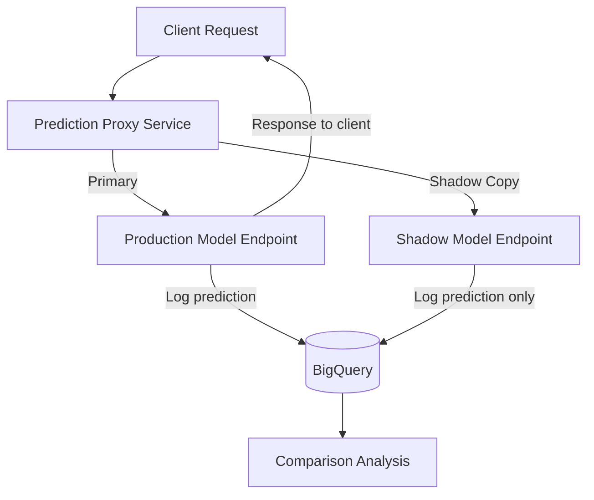

# How to Implement Shadow Mode Testing for ML Models on Google Cloud

Author: [nawazdhandala](https://www.github.com/nawazdhandala)

Tags: MLOps, Shadow Testing, Vertex AI, Model Deployment, Google Cloud

Description: Learn how to implement shadow mode testing for machine learning models on Google Cloud to validate new models against production traffic without affecting users.

---

Shadow mode testing is the safest way to validate a new ML model before deploying it to production. The idea is simple: your production model serves all real traffic and returns predictions to users as normal. Meanwhile, the shadow model receives a copy of every request, makes its own prediction, and logs it - but that prediction is never shown to users. You then compare the shadow model's predictions against the production model's predictions (and against ground truth if available) to decide whether the shadow model is ready for promotion.

This approach is safer than even canary deployments because users are never exposed to the shadow model's predictions. It is particularly useful for high-stakes predictions where even a small percentage of bad predictions is unacceptable - think fraud detection, credit scoring, or medical diagnosis.

## Architecture Overview



The key architectural decision is where to fork the traffic. You can do it at the application level, at a proxy layer, or using Pub/Sub for asynchronous shadow predictions.

## Step 1: Deploy the Shadow Model

Deploy the shadow model to its own endpoint. This keeps it completely isolated from production.

```python
# shadow/deploy_shadow.py
from google.cloud import aiplatform

def deploy_shadow_model(model_resource, shadow_endpoint_name):
    """Deploy a model to a shadow endpoint for testing."""
    aiplatform.init(project="my-project", location="us-central1")

    # Create a dedicated endpoint for shadow testing
    shadow_endpoint = aiplatform.Endpoint.create(
        display_name=shadow_endpoint_name,
        description="Shadow endpoint - predictions are not served to users",
        labels={
            "environment": "shadow",
            "purpose": "testing",
        },
    )

    # Deploy the shadow model
    model = aiplatform.Model(model_resource)
    model.deploy(
        endpoint=shadow_endpoint,
        deployed_model_display_name="shadow-model",
        machine_type="n1-standard-4",
        min_replica_count=1,
        max_replica_count=5,
        traffic_percentage=100,
    )

    print(f"Shadow model deployed to: {shadow_endpoint.resource_name}")
    return shadow_endpoint.resource_name
```

## Step 2: Build the Prediction Proxy

The proxy sits between your application and the Vertex AI endpoints. It forwards every request to both the production and shadow endpoints, returns only the production response to the caller, and logs both predictions.

```python
# shadow/prediction_proxy.py
from google.cloud import aiplatform
from google.cloud import bigquery
from concurrent.futures import ThreadPoolExecutor
import time
import json
import uuid
from flask import Flask, request, jsonify

app = Flask(__name__)

# Configuration
PROD_ENDPOINT_ID = "PRODUCTION_ENDPOINT_ID"
SHADOW_ENDPOINT_ID = "SHADOW_ENDPOINT_ID"
PROJECT_ID = "my-project"
LOG_TABLE = f"{PROJECT_ID}.ml_monitoring.shadow_comparison_logs"

# Initialize clients
aiplatform.init(project=PROJECT_ID, location="us-central1")
prod_endpoint = aiplatform.Endpoint(PROD_ENDPOINT_ID)
shadow_endpoint = aiplatform.Endpoint(SHADOW_ENDPOINT_ID)
bq_client = bigquery.Client()
executor = ThreadPoolExecutor(max_workers=10)


def get_prediction(endpoint, instances):
    """Get a prediction from an endpoint with timing."""
    start = time.time()
    try:
        response = endpoint.predict(instances=instances)
        latency = (time.time() - start) * 1000
        return {
            "predictions": response.predictions,
            "latency_ms": latency,
            "error": None,
        }
    except Exception as e:
        latency = (time.time() - start) * 1000
        return {
            "predictions": None,
            "latency_ms": latency,
            "error": str(e),
        }


@app.route("/predict", methods=["POST"])
def predict():
    """Handle prediction requests by forwarding to both endpoints."""
    request_id = str(uuid.uuid4())
    instances = request.json.get("instances", [])

    # Send to production endpoint (this is the response we return)
    prod_result = get_prediction(prod_endpoint, instances)

    # Send to shadow endpoint asynchronously (do not block the response)
    executor.submit(
        handle_shadow_prediction,
        request_id,
        instances,
        prod_result,
    )

    # Return only the production prediction to the client
    if prod_result["error"]:
        return jsonify({"error": prod_result["error"]}), 500

    return jsonify({
        "predictions": prod_result["predictions"],
        "request_id": request_id,
    })


def handle_shadow_prediction(request_id, instances, prod_result):
    """Run the shadow prediction and log the comparison."""
    shadow_result = get_prediction(shadow_endpoint, instances)

    # Log both predictions for comparison
    log_entry = {
        "request_id": request_id,
        "timestamp": time.time(),
        "input_features": json.dumps(instances),
        "prod_prediction": json.dumps(prod_result["predictions"]),
        "prod_latency_ms": prod_result["latency_ms"],
        "prod_error": prod_result["error"],
        "shadow_prediction": json.dumps(shadow_result["predictions"]),
        "shadow_latency_ms": shadow_result["latency_ms"],
        "shadow_error": shadow_result["error"],
        "predictions_match": (
            prod_result["predictions"] == shadow_result["predictions"]
            if prod_result["predictions"] and shadow_result["predictions"]
            else None
        ),
    }

    # Write to BigQuery
    errors = bq_client.insert_rows_json(LOG_TABLE, [log_entry])
    if errors:
        print(f"Error logging shadow comparison: {errors}")
```

## Step 3: Use Pub/Sub for Async Shadow Predictions

For high-throughput systems where even async HTTP calls add too much overhead, use Pub/Sub to decouple shadow predictions from the request path.

```python
# shadow/async_shadow.py
from google.cloud import pubsub_v1
from google.cloud import aiplatform
from google.cloud import bigquery
import json
import time

# Publisher - runs in your prediction proxy
class ShadowPublisher:
    """Publishes prediction requests to a Pub/Sub topic for shadow testing."""

    def __init__(self, project_id, topic_name="shadow-predictions"):
        self.publisher = pubsub_v1.PublisherClient()
        self.topic_path = self.publisher.topic_path(project_id, topic_name)

    def publish_for_shadow(self, request_id, instances, prod_prediction):
        """Publish a prediction request for shadow processing."""
        message = json.dumps({
            "request_id": request_id,
            "instances": instances,
            "prod_prediction": prod_prediction,
            "published_at": time.time(),
        }).encode("utf-8")

        future = self.publisher.publish(self.topic_path, message)
        return future


# Subscriber - runs as a separate service
class ShadowSubscriber:
    """Processes shadow prediction requests from Pub/Sub."""

    def __init__(self, project_id, shadow_endpoint_id):
        self.project_id = project_id
        aiplatform.init(project=project_id, location="us-central1")
        self.shadow_endpoint = aiplatform.Endpoint(shadow_endpoint_id)
        self.bq_client = bigquery.Client()

    def process_message(self, message):
        """Process a single shadow prediction request."""
        data = json.loads(message.data.decode("utf-8"))

        # Run the shadow prediction
        start = time.time()
        try:
            response = self.shadow_endpoint.predict(
                instances=data["instances"]
            )
            shadow_prediction = response.predictions
            shadow_error = None
        except Exception as e:
            shadow_prediction = None
            shadow_error = str(e)

        shadow_latency = (time.time() - start) * 1000

        # Compare predictions
        prod_pred = data["prod_prediction"]
        match = prod_pred == shadow_prediction if shadow_prediction else None

        # Log the comparison
        log_entry = {
            "request_id": data["request_id"],
            "timestamp": time.time(),
            "prod_prediction": json.dumps(prod_pred),
            "shadow_prediction": json.dumps(shadow_prediction),
            "shadow_latency_ms": shadow_latency,
            "shadow_error": shadow_error,
            "predictions_match": match,
            "processing_delay_ms": (time.time() - data["published_at"]) * 1000,
        }

        errors = self.bq_client.insert_rows_json(
            f"{self.project_id}.ml_monitoring.shadow_comparison_logs",
            [log_entry]
        )

        message.ack()

        if errors:
            print(f"Logging error: {errors}")
```

## Step 4: Analyze Shadow Test Results

After running shadow mode for a while, analyze the results to decide if the shadow model is ready for production.

```sql
-- Overall comparison between production and shadow models
SELECT
    COUNT(*) AS total_requests,
    -- How often do the models agree?
    ROUND(COUNTIF(predictions_match) / COUNT(*) * 100, 2) AS agreement_rate_pct,
    -- Error rates
    ROUND(COUNTIF(prod_error IS NOT NULL) / COUNT(*) * 100, 4) AS prod_error_rate,
    ROUND(COUNTIF(shadow_error IS NOT NULL) / COUNT(*) * 100, 4) AS shadow_error_rate,
    -- Latency comparison
    ROUND(AVG(prod_latency_ms), 2) AS avg_prod_latency_ms,
    ROUND(AVG(shadow_latency_ms), 2) AS avg_shadow_latency_ms,
    ROUND(
        APPROX_QUANTILES(prod_latency_ms, 100)[OFFSET(95)], 2
    ) AS p95_prod_latency_ms,
    ROUND(
        APPROX_QUANTILES(shadow_latency_ms, 100)[OFFSET(95)], 2
    ) AS p95_shadow_latency_ms,
FROM
    ml_monitoring.shadow_comparison_logs
WHERE
    timestamp > UNIX_SECONDS(TIMESTAMP_SUB(CURRENT_TIMESTAMP(), INTERVAL 7 DAY));
```

```sql
-- Detailed disagreement analysis
-- When the models disagree, which one is right more often?
SELECT
    JSON_EXTRACT_SCALAR(prod_prediction, '$[0].class') AS prod_class,
    JSON_EXTRACT_SCALAR(shadow_prediction, '$[0].class') AS shadow_class,
    COUNT(*) AS disagreement_count,
    -- If ground truth is available, check who is right
    COUNTIF(
        JSON_EXTRACT_SCALAR(prod_prediction, '$[0].class') = g.actual_label
    ) AS prod_correct,
    COUNTIF(
        JSON_EXTRACT_SCALAR(shadow_prediction, '$[0].class') = g.actual_label
    ) AS shadow_correct,
FROM
    ml_monitoring.shadow_comparison_logs s
LEFT JOIN
    ml_monitoring.ground_truth g ON s.request_id = g.request_id
WHERE
    NOT predictions_match
    AND s.timestamp > UNIX_SECONDS(TIMESTAMP_SUB(CURRENT_TIMESTAMP(), INTERVAL 7 DAY))
GROUP BY
    prod_class, shadow_class
ORDER BY
    disagreement_count DESC
LIMIT 20;
```

## Step 5: Automated Shadow Evaluation

Create a scheduled evaluation job that generates a summary report.

```python
# shadow/evaluate_shadow.py
from google.cloud import bigquery

def evaluate_shadow_model(min_sample_size=10000):
    """Generate a comprehensive evaluation of the shadow model."""
    client = bigquery.Client()

    # Check if we have enough data
    count_query = """
    SELECT COUNT(*) as n
    FROM ml_monitoring.shadow_comparison_logs
    WHERE timestamp > UNIX_SECONDS(TIMESTAMP_SUB(CURRENT_TIMESTAMP(), INTERVAL 7 DAY))
    """
    result = list(client.query(count_query).result())
    sample_size = result[0]["n"]

    if sample_size < min_sample_size:
        print(f"Only {sample_size} samples (need {min_sample_size}). Continue shadow testing.")
        return {"ready": False, "reason": "insufficient_samples"}

    # Compare accuracy using ground truth
    accuracy_query = """
    WITH comparisons AS (
        SELECT
            CASE
                WHEN JSON_EXTRACT_SCALAR(s.prod_prediction, '$[0].class') = g.actual_label
                THEN 1 ELSE 0
            END AS prod_correct,
            CASE
                WHEN JSON_EXTRACT_SCALAR(s.shadow_prediction, '$[0].class') = g.actual_label
                THEN 1 ELSE 0
            END AS shadow_correct,
        FROM ml_monitoring.shadow_comparison_logs s
        JOIN ml_monitoring.ground_truth g ON s.request_id = g.request_id
        WHERE s.timestamp > UNIX_SECONDS(TIMESTAMP_SUB(CURRENT_TIMESTAMP(), INTERVAL 7 DAY))
    )
    SELECT
        COUNT(*) AS evaluated_samples,
        ROUND(AVG(prod_correct), 4) AS prod_accuracy,
        ROUND(AVG(shadow_correct), 4) AS shadow_accuracy,
        ROUND(AVG(shadow_correct) - AVG(prod_correct), 4) AS accuracy_diff,
    FROM comparisons
    """

    accuracy = list(client.query(accuracy_query).result())[0]

    report = {
        "sample_size": sample_size,
        "evaluated_with_ground_truth": accuracy["evaluated_samples"],
        "prod_accuracy": accuracy["prod_accuracy"],
        "shadow_accuracy": accuracy["shadow_accuracy"],
        "accuracy_improvement": accuracy["accuracy_diff"],
    }

    # Decision logic
    if accuracy["accuracy_diff"] > 0:
        report["recommendation"] = "promote"
        report["ready"] = True
        print("Shadow model is BETTER than production. Recommend promotion.")
    elif accuracy["accuracy_diff"] > -0.01:
        report["recommendation"] = "promote_with_caution"
        report["ready"] = True
        print("Shadow model is comparable to production. Can promote with monitoring.")
    else:
        report["recommendation"] = "do_not_promote"
        report["ready"] = False
        print("Shadow model is WORSE than production. Do not promote.")

    print(f"Report: {json.dumps(report, indent=2)}")
    return report
```

## When to Use Shadow Mode vs Canary

Shadow mode testing is ideal when:
- The cost of a bad prediction is very high
- You need to evaluate on a large volume of traffic before any exposure
- Your model's output does not directly affect user behavior (so shadow predictions do not create feedback loops)
- You have ground truth available within a reasonable timeframe

Canary deployments are better when:
- You need to test the actual user impact (clicks, conversions, engagement)
- Ground truth is not available or is delayed
- The model's output affects user behavior, and you need to measure that

Many teams use both - shadow mode first for safety checks, then a canary deployment for user impact validation.

## Wrapping Up

Shadow mode testing gives you the highest confidence that a new model will perform well in production before you expose any users to it. The implementation on GCP involves deploying the shadow model to its own endpoint, building a proxy that forks traffic, and logging predictions from both models for comparison. Use Pub/Sub for high-throughput systems to avoid adding latency to the request path. Run the shadow test long enough to collect statistically significant data, then make a data-driven promotion decision.
