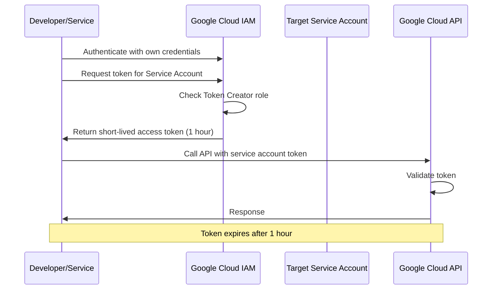

# How to Implement Short-Lived Credentials with Service Account Token Creator Role

Author: [nawazdhandala](https://www.github.com/nawazdhandala)

Tags: GCP, Google Cloud, IAM, Service Account, Token Creator, Short-Lived Credentials, Security

Description: Learn how to implement short-lived credentials in Google Cloud using the Service Account Token Creator role for secure, temporary access without persistent keys.

---

Long-lived service account keys are a security liability. They sit on disk, they get committed to git repos, and they never expire unless you rotate them manually. Short-lived credentials are the alternative - they are generated on demand, last for a limited time (typically 1 hour), and cannot be reused after expiration. The Service Account Token Creator role is the IAM mechanism that makes this work in Google Cloud.

Instead of distributing keys, you grant a principal the ability to generate temporary tokens for a service account. The principal authenticates with their own identity, requests a short-lived token, and uses that token to act as the service account. When the token expires, it is gone.

## How Service Account Impersonation Works



The key insight is that the developer or service never has persistent credentials for the service account. They use their own identity to request a temporary token, and that token is what provides the service account's permissions.

## Prerequisites

- A Google Cloud project
- A service account that has the permissions you need
- The IAM API enabled
- Understanding of which principals need to impersonate which service accounts

## Step 1: Create the Target Service Account

First, create the service account that will be impersonated. Grant it only the specific permissions it needs:

```bash
# Create a service account for deploying to Cloud Run
gcloud iam service-accounts create cloud-run-deployer \
    --project=my-project \
    --display-name="Cloud Run Deployer" \
    --description="Used for deploying applications to Cloud Run"

# Grant it the specific permissions it needs
gcloud projects add-iam-policy-binding my-project \
    --member="serviceAccount:cloud-run-deployer@my-project.iam.gserviceaccount.com" \
    --role="roles/run.developer"

gcloud projects add-iam-policy-binding my-project \
    --member="serviceAccount:cloud-run-deployer@my-project.iam.gserviceaccount.com" \
    --role="roles/artifactregistry.reader"
```

## Step 2: Grant the Token Creator Role

Now grant the Token Creator role to the principals who need to impersonate this service account:

```bash
# Allow a specific developer to generate tokens for the deployer SA
gcloud iam service-accounts add-iam-policy-binding \
    cloud-run-deployer@my-project.iam.gserviceaccount.com \
    --project=my-project \
    --member="user:developer@example.com" \
    --role="roles/iam.serviceAccountTokenCreator"

# Allow a group of developers
gcloud iam service-accounts add-iam-policy-binding \
    cloud-run-deployer@my-project.iam.gserviceaccount.com \
    --project=my-project \
    --member="group:deploy-team@example.com" \
    --role="roles/iam.serviceAccountTokenCreator"

# Allow another service account (for service-to-service impersonation)
gcloud iam service-accounts add-iam-policy-binding \
    cloud-run-deployer@my-project.iam.gserviceaccount.com \
    --project=my-project \
    --member="serviceAccount:ci-runner@my-project.iam.gserviceaccount.com" \
    --role="roles/iam.serviceAccountTokenCreator"
```

## Step 3: Use Impersonation from the gcloud CLI

The simplest way to use impersonation is through the gcloud CLI:

```bash
# Run a command as the deployer service account
gcloud run deploy my-app \
    --image=us-central1-docker.pkg.dev/my-project/apps/my-app:latest \
    --region=us-central1 \
    --project=my-project \
    --impersonate-service-account=cloud-run-deployer@my-project.iam.gserviceaccount.com

# You can also set impersonation globally for your gcloud session
gcloud config set auth/impersonate_service_account cloud-run-deployer@my-project.iam.gserviceaccount.com

# Now all gcloud commands use the service account's identity
gcloud run services list --project=my-project

# Unset when done
gcloud config unset auth/impersonate_service_account
```

## Step 4: Use Impersonation in Application Code

For applications, use the Google Cloud client libraries with impersonation:

```python
# deploy_app.py
# Using service account impersonation in Python

from google.auth import impersonated_credentials
from google.auth import default
from google.cloud import run_v2

# Get the default credentials (from the environment)
# This could be a user credential, another SA, or metadata server
source_credentials, project = default()

# Create impersonated credentials for the target service account
target_sa = "cloud-run-deployer@my-project.iam.gserviceaccount.com"

# The impersonated credentials will be short-lived (1 hour by default)
target_credentials = impersonated_credentials.Credentials(
    source_credentials=source_credentials,
    target_principal=target_sa,
    # Only request the scopes you actually need
    target_scopes=["https://www.googleapis.com/auth/cloud-platform"],
    # Token lifetime - default is 3600 seconds (1 hour)
    lifetime=3600
)

# Use the impersonated credentials with a client library
client = run_v2.ServicesClient(credentials=target_credentials)

# List Cloud Run services using the impersonated identity
request = run_v2.ListServicesRequest(
    parent=f"projects/my-project/locations/us-central1"
)

for service in client.list_services(request=request):
    print(f"Service: {service.name}")
```

## Step 5: Generate Different Types of Short-Lived Tokens

The Token Creator role allows generating several types of tokens:

### Access Tokens

Standard OAuth2 access tokens for calling Google APIs:

```python
# Generate an access token programmatically
from google.auth import impersonated_credentials
from google.auth import default
import google.auth.transport.requests

source_credentials, _ = default()

target_credentials = impersonated_credentials.Credentials(
    source_credentials=source_credentials,
    target_principal="cloud-run-deployer@my-project.iam.gserviceaccount.com",
    target_scopes=["https://www.googleapis.com/auth/cloud-platform"],
)

# Refresh to get the actual token
request = google.auth.transport.requests.Request()
target_credentials.refresh(request)

# The access token is available for use with other tools or APIs
print(f"Access token: {target_credentials.token}")
print(f"Expiry: {target_credentials.expiry}")
```

### ID Tokens

For authenticating to Cloud Run services or Cloud Functions:

```python
# Generate an ID token for calling a Cloud Run service
from google.auth import impersonated_credentials
from google.auth import default

source_credentials, _ = default()

# Create impersonated credentials
impersonated_creds = impersonated_credentials.Credentials(
    source_credentials=source_credentials,
    target_principal="cloud-run-deployer@my-project.iam.gserviceaccount.com",
    target_scopes=["https://www.googleapis.com/auth/cloud-platform"],
)

# Generate an ID token for a specific audience (the Cloud Run service URL)
from google.auth import impersonated_credentials as ic

id_token_creds = ic.IDTokenCredentials(
    target_credentials=impersonated_creds,
    target_audience="https://my-service-abc123.run.app"
)

# Use the ID token to call the Cloud Run service
import requests as http_requests
import google.auth.transport.requests

request = google.auth.transport.requests.Request()
id_token_creds.refresh(request)

response = http_requests.get(
    "https://my-service-abc123.run.app/api/data",
    headers={"Authorization": f"Bearer {id_token_creds.token}"}
)
print(response.json())
```

### Signed JWTs and Blobs

For signing arbitrary data (useful for generating signed URLs):

```python
# Generate a signed URL using impersonated credentials
from google.cloud import storage
from google.auth import impersonated_credentials
from google.auth import default
from datetime import timedelta

source_credentials, _ = default()

# Create impersonated signing credentials
signing_credentials = impersonated_credentials.Credentials(
    source_credentials=source_credentials,
    target_principal="cloud-run-deployer@my-project.iam.gserviceaccount.com",
    target_scopes=["https://www.googleapis.com/auth/cloud-platform"],
)

# Use the impersonated credentials to generate a signed URL
client = storage.Client(credentials=signing_credentials)
bucket = client.bucket("my-bucket")
blob = bucket.blob("data/report.pdf")

# Generate a signed URL valid for 15 minutes
url = blob.generate_signed_url(
    version="v4",
    expiration=timedelta(minutes=15),
    method="GET",
    credentials=signing_credentials
)

print(f"Signed URL: {url}")
```

## Step 6: Chain Impersonation for Multi-Hop Scenarios

Sometimes you need a chain of impersonation - Service A impersonates Service B, which impersonates Service C. This is supported through delegated credentials:

```python
# Chained impersonation: user -> SA_intermediate -> SA_target
from google.auth import impersonated_credentials
from google.auth import default

source_credentials, _ = default()

# Create credentials with a delegation chain
target_credentials = impersonated_credentials.Credentials(
    source_credentials=source_credentials,
    target_principal="final-target-sa@my-project.iam.gserviceaccount.com",
    target_scopes=["https://www.googleapis.com/auth/cloud-platform"],
    # The intermediate service account in the chain
    delegates=[
        "intermediate-sa@my-project.iam.gserviceaccount.com"
    ]
)
```

For this to work, the intermediate SA needs Token Creator on the target SA, and the source principal needs Token Creator on the intermediate SA.

## Step 7: Set Up Monitoring for Impersonation

Track who is impersonating which service accounts:

```bash
# Search audit logs for impersonation events
gcloud logging read \
    'protoPayload.authenticationInfo.serviceAccountDelegationInfo.firstPartyPrincipal.principalEmail:*' \
    --project=my-project \
    --freshness=7d \
    --format="table(timestamp,protoPayload.authenticationInfo.principalEmail,protoPayload.authenticationInfo.serviceAccountDelegationInfo)"
```

## Best Practices

**Limit Token Creator grants**: Only grant Token Creator to principals that genuinely need to impersonate the service account. This role is powerful because it effectively gives all the permissions of the target service account.

**Use the narrowest scopes possible**: When creating impersonated credentials, request only the OAuth scopes your code actually needs.

**Prefer client library impersonation over manual token generation**: The client libraries handle token refresh automatically and are less error-prone.

**Audit impersonation regularly**: Review who has Token Creator on each service account. This is effectively a list of everyone who can assume that identity.

## Summary

Short-lived credentials through service account impersonation eliminate the need for persistent service account keys. The pattern is straightforward: grant the Token Creator role to principals that need temporary access, and use impersonation through the gcloud CLI or client libraries to generate time-limited tokens. The tokens expire automatically, cannot be stored or shared meaningfully, and create a clear audit trail showing who impersonated what and when. For any new workload, this should be the default approach instead of creating service account keys.
