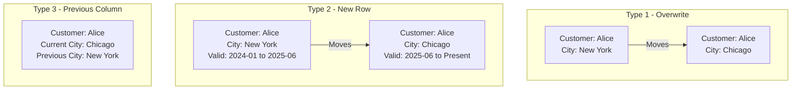

# How to Implement Slowly Changing Dimensions in BigQuery Using MERGE Statements and Partitioning

Author: [nawazdhandala](https://www.github.com/nawazdhandala)

Tags: GCP, BigQuery, SCD, Slowly Changing Dimensions, Data Warehousing, SQL, Data Modeling

Description: A practical guide to implementing Type 1, Type 2, and Type 3 slowly changing dimensions in BigQuery using MERGE statements with partitioning for performance.

---

Slowly changing dimensions (SCD) are a fundamental data warehousing concept that deals with tracking changes to dimension attributes over time. When a customer changes their address or a product gets reclassified, you need to decide how to handle that change in your warehouse. BigQuery's MERGE statement makes implementing SCD patterns straightforward, and partitioning keeps the performance acceptable even at scale. Let me walk through the three main types.

## The Three Types of SCD

Before diving into implementation, here is a quick refresher:

- Type 1: Overwrite the old value. Simple but you lose history.
- Type 2: Keep the full history by creating a new row for each change. Most common in practice.
- Type 3: Keep the current and previous value in separate columns. Good when you only care about the last change.



## SCD Type 1: Overwrite

Type 1 is the simplest approach. When a dimension attribute changes, you just overwrite it. This is appropriate when you do not need historical values - for example, correcting a data entry error.

First, create the dimension table:

```sql
-- Type 1 SCD: Customer dimension with no history tracking
CREATE TABLE IF NOT EXISTS `my-project.warehouse.dim_customer_type1`
(
  customer_id STRING NOT NULL,
  customer_name STRING,
  email STRING,
  city STRING,
  state STRING,
  country STRING,
  customer_segment STRING,
  updated_at TIMESTAMP
)
CLUSTER BY customer_id
OPTIONS (description = 'Customer dimension - Type 1 SCD (overwrite on change)');
```

Use MERGE to update existing records and insert new ones:

```sql
-- Type 1 SCD MERGE: Overwrites changed attributes
MERGE INTO `my-project.warehouse.dim_customer_type1` AS target
USING (
  -- Source data from the staging layer
  SELECT
    customer_id,
    customer_name,
    email,
    city,
    state,
    country,
    customer_segment,
    CURRENT_TIMESTAMP() AS updated_at
  FROM `my-project.staging.stg_customers`
) AS source
ON target.customer_id = source.customer_id

-- When the customer exists and something has changed, update it
WHEN MATCHED AND (
  target.customer_name != source.customer_name
  OR target.email != source.email
  OR target.city != source.city
  OR target.state != source.state
  OR target.country != source.country
  OR target.customer_segment != source.customer_segment
) THEN
  UPDATE SET
    customer_name = source.customer_name,
    email = source.email,
    city = source.city,
    state = source.state,
    country = source.country,
    customer_segment = source.customer_segment,
    updated_at = source.updated_at

-- When the customer is new, insert it
WHEN NOT MATCHED THEN
  INSERT (customer_id, customer_name, email, city, state, country, customer_segment, updated_at)
  VALUES (source.customer_id, source.customer_name, source.email, source.city,
          source.state, source.country, source.customer_segment, source.updated_at);
```

## SCD Type 2: Full History

Type 2 is the most commonly used pattern for dimensions where you need to track the complete history of changes. Each change creates a new row with validity dates.

Create the dimension table with validity tracking columns:

```sql
-- Type 2 SCD: Customer dimension with full change history
CREATE TABLE IF NOT EXISTS `my-project.warehouse.dim_customer_type2`
(
  -- Surrogate key for the dimension row
  customer_sk INT64 NOT NULL,
  -- Natural key from the source system
  customer_id STRING NOT NULL,
  customer_name STRING,
  email STRING,
  city STRING,
  state STRING,
  country STRING,
  customer_segment STRING,
  -- SCD Type 2 tracking columns
  effective_from DATE NOT NULL,
  effective_to DATE,             -- NULL means currently active
  is_current BOOL NOT NULL,
  -- Metadata
  row_hash STRING,               -- Hash of tracked columns for change detection
  created_at TIMESTAMP,
  updated_at TIMESTAMP
)
PARTITION BY effective_from
CLUSTER BY customer_id, is_current
OPTIONS (description = 'Customer dimension - Type 2 SCD (full history)');
```

The MERGE for Type 2 is more involved because you need to both expire old rows and insert new ones:

```sql
-- Type 2 SCD MERGE: Creates new rows for changes, expires old ones
-- Step 1: Identify changes by comparing hashes
CREATE TEMP TABLE customer_changes AS
WITH source_data AS (
  SELECT
    customer_id,
    customer_name,
    email,
    city,
    state,
    country,
    customer_segment,
    -- Create a hash of all tracked columns for change detection
    TO_HEX(MD5(CONCAT(
      COALESCE(customer_name, ''),
      COALESCE(email, ''),
      COALESCE(city, ''),
      COALESCE(state, ''),
      COALESCE(country, ''),
      COALESCE(customer_segment, '')
    ))) AS row_hash
  FROM `my-project.staging.stg_customers`
),
current_dimension AS (
  SELECT customer_id, row_hash
  FROM `my-project.warehouse.dim_customer_type2`
  WHERE is_current = TRUE
)
SELECT
  s.*,
  CASE
    WHEN d.customer_id IS NULL THEN 'INSERT'
    WHEN d.row_hash != s.row_hash THEN 'UPDATE'
    ELSE 'NO_CHANGE'
  END AS change_type
FROM source_data s
LEFT JOIN current_dimension d ON s.customer_id = d.customer_id
WHERE d.customer_id IS NULL OR d.row_hash != s.row_hash;

-- Step 2: Expire the current rows that have changes
MERGE INTO `my-project.warehouse.dim_customer_type2` AS target
USING customer_changes AS source
ON target.customer_id = source.customer_id
  AND target.is_current = TRUE
  AND source.change_type = 'UPDATE'
WHEN MATCHED THEN
  UPDATE SET
    effective_to = CURRENT_DATE(),
    is_current = FALSE,
    updated_at = CURRENT_TIMESTAMP();

-- Step 3: Insert new rows for both new customers and changed customers
INSERT INTO `my-project.warehouse.dim_customer_type2`
(customer_sk, customer_id, customer_name, email, city, state, country,
 customer_segment, effective_from, effective_to, is_current, row_hash,
 created_at, updated_at)
SELECT
  -- Generate a surrogate key using a sequence or hash
  FARM_FINGERPRINT(CONCAT(customer_id, CAST(CURRENT_TIMESTAMP() AS STRING))) AS customer_sk,
  customer_id,
  customer_name,
  email,
  city,
  state,
  country,
  customer_segment,
  CURRENT_DATE() AS effective_from,
  NULL AS effective_to,
  TRUE AS is_current,
  row_hash,
  CURRENT_TIMESTAMP() AS created_at,
  CURRENT_TIMESTAMP() AS updated_at
FROM customer_changes
WHERE change_type IN ('INSERT', 'UPDATE');
```

## Querying Type 2 SCD Tables

The `is_current` flag makes it easy to get the current state:

```sql
-- Get the current state of all customers
SELECT *
FROM `my-project.warehouse.dim_customer_type2`
WHERE is_current = TRUE;

-- Get a customer's state as of a specific date
SELECT *
FROM `my-project.warehouse.dim_customer_type2`
WHERE customer_id = 'CUST001'
  AND effective_from <= DATE '2025-06-15'
  AND (effective_to IS NULL OR effective_to > DATE '2025-06-15');

-- Get the full change history for a customer
SELECT
  customer_id,
  city,
  customer_segment,
  effective_from,
  effective_to,
  is_current
FROM `my-project.warehouse.dim_customer_type2`
WHERE customer_id = 'CUST001'
ORDER BY effective_from;
```

## SCD Type 3: Previous Value Tracking

Type 3 keeps only the current and immediately previous value. It is simpler than Type 2 but gives you less history:

```sql
-- Type 3 SCD: Tracks current and previous values for key attributes
CREATE TABLE IF NOT EXISTS `my-project.warehouse.dim_customer_type3`
(
  customer_id STRING NOT NULL,
  customer_name STRING,
  email STRING,
  -- Current values
  current_city STRING,
  current_state STRING,
  current_segment STRING,
  -- Previous values
  previous_city STRING,
  previous_state STRING,
  previous_segment STRING,
  -- When the change happened
  last_change_date DATE,
  updated_at TIMESTAMP
)
CLUSTER BY customer_id;
```

The MERGE for Type 3 shifts current values to previous columns before updating:

```sql
-- Type 3 SCD MERGE: Shifts current to previous, updates current
MERGE INTO `my-project.warehouse.dim_customer_type3` AS target
USING `my-project.staging.stg_customers` AS source
ON target.customer_id = source.customer_id

WHEN MATCHED AND (
  target.current_city != source.city
  OR target.current_state != source.state
  OR target.current_segment != source.customer_segment
) THEN
  UPDATE SET
    -- Shift current values to previous
    previous_city = target.current_city,
    previous_state = target.current_state,
    previous_segment = target.current_segment,
    -- Set new current values
    current_city = source.city,
    current_state = source.state,
    current_segment = source.customer_segment,
    customer_name = source.customer_name,
    email = source.email,
    last_change_date = CURRENT_DATE(),
    updated_at = CURRENT_TIMESTAMP()

WHEN NOT MATCHED THEN
  INSERT (customer_id, customer_name, email, current_city, current_state,
          current_segment, previous_city, previous_state, previous_segment,
          last_change_date, updated_at)
  VALUES (source.customer_id, source.customer_name, source.email,
          source.city, source.state, source.customer_segment,
          NULL, NULL, NULL, CURRENT_DATE(), CURRENT_TIMESTAMP());
```

## Performance Optimization with Partitioning

For large Type 2 SCD tables, partitioning by `effective_from` keeps queries fast:

```sql
-- Partition by effective_from date for efficient time-travel queries
-- Cluster by the natural key and is_current for common query patterns
CREATE TABLE `my-project.warehouse.dim_customer_type2`
(
  ...
)
PARTITION BY effective_from
CLUSTER BY customer_id, is_current;
```

This partitioning scheme means that querying the current state (`WHERE is_current = TRUE`) only scans the partitions where rows were last modified, not the entire history.

## Scheduling the SCD Updates

Run SCD updates as part of your daily pipeline:

```bash
# Schedule the Type 2 SCD update as a BigQuery scheduled query
bq query --use_legacy_sql=false \
  --schedule="0 4 * * *" \
  --display_name="SCD Type 2 Customer Update" \
  "$(cat scd_type2_update.sql)"
```

## Choosing the Right SCD Type

The choice depends on your specific requirements:

- Use Type 1 when you do not need history (fixing errors, non-critical attributes)
- Use Type 2 when full history matters (customer segmentation over time, regulatory requirements, time-travel analytics)
- Use Type 3 when you only need the previous value (before/after comparisons, simple what-changed analysis)

In practice, many dimension tables use a hybrid approach. The customer name gets Type 1 treatment (corrections should overwrite), the address gets Type 2 (you want to know where the customer was when they placed each order), and some attributes might use Type 3 for simplicity.

The MERGE statement in BigQuery makes all three patterns manageable. The key to getting good performance at scale is partitioning on the temporal columns and clustering on the natural key, so that both current-state queries and historical lookups are efficient.
