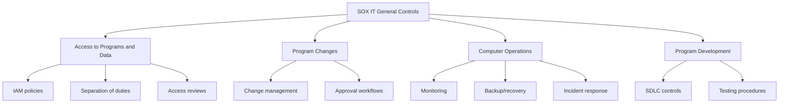

# How to Implement SOX Compliance Controls for Financial Applications on Google Cloud

Author: [nawazdhandala](https://www.github.com/nawazdhandala)

Tags: GCP, SOX Compliance, Financial Applications, Audit Controls, Google Cloud Security

Description: A practical guide to implementing Sarbanes-Oxley (SOX) compliance controls for financial applications running on Google Cloud Platform.

---

Sarbanes-Oxley (SOX) compliance is a fact of life for publicly traded companies. If your financial reporting systems run on Google Cloud, you need to demonstrate that your IT controls protect the integrity of financial data. SOX does not prescribe specific technical controls, but it requires you to prove that your systems ensure accurate financial reporting, have proper access controls, and maintain audit trails.

This guide covers the practical GCP configurations needed to satisfy SOX IT General Controls (ITGCs) for financial applications.

## SOX ITGC Categories on GCP

SOX IT General Controls fall into four categories, each with specific GCP implications:



## Access to Programs and Data

### Implementing Separation of Duties

SOX requires that no single person can both make and approve changes to financial systems. Implement this with custom IAM roles:

```bash
# Create a custom role for financial data viewers (read-only)
gcloud iam roles create financialDataViewer \
    --project=financial-app-project \
    --title="Financial Data Viewer" \
    --description="Read-only access to financial data for SOX compliance" \
    --permissions=bigquery.datasets.get,bigquery.tables.get,bigquery.tables.getData,bigquery.jobs.create,storage.objects.get,storage.objects.list

# Create a custom role for financial data writers
gcloud iam roles create financialDataWriter \
    --project=financial-app-project \
    --title="Financial Data Writer" \
    --description="Write access to financial data - restricted to authorized applications" \
    --permissions=bigquery.datasets.get,bigquery.tables.get,bigquery.tables.getData,bigquery.tables.updateData,bigquery.jobs.create

# Create a custom role for financial system administrators
gcloud iam roles create financialSystemAdmin \
    --project=financial-app-project \
    --title="Financial System Admin" \
    --description="Administrative access - cannot directly modify financial data" \
    --permissions=compute.instances.list,compute.instances.get,compute.instances.start,compute.instances.stop,container.clusters.get,container.pods.list,logging.logEntries.list
```

### Enforcing Access Controls

```bash
# Assign roles with conditions for time-based access
gcloud projects add-iam-policy-binding financial-app-project \
    --role=projects/financial-app-project/roles/financialDataViewer \
    --member="group:finance-analysts@mycompany.com" \
    --condition='expression=request.time.getHours("America/New_York") >= 7 && request.time.getHours("America/New_York") <= 20,title=Business hours only'

# Restrict sensitive operations to specific users
gcloud projects add-iam-policy-binding financial-app-project \
    --role=roles/bigquery.admin \
    --member="group:financial-db-admins@mycompany.com" \
    --condition='expression=resource.type == "bigquery.googleapis.com/Dataset" && resource.name.startsWith("projects/financial-app-project/datasets/"),title=Project datasets only'
```

### Automated Access Reviews

Create a Cloud Function that generates quarterly access review reports:

```python
# access_review.py
# Generates a quarterly access review report for SOX compliance
# Lists all IAM bindings on financial resources

import functions_framework
from google.cloud import asset_v1
from google.cloud import storage
from datetime import datetime
import json
import csv
import io

@functions_framework.http
def generate_access_review(request):
    """Generate access review report for all financial system resources."""

    asset_client = asset_v1.AssetServiceClient()
    storage_client = storage.Client()

    # Search all IAM policies in the financial projects
    scope = "projects/financial-app-project"

    # Query all IAM policy bindings
    request = asset_v1.SearchAllIamPoliciesRequest(
        scope=scope,
        query="",  # Empty query returns all policies
        page_size=500
    )

    results = asset_client.search_all_iam_policies(request=request)

    # Build the access review report
    report_data = []
    for result in results:
        resource = result.resource
        for binding in result.policy.bindings:
            for member in binding.members:
                report_data.append({
                    'resource': resource,
                    'role': binding.role,
                    'member': member,
                    'condition': str(binding.condition) if binding.condition else 'None',
                    'reviewed': 'Pending',
                    'reviewer': '',
                    'review_date': ''
                })

    # Generate CSV for the compliance team to review
    csv_buffer = io.StringIO()
    writer = csv.DictWriter(csv_buffer, fieldnames=report_data[0].keys())
    writer.writeheader()
    writer.writerows(report_data)

    # Upload to Cloud Storage
    report_date = datetime.utcnow().strftime('%Y-%m-%d')
    bucket = storage_client.bucket('sox-compliance-reports')
    blob = bucket.blob(f"access-reviews/{report_date}/access_review.csv")
    blob.upload_from_string(csv_buffer.getvalue(), content_type='text/csv')

    return json.dumps({
        'status': 'success',
        'entries': len(report_data),
        'report_path': f"gs://sox-compliance-reports/access-reviews/{report_date}/access_review.csv"
    })
```

## Program Change Management

### Enforcing Change Approval Workflows

Use Cloud Build with approval gates for deployment to financial systems:

```yaml
# cloudbuild.yaml
# CI/CD pipeline with SOX-required approval gates for financial application deployments
steps:
  # Step 1: Run automated tests
  - name: 'gcr.io/cloud-builders/npm'
    args: ['test']
    id: 'run-tests'

  # Step 2: Run security scanning
  - name: 'gcr.io/cloud-builders/gcloud'
    args: ['artifacts', 'docker', 'images', 'scan', '$_IMAGE_NAME']
    id: 'security-scan'
    waitFor: ['run-tests']

  # Step 3: Deploy to staging
  - name: 'gcr.io/cloud-builders/gcloud'
    args: ['run', 'deploy', 'financial-app-staging',
           '--image=$_IMAGE_NAME',
           '--region=us-central1',
           '--project=financial-app-staging']
    id: 'deploy-staging'
    waitFor: ['security-scan']

# Production deployment requires manual approval
# This is configured in Cloud Build triggers, not in the YAML
options:
  logging: CLOUD_LOGGING_ONLY
```

Configure the Cloud Build trigger with an approval requirement:

```bash
# Create a Cloud Build trigger with approval required
# The approval requirement satisfies SOX change management controls
gcloud builds triggers create github \
    --name="financial-app-prod-deploy" \
    --repo-name="financial-app" \
    --repo-owner="myorg" \
    --branch-pattern="^release/.*$" \
    --build-config="cloudbuild-prod.yaml" \
    --require-approval \
    --project=financial-app-project
```

### Tracking Changes with Audit Logs

```bash
# Create a log-based metric for deployment events
gcloud logging metrics create deployment-events \
    --project=financial-app-project \
    --description="Tracks all deployment events to financial systems" \
    --log-filter='resource.type="cloud_run_revision" OR resource.type="gke_cluster" AND protoPayload.methodName:("deploy" OR "update" OR "create")'
```

## Computer Operations Controls

### Backup and Recovery

```bash
# Enable automated backups for Cloud SQL financial databases
gcloud sql instances patch financial-db \
    --backup-start-time=02:00 \
    --enable-bin-log \
    --retained-backups-count=365 \
    --project=financial-app-project

# Enable point-in-time recovery
gcloud sql instances patch financial-db \
    --enable-point-in-time-recovery \
    --project=financial-app-project

# Create a snapshot schedule for Compute Engine disks
gcloud compute resource-policies create snapshot-schedule financial-disk-schedule \
    --region=us-central1 \
    --max-retention-days=365 \
    --daily-schedule \
    --start-time=03:00 \
    --project=financial-app-project
```

### Monitoring and Alerting

```bash
# Create uptime checks for financial application endpoints
gcloud monitoring uptime create financial-app-uptime \
    --display-name="Financial App Availability" \
    --resource-type=uptime-url \
    --monitored-resource='{"host": "financial-app.mycompany.com", "project_id": "financial-app-project"}' \
    --check-interval=60 \
    --timeout=10

# Alert on any database errors
gcloud monitoring policies create \
    --display-name="Financial DB Error Alert" \
    --condition-display-name="Database errors detected" \
    --condition-filter='resource.type="cloudsql_database" AND metric.type="cloudsql.googleapis.com/database/error_count"' \
    --condition-threshold-value=0 \
    --condition-threshold-comparison=COMPARISON_GT \
    --notification-channels=projects/financial-app-project/notificationChannels/CHANNEL_ID
```

## Data Integrity Controls

### Implementing Data Validation

```python
# data_integrity_check.py
# Scheduled function that validates financial data integrity
# Runs daily to detect unauthorized data modifications

import functions_framework
from google.cloud import bigquery
from google.cloud import monitoring_v3
from datetime import datetime

bq_client = bigquery.Client()

@functions_framework.http
def check_data_integrity(request):
    """Run data integrity checks on financial tables."""

    checks = []

    # Check 1: Row count validation
    # Compare current row counts against expected ranges
    row_count_query = """
    SELECT
        table_id,
        row_count,
        CASE
            WHEN row_count < 1000 THEN 'WARNING: Unusually low row count'
            WHEN row_count > 10000000 THEN 'WARNING: Unusually high row count'
            ELSE 'OK'
        END as status
    FROM `financial-app-project.financial_data.__TABLES__`
    WHERE table_id IN ('transactions', 'journal_entries', 'general_ledger')
    """
    results = bq_client.query(row_count_query).result()
    for row in results:
        checks.append({
            'check': f'row_count_{row.table_id}',
            'status': row.status,
            'value': row.row_count
        })

    # Check 2: Balance verification
    # Debits should equal credits in the journal
    balance_query = """
    SELECT
        ABS(SUM(debit_amount) - SUM(credit_amount)) as imbalance
    FROM `financial-app-project.financial_data.journal_entries`
    WHERE posting_date >= DATE_SUB(CURRENT_DATE(), INTERVAL 1 DAY)
    """
    balance_result = list(bq_client.query(balance_query).result())[0]
    balance_status = 'OK' if balance_result.imbalance < 0.01 else 'CRITICAL: Balance mismatch'
    checks.append({
        'check': 'daily_balance',
        'status': balance_status,
        'value': float(balance_result.imbalance)
    })

    # Report results
    failures = [c for c in checks if c['status'] != 'OK']
    if failures:
        send_alert(failures)

    return {'checks': checks, 'failures': len(failures)}
```

## Terraform Configuration

```hcl
# Organization policies for SOX compliance
resource "google_project_organization_policy" "disable_sa_keys" {
  project    = "financial-app-project"
  constraint = "iam.disableServiceAccountKeyCreation"

  boolean_policy {
    enforced = true
  }
}

# Audit logging configuration for all services
resource "google_project_iam_audit_config" "all_services" {
  project = "financial-app-project"
  service = "allServices"

  audit_log_config {
    log_type = "ADMIN_READ"
  }
  audit_log_config {
    log_type = "DATA_READ"
  }
  audit_log_config {
    log_type = "DATA_WRITE"
  }
}

# Cloud SQL with SOX-required backup configuration
resource "google_sql_database_instance" "financial_db" {
  name             = "financial-db"
  database_version = "POSTGRES_15"
  region           = "us-central1"
  project          = "financial-app-project"

  settings {
    tier = "db-custom-4-16384"

    backup_configuration {
      enabled                        = true
      start_time                     = "02:00"
      point_in_time_recovery_enabled = true
      transaction_log_retention_days = 7
      backup_retention_settings {
        retained_backups = 365
        retention_unit   = "COUNT"
      }
    }

    ip_configuration {
      ipv4_enabled    = false
      private_network = google_compute_network.financial_vpc.id
    }
  }
}
```

## Ongoing SOX Compliance Activities

SOX compliance is not a one-time setup. Maintain these regular activities:

1. **Quarterly access reviews** - Review all IAM bindings, remove stale access, document approvals
2. **Change management logs** - Every change to financial systems must have a ticket, approval, and test evidence
3. **Monthly integrity checks** - Validate financial data integrity, reconcile balances
4. **Annual control testing** - Your auditors will test each control; keep evidence organized in Cloud Storage
5. **Incident documentation** - Log every incident affecting financial systems, including root cause and remediation

The technical controls on GCP are the foundation, but SOX compliance ultimately requires documented processes, regular reviews, and evidence that controls are operating effectively throughout the year. Build the automation early and let it generate the evidence your auditors need.
