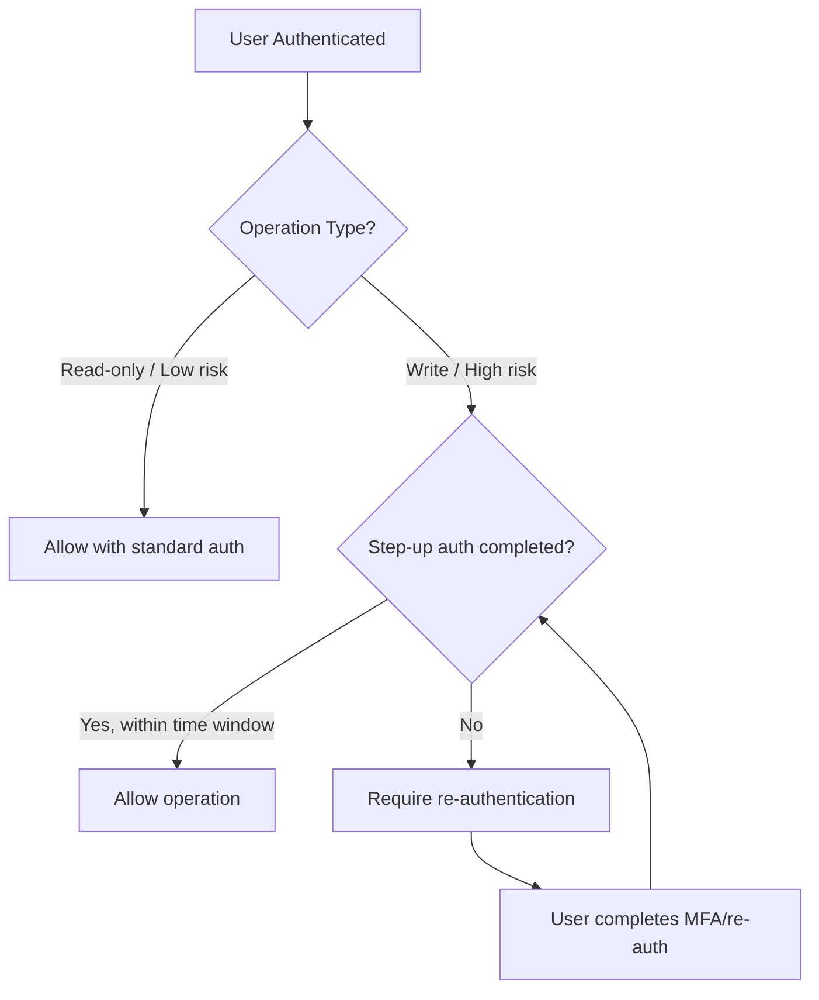

# How to Implement Step-Up Authentication for Sensitive GCP Operations

Author: [nawazdhandala](https://www.github.com/nawazdhandala)

Tags: GCP, Step-Up Authentication, IAM, Security, Access Control

Description: Learn how to implement step-up authentication for sensitive Google Cloud operations, requiring additional verification before users can perform high-risk actions.

---

Not all actions in your Google Cloud environment carry the same risk. Listing VMs is low-risk. Deleting a production database is high-risk. Step-up authentication ensures that when someone tries to perform a sensitive operation, they must provide additional verification beyond their standard login. This is the same concept as when your bank asks you to re-enter your password before transferring money, even though you are already logged in.

Google Cloud does not have a built-in "step-up authentication" button, but you can build this pattern using a combination of IAM Conditions, Access Context Manager, and custom authorization workflows. This post walks through practical approaches.

## The Step-Up Authentication Pattern

The idea is simple: normal operations require standard authentication. Sensitive operations require re-authentication or a stronger authentication factor.



## Approach 1: Access Levels with Re-Authentication

Access Context Manager lets you define access levels that require recent authentication. When combined with IAM Conditions, you can enforce re-authentication for specific operations.

### Setting Up an Access Level with Authentication Requirements

```bash
# Create an access policy (if you do not have one already)
gcloud access-context-manager policies create \
    --organization=123456789 \
    --title="Corp Access Policy"

# Create a custom access level that requires recent authentication
# This access level file uses CEL to check authentication recency
```

Create a YAML file defining the access level:

```yaml
# step-up-access-level.yaml
# Requires that the user authenticated within the last 30 minutes
# and used a hardware security key
custom:
  expr:
    expression: >
      request.auth.claims.auth_time > timestamp(now - duration('30m')) &&
      request.auth.claims.amr.exists(a, a == 'hwk')
    title: "Recent auth with hardware key"
    description: "User must have authenticated within 30 minutes using a hardware security key"
```

```bash
# Create the access level from the YAML definition
gcloud access-context-manager levels create step-up-level \
    --policy=POLICY_ID \
    --custom-level-spec=step-up-access-level.yaml \
    --title="Step-Up Authentication Required" \
    --description="Requires recent auth with hardware key"
```

### Binding the Access Level to Sensitive Operations

```bash
# Require step-up authentication for project-level admin operations
gcloud projects add-iam-policy-binding my-production-project \
    --role=roles/owner \
    --member="group:platform-admins@mycompany.com" \
    --condition='expression=request.time < timestamp("2030-01-01T00:00:00Z") && "accessPolicies/POLICY_ID/accessLevels/step-up-level" in request.auth.access_levels,title=Requires step-up auth'
```

## Approach 2: Session Duration Controls

Google Workspace and Cloud Identity allow you to set session duration policies that force re-authentication:

```bash
# Set a short session length for the admin group
# This forces re-authentication every 4 hours for administrative sessions
gcloud identity groups memberships modify-membership-roles \
    --group-email=gcp-admins@mycompany.com \
    --member-email=admin@mycompany.com \
    --update-roles-params='name=MEMBER,expiry_detail.expire_time=2026-12-31T00:00:00Z'
```

For a more targeted approach, configure session controls at the IAM level:

```bash
# Create an IAM policy binding with a session restriction
# This requires re-authentication for accessing the billing account
gcloud billing accounts add-iam-policy-binding BILLING_ACCOUNT_ID \
    --role=roles/billing.admin \
    --member="user:finance-admin@mycompany.com" \
    --condition='expression="accessPolicies/POLICY_ID/accessLevels/step-up-level" in request.auth.access_levels,title=Billing requires step-up auth'
```

## Approach 3: Custom Step-Up with Cloud Functions

For maximum control, build a custom step-up authentication service. This approach uses a Cloud Function as an authorization proxy:

```python
# step_up_auth.py
# Cloud Function that validates step-up authentication tokens
# before proxying sensitive API calls

import functions_framework
from google.cloud import firestore
from google.auth import default
from datetime import datetime, timedelta
import hashlib
import json

db = firestore.Client()

# Step-up token validity period in minutes
STEP_UP_VALIDITY_MINUTES = 30

@functions_framework.http
def verify_step_up(request):
    """Verify that the caller has completed step-up authentication."""

    # Extract the user's identity from the request
    auth_header = request.headers.get('Authorization', '')
    if not auth_header.startswith('Bearer '):
        return json.dumps({'error': 'Missing auth token'}), 401

    user_email = get_user_email_from_token(auth_header)

    # Check if the user has a valid step-up session
    step_up_ref = db.collection('step_up_sessions').document(
        hashlib.sha256(user_email.encode()).hexdigest()
    )
    step_up_doc = step_up_ref.get()

    if step_up_doc.exists:
        session_data = step_up_doc.to_dict()
        expires_at = session_data.get('expires_at')

        # Check if the step-up session is still valid
        if expires_at and expires_at > datetime.utcnow():
            return json.dumps({
                'verified': True,
                'user': user_email,
                'expires_at': expires_at.isoformat()
            }), 200

    # Step-up session not found or expired
    return json.dumps({
        'verified': False,
        'message': 'Step-up authentication required',
        'auth_url': f'https://auth.mycompany.com/step-up?user={user_email}'
    }), 403


@functions_framework.http
def complete_step_up(request):
    """Record that a user has completed step-up authentication."""

    # This endpoint is called after the user completes the MFA challenge
    user_email = request.json.get('email')
    mfa_token = request.json.get('mfa_token')

    # Validate the MFA token with your IdP
    if not validate_mfa_with_idp(user_email, mfa_token):
        return json.dumps({'error': 'Invalid MFA token'}), 401

    # Create a step-up session
    step_up_ref = db.collection('step_up_sessions').document(
        hashlib.sha256(user_email.encode()).hexdigest()
    )
    step_up_ref.set({
        'user_email': user_email,
        'created_at': datetime.utcnow(),
        'expires_at': datetime.utcnow() + timedelta(minutes=STEP_UP_VALIDITY_MINUTES),
        'auth_method': 'mfa'
    })

    return json.dumps({
        'verified': True,
        'expires_in_minutes': STEP_UP_VALIDITY_MINUTES
    }), 200
```

## Approach 4: Organization Policy Constraints

Use organization policies to enforce additional restrictions on sensitive operations:

```bash
# Require MFA for accessing resources in the production folder
gcloud resource-manager org-policies set-policy policy.yaml \
    --folder=PRODUCTION_FOLDER_ID
```

```yaml
# policy.yaml
# Restricts which identity types can access resources in this folder
constraint: iam.allowedPolicyMemberDomains
listPolicy:
  allowedValues:
    - "C0123456789"  # Only your verified organization domain
```

## Setting Up Notification Alerts for Sensitive Operations

Even with step-up auth, monitor who performs sensitive operations:

```bash
# Create a log sink for sensitive admin actions
gcloud logging sinks create sensitive-ops-sink \
    pubsub.googleapis.com/projects/my-project/topics/sensitive-ops \
    --log-filter='protoPayload.methodName=("SetIamPolicy" OR "DeleteDatabase" OR "DeleteInstance" OR "UpdateBillingAccount")'
```

Then set up a Cloud Function to alert on these operations:

```python
# alert_on_sensitive_ops.py
# Sends alerts when sensitive operations are performed
import base64
import json
import functions_framework
from google.cloud import pubsub_v1

@functions_framework.cloud_event
def alert_sensitive_op(cloud_event):
    """Alert when a sensitive operation is detected in audit logs."""

    # Decode the Pub/Sub message
    message_data = base64.b64decode(cloud_event.data["message"]["data"])
    log_entry = json.loads(message_data)

    method = log_entry.get('protoPayload', {}).get('methodName', 'unknown')
    caller = log_entry.get('protoPayload', {}).get('authenticationInfo', {}).get('principalEmail', 'unknown')
    resource = log_entry.get('resource', {}).get('labels', {})

    # Send alert through your preferred channel
    alert_message = (
        f"Sensitive operation detected:\n"
        f"  Operation: {method}\n"
        f"  Performed by: {caller}\n"
        f"  Resource: {json.dumps(resource)}"
    )

    send_slack_alert(alert_message)
    print(alert_message)
```

## Implementing Step-Up for Console Access

For Google Cloud Console access, combine Chrome Enterprise with BeyondCorp:

```bash
# Create a BeyondCorp access level that requires device trust and recent auth
gcloud access-context-manager levels create console-step-up \
    --policy=POLICY_ID \
    --basic-level-spec=console-access-level.yaml \
    --title="Console Step-Up Access"
```

```yaml
# console-access-level.yaml
# Requires a managed device with screen lock and recent OS updates
conditions:
  - devicePolicy:
      requireScreenlock: true
      osConstraints:
        - osType: DESKTOP_CHROME_OS
          minimumVersion: "110.0"
        - osType: DESKTOP_MAC
          minimumVersion: "13.0"
        - osType: DESKTOP_WINDOWS
          minimumVersion: "10.0.19045"
      allowedEncryptionStatuses:
        - ENCRYPTED
    requiredAccessLevels:
      - accessPolicies/POLICY_ID/accessLevels/corp-network
```

## Best Practices

**Define what qualifies as sensitive.** Not everything needs step-up auth. Focus on destructive operations (delete, modify IAM), access to production data, and billing changes.

**Keep the step-up window reasonable.** A 15-30 minute window balances security with usability. Requiring re-auth for every single operation will drive people to find workarounds.

**Log everything.** Every step-up authentication attempt (successful or failed) should be logged for audit purposes.

**Test the failure path.** Make sure users get a clear message when they need to step up, not a cryptic permission denied error.

**Have a break-glass process.** When the step-up auth system itself has an issue, you need a documented emergency procedure to bypass it for critical operations.

Step-up authentication adds a meaningful security layer to your most sensitive GCP operations. While it requires some custom work to implement, the result is a defense-in-depth approach that protects against compromised sessions and unauthorized privilege escalation.
