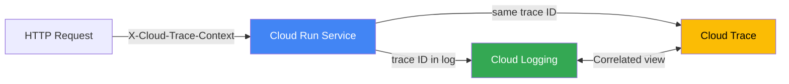

# How to Implement Structured Logging in a Go Application on Cloud Run Using the Cloud Logging Client Library

Author: [nawazdhandala](https://www.github.com/nawazdhandala)

Tags: GCP, Cloud Run, Go, Cloud Logging, Structured Logging, Observability

Description: Implement structured logging in a Go Cloud Run application using the Cloud Logging client library for better log analysis and correlation.

---

If you have ever tried to debug an issue in a Cloud Run service by searching through plain text logs, you know how painful it can be. Structured logging changes the game entirely. Instead of grepping through strings, you get queryable JSON fields that Cloud Logging can index, filter, and correlate with request traces.

The Cloud Logging client library for Go gives you direct integration with Google Cloud's logging infrastructure. In this post, I will show you how to set it up in a Cloud Run service and get the most out of structured logs.

## Why Not Just Use fmt.Println?

Cloud Run automatically captures anything written to stdout and stderr and sends it to Cloud Logging. So technically, you could use `fmt.Println` for everything. The problem is that Cloud Logging treats each line as an unstructured text entry. You lose the ability to:

- Filter by severity level
- Correlate logs with specific HTTP requests
- Query by custom fields
- Group related log entries

Structured logging solves all of these problems by outputting logs as JSON with well-known fields that Cloud Logging understands.

## Two Approaches

You have two options for structured logging on Cloud Run:

1. **Write JSON to stdout** - Cloud Run parses JSON automatically if it follows the expected format.
2. **Use the Cloud Logging client library** - Sends logs directly to the Cloud Logging API.

I will cover both, but the client library approach gives you more control.

## Approach 1: JSON to Stdout

This is the simpler option. Cloud Run recognizes specific JSON fields like `severity`, `message`, and `logging.googleapis.com/trace`.

```go
package main

import (
    "encoding/json"
    "fmt"
    "net/http"
    "os"
    "time"
)

// LogEntry represents a structured log entry that Cloud Logging understands
type LogEntry struct {
    Severity string `json:"severity"`
    Message  string `json:"message"`
    // This field correlates logs with Cloud Trace spans
    Trace      string            `json:"logging.googleapis.com/trace,omitempty"`
    Component  string            `json:"component,omitempty"`
    HTTPReq    *HTTPRequestLog   `json:"httpRequest,omitempty"`
    Labels     map[string]string `json:"logging.googleapis.com/labels,omitempty"`
    Timestamp  string            `json:"timestamp"`
}

// HTTPRequestLog holds HTTP request metadata for log entries
type HTTPRequestLog struct {
    RequestMethod string `json:"requestMethod"`
    RequestURL    string `json:"requestUrl"`
    Status        int    `json:"status"`
    Latency       string `json:"latency"`
}

// logJSON writes a structured log entry to stdout
func logJSON(entry LogEntry) {
    entry.Timestamp = time.Now().UTC().Format(time.RFC3339Nano)
    bytes, _ := json.Marshal(entry)
    fmt.Fprintln(os.Stdout, string(bytes))
}
```

Usage in a handler looks like this:

```go
func handleRequest(w http.ResponseWriter, r *http.Request) {
    // Extract trace context from the request header
    traceHeader := r.Header.Get("X-Cloud-Trace-Context")
    projectID := os.Getenv("GOOGLE_CLOUD_PROJECT")
    trace := ""
    if traceHeader != "" {
        // Parse the trace ID from the header format: TRACE_ID/SPAN_ID;o=TRACE_TRUE
        parts := strings.SplitN(traceHeader, "/", 2)
        if len(parts) > 0 {
            trace = fmt.Sprintf("projects/%s/traces/%s", projectID, parts[0])
        }
    }

    logJSON(LogEntry{
        Severity:  "INFO",
        Message:   "Processing request",
        Trace:     trace,
        Component: "api",
        Labels: map[string]string{
            "endpoint": r.URL.Path,
        },
    })

    w.WriteHeader(http.StatusOK)
}
```

## Approach 2: Cloud Logging Client Library

The client library approach sends logs directly to the API, which gives you more features like log entry grouping and synchronous flush.

```go
package main

import (
    "context"
    "fmt"
    "log"
    "net/http"
    "os"

    "cloud.google.com/go/logging"
)

// App holds the application dependencies including the logger
type App struct {
    logger *logging.Logger
    client *logging.Client
}

// NewApp creates a new application with Cloud Logging configured
func NewApp(ctx context.Context) (*App, error) {
    projectID := os.Getenv("GOOGLE_CLOUD_PROJECT")

    // Create the Cloud Logging client
    client, err := logging.NewClient(ctx, projectID)
    if err != nil {
        return nil, fmt.Errorf("failed to create logging client: %w", err)
    }

    // Create a logger that writes to a specific log name
    // Entries will appear under this log name in Cloud Logging
    logger := client.Logger("my-service",
        // Buffer up to 100 entries before flushing
        logging.EntryCountThreshold(100),
        // Flush at least every 5 seconds
        logging.DelayThreshold(5*time.Second),
    )

    return &App{
        logger: logger,
        client: client,
    }, nil
}

// Close flushes pending logs and closes the client
func (a *App) Close() {
    // Flush ensures all buffered entries are sent
    if err := a.logger.Flush(); err != nil {
        log.Printf("Failed to flush logs: %v", err)
    }
    a.client.Close()
}
```

Now use the logger in your handlers:

```go
import "cloud.google.com/go/logging"

// handleTask processes a task and logs structured data
func (a *App) handleTask(w http.ResponseWriter, r *http.Request) {
    // Log with structured payload and severity
    a.logger.Log(logging.Entry{
        Severity: logging.Info,
        Payload: map[string]interface{}{
            "message":   "Task processing started",
            "taskID":    r.URL.Query().Get("id"),
            "userAgent": r.UserAgent(),
            "method":    r.Method,
        },
        // Add HTTP request info for Cloud Logging correlation
        HTTPRequest: &logging.HTTPRequest{
            Request: r,
        },
        // Add trace context for distributed tracing
        Trace: extractTrace(r),
    })

    // Simulate processing
    result, err := processTask(r.URL.Query().Get("id"))
    if err != nil {
        // Log errors with ERROR severity
        a.logger.Log(logging.Entry{
            Severity: logging.Error,
            Payload: map[string]interface{}{
                "message": "Task processing failed",
                "error":   err.Error(),
                "taskID":  r.URL.Query().Get("id"),
            },
            Trace: extractTrace(r),
        })
        http.Error(w, "Processing failed", http.StatusInternalServerError)
        return
    }

    a.logger.Log(logging.Entry{
        Severity: logging.Info,
        Payload: map[string]interface{}{
            "message": "Task processing completed",
            "taskID":  r.URL.Query().Get("id"),
            "result":  result,
        },
        Trace: extractTrace(r),
    })

    w.WriteHeader(http.StatusOK)
}
```

## Logging Middleware

Wrapping your router with logging middleware captures request-level data automatically.

```go
// loggingMiddleware captures structured request logs
func (a *App) loggingMiddleware(next http.Handler) http.Handler {
    return http.HandlerFunc(func(w http.ResponseWriter, r *http.Request) {
        start := time.Now()

        // Wrap the ResponseWriter to capture the status code
        wrapped := &statusWriter{ResponseWriter: w, status: http.StatusOK}

        next.ServeHTTP(wrapped, r)

        duration := time.Since(start)

        // Determine severity based on status code
        severity := logging.Info
        if wrapped.status >= 500 {
            severity = logging.Error
        } else if wrapped.status >= 400 {
            severity = logging.Warning
        }

        a.logger.Log(logging.Entry{
            Severity: severity,
            Payload: map[string]interface{}{
                "message":    "Request completed",
                "method":     r.Method,
                "path":       r.URL.Path,
                "status":     wrapped.status,
                "duration_ms": duration.Milliseconds(),
                "remote_addr": r.RemoteAddr,
            },
            Trace: extractTrace(r),
        })
    })
}

// statusWriter wraps http.ResponseWriter to capture the status code
type statusWriter struct {
    http.ResponseWriter
    status int
}

func (w *statusWriter) WriteHeader(status int) {
    w.status = status
    w.ResponseWriter.WriteHeader(status)
}
```

## Request Trace Correlation



## Querying Structured Logs

Once your logs are structured, you can run powerful queries in Cloud Logging:

```
# Find all errors for a specific endpoint
severity="ERROR" AND jsonPayload.path="/api/v1/tasks"

# Find slow requests over 500ms
jsonPayload.duration_ms > 500

# Trace a specific request through all its log entries
trace="projects/my-project/traces/abc123"
```

## Best Practices

1. **Always include trace context** - It lets you see all logs from a single request in one view.
2. **Use consistent field names** - Standardize on names like `duration_ms`, `user_id`, `error` across services.
3. **Do not log sensitive data** - Never log passwords, tokens, or PII. Redact them before logging.
4. **Flush on shutdown** - Call `logger.Flush()` in your shutdown handler to avoid losing the last batch of logs.
5. **Set appropriate severity levels** - Use DEBUG for development details, INFO for normal operations, WARNING for recoverable issues, and ERROR for failures.

## Wrapping Up

Structured logging might seem like extra work compared to plain text logs, but the payoff is huge when debugging production issues. Being able to filter by severity, trace ID, or custom fields turns a painful log search into a quick query. The Cloud Logging client library makes this straightforward in Go, and with Cloud Run automatically providing trace context, you get request correlation almost for free.

For comprehensive monitoring of your Cloud Run services - including log-based alerting, uptime checks, and performance tracking - consider using OneUptime alongside Cloud Logging for full observability.
