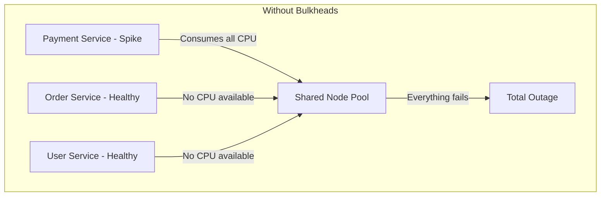

# How to Implement the Bulkhead Pattern for Fault Isolation in GKE Microservices

Author: [nawazdhandala](https://www.github.com/nawazdhandala)

Tags: GCP, GKE, Kubernetes, Bulkhead Pattern, Fault Isolation, Microservices, Resilience

Description: Implement the bulkhead pattern in Google Kubernetes Engine to isolate failures and prevent cascading outages across your microservice architecture.

---

In ship design, bulkheads are watertight compartments that prevent water from flooding the entire vessel if one section is breached. The bulkhead pattern applies the same principle to microservices. By isolating resources for different services or workloads, you prevent a failure in one area from consuming all resources and bringing down everything else.

Without bulkheads, a single misbehaving service can exhaust the shared connection pool, consume all available memory, or saturate the CPU - taking down healthy services that happen to share the same resources. In GKE, you can implement bulkheads at several levels: namespace isolation, resource quotas, node pool separation, and application-level connection pool isolation.

## The Problem: Cascading Failures

Imagine you have three services running on the same GKE cluster. The payment service starts receiving a spike in traffic and consumes all available CPU. The order service and user service, which are perfectly healthy, start timing out because they cannot get CPU time. One bad service just took down your entire platform.



## Level 1: Namespace Isolation

The simplest bulkhead is separating services into different Kubernetes namespaces with resource quotas. This prevents one team's services from consuming resources allocated to another team.

```yaml
# Create namespaces for different service groups
apiVersion: v1
kind: Namespace
metadata:
  name: payments
  labels:
    team: payments
---
apiVersion: v1
kind: Namespace
metadata:
  name: orders
  labels:
    team: orders
---
apiVersion: v1
kind: Namespace
metadata:
  name: users
  labels:
    team: users
```

Apply resource quotas to each namespace to cap their resource consumption.

```yaml
# resource-quota-payments.yaml
apiVersion: v1
kind: ResourceQuota
metadata:
  name: payments-quota
  namespace: payments
spec:
  hard:
    # Limit total resources the payments namespace can use
    requests.cpu: "4"
    requests.memory: 8Gi
    limits.cpu: "8"
    limits.memory: 16Gi
    pods: "20"
    services: "10"
---
# resource-quota-orders.yaml
apiVersion: v1
kind: ResourceQuota
metadata:
  name: orders-quota
  namespace: orders
spec:
  hard:
    requests.cpu: "4"
    requests.memory: 8Gi
    limits.cpu: "8"
    limits.memory: 16Gi
    pods: "20"
    services: "10"
```

Also set LimitRanges to enforce per-pod resource boundaries.

```yaml
# limit-range-payments.yaml
apiVersion: v1
kind: LimitRange
metadata:
  name: payments-limits
  namespace: payments
spec:
  limits:
    - type: Container
      default:
        cpu: 500m
        memory: 512Mi
      defaultRequest:
        cpu: 200m
        memory: 256Mi
      max:
        cpu: "2"
        memory: 2Gi
      min:
        cpu: 50m
        memory: 64Mi
```

## Level 2: Node Pool Isolation

For stronger isolation, run critical services on dedicated node pools. This guarantees that a noisy neighbor cannot steal CPU or memory from your most important services.

```bash
# Create a dedicated node pool for payment processing
gcloud container node-pools create payments-pool \
  --cluster=my-cluster \
  --zone=us-central1-a \
  --machine-type=n2-standard-4 \
  --num-nodes=3 \
  --node-labels=workload=payments \
  --node-taints=dedicated=payments:NoSchedule

# Create a separate pool for order processing
gcloud container node-pools create orders-pool \
  --cluster=my-cluster \
  --zone=us-central1-a \
  --machine-type=n2-standard-4 \
  --num-nodes=2 \
  --node-labels=workload=orders \
  --node-taints=dedicated=orders:NoSchedule

# Create a general pool for everything else
gcloud container node-pools create general-pool \
  --cluster=my-cluster \
  --zone=us-central1-a \
  --machine-type=n2-standard-2 \
  --num-nodes=3 \
  --enable-autoscaling \
  --min-nodes=2 \
  --max-nodes=10
```

Use node affinity and tolerations to pin services to their dedicated pools.

```yaml
# payment-service-deployment.yaml
apiVersion: apps/v1
kind: Deployment
metadata:
  name: payment-service
  namespace: payments
spec:
  replicas: 3
  selector:
    matchLabels:
      app: payment-service
  template:
    metadata:
      labels:
        app: payment-service
    spec:
      # Only schedule on the payments node pool
      nodeSelector:
        workload: payments
      tolerations:
        - key: dedicated
          operator: Equal
          value: payments
          effect: NoSchedule
      containers:
        - name: payment-service
          image: gcr.io/my-project/payment-service:latest
          ports:
            - containerPort: 8080
          resources:
            requests:
              cpu: 500m
              memory: 512Mi
            limits:
              cpu: "1"
              memory: 1Gi
```

## Level 3: Pod Disruption Budgets

Pod Disruption Budgets (PDBs) ensure that Kubernetes always keeps a minimum number of pods running during voluntary disruptions like node upgrades or autoscaling events.

```yaml
# pdb-payment-service.yaml
apiVersion: policy/v1
kind: PodDisruptionBudget
metadata:
  name: payment-service-pdb
  namespace: payments
spec:
  # Always keep at least 2 pods running
  minAvailable: 2
  selector:
    matchLabels:
      app: payment-service
---
# For less critical services, you can use maxUnavailable instead
apiVersion: policy/v1
kind: PodDisruptionBudget
metadata:
  name: analytics-service-pdb
  namespace: analytics
spec:
  maxUnavailable: 1
  selector:
    matchLabels:
      app: analytics-service
```

## Level 4: Application-Level Bulkheads

At the application level, use separate connection pools and thread pools for different downstream dependencies. If one dependency becomes slow, it only exhausts its own pool and does not block other operations.

```python
# application-level-bulkheads.py
import concurrent.futures
from google.cloud import firestore
from google.cloud import storage
import sqlalchemy

class BulkheadedService:
    """Service with isolated resource pools for each dependency."""

    def __init__(self):
        # Separate thread pools for each downstream service
        # If the payment API becomes slow, it only consumes its own threads
        self.payment_executor = concurrent.futures.ThreadPoolExecutor(
            max_workers=10,  # Cap at 10 concurrent payment calls
            thread_name_prefix='payment'
        )
        self.inventory_executor = concurrent.futures.ThreadPoolExecutor(
            max_workers=5,   # Cap at 5 concurrent inventory calls
            thread_name_prefix='inventory'
        )
        self.notification_executor = concurrent.futures.ThreadPoolExecutor(
            max_workers=3,   # Cap at 3 concurrent notification calls
            thread_name_prefix='notification'
        )

        # Separate database connection pools for read and write operations
        self.read_db = sqlalchemy.create_engine(
            'postgresql://...',
            pool_size=10,      # Read pool can handle more connections
            max_overflow=5,
        )
        self.write_db = sqlalchemy.create_engine(
            'postgresql://...',
            pool_size=5,       # Write pool is smaller and protected
            max_overflow=2,
        )

    def process_order(self, order_data):
        """Process an order using isolated resource pools."""
        # Each call uses its own thread pool - one slow dependency
        # will not block the others
        payment_future = self.payment_executor.submit(
            self.charge_payment, order_data
        )
        inventory_future = self.inventory_executor.submit(
            self.reserve_inventory, order_data
        )

        try:
            # Wait for payment with a timeout specific to this pool
            payment_result = payment_future.result(timeout=10)
            inventory_result = inventory_future.result(timeout=5)

            # Notifications are fire-and-forget - do not wait
            self.notification_executor.submit(
                self.send_confirmation, order_data
            )

            return {'payment': payment_result, 'inventory': inventory_result}

        except concurrent.futures.TimeoutError:
            # Only the timed-out pool is affected
            return {'error': 'Downstream service timeout'}

    def charge_payment(self, order_data):
        # Payment processing logic
        pass

    def reserve_inventory(self, order_data):
        # Inventory reservation logic
        pass

    def send_confirmation(self, order_data):
        # Notification logic
        pass
```

## Level 5: Network Policies

Use Kubernetes Network Policies to create network-level bulkheads. This prevents compromised or misconfigured services from communicating with services they should not access.

```yaml
# network-policy-payments.yaml
apiVersion: networking.k8s.io/v1
kind: NetworkPolicy
metadata:
  name: payments-isolation
  namespace: payments
spec:
  podSelector:
    matchLabels:
      app: payment-service
  policyTypes:
    - Ingress
    - Egress
  ingress:
    # Only allow traffic from the order service and the API gateway
    - from:
        - namespaceSelector:
            matchLabels:
              team: orders
        - namespaceSelector:
            matchLabels:
              team: gateway
  egress:
    # Only allow outbound traffic to specific destinations
    - to:
        - namespaceSelector:
            matchLabels:
              team: payments
    # Allow DNS resolution
    - to:
        - namespaceSelector: {}
          podSelector:
            matchLabels:
              k8s-app: kube-dns
      ports:
        - protocol: UDP
          port: 53
```

## Monitoring Bulkhead Health

Set up monitoring to track resource usage within each bulkhead so you know when a compartment is approaching its limits.

```bash
# Create a Cloud Monitoring alert when a namespace uses more than 80% of its CPU quota
gcloud alpha monitoring policies create \
  --display-name="Payments CPU quota near limit" \
  --condition-display-name="CPU usage > 80%" \
  --condition-filter='resource.type="k8s_container" AND resource.labels.namespace_name="payments" AND metric.type="kubernetes.io/container/cpu/core_usage_time"'
```

## Summary

The bulkhead pattern is about accepting that failures will happen and making sure they do not spread. In GKE, you can layer bulkheads at multiple levels - namespaces, node pools, pod disruption budgets, application-level resource pools, and network policies. The more critical the service, the stronger its isolation should be.

OneUptime can monitor each bulkhead compartment independently, alerting you when resource usage approaches quota limits or when failure rates in one compartment start rising. This gives you early warning before a contained failure breaks through its bulkhead and becomes a system-wide outage.
