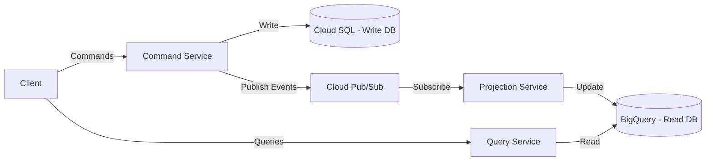

# How to Implement the CQRS Pattern with Cloud Pub/Sub and BigQuery on GCP

Author: [nawazdhandala](https://www.github.com/nawazdhandala)

Tags: GCP, CQRS, Pub/Sub, BigQuery, Architecture

Description: Learn how to implement the Command Query Responsibility Segregation pattern using Cloud Pub/Sub and BigQuery on Google Cloud Platform.

---

CQRS - Command Query Responsibility Segregation - is an architectural pattern that uses different models for reading and writing data. Instead of a single database that handles both reads and writes, you have a write model optimized for commands (inserts, updates, deletes) and a separate read model optimized for queries. On GCP, Cloud Pub/Sub bridges the two sides, and BigQuery serves as a powerful read model for analytical queries. Here is how to build this in practice.

## Why CQRS on GCP

The typical motivation for CQRS is that read and write workloads have fundamentally different characteristics:

- **Writes** are transactional, need strong consistency, and are relatively low volume
- **Reads** are often complex queries, need to be fast, and can tolerate slight staleness
- **Read patterns change more frequently** than write patterns as new dashboards and reports are needed

On GCP, this maps naturally to:
- **Cloud SQL (PostgreSQL)** for the write side - strong consistency, ACID transactions
- **BigQuery** for the read side - fast analytical queries, handles complex joins effortlessly
- **Cloud Pub/Sub** to propagate changes from the write side to the read side

## Architecture Overview



## Step 1 - Build the Command Side

The command side handles all writes. It validates business rules, persists data, and publishes events.

Set up the write database:

```bash
# Create Cloud SQL instance for the write model
gcloud sql instances create orders-write-db \
  --database-version POSTGRES_15 \
  --tier db-custom-4-16384 \
  --region us-central1 \
  --availability-type REGIONAL

gcloud sql databases create orders --instance orders-write-db
```

Define the write model schema - optimized for transactional writes:

```sql
-- Write model schema - normalized, optimized for transactional integrity
CREATE TABLE orders (
    id UUID PRIMARY KEY DEFAULT gen_random_uuid(),
    customer_id UUID NOT NULL,
    status VARCHAR(20) NOT NULL DEFAULT 'pending',
    total_amount DECIMAL(12,2) NOT NULL,
    currency VARCHAR(3) DEFAULT 'USD',
    created_at TIMESTAMP DEFAULT CURRENT_TIMESTAMP,
    updated_at TIMESTAMP DEFAULT CURRENT_TIMESTAMP
);

CREATE TABLE order_items (
    id UUID PRIMARY KEY DEFAULT gen_random_uuid(),
    order_id UUID NOT NULL REFERENCES orders(id),
    product_id UUID NOT NULL,
    product_name VARCHAR(255) NOT NULL,
    quantity INTEGER NOT NULL CHECK (quantity > 0),
    unit_price DECIMAL(10,2) NOT NULL,
    line_total DECIMAL(12,2) GENERATED ALWAYS AS (quantity * unit_price) STORED
);

CREATE INDEX idx_orders_customer ON orders(customer_id);
CREATE INDEX idx_orders_status ON orders(status);
CREATE INDEX idx_order_items_order ON order_items(order_id);
```

Build the command handler that writes data and publishes events:

```python
# Command handler - processes write operations and publishes events
from google.cloud import pubsub_v1
import json
import uuid
from datetime import datetime

publisher = pubsub_v1.PublisherClient()
topic_path = publisher.topic_path('my-project', 'order-events')

class OrderCommandHandler:
    def __init__(self, db):
        self.db = db

    async def create_order(self, command):
        """Handle the CreateOrder command."""
        order_id = str(uuid.uuid4())

        # Validate business rules
        if not command.get("items"):
            raise ValueError("Order must have at least one item")

        total = sum(
            item["quantity"] * item["unit_price"]
            for item in command["items"]
        )

        # Write to the database within a transaction
        async with self.db.transaction():
            await self.db.execute(
                """INSERT INTO orders (id, customer_id, total_amount, status)
                   VALUES ($1, $2, $3, 'pending')""",
                order_id, command["customer_id"], total
            )

            for item in command["items"]:
                await self.db.execute(
                    """INSERT INTO order_items (order_id, product_id, product_name, quantity, unit_price)
                       VALUES ($1, $2, $3, $4, $5)""",
                    order_id, item["product_id"], item["product_name"],
                    item["quantity"], item["unit_price"]
                )

        # Publish the event after the transaction commits
        event = {
            "event_type": "OrderCreated",
            "event_id": str(uuid.uuid4()),
            "timestamp": datetime.utcnow().isoformat(),
            "aggregate_id": order_id,
            "data": {
                "order_id": order_id,
                "customer_id": command["customer_id"],
                "items": command["items"],
                "total_amount": float(total),
                "status": "pending"
            }
        }

        # Publish to Pub/Sub for the read side to process
        publisher.publish(
            topic_path,
            json.dumps(event).encode('utf-8'),
            event_type="OrderCreated"
        )

        return {"order_id": order_id, "status": "pending"}

    async def update_order_status(self, order_id, new_status):
        """Handle the UpdateOrderStatus command."""
        # Update the write model
        result = await self.db.execute(
            """UPDATE orders SET status = $1, updated_at = CURRENT_TIMESTAMP
               WHERE id = $2 RETURNING id""",
            new_status, order_id
        )

        if not result:
            raise ValueError(f"Order {order_id} not found")

        # Publish the status change event
        event = {
            "event_type": "OrderStatusUpdated",
            "event_id": str(uuid.uuid4()),
            "timestamp": datetime.utcnow().isoformat(),
            "aggregate_id": order_id,
            "data": {
                "order_id": order_id,
                "new_status": new_status
            }
        }

        publisher.publish(
            topic_path,
            json.dumps(event).encode('utf-8'),
            event_type="OrderStatusUpdated"
        )

        return {"order_id": order_id, "status": new_status}
```

## Step 2 - Set Up the Event Pipeline

Configure Pub/Sub to deliver events to the projection service:

```bash
# Create the event topic
gcloud pubsub topics create order-events

# Create a subscription for the BigQuery projection service
gcloud pubsub subscriptions create bigquery-projection \
  --topic order-events \
  --ack-deadline 60 \
  --dead-letter-topic order-events-dlq \
  --max-delivery-attempts 10

# Option: Use Pub/Sub's built-in BigQuery subscription
# This writes messages directly to BigQuery without a custom subscriber
gcloud pubsub subscriptions create bigquery-direct \
  --topic order-events \
  --bigquery-table my-project:order_analytics.raw_events \
  --write-metadata
```

## Step 3 - Build the Read Model in BigQuery

Create BigQuery tables optimized for query patterns:

```sql
-- BigQuery read model schema - denormalized for fast queries
-- This is a different structure than the write model

CREATE TABLE `my-project.order_analytics.orders_view` (
    order_id STRING NOT NULL,
    customer_id STRING NOT NULL,
    customer_name STRING,
    customer_email STRING,
    status STRING NOT NULL,
    total_amount NUMERIC NOT NULL,
    currency STRING DEFAULT 'USD',
    item_count INT64,
    items ARRAY<STRUCT<
        product_id STRING,
        product_name STRING,
        quantity INT64,
        unit_price NUMERIC,
        line_total NUMERIC
    >>,
    created_at TIMESTAMP,
    updated_at TIMESTAMP,
    -- Partitioning for efficient queries by date
    _partition_date DATE
)
PARTITION BY _partition_date
CLUSTER BY customer_id, status;

-- Aggregated view for dashboards
CREATE TABLE `my-project.order_analytics.daily_summary` (
    date DATE NOT NULL,
    total_orders INT64,
    total_revenue NUMERIC,
    average_order_value NUMERIC,
    orders_by_status ARRAY<STRUCT<status STRING, count INT64>>,
    top_products ARRAY<STRUCT<product_name STRING, quantity INT64, revenue NUMERIC>>
)
PARTITION BY date;
```

## Step 4 - Build the Projection Service

The projection service consumes events and updates the BigQuery read model:

```python
# Projection service - transforms events into read model updates
from google.cloud import bigquery
from google.cloud import pubsub_v1
import json

bq_client = bigquery.Client()
subscriber = pubsub_v1.SubscriberClient()

def project_event(message):
    """Process an event and update the BigQuery read model."""
    try:
        event = json.loads(message.data.decode('utf-8'))
        event_type = event["event_type"]

        if event_type == "OrderCreated":
            handle_order_created(event["data"])
        elif event_type == "OrderStatusUpdated":
            handle_order_status_updated(event["data"])
        else:
            print(f"Unknown event type: {event_type}")

        message.ack()

    except Exception as e:
        print(f"Failed to process event: {e}")
        message.nack()

def handle_order_created(data):
    """Insert a new order into the BigQuery read model."""
    # Build the denormalized row for BigQuery
    row = {
        "order_id": data["order_id"],
        "customer_id": data["customer_id"],
        "status": data["status"],
        "total_amount": data["total_amount"],
        "item_count": len(data["items"]),
        "items": [
            {
                "product_id": item["product_id"],
                "product_name": item["product_name"],
                "quantity": item["quantity"],
                "unit_price": item["unit_price"],
                "line_total": item["quantity"] * item["unit_price"]
            }
            for item in data["items"]
        ],
        "created_at": data.get("created_at", datetime.utcnow().isoformat()),
        "updated_at": data.get("created_at", datetime.utcnow().isoformat()),
        "_partition_date": datetime.utcnow().strftime("%Y-%m-%d")
    }

    # Insert into BigQuery using the streaming API for real-time updates
    table_ref = bq_client.dataset("order_analytics").table("orders_view")
    errors = bq_client.insert_rows_json(table_ref, [row])

    if errors:
        raise Exception(f"BigQuery insert errors: {errors}")

def handle_order_status_updated(data):
    """Update order status in the BigQuery read model using DML."""
    query = """
        UPDATE `my-project.order_analytics.orders_view`
        SET status = @new_status, updated_at = CURRENT_TIMESTAMP()
        WHERE order_id = @order_id
    """

    job_config = bigquery.QueryJobConfig(
        query_parameters=[
            bigquery.ScalarQueryParameter("new_status", "STRING", data["new_status"]),
            bigquery.ScalarQueryParameter("order_id", "STRING", data["order_id"])
        ]
    )

    bq_client.query(query, job_config=job_config).result()

# Start the subscriber
subscription_path = subscriber.subscription_path('my-project', 'bigquery-projection')
streaming_pull = subscriber.subscribe(subscription_path, callback=project_event)
```

## Step 5 - Build the Query Service

The query service reads from BigQuery and serves API requests:

```python
# Query service - reads from BigQuery read model
from google.cloud import bigquery
from flask import Flask, request, jsonify

app = Flask(__name__)
bq_client = bigquery.Client()

@app.route("/api/orders", methods=["GET"])
def list_orders():
    """Query orders with filtering and pagination from BigQuery."""
    customer_id = request.args.get("customer_id")
    status = request.args.get("status")
    page_size = int(request.args.get("page_size", 20))

    # Build the query dynamically
    query = "SELECT * FROM `my-project.order_analytics.orders_view` WHERE 1=1"
    params = []

    if customer_id:
        query += " AND customer_id = @customer_id"
        params.append(bigquery.ScalarQueryParameter("customer_id", "STRING", customer_id))

    if status:
        query += " AND status = @status"
        params.append(bigquery.ScalarQueryParameter("status", "STRING", status))

    query += " ORDER BY created_at DESC LIMIT @page_size"
    params.append(bigquery.ScalarQueryParameter("page_size", "INT64", page_size))

    job_config = bigquery.QueryJobConfig(query_parameters=params)
    results = bq_client.query(query, job_config=job_config).result()

    orders = [dict(row) for row in results]
    return jsonify({"orders": orders})

@app.route("/api/analytics/daily-summary", methods=["GET"])
def daily_summary():
    """Complex analytical query that would be expensive on the write database."""
    query = """
        SELECT
            DATE(created_at) as date,
            COUNT(*) as total_orders,
            SUM(total_amount) as total_revenue,
            AVG(total_amount) as avg_order_value,
            COUNTIF(status = 'completed') as completed_orders,
            COUNTIF(status = 'cancelled') as cancelled_orders
        FROM `my-project.order_analytics.orders_view`
        WHERE created_at >= TIMESTAMP_SUB(CURRENT_TIMESTAMP(), INTERVAL 30 DAY)
        GROUP BY date
        ORDER BY date DESC
    """

    results = bq_client.query(query).result()
    return jsonify({"summary": [dict(row) for row in results]})
```

## Understanding the Trade-offs

**Eventual consistency.** The read model is not instantly updated when a write happens. There is a delay (typically seconds) between a command being processed and the BigQuery view reflecting the change. Your application needs to handle this:

```python
# After creating an order, return the data from the write side
# Do not immediately query BigQuery - it might not have the new order yet
@app.route("/api/orders", methods=["POST"])
def create_order():
    result = command_handler.create_order(request.json)
    # Return the command result directly, not a BigQuery query
    return jsonify(result), 202
```

**Complexity.** CQRS adds infrastructure (Pub/Sub topics, projection service, two databases) and conceptual overhead. Only use it when the benefits justify the complexity.

**When CQRS is worth it:**
- Read and write workloads scale very differently
- You need complex analytical queries that slow down the transactional database
- Multiple read models serve different use cases (dashboards, search, reports)
- You want to independently optimize read and write performance

**When CQRS is overkill:**
- Simple CRUD applications
- Low data volume where a single database handles everything fine
- Teams that are not comfortable with eventual consistency

## Cost on GCP

- **Cloud SQL** for the write side: based on instance size and storage
- **Pub/Sub**: $0.04 per million messages
- **BigQuery**: $0 for storage of first 10 GB; $5 per TB queried (or flat-rate pricing)

For most applications, the Pub/Sub costs are negligible, and BigQuery's pay-per-query pricing is very cost-effective for read-heavy workloads.

CQRS with Pub/Sub and BigQuery is a powerful pattern on GCP, but reach for it only when your read and write requirements have genuinely diverged enough to justify the added complexity.
