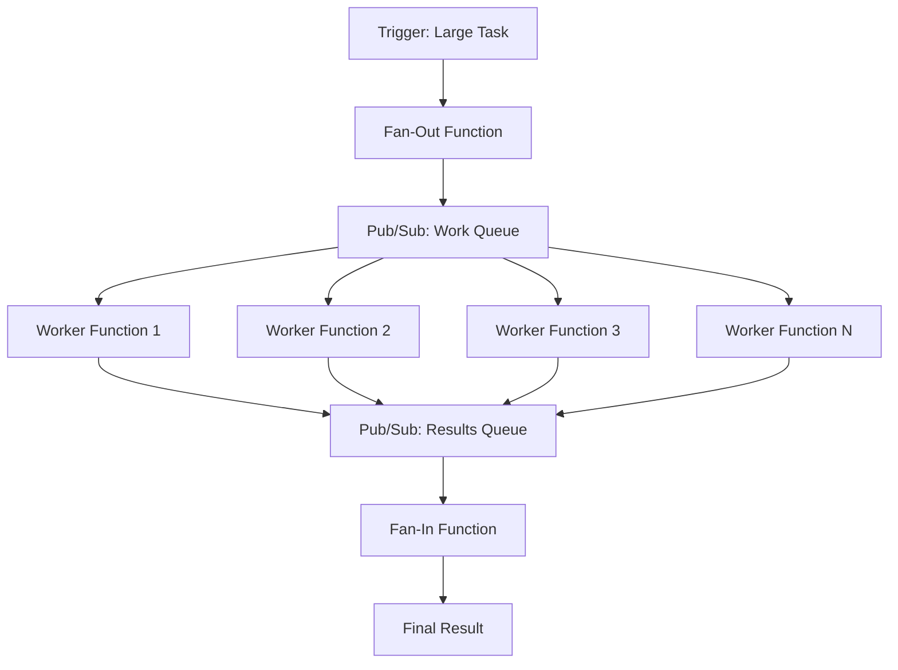

# How to Implement the Fan-Out Fan-In Pattern Using Cloud Functions and Pub/Sub

Author: [nawazdhandala](https://www.github.com/nawazdhandala)

Tags: GCP, Fan-Out Fan-In, Cloud Functions, Pub/Sub, Distributed Processing, Serverless

Description: Learn how to implement the fan-out fan-in pattern on GCP using Cloud Functions for parallel processing and Pub/Sub for message distribution and aggregation.

---

Some workloads are embarrassingly parallel - processing a batch of images, sending notifications to thousands of users, running validation checks on a dataset, or aggregating results from multiple APIs. The fan-out fan-in pattern handles these by splitting a large task into many small subtasks (fan-out), processing them in parallel, and then combining the results (fan-in).

On GCP, Cloud Functions and Pub/Sub are a natural fit for this pattern. Pub/Sub distributes work items to multiple concurrent Cloud Function instances, and a separate aggregation step collects the results. This post walks through implementing the pattern with a practical example.

## The Pattern



The flow has three stages:

1. **Fan-Out**: A coordinator function splits the work into chunks and publishes each chunk as a message to a Pub/Sub topic.
2. **Process**: Worker functions subscribe to the topic and process each chunk independently and in parallel.
3. **Fan-In**: Worker functions publish their results to a results topic. An aggregator function collects and combines the results.

## Example: Parallel Data Validation

Let us build a concrete example. Imagine you have a CSV file with 100,000 rows that needs validation. Processing it sequentially takes too long, so you want to split it into chunks and validate them in parallel.

## Step 1: Create Pub/Sub Topics

```bash
# Topic for distributing work items
gcloud pubsub topics create validation-work-queue --project=my-project

# Topic for collecting results
gcloud pubsub topics create validation-results --project=my-project

# Subscription for the results topic (used by the fan-in function)
gcloud pubsub subscriptions create validation-results-sub \
  --topic=validation-results \
  --ack-deadline=60 \
  --project=my-project
```

## Step 2: Write the Fan-Out Function

The fan-out function reads the input, splits it into chunks, and publishes each chunk to the work queue:

```python
# fanout/main.py
import json
import logging
import uuid
from google.cloud import storage, pubsub_v1, firestore

logging.basicConfig(level=logging.INFO)
logger = logging.getLogger(__name__)

publisher = pubsub_v1.PublisherClient()
storage_client = storage.Client()
db = firestore.Client()

CHUNK_SIZE = 1000  # Number of rows per chunk
WORK_TOPIC = "projects/my-project/topics/validation-work-queue"

def fan_out(event, context):
    """Triggered by a file upload to Cloud Storage.

    Reads the CSV file, splits it into chunks, and publishes
    each chunk to the work queue for parallel processing.
    """
    bucket_name = event["bucket"]
    file_name = event["name"]

    if not file_name.endswith(".csv"):
        return

    # Generate a unique job ID for tracking
    job_id = str(uuid.uuid4())[:8]
    logger.info(f"Starting job {job_id} for file {file_name}")

    # Download the file
    bucket = storage_client.bucket(bucket_name)
    blob = bucket.blob(file_name)
    content = blob.download_as_text()

    # Split into lines and separate the header
    lines = content.strip().split("\n")
    header = lines[0]
    data_rows = lines[1:]

    total_rows = len(data_rows)
    total_chunks = (total_rows + CHUNK_SIZE - 1) // CHUNK_SIZE

    logger.info(f"Job {job_id}: {total_rows} rows, {total_chunks} chunks")

    # Store job metadata in Firestore for tracking
    db.collection("validation_jobs").document(job_id).set({
        "file_name": file_name,
        "total_rows": total_rows,
        "total_chunks": total_chunks,
        "completed_chunks": 0,
        "status": "processing",
        "started_at": firestore.SERVER_TIMESTAMP,
        "valid_rows": 0,
        "invalid_rows": 0,
        "errors": [],
    })

    # Fan out: publish each chunk to the work queue
    for i in range(0, total_rows, CHUNK_SIZE):
        chunk_index = i // CHUNK_SIZE
        chunk_rows = data_rows[i:i + CHUNK_SIZE]

        message = {
            "job_id": job_id,
            "chunk_index": chunk_index,
            "total_chunks": total_chunks,
            "header": header,
            "rows": chunk_rows,
        }

        # Publish the chunk to the work queue
        future = publisher.publish(
            WORK_TOPIC,
            json.dumps(message).encode("utf-8"),
            job_id=job_id,
            chunk_index=str(chunk_index),
        )
        future.result()  # Wait for publish to complete

    logger.info(f"Job {job_id}: published {total_chunks} chunks to work queue")
    return f"Job {job_id} started with {total_chunks} chunks"
```

## Step 3: Write the Worker Function

The worker function receives a chunk, validates each row, and publishes the results:

```python
# worker/main.py
import json
import base64
import logging
import re
from google.cloud import pubsub_v1

logging.basicConfig(level=logging.INFO)
logger = logging.getLogger(__name__)

publisher = pubsub_v1.PublisherClient()
RESULTS_TOPIC = "projects/my-project/topics/validation-results"

def validate_chunk(event, context):
    """Process a chunk of data from the work queue.

    Validates each row and publishes the results to the results topic.
    """
    # Decode the Pub/Sub message
    message_data = base64.b64decode(event["data"]).decode("utf-8")
    message = json.loads(message_data)

    job_id = message["job_id"]
    chunk_index = message["chunk_index"]
    header = message["header"]
    rows = message["rows"]

    logger.info(f"Job {job_id}: processing chunk {chunk_index} ({len(rows)} rows)")

    # Parse header columns
    columns = [c.strip() for c in header.split(",")]

    valid_count = 0
    invalid_count = 0
    errors = []

    for row_num, row in enumerate(rows):
        # Parse the row
        values = [v.strip() for v in row.split(",")]

        # Validate each field
        row_errors = validate_row(columns, values, chunk_index * 1000 + row_num)

        if row_errors:
            invalid_count += 1
            errors.extend(row_errors[:3])  # Limit errors per chunk
        else:
            valid_count += 1

    # Publish the results
    result = {
        "job_id": job_id,
        "chunk_index": chunk_index,
        "valid_count": valid_count,
        "invalid_count": invalid_count,
        "errors": errors[:10],  # Limit to 10 errors per chunk
    }

    future = publisher.publish(
        RESULTS_TOPIC,
        json.dumps(result).encode("utf-8"),
        job_id=job_id,
    )
    future.result()

    logger.info(f"Job {job_id} chunk {chunk_index}: "
                f"{valid_count} valid, {invalid_count} invalid")


def validate_row(columns, values, row_number):
    """Validate a single row of data."""
    errors = []

    # Check column count matches
    if len(values) != len(columns):
        errors.append({
            "row": row_number,
            "error": f"Expected {len(columns)} columns, got {len(values)}",
        })
        return errors

    # Create a dict for easier access
    data = dict(zip(columns, values))

    # Validate email format
    if "email" in data:
        email_pattern = r"^[a-zA-Z0-9._%+-]+@[a-zA-Z0-9.-]+\.[a-zA-Z]{2,}$"
        if not re.match(email_pattern, data["email"]):
            errors.append({"row": row_number, "error": f"Invalid email: {data['email']}"})

    # Validate numeric fields
    for field in ["quantity", "price", "amount"]:
        if field in data:
            try:
                val = float(data[field])
                if val < 0:
                    errors.append({"row": row_number, "error": f"Negative {field}: {val}"})
            except ValueError:
                errors.append({"row": row_number, "error": f"Non-numeric {field}: {data[field]}"})

    # Validate required fields
    for field in ["name", "id"]:
        if field in data and not data[field]:
            errors.append({"row": row_number, "error": f"Empty required field: {field}"})

    return errors
```

## Step 4: Write the Fan-In Function

The fan-in function collects results from all chunks and produces the final output:

```python
# fanin/main.py
import json
import base64
import logging
from google.cloud import firestore

logging.basicConfig(level=logging.INFO)
logger = logging.getLogger(__name__)

db = firestore.Client()

def aggregate_results(event, context):
    """Collect results from worker functions and update the job status.

    Each worker publishes its chunk result. This function aggregates
    them and marks the job as complete when all chunks are done.
    """
    # Decode the Pub/Sub message
    message_data = base64.b64decode(event["data"]).decode("utf-8")
    result = json.loads(message_data)

    job_id = result["job_id"]
    chunk_index = result["chunk_index"]
    valid_count = result["valid_count"]
    invalid_count = result["invalid_count"]
    errors = result["errors"]

    logger.info(f"Job {job_id}: received results for chunk {chunk_index}")

    # Update the job document in Firestore using a transaction
    job_ref = db.collection("validation_jobs").document(job_id)

    @firestore.transactional
    def update_job(transaction, job_ref):
        job_doc = job_ref.get(transaction=transaction)
        if not job_doc.exists:
            logger.error(f"Job {job_id} not found")
            return False

        job_data = job_doc.to_dict()

        # Update counts
        new_completed = job_data["completed_chunks"] + 1
        new_valid = job_data["valid_rows"] + valid_count
        new_invalid = job_data["invalid_rows"] + invalid_count
        new_errors = job_data.get("errors", []) + errors

        # Limit total stored errors
        new_errors = new_errors[:100]

        update_data = {
            "completed_chunks": new_completed,
            "valid_rows": new_valid,
            "invalid_rows": new_invalid,
            "errors": new_errors,
        }

        # Check if all chunks are done
        if new_completed >= job_data["total_chunks"]:
            update_data["status"] = "complete"
            update_data["completed_at"] = firestore.SERVER_TIMESTAMP
            logger.info(f"Job {job_id} COMPLETE: {new_valid} valid, "
                       f"{new_invalid} invalid, {len(new_errors)} errors")
        else:
            logger.info(f"Job {job_id}: {new_completed}/{job_data['total_chunks']} "
                       f"chunks complete")

        transaction.update(job_ref, update_data)
        return new_completed >= job_data["total_chunks"]

    transaction = db.transaction()
    is_complete = update_job(transaction, job_ref)

    if is_complete:
        # Optionally trigger post-processing (notification, report, etc.)
        notify_job_complete(job_id)


def notify_job_complete(job_id):
    """Send a notification that the job is complete."""
    job_doc = db.collection("validation_jobs").document(job_id).get()
    job_data = job_doc.to_dict()

    logger.info(f"Job {job_id} complete notification: "
                f"Total: {job_data['total_rows']}, "
                f"Valid: {job_data['valid_rows']}, "
                f"Invalid: {job_data['invalid_rows']}")

    # In production: send email, Slack message, or webhook
```

## Step 5: Deploy Everything

```bash
# Deploy the fan-out function (triggered by Cloud Storage)
gcloud functions deploy validation-fanout \
  --runtime=python311 \
  --trigger-resource=my-project-raw-data \
  --trigger-event=google.storage.object.finalize \
  --entry-point=fan_out \
  --source=./fanout \
  --memory=1024MB \
  --timeout=540s \
  --region=us-central1 \
  --project=my-project

# Deploy the worker function (triggered by Pub/Sub work queue)
gcloud functions deploy validation-worker \
  --runtime=python311 \
  --trigger-topic=validation-work-queue \
  --entry-point=validate_chunk \
  --source=./worker \
  --memory=256MB \
  --timeout=120s \
  --max-instances=50 \
  --region=us-central1 \
  --project=my-project

# Deploy the fan-in function (triggered by Pub/Sub results)
gcloud functions deploy validation-fanin \
  --runtime=python311 \
  --trigger-topic=validation-results \
  --entry-point=aggregate_results \
  --source=./fanin \
  --memory=256MB \
  --timeout=60s \
  --region=us-central1 \
  --project=my-project
```

Note the `--max-instances=50` on the worker function. This controls the maximum parallelism. Set it based on your downstream dependencies and budget.

## Step 6: Monitor the Job

Query the job status:

```python
def get_job_status(job_id):
    """Query the status of a validation job."""
    doc = db.collection("validation_jobs").document(job_id).get()
    if doc.exists:
        data = doc.to_dict()
        print(f"Status: {data['status']}")
        print(f"Progress: {data['completed_chunks']}/{data['total_chunks']} chunks")
        print(f"Valid: {data['valid_rows']}, Invalid: {data['invalid_rows']}")
        if data.get("errors"):
            print(f"Sample errors: {data['errors'][:5]}")
    else:
        print(f"Job {job_id} not found")
```

## Performance Considerations

The fan-out fan-in pattern can process large datasets very quickly by parallelizing the work. With 50 concurrent worker instances, a 100,000-row file split into 100 chunks of 1,000 rows processes in roughly the time it takes to process a single chunk, plus overhead for message delivery and aggregation.

Key tuning parameters:
- **Chunk size**: Larger chunks mean fewer messages but less parallelism. Start with 1,000 rows per chunk.
- **Max instances**: More instances mean faster processing but higher cost and more pressure on downstream dependencies.
- **Retry policy**: Pub/Sub automatically retries failed messages. Make sure your worker function is idempotent.

## Summary

The fan-out fan-in pattern with Cloud Functions and Pub/Sub turns sequential processing into parallel processing with minimal infrastructure overhead. Pub/Sub handles the message distribution, Cloud Functions provide the compute, and Firestore tracks the state. The pattern works for any workload that can be split into independent chunks - data validation, image processing, API calls, report generation, and more. Start with the three-function pattern described here and adjust the chunk size and concurrency based on your specific workload.
