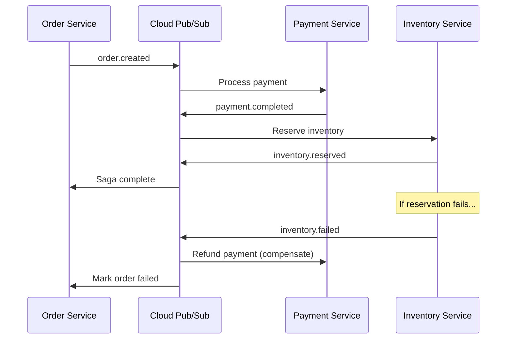

# How to Implement the Saga Pattern for Distributed Transactions Using Cloud Pub/Sub and Cloud Functions

Author: [nawazdhandala](https://www.github.com/nawazdhandala)

Tags: GCP, Cloud Pub/Sub, Cloud Functions, Saga Pattern, Distributed Transactions, Microservices

Description: Learn how to implement the Saga pattern for managing distributed transactions across microservices using Google Cloud Pub/Sub and Cloud Functions with compensating actions.

---

Distributed transactions are one of the hardest problems in microservice architectures. When a single business operation spans multiple services, each with its own database, you can not just wrap everything in a database transaction and call it a day. The Saga pattern offers a practical solution by breaking a distributed transaction into a sequence of local transactions, each with a corresponding compensating action that can undo its work if something goes wrong downstream.

In this post, I will walk through implementing the Saga pattern on Google Cloud using Pub/Sub for message routing and Cloud Functions for executing each step.

## Why the Saga Pattern?

Traditional two-phase commit protocols are fragile and do not scale well. They require locking resources across services, which kills performance and introduces tight coupling. The Saga pattern takes a different approach. Instead of trying to make everything atomic, it embraces eventual consistency.

Here is a concrete example: an e-commerce order flow that involves three services - Order Service, Payment Service, and Inventory Service. Each step publishes an event, and if any step fails, compensating transactions roll back previous steps.



## Setting Up the Pub/Sub Topics

First, create the topics and subscriptions that form the communication backbone of the saga.

```bash
# Create topics for each saga step and their compensations
gcloud pubsub topics create order-created
gcloud pubsub topics create payment-completed
gcloud pubsub topics create payment-failed
gcloud pubsub topics create inventory-reserved
gcloud pubsub topics create inventory-failed
gcloud pubsub topics create saga-completed
gcloud pubsub topics create saga-compensation

# Create subscriptions for Cloud Functions triggers
gcloud pubsub subscriptions create payment-sub --topic=order-created
gcloud pubsub subscriptions create inventory-sub --topic=payment-completed
gcloud pubsub subscriptions create order-complete-sub --topic=inventory-reserved
gcloud pubsub subscriptions create compensation-sub --topic=saga-compensation
```

## Implementing the Order Service

The Order Service kicks off the saga by publishing an event when a new order is created. This function handles the HTTP request from the client.

```javascript
// order-service/index.js
const { PubSub } = require('@google-cloud/pubsub');
const { Firestore } = require('@google-cloud/firestore');

const pubsub = new PubSub();
const db = new Firestore();

exports.createOrder = async (req, res) => {
  const { userId, items, totalAmount } = req.body;

  // Generate a unique saga ID to track this distributed transaction
  const sagaId = `saga-${Date.now()}-${Math.random().toString(36).substr(2, 9)}`;

  // Store the order with a pending status
  const orderRef = db.collection('orders').doc(sagaId);
  await orderRef.set({
    sagaId,
    userId,
    items,
    totalAmount,
    status: 'PENDING',
    createdAt: new Date().toISOString(),
  });

  // Publish the order.created event to kick off the saga
  const topic = pubsub.topic('order-created');
  await topic.publishMessage({
    json: { sagaId, userId, items, totalAmount },
    attributes: { sagaId, step: 'order-created' },
  });

  res.status(202).json({ sagaId, message: 'Order saga initiated' });
};
```

## Implementing the Payment Service

The Payment Service listens for order-created events and processes the payment. If the payment fails, it publishes a failure event that triggers compensation.

```javascript
// payment-service/index.js
const { PubSub } = require('@google-cloud/pubsub');
const { Firestore } = require('@google-cloud/firestore');

const pubsub = new PubSub();
const db = new Firestore();

// This function is triggered by order-created messages
exports.processPayment = async (message) => {
  const data = JSON.parse(Buffer.from(message.data, 'base64').toString());
  const { sagaId, userId, totalAmount } = data;

  try {
    // Simulate payment processing - replace with actual payment gateway call
    const paymentResult = await chargeCustomer(userId, totalAmount);

    // Record the payment for potential compensation later
    await db.collection('payments').doc(sagaId).set({
      sagaId,
      userId,
      amount: totalAmount,
      transactionId: paymentResult.transactionId,
      status: 'COMPLETED',
      createdAt: new Date().toISOString(),
    });

    // Payment succeeded - publish event to continue the saga
    await pubsub.topic('payment-completed').publishMessage({
      json: { sagaId, ...data, transactionId: paymentResult.transactionId },
      attributes: { sagaId, step: 'payment-completed' },
    });
  } catch (error) {
    console.error(`Payment failed for saga ${sagaId}:`, error.message);

    // Payment failed - publish failure event to trigger compensation
    await pubsub.topic('payment-failed').publishMessage({
      json: { sagaId, reason: error.message },
      attributes: { sagaId, step: 'payment-failed' },
    });
  }

  message.ack();
};

async function chargeCustomer(userId, amount) {
  // Your actual payment logic goes here
  return { transactionId: `txn-${Date.now()}` };
}
```

## Implementing the Inventory Service

The Inventory Service reserves stock after payment is confirmed. If it cannot fulfill the order, it triggers compensation to refund the payment.

```javascript
// inventory-service/index.js
const { PubSub } = require('@google-cloud/pubsub');
const { Firestore } = require('@google-cloud/firestore');

const pubsub = new PubSub();
const db = new Firestore();

exports.reserveInventory = async (message) => {
  const data = JSON.parse(Buffer.from(message.data, 'base64').toString());
  const { sagaId, items, transactionId } = data;

  try {
    // Check and reserve inventory for each item in the order
    for (const item of items) {
      const inventoryRef = db.collection('inventory').doc(item.productId);
      const doc = await inventoryRef.get();

      if (!doc.exists || doc.data().quantity < item.quantity) {
        throw new Error(`Insufficient stock for product ${item.productId}`);
      }

      // Decrement the available inventory
      await inventoryRef.update({
        quantity: doc.data().quantity - item.quantity,
      });
    }

    // Inventory reserved successfully - publish completion event
    await pubsub.topic('inventory-reserved').publishMessage({
      json: { sagaId, items },
      attributes: { sagaId, step: 'inventory-reserved' },
    });
  } catch (error) {
    console.error(`Inventory reservation failed for saga ${sagaId}:`, error.message);

    // Trigger compensation - we need to refund the payment
    await pubsub.topic('saga-compensation').publishMessage({
      json: {
        sagaId,
        compensateSteps: ['payment'],
        transactionId,
        reason: error.message,
      },
      attributes: { sagaId, step: 'inventory-failed' },
    });
  }

  message.ack();
};
```

## Building the Compensation Handler

The compensation handler is the safety net. It listens for failure events and executes the appropriate rollback actions for each completed step.

```javascript
// compensation-handler/index.js
const { Firestore } = require('@google-cloud/firestore');

const db = new Firestore();

exports.handleCompensation = async (message) => {
  const data = JSON.parse(Buffer.from(message.data, 'base64').toString());
  const { sagaId, compensateSteps, reason } = data;

  console.log(`Running compensation for saga ${sagaId}. Reason: ${reason}`);

  // Execute compensating actions for each step that needs rollback
  for (const step of compensateSteps) {
    switch (step) {
      case 'payment':
        await compensatePayment(sagaId);
        break;
      case 'inventory':
        await compensateInventory(sagaId);
        break;
      default:
        console.warn(`Unknown compensation step: ${step}`);
    }
  }

  // Mark the order as failed
  await db.collection('orders').doc(sagaId).update({
    status: 'FAILED',
    failureReason: reason,
    updatedAt: new Date().toISOString(),
  });

  message.ack();
};

async function compensatePayment(sagaId) {
  const paymentDoc = await db.collection('payments').doc(sagaId).get();
  if (paymentDoc.exists) {
    // Refund the payment - replace with actual refund logic
    await db.collection('payments').doc(sagaId).update({
      status: 'REFUNDED',
      refundedAt: new Date().toISOString(),
    });
    console.log(`Refunded payment for saga ${sagaId}`);
  }
}

async function compensateInventory(sagaId) {
  // Restore reserved inventory quantities
  console.log(`Restored inventory for saga ${sagaId}`);
}
```

## Deploying the Functions

Deploy each function with the appropriate Pub/Sub trigger.

```bash
# Deploy the order creation endpoint as an HTTP function
gcloud functions deploy createOrder \
  --runtime=nodejs20 \
  --trigger-http \
  --source=./order-service \
  --allow-unauthenticated

# Deploy the payment processor triggered by order-created topic
gcloud functions deploy processPayment \
  --runtime=nodejs20 \
  --trigger-topic=order-created \
  --source=./payment-service

# Deploy the inventory service triggered by payment-completed topic
gcloud functions deploy reserveInventory \
  --runtime=nodejs20 \
  --trigger-topic=payment-completed \
  --source=./inventory-service

# Deploy the compensation handler
gcloud functions deploy handleCompensation \
  --runtime=nodejs20 \
  --trigger-topic=saga-compensation \
  --source=./compensation-handler
```

## Adding Saga State Tracking

For production systems, you want to track the state of each saga so you can monitor progress and debug failures. A simple state machine stored in Firestore works well for this.

```javascript
// saga-tracker/index.js - Track saga state transitions
const SAGA_STATES = {
  INITIATED: 'INITIATED',
  PAYMENT_PROCESSING: 'PAYMENT_PROCESSING',
  PAYMENT_COMPLETED: 'PAYMENT_COMPLETED',
  INVENTORY_RESERVING: 'INVENTORY_RESERVING',
  COMPLETED: 'COMPLETED',
  COMPENSATING: 'COMPENSATING',
  FAILED: 'FAILED',
};

async function updateSagaState(db, sagaId, newState, metadata = {}) {
  const sagaRef = db.collection('sagas').doc(sagaId);

  // Use a transaction to prevent race conditions on state updates
  await db.runTransaction(async (transaction) => {
    const doc = await transaction.get(sagaRef);
    const currentState = doc.exists ? doc.data().state : null;

    // Log the state transition for audit purposes
    transaction.set(sagaRef, {
      state: newState,
      previousState: currentState,
      updatedAt: new Date().toISOString(),
      ...metadata,
    }, { merge: true });

    // Append to the saga history for full traceability
    const historyRef = sagaRef.collection('history').doc();
    transaction.set(historyRef, {
      from: currentState,
      to: newState,
      timestamp: new Date().toISOString(),
      ...metadata,
    });
  });
}
```

## Handling Timeouts

One thing that often gets overlooked is handling cases where a saga step never completes. You should set up a Cloud Scheduler job that periodically checks for stale sagas and triggers compensation if needed.

```bash
# Create a scheduler job that runs every 5 minutes to check for stuck sagas
gcloud scheduler jobs create http saga-timeout-checker \
  --schedule="*/5 * * * *" \
  --uri="https://REGION-PROJECT.cloudfunctions.net/checkSagaTimeouts" \
  --http-method=POST
```

## Key Takeaways

The Saga pattern is not a silver bullet, but it is the most practical approach for handling distributed transactions in microservices. When implementing it on GCP, keep these points in mind. Pub/Sub gives you reliable message delivery with at-least-once semantics, so make your saga steps idempotent. Cloud Functions scale automatically, but you need to handle cold starts in your timeout calculations. Always store the saga state so you can recover from partial failures. And test your compensation logic as thoroughly as your happy path - that is where the real complexity lives.

Monitoring your sagas is just as important as implementing them. Use Cloud Trace to follow requests across services and set up alerts on saga failure rates. With OneUptime, you can monitor the health of each microservice in your saga chain and get notified when failure rates spike, helping you catch issues before they cascade across your entire transaction flow.
