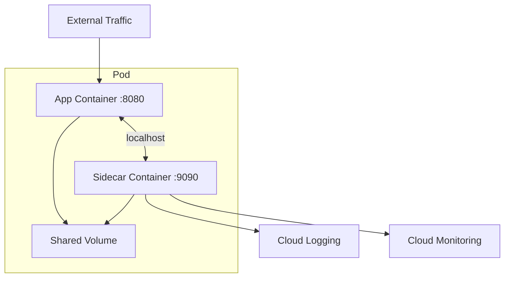

# How to Implement the Sidecar Pattern for Cross-Cutting Concerns in GKE Microservices

Author: [nawazdhandala](https://www.github.com/nawazdhandala)

Tags: GCP, GKE, Kubernetes, Sidecar Pattern, Microservices, Service Mesh

Description: Learn how to use the sidecar pattern in Google Kubernetes Engine to handle logging, monitoring, authentication, and other cross-cutting concerns without modifying application code.

---

Every microservice needs logging, metrics collection, TLS termination, and authentication. But baking these concerns into each service creates a maintenance nightmare. You end up duplicating code across services written in different languages, and updating a shared library means redeploying every service. The sidecar pattern solves this by running a companion container alongside your application container in the same pod. The sidecar handles the cross-cutting concerns while your application focuses on business logic.

In this post, I will show you how to implement sidecars in GKE for several common use cases: structured logging, outbound proxy, and authentication.

## How the Sidecar Pattern Works in Kubernetes

In Kubernetes, containers within the same pod share the same network namespace and can communicate over localhost. They also share storage volumes. This makes it natural to run a sidecar container that intercepts traffic, collects logs, or provides shared services to the main application container.



## Sidecar for Structured Logging

One of the most common sidecar use cases is log collection. Instead of adding logging libraries to every service, you write logs to a shared file and let a sidecar container ship them to Cloud Logging in a structured format.

First, here is the sidecar container that watches log files and forwards them.

```python
# log-sidecar/main.py
import os
import json
import time
from google.cloud import logging as cloud_logging

client = cloud_logging.Client()
logger = client.logger('microservice-logs')

LOG_DIR = '/var/log/app'
POLL_INTERVAL = 1  # seconds

def tail_and_ship():
    """Watch log files and ship entries to Cloud Logging."""
    positions = {}

    while True:
        for filename in os.listdir(LOG_DIR):
            filepath = os.path.join(LOG_DIR, filename)
            if not os.path.isfile(filepath):
                continue

            # Track where we left off in each file
            current_pos = positions.get(filepath, 0)
            with open(filepath, 'r') as f:
                f.seek(current_pos)
                for line in f:
                    line = line.strip()
                    if not line:
                        continue
                    try:
                        # Try parsing as JSON for structured logs
                        entry = json.loads(line)
                        logger.log_struct(entry, severity=entry.get('level', 'INFO'))
                    except json.JSONDecodeError:
                        # Fall back to plain text
                        logger.log_text(line)

                positions[filepath] = f.tell()

        time.sleep(POLL_INTERVAL)

if __name__ == '__main__':
    tail_and_ship()
```

Now the Kubernetes deployment that pairs the application with the logging sidecar.

```yaml
# deployment-with-log-sidecar.yaml
apiVersion: apps/v1
kind: Deployment
metadata:
  name: order-service
  namespace: default
spec:
  replicas: 3
  selector:
    matchLabels:
      app: order-service
  template:
    metadata:
      labels:
        app: order-service
    spec:
      containers:
        # Main application container
        - name: order-service
          image: gcr.io/my-project/order-service:latest
          ports:
            - containerPort: 8080
          volumeMounts:
            # Share a volume with the sidecar for log files
            - name: log-volume
              mountPath: /var/log/app
          env:
            - name: LOG_FILE
              value: /var/log/app/service.log

        # Logging sidecar container
        - name: log-shipper
          image: gcr.io/my-project/log-sidecar:latest
          volumeMounts:
            - name: log-volume
              mountPath: /var/log/app
              readOnly: true
          resources:
            requests:
              cpu: 50m
              memory: 64Mi
            limits:
              cpu: 100m
              memory: 128Mi

      volumes:
        - name: log-volume
          emptyDir: {}
```

## Sidecar for Authentication

Another powerful use case is offloading authentication to a sidecar. The sidecar intercepts incoming requests, validates JWT tokens, and only forwards authenticated requests to the main application.

```python
# auth-sidecar/main.py
import os
from flask import Flask, request, Response
import requests
import jwt
from google.auth.transport import requests as google_requests
from google.oauth2 import id_token

app = Flask(__name__)

# The main app runs on this port inside the pod
APP_PORT = os.environ.get('APP_PORT', '8080')
ALLOWED_AUDIENCES = os.environ.get('ALLOWED_AUDIENCES', '').split(',')

@app.route('/', defaults={'path': ''}, methods=['GET', 'POST', 'PUT', 'DELETE', 'PATCH'])
@app.route('/<path:path>', methods=['GET', 'POST', 'PUT', 'DELETE', 'PATCH'])
def proxy(path):
    """Validate auth token and proxy the request to the main app."""
    auth_header = request.headers.get('Authorization', '')

    if not auth_header.startswith('Bearer '):
        return Response('Missing or invalid Authorization header', status=401)

    token = auth_header.split(' ', 1)[1]

    try:
        # Verify the token against Google's public keys
        decoded = id_token.verify_oauth2_token(
            token,
            google_requests.Request(),
            audience=ALLOWED_AUDIENCES[0],
        )

        # Forward the request to the main application on localhost
        target_url = f'http://localhost:{APP_PORT}/{path}'
        headers = dict(request.headers)
        # Add the verified user info as a header
        headers['X-Authenticated-User'] = decoded.get('email', '')
        headers['X-User-Id'] = decoded.get('sub', '')

        resp = requests.request(
            method=request.method,
            url=target_url,
            headers=headers,
            data=request.get_data(),
            params=request.args,
        )

        return Response(resp.content, status=resp.status_code, headers=dict(resp.headers))

    except Exception as e:
        return Response(f'Authentication failed: {str(e)}', status=401)

if __name__ == '__main__':
    # The sidecar listens on port 9090, proxies to the app on 8080
    app.run(host='0.0.0.0', port=9090)
```

The corresponding deployment exposes the sidecar port instead of the application port.

```yaml
# deployment-with-auth-sidecar.yaml
apiVersion: apps/v1
kind: Deployment
metadata:
  name: api-service
spec:
  replicas: 2
  selector:
    matchLabels:
      app: api-service
  template:
    metadata:
      labels:
        app: api-service
    spec:
      containers:
        - name: api-service
          image: gcr.io/my-project/api-service:latest
          ports:
            - containerPort: 8080

        # Auth sidecar intercepts traffic before it reaches the app
        - name: auth-sidecar
          image: gcr.io/my-project/auth-sidecar:latest
          ports:
            - containerPort: 9090
          env:
            - name: APP_PORT
              value: "8080"
            - name: ALLOWED_AUDIENCES
              value: "my-project.apps.googleusercontent.com"
          resources:
            requests:
              cpu: 100m
              memory: 128Mi
---
# The service routes traffic to the sidecar port, not the app port
apiVersion: v1
kind: Service
metadata:
  name: api-service
spec:
  selector:
    app: api-service
  ports:
    - port: 80
      targetPort: 9090  # Traffic goes to the auth sidecar first
```

## Sidecar for Metrics Collection

A metrics sidecar can scrape application metrics and export them to Cloud Monitoring without requiring the application to know anything about the monitoring system.

```yaml
# deployment-with-metrics-sidecar.yaml
apiVersion: apps/v1
kind: Deployment
metadata:
  name: payment-service
spec:
  replicas: 3
  selector:
    matchLabels:
      app: payment-service
  template:
    metadata:
      labels:
        app: payment-service
    spec:
      containers:
        - name: payment-service
          image: gcr.io/my-project/payment-service:latest
          ports:
            - containerPort: 8080

        # OpenTelemetry Collector as a sidecar for metrics and traces
        - name: otel-collector
          image: otel/opentelemetry-collector-contrib:latest
          ports:
            - containerPort: 4317  # OTLP gRPC receiver
            - containerPort: 4318  # OTLP HTTP receiver
          volumeMounts:
            - name: otel-config
              mountPath: /etc/otel
          args: ["--config=/etc/otel/config.yaml"]
          resources:
            requests:
              cpu: 100m
              memory: 256Mi

      volumes:
        - name: otel-config
          configMap:
            name: otel-sidecar-config
```

Here is the OpenTelemetry Collector configuration that exports to GCP.

```yaml
# otel-config.yaml
apiVersion: v1
kind: ConfigMap
metadata:
  name: otel-sidecar-config
data:
  config.yaml: |
    receivers:
      otlp:
        protocols:
          grpc:
            endpoint: 0.0.0.0:4317
          http:
            endpoint: 0.0.0.0:4318
    processors:
      batch:
        timeout: 10s
    exporters:
      googlecloud:
        project: my-project
    service:
      pipelines:
        traces:
          receivers: [otlp]
          processors: [batch]
          exporters: [googlecloud]
        metrics:
          receivers: [otlp]
          processors: [batch]
          exporters: [googlecloud]
```

## GKE Native Sidecar Containers

Starting with GKE 1.28+, Kubernetes supports native sidecar containers through init containers with the `restartPolicy: Always` field. These start before the main container and keep running alongside it, with proper lifecycle management.

```yaml
# Using native sidecar containers (GKE 1.28+)
apiVersion: apps/v1
kind: Deployment
metadata:
  name: web-service
spec:
  replicas: 2
  selector:
    matchLabels:
      app: web-service
  template:
    spec:
      initContainers:
        # Native sidecar - starts first and runs for the pod lifetime
        - name: log-agent
          image: gcr.io/my-project/log-agent:latest
          restartPolicy: Always
          volumeMounts:
            - name: logs
              mountPath: /var/log/app
      containers:
        - name: web-service
          image: gcr.io/my-project/web-service:latest
          volumeMounts:
            - name: logs
              mountPath: /var/log/app
      volumes:
        - name: logs
          emptyDir: {}
```

## Best Practices

Keep your sidecars lightweight. They share CPU and memory with the main application, so a bloated sidecar will starve your business logic. Set resource requests and limits on every sidecar container. Use health checks on both the main container and the sidecar so Kubernetes can restart them independently if one fails. And version your sidecar images just like application images so you can roll back if a sidecar update causes issues.

The sidecar pattern is a fundamental building block for microservice architectures on GKE. Combined with a monitoring solution like OneUptime, you can track the resource consumption and health of both your application containers and their sidecars, catching issues like memory leaks in log shippers or CPU spikes in auth proxies before they impact your users.
