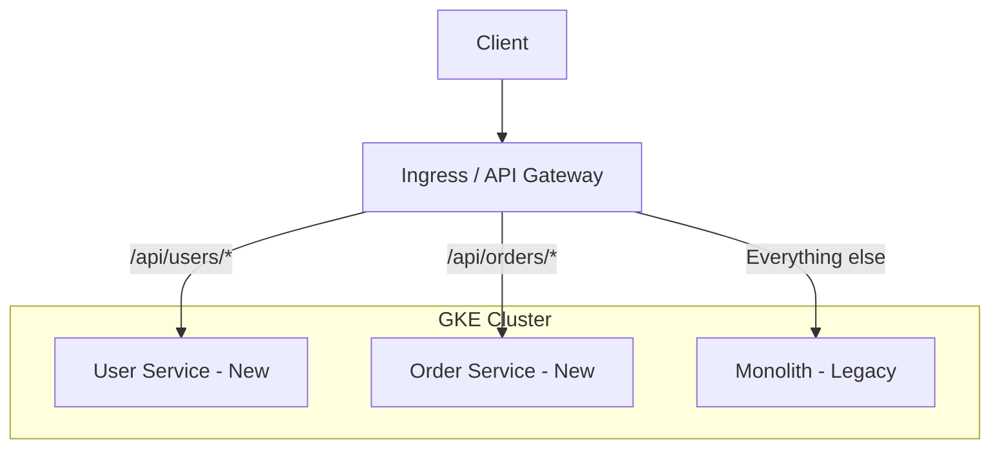

# How to Implement the Strangler Fig Pattern to Migrate Monoliths to Microservices on GKE

Author: [nawazdhandala](https://www.github.com/nawazdhandala)

Tags: GCP, GKE, Kubernetes, Strangler Fig Pattern, Microservices, Migration

Description: A practical guide to incrementally migrating a monolithic application to microservices on Google Kubernetes Engine using the Strangler Fig pattern with traffic routing.

---

Rewriting a monolith from scratch almost never works. The big bang approach is risky, expensive, and often ends in failure. The Strangler Fig pattern takes a different approach inspired by the strangler fig tree, which grows around an existing tree and gradually replaces it. You build new features as microservices, incrementally route traffic from the monolith to the new services, and eventually the monolith withers away.

In this post, I will walk through implementing the Strangler Fig pattern on GKE, using Istio for traffic routing so you can gradually shift functionality from a monolith to new microservices without any downtime.

## The Migration Strategy

The key idea is simple: put a routing layer in front of your monolith that can selectively forward requests to new microservices. As you extract functionality from the monolith, you update the routing rules. The monolith and microservices run side by side, and users never notice the transition.



## Phase 1: Deploy the Monolith to GKE

The first step is containerizing the monolith and deploying it to GKE. This gets you onto the platform where you will eventually run your microservices too.

```dockerfile
# Dockerfile for the monolith
FROM node:20-slim

WORKDIR /app
COPY package*.json ./
RUN npm ci --production
COPY . .

EXPOSE 3000
CMD ["node", "server.js"]
```

```yaml
# monolith-deployment.yaml
apiVersion: apps/v1
kind: Deployment
metadata:
  name: monolith
  labels:
    app: monolith
    version: v1
spec:
  replicas: 3
  selector:
    matchLabels:
      app: monolith
  template:
    metadata:
      labels:
        app: monolith
        version: v1
    spec:
      containers:
        - name: monolith
          image: gcr.io/my-project/monolith:latest
          ports:
            - containerPort: 3000
          resources:
            requests:
              cpu: 500m
              memory: 512Mi
          readinessProbe:
            httpGet:
              path: /health
              port: 3000
            initialDelaySeconds: 10
---
apiVersion: v1
kind: Service
metadata:
  name: monolith
spec:
  selector:
    app: monolith
  ports:
    - port: 80
      targetPort: 3000
```

## Phase 2: Set Up Istio for Traffic Routing

Install Istio on GKE. It gives you fine-grained control over traffic routing, which is essential for the strangler pattern.

```bash
# Enable Istio on GKE
gcloud container clusters update my-cluster \
  --update-addons=Istio=ENABLED \
  --zone=us-central1-a

# Label the namespace for automatic sidecar injection
kubectl label namespace default istio-injection=enabled
```

Create a VirtualService that initially routes all traffic to the monolith.

```yaml
# virtual-service.yaml - Start by routing everything to the monolith
apiVersion: networking.istio.io/v1beta1
kind: VirtualService
metadata:
  name: app-routing
spec:
  hosts:
    - "app.example.com"
  gateways:
    - app-gateway
  http:
    # All traffic goes to the monolith initially
    - route:
        - destination:
            host: monolith
            port:
              number: 80
---
apiVersion: networking.istio.io/v1beta1
kind: Gateway
metadata:
  name: app-gateway
spec:
  selector:
    istio: ingressgateway
  servers:
    - port:
        number: 80
        name: http
        protocol: HTTP
      hosts:
        - "app.example.com"
```

## Phase 3: Extract the First Microservice

Pick a bounded context from the monolith to extract first. Start with something that has clear boundaries and low risk. For this example, let us extract the user management functionality.

```python
# user-service/main.py
import os
from flask import Flask, request, jsonify
from google.cloud import firestore

app = Flask(__name__)
db = firestore.Client()

@app.route('/api/users', methods=['GET'])
def list_users():
    """List users - this was previously handled by the monolith."""
    users = []
    docs = db.collection('users').limit(100).stream()
    for doc in docs:
        user_data = doc.to_dict()
        user_data['id'] = doc.id
        users.append(user_data)
    return jsonify(users), 200

@app.route('/api/users/<user_id>', methods=['GET'])
def get_user(user_id):
    """Get a single user by ID."""
    doc = db.collection('users').document(user_id).get()
    if not doc.exists:
        return jsonify({'error': 'User not found'}), 404
    user_data = doc.to_dict()
    user_data['id'] = doc.id
    return jsonify(user_data), 200

@app.route('/api/users', methods=['POST'])
def create_user():
    """Create a new user."""
    data = request.get_json()
    doc_ref = db.collection('users').document()
    doc_ref.set({
        'email': data['email'],
        'name': data['name'],
        'created_at': firestore.SERVER_TIMESTAMP,
    })
    return jsonify({'id': doc_ref.id}), 201

if __name__ == '__main__':
    app.run(host='0.0.0.0', port=int(os.environ.get('PORT', 8080)))
```

Deploy the new service alongside the monolith.

```yaml
# user-service-deployment.yaml
apiVersion: apps/v1
kind: Deployment
metadata:
  name: user-service
  labels:
    app: user-service
spec:
  replicas: 2
  selector:
    matchLabels:
      app: user-service
  template:
    metadata:
      labels:
        app: user-service
    spec:
      containers:
        - name: user-service
          image: gcr.io/my-project/user-service:latest
          ports:
            - containerPort: 8080
          resources:
            requests:
              cpu: 200m
              memory: 256Mi
---
apiVersion: v1
kind: Service
metadata:
  name: user-service
spec:
  selector:
    app: user-service
  ports:
    - port: 80
      targetPort: 8080
```

## Phase 4: Route Traffic to the New Service

Now update the VirtualService to route user-related requests to the new microservice while everything else still goes to the monolith.

```yaml
# virtual-service-updated.yaml
apiVersion: networking.istio.io/v1beta1
kind: VirtualService
metadata:
  name: app-routing
spec:
  hosts:
    - "app.example.com"
  gateways:
    - app-gateway
  http:
    # User endpoints now go to the new microservice
    - match:
        - uri:
            prefix: /api/users
      route:
        - destination:
            host: user-service
            port:
              number: 80

    # Everything else still goes to the monolith
    - route:
        - destination:
            host: monolith
            port:
              number: 80
```

## Phase 5: Canary Traffic Splitting

Before routing all user traffic to the new service, do a gradual rollout. Start with 10% of traffic and increase as you gain confidence.

```yaml
# canary-routing.yaml - Split traffic between monolith and new service
apiVersion: networking.istio.io/v1beta1
kind: VirtualService
metadata:
  name: app-routing
spec:
  hosts:
    - "app.example.com"
  gateways:
    - app-gateway
  http:
    - match:
        - uri:
            prefix: /api/users
      route:
        # Send 10% of user traffic to the new service
        - destination:
            host: user-service
            port:
              number: 80
          weight: 10
        # Keep 90% on the monolith
        - destination:
            host: monolith
            port:
              number: 80
          weight: 90

    - route:
        - destination:
            host: monolith
            port:
              number: 80
```

Gradually increase the weight to 25, 50, 75, and finally 100 as you verify the new service is working correctly.

## Phase 6: Data Migration Strategy

One of the trickiest parts of the strangler pattern is handling data. The monolith has its own database, and the new microservice might use a different one. Here is a common approach using dual writes during the transition period.

```javascript
// During migration, the monolith writes to both the old DB and the new one
// This keeps data in sync while both systems are active
async function createUserDualWrite(userData) {
  // Write to the legacy database (old path)
  const legacyResult = await legacyDb.query(
    'INSERT INTO users (email, name) VALUES ($1, $2) RETURNING id',
    [userData.email, userData.name]
  );

  // Also write to the new Firestore database (new path)
  const firestore = new Firestore();
  await firestore.collection('users').doc(legacyResult.rows[0].id).set({
    email: userData.email,
    name: userData.name,
    migratedFrom: 'legacy',
    createdAt: Firestore.Timestamp.now(),
  });

  return legacyResult.rows[0].id;
}
```

## Phase 7: Remove the Old Code

Once the new service is handling 100% of user traffic and you have verified everything works, remove the user-related code from the monolith. The monolith gets smaller with each extraction.

```bash
# Verify the old endpoints are no longer receiving traffic
kubectl logs -l app=monolith --tail=1000 | grep "/api/users"
# Should show zero hits if routing is correct

# Remove user routes from the monolith codebase
# Then redeploy the slimmed-down monolith
gcloud builds submit --tag gcr.io/my-project/monolith:v2 ./monolith
kubectl set image deployment/monolith monolith=gcr.io/my-project/monolith:v2
```

## Tracking Migration Progress

Keep a clear record of what has been migrated and what remains in the monolith.

```yaml
# migration-status.yaml - Track your progress
migration:
  completed:
    - name: user-management
      service: user-service
      migrated: 2026-01-15
      routes: ["/api/users/*"]
    - name: notifications
      service: notification-service
      migrated: 2026-02-01
      routes: ["/api/notifications/*"]
  in_progress:
    - name: order-management
      service: order-service
      status: canary at 25%
      routes: ["/api/orders/*"]
  remaining:
    - name: billing
    - name: reporting
    - name: admin-panel
```

## Key Takeaways

The Strangler Fig pattern lets you migrate at your own pace with minimal risk. You can stop at any point and have a working system. Each extracted service is independently deployable and scalable. The critical tools are a routing layer like Istio that supports traffic splitting, and monitoring to compare behavior between the old and new implementations.

Speaking of monitoring, OneUptime can help you track both the monolith and your new microservices side by side during the migration. You can set up dashboards comparing response times and error rates between the old and new implementations, giving you the confidence to shift more traffic to the microservices as you progress through the migration.
