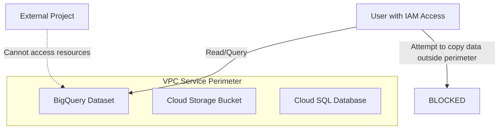

# How to Implement VPC Service Controls to Protect Sensitive Data in a GCP Project

Author: [nawazdhandala](https://www.github.com/nawazdhandala)

Tags: GCP, VPC Service Controls, Security, Data Protection, Compliance, Access Context Manager

Description: Implement VPC Service Controls to create security perimeters around GCP services, preventing data exfiltration and unauthorized access to sensitive data in your Google Cloud project.

---

VPC Service Controls is one of the most powerful and least understood security features on Google Cloud. It creates an invisible security boundary around your GCP services that prevents data from leaving the perimeter, even if someone with the right IAM permissions tries to copy it to an unauthorized project. Think of it as a data loss prevention layer at the infrastructure level.

If you handle sensitive data - healthcare records, financial transactions, personally identifiable information - VPC Service Controls should be part of your security baseline. Here is how to set it up.

## What Problem Does It Solve?

IAM controls who can access resources. VPC Service Controls controls where data can go. These are two different problems.

Consider this scenario: A developer has BigQuery Data Viewer access on a dataset containing customer PII. With just IAM, they could run a query and export the results to a BigQuery dataset in their personal GCP project. VPC Service Controls prevents this - the data cannot leave the perimeter, regardless of the user's IAM permissions.



## How VPC Service Controls Works

The system has three main components:

1. **Access Policy**: An organization-level resource that contains perimeters and access levels.
2. **Service Perimeter**: Defines which projects and services are protected. Resources inside the perimeter can communicate freely. Traffic crossing the perimeter is blocked by default.
3. **Access Levels**: Conditions under which the perimeter can be crossed (IP ranges, device trust, identity).

## Step 1: Create an Access Policy

You need organization-level access to create an access policy:

```bash
# Create an access policy for your organization
gcloud access-context-manager policies create \
  --organization=ORGANIZATION_ID \
  --title="Organization Security Policy"

# Note the policy ID from the output - you will need it
# You can also list existing policies
gcloud access-context-manager policies list \
  --organization=ORGANIZATION_ID
```

## Step 2: Define Access Levels

Access levels define conditions for crossing the perimeter. Create access levels for your corporate network and trusted identities:

```bash
# Create an access level for your corporate network IP ranges
gcloud access-context-manager levels create corp-network \
  --policy=POLICY_ID \
  --title="Corporate Network" \
  --basic-level-spec=/dev/stdin << 'EOF'
- ipSubnetworks:
    - 203.0.113.0/24
    - 198.51.100.0/24
EOF

# Create an access level for specific trusted users
gcloud access-context-manager levels create trusted-admins \
  --policy=POLICY_ID \
  --title="Trusted Administrators" \
  --basic-level-spec=/dev/stdin << 'EOF'
- members:
    - user:admin@company.com
    - user:security-lead@company.com
    - serviceAccount:cicd@my-project.iam.gserviceaccount.com
EOF

# Create a combined access level (corporate network AND trusted users)
gcloud access-context-manager levels create corp-trusted-admins \
  --policy=POLICY_ID \
  --title="Corporate Network Trusted Admins" \
  --combine-function=AND \
  --basic-level-spec=/dev/stdin << 'EOF'
- ipSubnetworks:
    - 203.0.113.0/24
  members:
    - user:admin@company.com
    - serviceAccount:cicd@my-project.iam.gserviceaccount.com
EOF
```

## Step 3: Create a Service Perimeter in Dry Run Mode

Always start in dry run mode. This logs what would be blocked without actually blocking anything, so you can identify legitimate traffic that needs to be allowed:

```bash
# Create a service perimeter in dry run mode
gcloud access-context-manager perimeters dry-run create sensitive-data-perimeter \
  --policy=POLICY_ID \
  --title="Sensitive Data Perimeter" \
  --resources="projects/PROJECT_NUMBER_1,projects/PROJECT_NUMBER_2" \
  --restricted-services="\
bigquery.googleapis.com,\
storage.googleapis.com,\
sqladmin.googleapis.com,\
spanner.googleapis.com,\
dataflow.googleapis.com,\
pubsub.googleapis.com" \
  --access-levels="accessPolicies/POLICY_ID/accessLevels/corp-network"
```

The `--restricted-services` list specifies which GCP APIs are protected by the perimeter. Only add services that handle sensitive data.

## Step 4: Monitor Dry Run Logs

After enabling dry run, monitor the logs to see what traffic would be blocked:

```bash
# Query for dry run violation logs
gcloud logging read '
  protoPayload.metadata.@type="type.googleapis.com/google.cloud.audit.VpcServiceControlAuditMetadata"
  AND protoPayload.metadata.dryRun=true
' \
  --project=my-project \
  --format="table(timestamp, protoPayload.metadata.violationReason, protoPayload.metadata.resourceNames)"
```

Common violations you will see:
- Cloud Console access from developer machines (need to add their IP ranges to access levels)
- CI/CD pipelines that cross the perimeter (need to add their service accounts to access levels)
- Third-party integrations that call GCP APIs (need ingress rules)

## Step 5: Configure Ingress and Egress Rules

For legitimate traffic that needs to cross the perimeter, configure ingress and egress rules:

```yaml
# ingress-policy.yaml - Allow specific external access patterns

# Allow the CI/CD pipeline to deploy to the perimeter
- ingressFrom:
    identities:
      - serviceAccount:cicd-sa@build-project.iam.gserviceaccount.com
    sources:
      - accessLevel: accessPolicies/POLICY_ID/accessLevels/corp-network
  ingressTo:
    operations:
      - serviceName: storage.googleapis.com
        methodSelectors:
          - method: google.storage.objects.create
          - method: google.storage.objects.get
      - serviceName: bigquery.googleapis.com
        methodSelectors:
          - method: google.cloud.bigquery.v2.JobService.InsertJob
    resources:
      - projects/PROJECT_NUMBER_1
```

```yaml
# egress-policy.yaml - Allow specific data to leave the perimeter

# Allow BigQuery to read from a shared dataset in another project
- egressFrom:
    identities:
      - serviceAccount:analytics@my-project.iam.gserviceaccount.com
  egressTo:
    operations:
      - serviceName: bigquery.googleapis.com
        methodSelectors:
          - method: google.cloud.bigquery.v2.TableDataService.Tabledata
    resources:
      - projects/SHARED_DATA_PROJECT_NUMBER
```

Apply the ingress and egress policies:

```bash
# Update the perimeter with ingress and egress rules
gcloud access-context-manager perimeters dry-run update sensitive-data-perimeter \
  --policy=POLICY_ID \
  --set-ingress-policies=ingress-policy.yaml \
  --set-egress-policies=egress-policy.yaml
```

## Step 6: Enforce the Perimeter

After monitoring dry run for at least a week and resolving all legitimate violations, enforce the perimeter:

```bash
# Convert from dry run to enforced
gcloud access-context-manager perimeters dry-run enforce sensitive-data-perimeter \
  --policy=POLICY_ID
```

You can also keep the dry run running alongside the enforced perimeter to catch new violations before they cause outages:

```bash
# Create the enforced perimeter
gcloud access-context-manager perimeters create sensitive-data-perimeter \
  --policy=POLICY_ID \
  --title="Sensitive Data Perimeter" \
  --resources="projects/PROJECT_NUMBER_1" \
  --restricted-services="bigquery.googleapis.com,storage.googleapis.com" \
  --access-levels="accessPolicies/POLICY_ID/accessLevels/corp-network" \
  --ingress-policies=ingress-policy.yaml \
  --egress-policies=egress-policy.yaml

# Keep a dry run with expanded services to test before adding them to enforcement
gcloud access-context-manager perimeters dry-run update sensitive-data-perimeter \
  --policy=POLICY_ID \
  --add-restricted-services="sqladmin.googleapis.com"
```

## Step 7: Set Up Perimeter Bridges

If you have multiple perimeters that need to share data with each other (for example, a data platform perimeter and an analytics perimeter), use perimeter bridges:

```bash
# Create a bridge between two perimeters
gcloud access-context-manager perimeters create data-analytics-bridge \
  --policy=POLICY_ID \
  --title="Data to Analytics Bridge" \
  --perimeter-type=bridge \
  --resources="projects/DATA_PROJECT_NUMBER,projects/ANALYTICS_PROJECT_NUMBER"
```

Bridge perimeters allow bidirectional communication between the projects they connect, without opening up the perimeters to everything.

## Monitoring and Alerting

Set up alerts for perimeter violations:

```bash
# Create a log-based metric for VPC SC violations
gcloud logging metrics create vpc-sc-violations \
  --description="Count of VPC Service Controls violations" \
  --log-filter='protoPayload.metadata.@type="type.googleapis.com/google.cloud.audit.VpcServiceControlAuditMetadata" AND protoPayload.metadata.violationReason!=""' \
  --project=my-project

# Create an alert on the metric
gcloud monitoring policies create \
  --display-name="VPC Service Controls Violations" \
  --condition-display-name="Perimeter violations detected" \
  --condition-filter='metric.type="logging.googleapis.com/user/vpc-sc-violations"' \
  --condition-threshold-value=0 \
  --condition-comparison=COMPARISON_GT \
  --aggregation-alignment-period=300s \
  --aggregation-per-series-aligner=ALIGN_SUM \
  --notification-channels=CHANNEL_ID \
  --project=my-project
```

## Troubleshooting Common Issues

### Problem: Cloud Console Access Blocked

Users cannot access resources through the Cloud Console because their IP is not in the access level.

Fix: Add your corporate egress IP ranges to the access level. If users work remotely, consider using BeyondCorp Enterprise or adding a VPN egress IP.

### Problem: Cloud Build Cannot Access Resources

Cloud Build runs on Google-managed infrastructure with dynamic IPs that cannot be added to an access level.

Fix: Add the Cloud Build service account to an identity-based access level, or use ingress rules that allow the Cloud Build service account specifically.

### Problem: Cross-Project Service Communication Fails

A Cloud Function in one project cannot read from a Cloud Storage bucket in the perimeter.

Fix: Either add the Cloud Function's project to the perimeter, or create an ingress rule that allows the specific service account and operations.

### Debugging Violations

```bash
# Get detailed information about a specific violation
gcloud logging read '
  protoPayload.metadata.@type="type.googleapis.com/google.cloud.audit.VpcServiceControlAuditMetadata"
  AND protoPayload.metadata.violationReason="RESOURCES_NOT_IN_SAME_SERVICE_PERIMETER"
' \
  --project=my-project \
  --limit=10 \
  --format=json
```

The violation logs tell you:
- Which service was called
- Which identity made the request
- Why the request was blocked (not in perimeter, not in access level, etc.)
- The source and target resources

## Best Practices

1. **Always start with dry run**: Enforcing immediately will likely break something. Monitor dry run for at least a week.
2. **Restrict only necessary services**: Do not add every GCP service to the perimeter. Only restrict services that handle sensitive data.
3. **Use identity-based access levels**: IP-based access levels alone are fragile. Combine them with identity constraints.
4. **Document your perimeter design**: Keep a clear record of what is in each perimeter, why, and what ingress/egress rules exist.
5. **Monitor violations continuously**: Even after enforcement, new integrations or workflows might hit the perimeter.
6. **Test before adding services**: Use dry run to test the impact of adding a new service to the perimeter before enforcement.

## Wrapping Up

VPC Service Controls adds a critical security layer that IAM alone cannot provide. It prevents data exfiltration at the infrastructure level, ensuring that sensitive data stays within your defined boundaries regardless of individual user permissions. The key to success is starting with dry run mode, carefully analyzing violation logs to identify legitimate traffic, configuring precise ingress and egress rules, and then enforcing the perimeter with confidence. For any organization handling regulated or sensitive data on GCP, VPC Service Controls should be a non-negotiable part of your security architecture.
