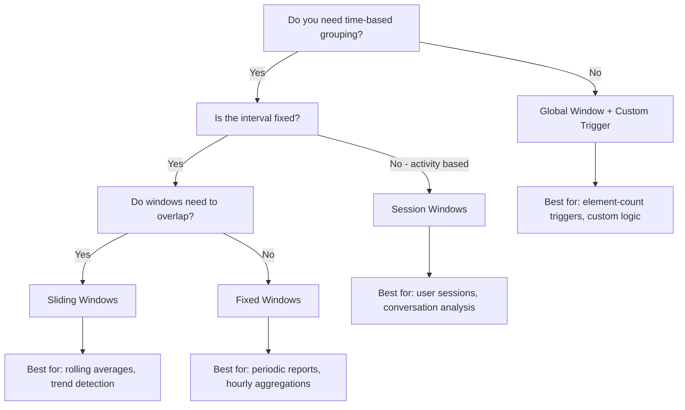

# How to Implement Windowing Strategies in Dataflow Streaming Pipelines

Author: [nawazdhandala](https://www.github.com/nawazdhandala)

Tags: GCP, Google Cloud Dataflow, Apache Beam, Streaming, Windowing

Description: A practical guide to implementing fixed, sliding, session, and global windowing strategies in Google Cloud Dataflow streaming pipelines with Apache Beam.

---

Streaming data never stops. Unlike batch processing where you have a clear beginning and end, streaming pipelines need a way to group unbounded data into finite chunks for aggregation. That is exactly what windowing does in Apache Beam and Google Cloud Dataflow.

Windowing assigns each element in your PCollection to one or more finite windows based on timestamps. Once elements are grouped into windows, you can perform aggregations like counts, sums, and averages over those bounded subsets. Getting windowing right is critical for producing correct results from streaming data.

## Understanding Event Time vs. Processing Time

Before diving into windowing strategies, you need to understand the difference between event time and processing time. Event time is when the data was actually generated - a sensor reading at 2:03 PM, a user click at 5:17 PM. Processing time is when Dataflow actually processes that element, which could be seconds, minutes, or even hours later.

Windowing in Beam operates on event time by default. Each element carries a timestamp, and the window assignment is based on that timestamp. This is important because data can arrive out of order, and event-time windowing handles this correctly.

## Fixed Windows

Fixed windows are the simplest and most commonly used strategy. They divide time into uniform, non-overlapping intervals. Every element falls into exactly one window.

Here is how to apply a fixed window of 5 minutes to a streaming PCollection.

```java
// Apply 5-minute fixed windows to a streaming PCollection
PCollection<String> events = pipeline
    .apply("ReadFromPubSub", PubsubIO.readStrings()
        .fromSubscription("projects/my-project/subscriptions/events-sub"));

PCollection<String> windowedEvents = events
    .apply("Window5Min", Window.<String>into(
        FixedWindows.of(Duration.standardMinutes(5))
    ));

// Now aggregate within each 5-minute window
PCollection<KV<String, Long>> eventCounts = windowedEvents
    .apply("ExtractKey", MapElements.via(
        new SimpleFunction<String, KV<String, Long>>() {
            @Override
            public KV<String, Long> apply(String event) {
                // Parse the event and extract the key
                String eventType = parseEventType(event);
                return KV.of(eventType, 1L);
            }
        }))
    .apply("CountPerWindow", Sum.longsPerKey());
```

With this setup, events are grouped into non-overlapping 5-minute buckets. All events from 2:00-2:05 go into one window, 2:05-2:10 into the next, and so on. The count aggregation produces a separate result for each window.

## Sliding Windows

Sliding windows overlap. You define both a window size and a slide period. If your window is 10 minutes with a 5-minute slide, you get overlapping windows: 2:00-2:10, 2:05-2:15, 2:10-2:20. Each element can belong to multiple windows.

This is useful for computing rolling averages or detecting trends.

```java
// Apply 10-minute sliding windows with a 5-minute slide period
PCollection<Double> windowedReadings = sensorReadings
    .apply("SlidingWindow", Window.<Double>into(
        SlidingWindows.of(Duration.standardMinutes(10))
            .every(Duration.standardMinutes(5))
    ));

// Compute rolling average temperature per sensor
PCollection<KV<String, Double>> rollingAvg = windowedReadings
    .apply("ComputeAvg", Mean.perKey());
```

The tradeoff with sliding windows is that each element gets duplicated into multiple windows, so you use more memory and compute. A 10-minute window with a 1-minute slide means each element exists in 10 windows simultaneously.

## Session Windows

Session windows are dynamic - they are based on activity gaps rather than fixed time intervals. A session window closes when no new data arrives for a specified gap duration. This makes them perfect for modeling user sessions, conversation threads, or any activity with natural pauses.

```java
// Apply session windows with a 30-minute inactivity gap
PCollection<KV<String, String>> userEvents = pipeline
    .apply("ReadEvents", PubsubIO.readStrings()
        .fromSubscription("projects/my-project/subscriptions/clicks-sub"))
    .apply("ParseToKV", ParDo.of(new DoFn<String, KV<String, String>>() {
        @ProcessElement
        public void processElement(ProcessContext c) {
            // Parse event and key by user ID
            JsonObject event = JsonParser.parseString(c.element()).getAsJsonObject();
            String userId = event.get("user_id").getAsString();
            c.output(KV.of(userId, c.element()));
        }
    }));

// Session windows are keyed - each key gets its own session tracking
PCollection<KV<String, String>> sessionedEvents = userEvents
    .apply("SessionWindows", Window.<KV<String, String>>into(
        Sessions.withGapDuration(Duration.standardMinutes(30))
    ));

// Count events per user session
PCollection<KV<String, Long>> eventsPerSession = sessionedEvents
    .apply("CountPerSession", Count.perKey());
```

Session windows are keyed, meaning each key tracks its own sessions independently. User A might have a session from 2:00-2:45 while User B has sessions from 2:10-2:20 and 3:00-3:35.

## Global Windows

The global window is the default for batch pipelines - it puts everything into a single window. For streaming pipelines, you would use this with custom triggers to control when results are emitted.

```java
// Global window with a trigger that fires every 100 elements
PCollection<String> globallyWindowed = events
    .apply("GlobalWindow", Window.<String>into(
        new GlobalWindows())
        .triggering(Repeatedly.forever(
            AfterPane.elementCountAtLeast(100)
        ))
        .withAllowedLateness(Duration.ZERO)
        .discardingFiredPanes());
```

Global windows are rarely used in streaming unless you have a specific reason. They are more common in batch pipelines where the entire dataset is already bounded.

## Choosing the Right Strategy

Here is a diagram showing when to use each windowing strategy.



## Timestamp Assignment

For windowing to work correctly, your elements need accurate timestamps. When reading from Pub/Sub, Dataflow automatically uses the Pub/Sub publish time. But sometimes you need to use a timestamp from the data itself.

```java
// Assign timestamps from the event data rather than Pub/Sub publish time
PCollection<String> withEventTimestamps = events
    .apply("AssignTimestamps", WithTimestamps.<String>of(
        event -> {
            // Extract the actual event timestamp from the JSON payload
            JsonObject json = JsonParser.parseString(event).getAsJsonObject();
            long epochMillis = json.get("event_timestamp").getAsLong();
            return Instant.ofEpochMilli(epochMillis);
        })
        .withAllowedTimestampSkew(Duration.standardHours(1))
    );
```

The `withAllowedTimestampSkew` setting is important. It tells Beam how far back in time an element's timestamp can be compared to the current watermark. If your data can arrive significantly delayed, you need to set this appropriately.

## Combining Windows with GroupByKey

Windows become particularly useful when combined with grouping operations.

```java
// Group events by category within each 1-hour fixed window
PCollection<KV<String, Iterable<Event>>> groupedByWindow = parsedEvents
    .apply("HourlyWindows", Window.<KV<String, Event>>into(
        FixedWindows.of(Duration.standardHours(1))
    ))
    .apply("GroupByCategory", GroupByKey.create());
```

Each key-window combination produces a separate group. If you have 3 categories and 24 hourly windows in a day, you get 72 groups.

## Practical Tips

After running many streaming pipelines in production, here are patterns that have served me well.

Start with fixed windows unless you have a specific reason for something else. They are the easiest to reason about and debug.

For session windows, choose your gap duration carefully. Too short and you split legitimate sessions. Too long and you merge unrelated activity into one session.

Sliding windows with small slide periods generate a lot of data. A 1-hour window sliding every 1 second creates 3,600 copies of each element. Use the largest slide period that meets your latency requirements.

Always set allowed lateness when using windowing in streaming. Without it, late data gets silently dropped once the watermark passes the window's end.

Test your windowing logic with a direct runner before deploying to Dataflow. It is much easier to debug windowing issues locally than in a distributed environment.

Windowing is the foundation of stream processing in Dataflow. Once you understand how windows interact with triggers, watermarks, and accumulation modes, you can build streaming pipelines that produce accurate results from messy, real-world data.
