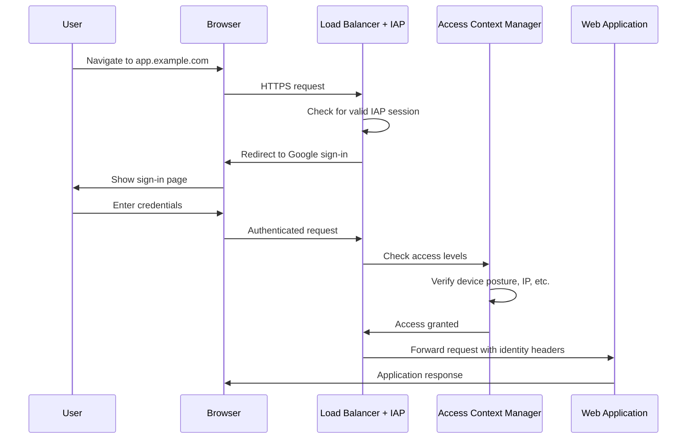

# How to Implement Zero Trust Access to Web Applications Using BeyondCorp Enterprise

Author: [nawazdhandala](https://www.github.com/nawazdhandala)

Tags: GCP, BeyondCorp, Zero Trust, Security, Identity-Aware Proxy

Description: A practical guide to implementing zero trust access for your web applications using Google BeyondCorp Enterprise and Identity-Aware Proxy on GCP.

---

Traditional network security assumes that everything inside your corporate network is trusted and everything outside is not. BeyondCorp Enterprise flips this model. Every request is verified regardless of where it comes from - whether the user is sitting in the office or working from a coffee shop. No VPN required.

This guide shows you how to set up BeyondCorp Enterprise to protect web applications hosted on GCP with identity-based access controls.

## What BeyondCorp Enterprise Provides

BeyondCorp Enterprise builds on several GCP components:

- Identity-Aware Proxy (IAP) - Verifies user identity and applies access policies before allowing access to applications
- Access Context Manager - Defines conditions like device type, IP range, and location
- Endpoint Verification - Collects device security information
- Chrome Enterprise Premium - Provides threat and data protection in the browser

Together, these components let you enforce access policies based on who the user is, what device they are using, and whether the device meets your security requirements.

## Prerequisites

You will need:

- A GCP project with billing enabled
- An application running behind a GCP load balancer (HTTPS)
- Cloud Identity or Google Workspace for user management
- BeyondCorp Enterprise license (for advanced features)
- Organization-level access to configure access policies

```bash
# Enable the required APIs
gcloud services enable iap.googleapis.com \
  accesscontextmanager.googleapis.com \
  beyondcorp.googleapis.com \
  --project=my-project-id
```

## Step 1: Set Up the OAuth Consent Screen

IAP uses OAuth for authentication. You need to configure the consent screen first.

```bash
# Navigate to the OAuth consent screen in the console
# or configure it via the API
# Set the application name and authorized domains
```

In the GCP Console, go to APIs & Services, then OAuth consent screen. Set it to "Internal" if you only want users from your organization, or "External" for broader access. Add your application domain to the authorized domains.

## Step 2: Configure Identity-Aware Proxy

IAP sits in front of your application and intercepts all requests. Users must authenticate before they can reach your app.

For a web application behind a backend service on a load balancer:

```bash
# Enable IAP on a backend service
gcloud iap web enable \
  --resource-type=backend-services \
  --service=my-backend-service \
  --project=my-project-id
```

For App Engine applications:

```bash
# Enable IAP on App Engine
gcloud iap web enable \
  --resource-type=app-engine \
  --project=my-project-id
```

## Step 3: Configure IAP Access

Grant specific users or groups access through IAP.

```bash
# Grant a specific user access through IAP
gcloud iap web add-iam-policy-binding \
  --resource-type=backend-services \
  --service=my-backend-service \
  --member="user:alice@example.com" \
  --role="roles/iap.httpsResourceAccessor" \
  --project=my-project-id

# Grant a group access
gcloud iap web add-iam-policy-binding \
  --resource-type=backend-services \
  --service=my-backend-service \
  --member="group:engineering@example.com" \
  --role="roles/iap.httpsResourceAccessor" \
  --project=my-project-id
```

Only users with the `roles/iap.httpsResourceAccessor` role can access the application. Everyone else gets a 403 error.

## Step 4: Set Up the Load Balancer with IAP

If you do not have a load balancer yet, create one with IAP enabled.

```bash
# Create a health check
gcloud compute health-checks create http my-health-check \
  --port=8080 \
  --request-path=/health \
  --project=my-project-id

# Create a backend service with IAP enabled
gcloud compute backend-services create my-backend-service \
  --protocol=HTTP \
  --health-checks=my-health-check \
  --global \
  --iap=enabled,oauth2-client-id=CLIENT_ID,oauth2-client-secret=CLIENT_SECRET \
  --project=my-project-id

# Add your instance group or NEG to the backend service
gcloud compute backend-services add-backend my-backend-service \
  --instance-group=my-instance-group \
  --instance-group-zone=us-central1-a \
  --global \
  --project=my-project-id

# Create a URL map
gcloud compute url-maps create my-url-map \
  --default-service=my-backend-service \
  --project=my-project-id

# Create an HTTPS proxy with a managed SSL certificate
gcloud compute ssl-certificates create my-cert \
  --domains=app.example.com \
  --global \
  --project=my-project-id

gcloud compute target-https-proxies create my-https-proxy \
  --url-map=my-url-map \
  --ssl-certificates=my-cert \
  --project=my-project-id

# Create a forwarding rule
gcloud compute forwarding-rules create my-forwarding-rule \
  --target-https-proxy=my-https-proxy \
  --ports=443 \
  --global \
  --project=my-project-id
```

## Step 5: Create Access Levels with Access Context Manager

Access levels define the conditions under which access is granted. They go beyond just identity - you can require specific networks, device states, or geographic regions.

```yaml
# access-level.yaml
# Defines an access level that requires a corporate device and managed browser
- accessLevel:
    name: accessPolicies/POLICY_ID/accessLevels/corp-device-required
    title: Corporate Device Required
    basic:
      conditions:
        - devicePolicy:
            requireScreenlock: true
            osConstraints:
              - osType: DESKTOP_CHROME_OS
              - osType: DESKTOP_WINDOWS
                minimumVersion: "10.0.0"
              - osType: DESKTOP_MAC
                minimumVersion: "12.0.0"
            allowedEncryptionStatuses:
              - ENCRYPTED
```

Create the access level using gcloud.

```bash
# Create an access level requiring corporate IP range
gcloud access-context-manager levels create corp-network \
  --title="Corporate Network" \
  --basic-level-spec=corp-network-spec.yaml \
  --policy=POLICY_ID
```

Where the spec file defines the conditions.

```yaml
# corp-network-spec.yaml
# Requires requests to come from corporate IP ranges
- ipSubnetworks:
    - "203.0.113.0/24"
    - "198.51.100.0/24"
```

## Step 6: Apply Access Levels to IAP

Bind the access level to your IAP-protected resource.

```bash
# Apply the access level to the backend service
gcloud iap web set-iam-policy \
  --resource-type=backend-services \
  --service=my-backend-service \
  --project=my-project-id \
  policy.json
```

The policy file combines IAM roles with access level conditions.

```json
{
  "bindings": [
    {
      "role": "roles/iap.httpsResourceAccessor",
      "members": [
        "group:engineering@example.com"
      ],
      "condition": {
        "expression": "\"accessPolicies/POLICY_ID/accessLevels/corp-device-required\" in request.auth.access_levels",
        "title": "Require Corporate Device"
      }
    }
  ]
}
```

This means that even if a user is in the engineering group, they can only access the application if their device meets the corporate device requirements.

## Step 7: Verify the Setup

Test the access flow.

1. Open a browser and navigate to your application URL
2. You should be redirected to Google's sign-in page
3. After signing in, IAP checks your identity and access levels
4. If everything passes, you are forwarded to the application
5. If any check fails, you see a 403 Forbidden page

```bash
# Check the IAP status on your backend service
gcloud iap web get-iam-policy \
  --resource-type=backend-services \
  --service=my-backend-service \
  --project=my-project-id
```

## Architecture Diagram

Here is how the request flow works with BeyondCorp Enterprise.



## Reading User Identity in Your Application

IAP passes user identity information to your application through HTTP headers.

```python
# Example: reading IAP identity headers in a Python Flask app
from flask import Flask, request

app = Flask(__name__)

@app.route("/")
def home():
    # IAP sets these headers after authentication
    user_email = request.headers.get("X-Goog-Authenticated-User-Email", "")
    user_id = request.headers.get("X-Goog-Authenticated-User-Id", "")

    # Strip the "accounts.google.com:" prefix
    email = user_email.replace("accounts.google.com:", "")

    return f"Hello, {email}!"
```

Make sure your application validates the JWT in the `X-Goog-IAP-JWT-Assertion` header to prevent spoofing in case someone bypasses the load balancer.

## Summary

BeyondCorp Enterprise with IAP provides zero trust access to your web applications without requiring a VPN. Users authenticate through Google's identity platform, and access decisions are made based on identity, device posture, and network conditions. The setup involves configuring IAP on your load balancer, defining access levels with Access Context Manager, and binding those levels to your IAP-protected resources. Your application receives authenticated user identity in HTTP headers, making it easy to implement user-specific logic.
