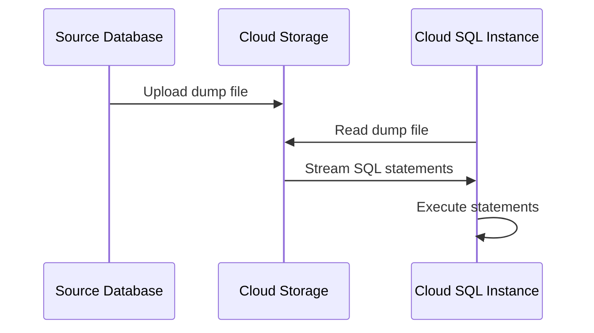

# How to Import Data into Cloud SQL Using SQL Dump Files

Author: [nawazdhandala](https://www.github.com/nawazdhandala)

Tags: GCP, Cloud SQL, Data Import, SQL Dump, Migration

Description: A practical guide to importing data into Cloud SQL instances using SQL dump files from Cloud Storage, covering MySQL and PostgreSQL workflows.

---

Whether you are migrating from another database provider, restoring from an export, or loading test data into a development environment, importing SQL dump files into Cloud SQL is something you will need to do eventually. The process is not complicated, but there are specific requirements around file format, permissions, and storage that catch people off guard. This guide covers the full workflow.

## The Import Process Overview

Cloud SQL imports work like this:

1. You create a SQL dump file from your source database
2. Upload the dump file to a Cloud Storage bucket
3. Grant the Cloud SQL service account access to the bucket
4. Run the import operation from the gcloud CLI or Console
5. Cloud SQL reads the file from Cloud Storage and executes the SQL statements



## Creating a SQL Dump File

### MySQL Dump

Use `mysqldump` to create a dump from your source MySQL database:

```bash
# Create a MySQL dump file
# --single-transaction ensures consistency without locking tables
# --routines includes stored procedures and functions
# --triggers includes triggers
# --set-gtid-purged=OFF avoids GTID-related issues during import
mysqldump \
    --host=source-db-host \
    --user=root \
    --password \
    --single-transaction \
    --routines \
    --triggers \
    --set-gtid-purged=OFF \
    --databases mydb > mydb-dump.sql
```

Important flags to know:

- `--single-transaction` takes a consistent snapshot without locking (InnoDB only)
- `--set-gtid-purged=OFF` is critical for Cloud SQL imports - without it, the import will fail
- Do not use `--all-databases` unless you know what you are doing, as it includes system databases

### PostgreSQL Dump

Use `pg_dump` for PostgreSQL:

```bash
# Create a PostgreSQL dump file in plain SQL format
# -Fp produces plain-text SQL output
# --no-owner removes ownership commands (Cloud SQL manages users differently)
# --no-acl removes permission commands
pg_dump \
    --host=source-db-host \
    --username=postgres \
    --format=plain \
    --no-owner \
    --no-acl \
    --dbname=mydb > mydb-dump.sql
```

The `--no-owner` and `--no-acl` flags are important because Cloud SQL has specific user management that differs from a self-managed PostgreSQL instance.

## Preparing the Dump File

Before uploading, review and possibly modify the dump file.

### Remove Unsupported Statements

Cloud SQL does not support all SQL statements. Remove or comment out:

- `CREATE DATABASE` statements (create the database separately)
- `ALTER DATABASE` statements that set unsupported parameters
- References to system tablespaces
- Any `DEFINER` clauses in views or routines (MySQL)

For MySQL, remove DEFINER clauses:

```bash
# Remove DEFINER clauses from MySQL dump files
# These cause permission issues in Cloud SQL
sed -i 's/DEFINER=[^ ]* / /g' mydb-dump.sql
```

### Compress Large Files

For large dumps, compress the file before uploading:

```bash
# Compress the dump file with gzip
gzip mydb-dump.sql
```

Cloud SQL supports importing `.gz` compressed files directly.

## Upload to Cloud Storage

Create a bucket (if you do not have one) and upload the dump:

```bash
# Create a Cloud Storage bucket for database imports
gsutil mb -l us-central1 gs://my-db-imports/

# Upload the dump file
gsutil cp mydb-dump.sql.gz gs://my-db-imports/
```

For very large files (multi-GB), use parallel uploads:

```bash
# Upload large files using parallel composite uploads
gsutil -o GSUtil:parallel_composite_upload_threshold=150M \
    cp mydb-dump.sql.gz gs://my-db-imports/
```

## Grant Access to Cloud SQL

Cloud SQL uses a per-project service account to access Cloud Storage. You need to grant this service account read access to your bucket.

First, find your Cloud SQL service account:

```bash
# Get the service account email for your Cloud SQL instance
gcloud sql instances describe my-instance \
    --format="value(serviceAccountEmailAddress)"
```

This returns something like `p123456789-abcdef@gcp-sa-cloud-sql.iam.gserviceaccount.com`.

Grant it access to the bucket:

```bash
# Grant the Cloud SQL service account read access to the bucket
gsutil iam ch \
    serviceAccount:p123456789-abcdef@gcp-sa-cloud-sql.iam.gserviceaccount.com:objectViewer \
    gs://my-db-imports/
```

## Running the Import

### MySQL Import

```bash
# Import a SQL dump file into a MySQL Cloud SQL instance
gcloud sql import sql my-mysql-instance \
    gs://my-db-imports/mydb-dump.sql.gz \
    --database=mydb
```

### PostgreSQL Import

```bash
# Import a SQL dump file into a PostgreSQL Cloud SQL instance
gcloud sql import sql my-postgres-instance \
    gs://my-db-imports/mydb-dump.sql.gz \
    --database=mydb
```

The `--database` flag specifies which database to import into. The database must already exist:

```bash
# Create the target database if it does not exist
gcloud sql databases create mydb --instance=my-postgres-instance
```

## Monitoring Import Progress

Imports can take a while for large databases. Monitor the operation:

```bash
# Check the status of the most recent operation
gcloud sql operations list --instance=my-instance --limit=1

# Get details on a specific operation
gcloud sql operations describe OPERATION_ID
```

During the import, the instance remains available but performance may be degraded. For large imports, consider doing this during a maintenance window.

## Handling Import Errors

### Error: "Access Denied"

The Cloud SQL service account does not have access to the Cloud Storage bucket. Double-check the IAM binding:

```bash
# Verify the service account has access
gsutil iam get gs://my-db-imports/ | grep gcp-sa-cloud-sql
```

### Error: "Unknown database"

The target database does not exist. Create it first:

```bash
# Create the database before importing
gcloud sql databases create mydb --instance=my-instance
```

### Error: "Got a packet bigger than max_allowed_packet"

For MySQL, increase the `max_allowed_packet` flag:

```bash
# Increase max_allowed_packet for large row imports
gcloud sql instances patch my-instance \
    --database-flags=max_allowed_packet=1073741824
```

### Error: "DEFINER not allowed"

Remove DEFINER clauses from your dump file. Cloud SQL restricts which users can appear in DEFINER clauses.

## Importing Large Databases

For databases over 100 GB, consider these strategies:

### Split the Dump

Break the dump into schema and data files:

```bash
# Export schema only
mysqldump --no-data --routines --triggers mydb > schema.sql

# Export data only, split by table
for table in $(mysql -N -e "SHOW TABLES FROM mydb"); do
    mysqldump --no-create-info --single-transaction mydb $table > data_${table}.sql
done
```

Import schema first, then data files one at a time.

### Disable Binary Logging During Import

For MySQL, temporarily disable binary logging to speed up the import:

```bash
# Disable binary logging during import (reduces overhead)
gcloud sql instances patch my-instance \
    --no-backup

# Run the import
gcloud sql import sql my-instance gs://my-db-imports/mydb-dump.sql.gz --database=mydb

# Re-enable backups after import
gcloud sql instances patch my-instance \
    --backup-start-time=03:00
```

### Use a Larger Machine Type

Temporarily scale up your instance for the import, then scale back down:

```bash
# Scale up for faster import
gcloud sql instances patch my-instance --tier=db-custom-8-32768

# Run import...

# Scale back down
gcloud sql instances patch my-instance --tier=db-custom-4-16384
```

## Verifying the Import

After the import completes, verify your data:

```bash
# Connect to the instance and run verification queries
gcloud sql connect my-instance --user=postgres --database=mydb
```

```sql
-- Check table counts to verify data completeness
SELECT schemaname, tablename, n_live_tup
FROM pg_stat_user_tables
ORDER BY n_live_tup DESC;

-- Or for MySQL
SELECT table_name, table_rows
FROM information_schema.tables
WHERE table_schema = 'mydb'
ORDER BY table_rows DESC;
```

Compare row counts with your source database to make sure everything came through.

## Clean Up

After a successful import, clean up the dump file from Cloud Storage:

```bash
# Remove the dump file to avoid storage costs
gsutil rm gs://my-db-imports/mydb-dump.sql.gz
```

## Summary

Importing SQL dump files into Cloud SQL follows a predictable workflow: create the dump, upload to Cloud Storage, grant access, and run the import. The main gotchas are permissions, unsupported SQL statements, and sizing for large databases. Always verify your import by comparing row counts with the source, and clean up temporary files from Cloud Storage when you are done.
