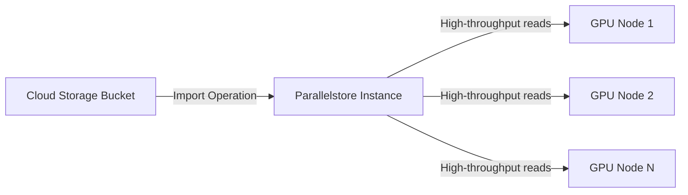

# How to Import Training Data from Cloud Storage to Parallelstore for AI/ML Model Training

Author: [nawazdhandala](https://www.github.com/nawazdhandala)

Tags: GCP, Google Cloud, Parallelstore, Cloud Storage, AI, ML, Model Training, Data Pipeline

Description: Learn how to efficiently import training data from Google Cloud Storage into Parallelstore for high-performance AI and ML model training workloads.

---

Training machine learning models at scale means dealing with massive datasets, and where that data lives has a direct impact on how fast your training runs. Google Cloud Storage is the natural landing zone for most training data - it is cheap, durable, and accessible from anywhere. But when your training job needs to read millions of small files or stream hundreds of gigabytes per second, GCS alone cannot keep up. That is why the typical pattern is to stage your data into Parallelstore before kicking off a training run.

Parallelstore is Google Cloud's managed high-performance parallel file system, designed specifically for workloads that need massive throughput and low-latency file access. The built-in data import functionality makes it straightforward to pull data from Cloud Storage into Parallelstore, and once it is there, your training jobs can access it at speeds that would not be possible from GCS directly.

## Understanding the Data Flow

The architecture is simple. Your raw training data sits in a GCS bucket. You use the Parallelstore import operation to copy that data into a Parallelstore instance. Your GPU nodes then read from Parallelstore during training, getting the throughput they need without being bottlenecked by object storage latencies.



## Prerequisites

You will need:

- A Parallelstore instance already provisioned (at least as large as your dataset)
- A GCS bucket containing your training data
- The gcloud CLI installed and authenticated
- Appropriate IAM permissions on both the GCS bucket and the Parallelstore instance

## Step 1: Prepare Your Cloud Storage Data

Before importing, make sure your data is organized in a way that maps well to a file system. Parallelstore preserves the directory structure from GCS, so the object path in GCS becomes the file path in Parallelstore.

```bash
# Check the size of your training data to ensure your Parallelstore
# instance has enough capacity
gsutil du -s gs://my-training-data/imagenet/

# List the structure to understand what will be imported
gsutil ls gs://my-training-data/imagenet/ | head -20
```

If your data is stored as TFRecords, Parquet files, or other large sequential files, the import will be straightforward. If you have millions of small files (like individual images), the import still works but takes longer because of the per-file overhead.

## Step 2: Set Up IAM Permissions

The Parallelstore service agent needs permission to read from your GCS bucket. This is a step people often miss.

```bash
# Get the Parallelstore service agent email for your project
# It follows the format: service-<project-number>@gcp-sa-parallelstore.iam.gserviceaccount.com
PROJECT_NUMBER=$(gcloud projects describe my-project --format="value(projectNumber)")
SERVICE_AGENT="service-${PROJECT_NUMBER}@gcp-sa-parallelstore.iam.gserviceaccount.com"

# Grant the service agent read access to your GCS bucket
gsutil iam ch serviceAccount:${SERVICE_AGENT}:objectViewer gs://my-training-data
```

## Step 3: Start the Data Import

Use the gcloud CLI to initiate the import operation. The import runs asynchronously, so you get an operation ID back immediately.

```bash
# Start the import from GCS to Parallelstore
# source-gcs-bucket-uri specifies the GCS path to import from
# destination-parallelstore-path is where files land in the Parallelstore instance
gcloud parallelstore instances import-data my-parallelstore \
    --project=my-project \
    --location=us-central1-a \
    --source-gcs-bucket-uri=gs://my-training-data/imagenet/ \
    --destination-parallelstore-path=/imagenet/
```

The command returns an operation ID that you can use to track progress.

## Step 4: Monitor the Import Progress

Data imports can take a while depending on the size of your dataset. Track the progress using the operation ID.

```bash
# Check the status of the import operation
# Replace OPERATION_ID with the ID returned from the import command
gcloud parallelstore operations describe OPERATION_ID \
    --project=my-project \
    --location=us-central1-a
```

For large datasets, the import throughput depends on the Parallelstore instance size. Larger instances have more servers and can ingest data faster. A 12 TiB instance can typically import data at around 10-20 GB/s from GCS, so a 1 TB dataset would take roughly a minute or two.

## Step 5: Verify the Imported Data

Once the import completes, verify that all your data made it across correctly.

```bash
# If you have the Parallelstore instance mounted (e.g., via the CSI driver in GKE),
# you can check the imported files directly
kubectl exec -it my-training-pod -- ls -la /data/imagenet/ | head -20

# Count the total number of files to compare with GCS
kubectl exec -it my-training-pod -- find /data/imagenet/ -type f | wc -l
```

Compare the file count and total size against what is in GCS. They should match exactly.

## Step 6: Configure Your Training Job to Use Parallelstore

Now point your training job at the Parallelstore mount point instead of GCS.

```python
# training_config.py
# Point the data loader at the Parallelstore mount path instead of GCS
import tensorflow as tf

# Before: reading from GCS (slow for large datasets)
# dataset = tf.data.TFRecordDataset("gs://my-training-data/imagenet/train-*.tfrecord")

# After: reading from Parallelstore (much faster)
# The data is at the mount point configured in your pod spec
DATA_DIR = "/data/imagenet"
train_files = tf.io.gfile.glob(f"{DATA_DIR}/train-*.tfrecord")

# Create a dataset with parallel reads for maximum throughput
dataset = tf.data.TFRecordDataset(
    train_files,
    num_parallel_reads=tf.data.AUTOTUNE  # Let TF decide the parallelism level
)

# Standard preprocessing pipeline
dataset = dataset.shuffle(buffer_size=10000)
dataset = dataset.map(parse_example, num_parallel_calls=tf.data.AUTOTUNE)
dataset = dataset.batch(256)
dataset = dataset.prefetch(tf.data.AUTOTUNE)
```

## Automating Imports for Recurring Training Runs

If you retrain your models regularly with updated data, automate the import step as part of your training pipeline.

```bash
#!/bin/bash
# import-and-train.sh
# Automates the data import and triggers training once complete

set -e

INSTANCE="my-parallelstore"
PROJECT="my-project"
ZONE="us-central1-a"
GCS_PATH="gs://my-training-data/imagenet/"
PS_PATH="/imagenet/"

echo "Starting data import from ${GCS_PATH}..."

# Start the import and capture the operation name
OPERATION=$(gcloud parallelstore instances import-data ${INSTANCE} \
    --project=${PROJECT} \
    --location=${ZONE} \
    --source-gcs-bucket-uri=${GCS_PATH} \
    --destination-parallelstore-path=${PS_PATH} \
    --format="value(name)")

echo "Import operation: ${OPERATION}"

# Poll until the operation completes
while true; do
    STATUS=$(gcloud parallelstore operations describe ${OPERATION} \
        --project=${PROJECT} \
        --location=${ZONE} \
        --format="value(done)")

    if [ "${STATUS}" = "True" ]; then
        echo "Import complete!"
        break
    fi

    echo "Import still running, waiting 30 seconds..."
    sleep 30
done

# Now trigger the training job
echo "Launching training job..."
kubectl apply -f training-job.yaml
```

## Performance Considerations

A few things to keep in mind for getting the best import and training performance:

Keep your Parallelstore instance and GCS bucket in the same region. Cross-region imports work but are slower and incur egress charges.

Size your Parallelstore instance appropriately. The throughput scales with instance size, so a larger instance imports data faster and serves it to training jobs at higher bandwidth.

For datasets with millions of small files, consider packing them into larger files (like TFRecords or WebDataset format) before importing. The import operation handles large files more efficiently than millions of tiny ones.

If you only need a subset of your GCS data, import just that subset rather than the entire bucket. The import supports specifying a prefix path, so you can target specific directories.

## Cleaning Up After Training

If your Parallelstore instance is shared across multiple training runs, clean up old data when you are done.

```bash
# Remove the imported data after training completes to free space
# Do this from a pod that has the Parallelstore volume mounted
kubectl exec -it my-training-pod -- rm -rf /data/imagenet/old-version/
```

## Summary

The pattern of importing data from Cloud Storage to Parallelstore before training is becoming the standard approach for large-scale ML workloads on GCP. The import operation is simple to run, the performance gains during training are significant, and the whole process can be automated as part of your ML pipeline. If your training jobs are spending more time waiting on data than computing gradients, staging your data into Parallelstore is the fix.
