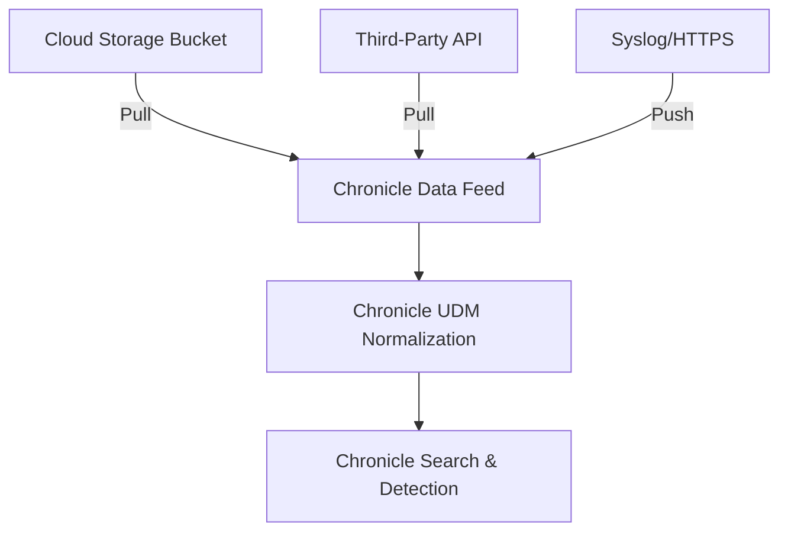

# How to Ingest Log Data into Google Chronicle SIEM Using Data Feeds

Author: [nawazdhandala](https://www.github.com/nawazdhandala)

Tags: GCP, Chronicle SIEM, Log Ingestion, Data Feeds, Security Operations

Description: A practical guide to setting up data feeds in Google Chronicle SIEM for ingesting log data from various sources including cloud services and on-premises systems.

---

Google Chronicle SIEM is built on Google's infrastructure and can ingest massive volumes of security telemetry without you worrying about storage limits or query performance. The primary way to get data into Chronicle is through data feeds - configured pipelines that pull or receive log data from various sources. In this guide, I will walk through how to set up data feeds to get your logs flowing into Chronicle.

## How Data Feeds Work in Chronicle

Chronicle supports two main ingestion methods:

1. **Push-based feeds** - Your source sends data directly to Chronicle's ingestion API
2. **Pull-based feeds** - Chronicle reaches out to your source and pulls data on a schedule

Each feed is configured with a source type, log type, and connection details. Chronicle normalizes the incoming data into its Unified Data Model (UDM), which makes it searchable and correlatable regardless of where the logs originated.



## Setting Up a Google Cloud Storage Feed

One of the most common patterns is landing logs in a Cloud Storage bucket and having Chronicle pull from there. This works well for GCP audit logs, VPC flow logs, and any other data you can export.

### Step 1: Prepare the Cloud Storage Bucket

First, create a bucket and set up a log export. This example exports Cloud Audit Logs.

```bash
# Create a dedicated bucket for Chronicle ingestion
gsutil mb -l US gs://chronicle-log-ingestion-YOUR_PROJECT_ID

# Create a log sink that exports audit logs to the bucket
gcloud logging sinks create chronicle-audit-sink \
    storage.googleapis.com/chronicle-log-ingestion-YOUR_PROJECT_ID \
    --log-filter='logName:"cloudaudit.googleapis.com"' \
    --project=YOUR_PROJECT_ID
```

After creating the sink, grant the sink's service account write access to the bucket.

```bash
# Get the sink's service account
SINK_SA=$(gcloud logging sinks describe chronicle-audit-sink \
    --project=YOUR_PROJECT_ID \
    --format='value(writerIdentity)')

# Grant write access to the bucket
gsutil iam ch $SINK_SA:roles/storage.objectCreator \
    gs://chronicle-log-ingestion-YOUR_PROJECT_ID
```

### Step 2: Create a Service Account for Chronicle

Chronicle needs a service account with read access to pull logs from your bucket.

```bash
# Create a service account for Chronicle
gcloud iam service-accounts create chronicle-feed-reader \
    --display-name="Chronicle Feed Reader" \
    --project=YOUR_PROJECT_ID

# Grant read access to the bucket
gsutil iam ch \
    serviceAccount:chronicle-feed-reader@YOUR_PROJECT_ID.iam.gserviceaccount.com:roles/storage.objectViewer \
    gs://chronicle-log-ingestion-YOUR_PROJECT_ID

# Generate a key for the service account
gcloud iam service-accounts keys create chronicle-feed-key.json \
    --iam-account=chronicle-feed-reader@YOUR_PROJECT_ID.iam.gserviceaccount.com
```

### Step 3: Configure the Feed in Chronicle

In the Chronicle console, navigate to Settings, then SIEM Settings, then Feeds. Click "Add New" and configure the following:

- **Source Type**: Google Cloud Storage
- **Log Type**: GCP Cloud Audit (or the appropriate type for your data)
- **GCS URI**: `gs://chronicle-log-ingestion-YOUR_PROJECT_ID`
- **Source Delete Option**: Choose whether Chronicle deletes files after ingestion
- **Service Account Credentials**: Upload the JSON key you generated

You can also configure feeds programmatically using the Chronicle Feed Management API.

```python
# create_feed.py
# Creates a Chronicle data feed using the API
import requests
import json

CHRONICLE_API_URL = "https://backstory.googleapis.com"
CUSTOMER_ID = "your-chronicle-customer-id"

def create_gcs_feed(access_token, bucket_uri, log_type):
    """Create a GCS-based data feed in Chronicle."""
    url = f"{CHRONICLE_API_URL}/v1/feeds"

    headers = {
        "Authorization": f"Bearer {access_token}",
        "Content-Type": "application/json"
    }

    # Feed configuration payload
    feed_config = {
        "details": {
            "feedSourceType": "GOOGLE_CLOUD_STORAGE",
            "logType": log_type,
            "gcsSettings": {
                "bucketUri": bucket_uri,
                "sourceType": "FOLDERS_RECURSIVE",
                "sourceDeletionOption": "SOURCE_DELETION_NEVER"
            }
        }
    }

    response = requests.post(url, headers=headers, json=feed_config)

    if response.status_code == 200:
        print(f"Feed created successfully: {response.json()}")
    else:
        print(f"Error creating feed: {response.status_code} - {response.text}")

    return response.json()

# Usage
# create_gcs_feed(token, "gs://chronicle-log-ingestion-myproject", "GCP_CLOUDAUDIT")
```

## Setting Up an API-Based Feed

For third-party services that expose log APIs, Chronicle can pull directly from those APIs. Let me walk through setting up an Office 365 feed as an example, since it is a common integration.

In the Chronicle console:

1. Go to Settings then Feeds then Add New
2. Select **Source Type**: Third Party API
3. Select **Log Type**: Office 365
4. Enter your Office 365 tenant ID, client ID, and client secret
5. Select the content types you want to ingest (Audit.AzureActiveDirectory, Audit.Exchange, etc.)

Chronicle handles the pagination, rate limiting, and incremental fetching automatically. It will poll the API on a regular schedule and bring in new events.

## Setting Up a Syslog Feed

For on-premises devices like firewalls and network equipment, syslog is often the only option. You will need the Chronicle Forwarder for this, which acts as a local collector.

### Install the Chronicle Forwarder

The forwarder runs as a Docker container on a machine in your network.

```bash
# Pull the Chronicle forwarder image
docker pull gcr.io/chronicle-container/cf_production_stable

# Create a configuration directory
mkdir -p /opt/chronicle/config
```

Create the forwarder configuration file. This tells the forwarder which syslog ports to listen on and where to send the data.

```yaml
# /opt/chronicle/config/forwarder.conf
# Chronicle forwarder configuration for syslog collection
output:
  url: malachiteingestion-pa.googleapis.com:443
  identity:
    customer_id: "YOUR_CHRONICLE_CUSTOMER_ID"
    collector_id: "YOUR_COLLECTOR_ID"
    secret_key: "YOUR_SECRET_KEY"

collectors:
  - syslog:
      common:
        enabled: true
        data_type: PAN_FIREWALL
        batch_n_seconds: 10
        batch_n_bytes: 1048576
      tcp_address: "0.0.0.0:514"
      udp_address: "0.0.0.0:514"
      connection_timeout_sec: 60
```

Start the forwarder container.

```bash
# Run the forwarder container
docker run -d \
    --name chronicle-forwarder \
    --restart=always \
    -v /opt/chronicle/config:/opt/chronicle/external \
    -p 514:514/tcp \
    -p 514:514/udp \
    gcr.io/chronicle-container/cf_production_stable
```

Now point your syslog sources at the forwarder's IP address on port 514.

## Setting Up an HTTPS Feed (Webhook)

Some services can push logs via webhooks. Chronicle supports HTTPS-based ingestion for these cases.

In the Chronicle console, create an HTTPS feed:

1. Go to Settings then Feeds then Add New
2. Select **Source Type**: Webhook
3. Select the appropriate **Log Type**
4. Chronicle generates a unique ingestion URL and API key

You can then configure your source to POST log data to that URL.

```bash
# Test the webhook endpoint with a sample log entry
curl -X POST "https://malachiteingestion-pa.googleapis.com/v2/unstructuredlogentries:batchCreate" \
    -H "Content-Type: application/json" \
    -H "X-Chronicle-API-Key: YOUR_API_KEY" \
    -d '{
        "customer_id": "YOUR_CUSTOMER_ID",
        "log_type": "GITHUB",
        "entries": [
            {
                "log_text": "{\"action\":\"repo.create\",\"actor\":\"user@example.com\"}"
            }
        ]
    }'
```

## Verifying Data Ingestion

After setting up your feeds, verify that data is flowing correctly.

In the Chronicle console, go to the Data Ingestion dashboard. You should see:

- **Ingestion rate** - bytes per second being ingested
- **Log count** - number of events per log type
- **Error rate** - any parsing or ingestion errors

You can also run a quick UDM search to verify.

```
metadata.log_type = "GCP_CLOUDAUDIT" AND metadata.event_timestamp.seconds > timestamp("2026-02-17T00:00:00Z")
```

## Troubleshooting Common Issues

**Feed shows "Healthy" but no data appears**: Check that the source is actually producing logs. For GCS feeds, verify files are being written to the bucket. For API feeds, check the credentials have not expired.

**Parsing errors in the dashboard**: This usually means the log format does not match what Chronicle expects for that log type. Check that you selected the correct log type for your data source. If you are sending custom formats, you may need a custom parser.

**High latency in data appearing**: Pull-based feeds have a polling interval, so there is inherent delay. For near-real-time ingestion, use push-based methods like the forwarder or HTTPS webhooks.

**Forwarder not sending data**: Check the forwarder container logs with `docker logs chronicle-forwarder`. Common issues include incorrect credentials, network connectivity to the ingestion endpoint, and misconfigured collector sections.

Getting data into Chronicle is the foundation of your security operations. Once the feeds are running and data is normalized into UDM, you can build detection rules, run investigations, and correlate events across all your sources. Start with your highest-value log sources - cloud audit logs, identity provider logs, and network logs - and expand from there.
