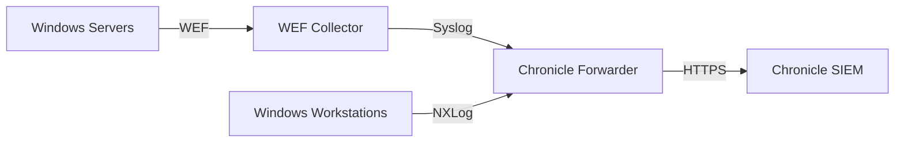

# How to Ingest Windows Event Logs into Chronicle Using the Forwarder

Author: [nawazdhandala](https://www.github.com/nawazdhandala)

Tags: GCP, Chronicle SIEM, Windows Event Logs, Chronicle Forwarder, Log Collection

Description: Step-by-step guide to deploying the Chronicle Forwarder to collect Windows Event Logs and send them to Google Chronicle SIEM for security monitoring and detection.

---

Windows Event Logs are one of the most valuable data sources for security monitoring. They capture authentication events, process creation, privilege usage, and much more. Getting these logs into Chronicle SIEM means you can correlate Windows activity with your cloud logs, network events, and other security telemetry. The Chronicle Forwarder is the component that bridges the gap between your on-premises Windows environment and Chronicle's cloud-based SIEM.

In this guide, I will walk through deploying the Chronicle Forwarder, configuring it for Windows Event Log collection, and verifying the data shows up correctly in Chronicle.

## Architecture Overview

The Chronicle Forwarder runs as a service on a Linux or Windows machine in your network. For Windows Event Logs, you have two approaches:

1. **WEF (Windows Event Forwarding) + Forwarder** - Windows machines forward events to a WEF collector, which sends them to the Chronicle Forwarder via syslog
2. **NXLog + Forwarder** - NXLog agent on Windows machines sends events directly to the Chronicle Forwarder



I will cover both approaches.

## Prerequisites

- Chronicle SIEM instance with forwarder credentials (customer ID, collector ID, secret key)
- A Linux or Windows server to run the Chronicle Forwarder
- Network connectivity from the forwarder to `malachiteingestion-pa.googleapis.com` on port 443
- Admin access to your Windows machines for configuring log forwarding

## Method 1: Windows Event Forwarding with Chronicle Forwarder

### Step 1: Configure Windows Event Forwarding

WEF is a built-in Windows feature that centralizes event log collection. First, set up the WEF collector.

On the collector server, run these PowerShell commands to configure the WEC (Windows Event Collector) service.

```powershell
# Enable the Windows Event Collector service
wecutil qc /q

# Create a subscription for security events
# Save this as subscription.xml
```

Create the subscription XML file that defines which events to collect.

```xml
<!-- subscription.xml -->
<!-- WEF subscription for security-relevant Windows events -->
<Subscription xmlns="http://schemas.microsoft.com/2006/03/windows/events/subscription">
    <SubscriptionId>ChronicleSecurityEvents</SubscriptionId>
    <SubscriptionType>SourceInitiated</SubscriptionType>
    <Description>Security events for Chronicle SIEM</Description>
    <Enabled>true</Enabled>
    <Uri>http://schemas.microsoft.com/wbem/wsman/1/windows/EventLog</Uri>
    <ConfigurationMode>Custom</ConfigurationMode>
    <Query>
        <![CDATA[
            <QueryList>
                <Query Id="0" Path="Security">
                    <Select Path="Security">
                        *[System[(EventID=4624 or EventID=4625 or EventID=4634 or
                        EventID=4648 or EventID=4672 or EventID=4688 or
                        EventID=4698 or EventID=4720 or EventID=4722 or
                        EventID=4724 or EventID=4728 or EventID=4732 or
                        EventID=4756 or EventID=4768 or EventID=4769 or
                        EventID=4771 or EventID=4776)]]
                    </Select>
                </Query>
                <Query Id="1" Path="System">
                    <Select Path="System">
                        *[System[(EventID=7045 or EventID=7040)]]
                    </Select>
                </Query>
                <Query Id="2" Path="Microsoft-Windows-PowerShell/Operational">
                    <Select Path="Microsoft-Windows-PowerShell/Operational">
                        *[System[(EventID=4103 or EventID=4104)]]
                    </Select>
                </Query>
            </QueryList>
        ]]>
    </Query>
    <ReadExistingEvents>false</ReadExistingEvents>
    <TransportName>HTTP</TransportName>
    <Delivery Mode="Push">
        <Batching>
            <MaxLatencyTime>60000</MaxLatencyTime>
        </Batching>
    </Delivery>
</Subscription>
```

The selected Event IDs cover the most security-relevant events:

- 4624/4625 - Successful and failed logins
- 4688 - Process creation
- 4672 - Special privileges assigned
- 4720/4722/4724 - Account management
- 4728/4732/4756 - Group membership changes
- 4768/4769/4771 - Kerberos authentication
- 7045 - New service installed
- 4103/4104 - PowerShell script execution

Apply the subscription on the WEF collector.

```powershell
# Create the subscription
wecutil cs subscription.xml
```

### Step 2: Configure Syslog Forwarding from WEF Collector

Install a syslog agent on the WEF collector to forward events to the Chronicle Forwarder. NXLog Community Edition works well for this.

```xml
<!-- nxlog.conf on the WEF collector -->
<!-- Reads forwarded Windows events and sends them via syslog -->
<Input eventlog>
    Module im_msvistalog
    Query <QueryList>\
        <Query Id="0">\
            <Select Path="ForwardedEvents">*</Select>\
        </Query>\
    </QueryList>
</Input>

<Output chronicle_forwarder>
    Module om_tcp
    Host CHRONICLE_FORWARDER_IP
    Port 10514
    OutputType Syslog_TLS
</Output>

<Route wef_to_chronicle>
    Path eventlog => chronicle_forwarder
</Route>
```

### Step 3: Deploy the Chronicle Forwarder

Install the Chronicle Forwarder on a Linux server. The forwarder is distributed as a Docker container.

```bash
# Pull the Chronicle forwarder image
docker pull gcr.io/chronicle-container/cf_production_stable

# Create the configuration directory
mkdir -p /opt/chronicle/config
```

Create the forwarder configuration.

```yaml
# /opt/chronicle/config/forwarder.conf
# Chronicle Forwarder configuration for Windows Event Logs
output:
  url: malachiteingestion-pa.googleapis.com:443
  identity:
    customer_id: "YOUR_CHRONICLE_CUSTOMER_ID"
    collector_id: "YOUR_COLLECTOR_ID"
    secret_key: "YOUR_SECRET_KEY"
  compression: true

collectors:
  - syslog:
      common:
        enabled: true
        data_type: WINEVTLOG
        batch_n_seconds: 10
        batch_n_bytes: 1048576
      tcp_address: "0.0.0.0:10514"
      connection_timeout_sec: 60
```

Start the forwarder.

```bash
# Run the Chronicle Forwarder
docker run -d \
    --name chronicle-forwarder \
    --restart=always \
    -v /opt/chronicle/config:/opt/chronicle/external \
    -p 10514:10514/tcp \
    gcr.io/chronicle-container/cf_production_stable
```

## Method 2: NXLog Direct to Chronicle Forwarder

For smaller environments or when WEF is not feasible, install NXLog directly on each Windows machine.

### Step 1: Install NXLog on Windows Machines

Download and install NXLog Community Edition on each Windows machine you want to monitor.

### Step 2: Configure NXLog

Create the NXLog configuration that reads Windows Event Logs and sends them to the Chronicle Forwarder.

```xml
<!-- C:\Program Files\nxlog\conf\nxlog.conf -->
<!-- Collects Windows security events and sends to Chronicle Forwarder -->

define ROOT C:\Program Files\nxlog

<Extension _syslog>
    Module xm_syslog
</Extension>

<Extension _json>
    Module xm_json
</Extension>

<!-- Read Windows Security Event Log -->
<Input security_events>
    Module im_msvistalog
    <QueryXML>
        <QueryList>
            <Query Id="0" Path="Security">
                <Select Path="Security">*</Select>
            </Query>
        </QueryList>
    </QueryXML>
</Input>

<!-- Read PowerShell Operational Log -->
<Input powershell_events>
    Module im_msvistalog
    <QueryXML>
        <QueryList>
            <Query Id="0" Path="Microsoft-Windows-PowerShell/Operational">
                <Select Path="Microsoft-Windows-PowerShell/Operational">*</Select>
            </Query>
        </QueryList>
    </QueryXML>
</Input>

<!-- Read Sysmon if installed -->
<Input sysmon_events>
    Module im_msvistalog
    <QueryXML>
        <QueryList>
            <Query Id="0" Path="Microsoft-Windows-Sysmon/Operational">
                <Select Path="Microsoft-Windows-Sysmon/Operational">*</Select>
            </Query>
        </QueryList>
    </QueryXML>
</Input>

<!-- Send to Chronicle Forwarder -->
<Output chronicle>
    Module om_tcp
    Host CHRONICLE_FORWARDER_IP
    Port 10514
    Exec to_syslog_ietf();
</Output>

<Route security_to_chronicle>
    Path security_events, powershell_events, sysmon_events => chronicle
</Route>
```

### Step 3: Configure the Chronicle Forwarder

The forwarder configuration is the same as Method 1. If you are collecting from multiple sources, you can add additional collector entries.

```yaml
# /opt/chronicle/config/forwarder.conf
output:
  url: malachiteingestion-pa.googleapis.com:443
  identity:
    customer_id: "YOUR_CHRONICLE_CUSTOMER_ID"
    collector_id: "YOUR_COLLECTOR_ID"
    secret_key: "YOUR_SECRET_KEY"
  compression: true

collectors:
  # Collector for WEF-forwarded events
  - syslog:
      common:
        enabled: true
        data_type: WINEVTLOG
        batch_n_seconds: 10
        batch_n_bytes: 1048576
      tcp_address: "0.0.0.0:10514"
      connection_timeout_sec: 60

  # Collector for Sysmon events
  - syslog:
      common:
        enabled: true
        data_type: WINDOWS_SYSMON
        batch_n_seconds: 10
        batch_n_bytes: 1048576
      tcp_address: "0.0.0.0:10515"
      connection_timeout_sec: 60
```

## Verifying Data Ingestion

After deploying the forwarder, verify that Windows Event Logs are appearing in Chronicle.

In the Chronicle console, go to the Data Ingestion dashboard and look for the WINEVTLOG log type. You should see ingestion metrics within a few minutes.

Run a UDM search to verify specific event types.

```
metadata.log_type = "WINEVTLOG" AND metadata.event_type = "USER_LOGIN"
```

For process creation events, which are useful for detecting malicious activity.

```
metadata.log_type = "WINEVTLOG" AND metadata.event_type = "PROCESS_LAUNCH"
```

## Troubleshooting

**Forwarder not receiving data**: Check that the forwarder is listening on the configured port. Run `docker logs chronicle-forwarder` to see if there are any errors. Verify firewall rules allow traffic from your Windows machines or WEF collector to the forwarder.

**Data arrives but parsing fails**: Verify the `data_type` in the forwarder configuration matches the actual log format. Use WINEVTLOG for standard Windows Event Logs and WINDOWS_SYSMON for Sysmon-specific events.

**High latency**: The forwarder batches data before sending. If latency is an issue, reduce the `batch_n_seconds` value. Going below 5 seconds is generally not recommended as it increases overhead.

**Missing events**: Check the WEF subscription or NXLog configuration to make sure the Event IDs you need are included. Also verify that the Windows audit policy is configured to generate the events you expect.

Getting Windows Event Logs into Chronicle unlocks a whole category of detections around endpoint activity, Active Directory attacks, and lateral movement. Combined with your cloud logs and network data, you get the full visibility needed to detect and investigate threats across your entire environment.
