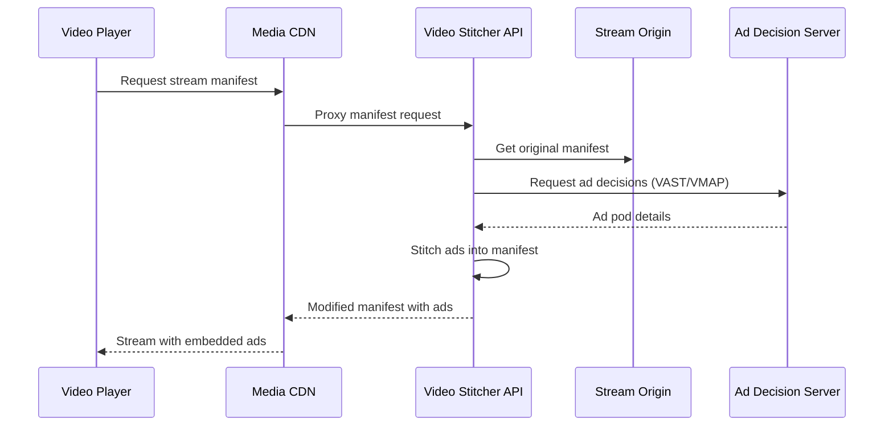

# How to Insert Server-Side Ads into Live Streams Using Google Cloud Video Stitcher API

Author: [nawazdhandala](https://www.github.com/nawazdhandala)

Tags: GCP, Video Stitcher API, Ad Insertion, Live Streaming, Media

Description: Insert server-side ads into live video streams using Google Cloud Video Stitcher API for seamless, ad-blocker-resistant monetization.

---

Server-side ad insertion (SSAI) stitches advertisements directly into the video stream on the server before it reaches the viewer. Unlike client-side ad insertion where the player fetches ads separately (and ad blockers can intercept them), SSAI delivers a single continuous stream that includes the ads. The viewer's player cannot tell the difference between content and ads.

Google Cloud's Video Stitcher API provides this capability. It sits between your origin (Live Stream API or VOD content) and your CDN, dynamically inserting ads based on ad decision server (ADS) responses.

## How Server-Side Ad Insertion Works



The stitcher modifies the HLS/DASH manifest to replace content segments with ad segments during ad breaks, making the transition seamless from the player's perspective.

## Prerequisites

- GCP project with Video Stitcher API enabled
- A live stream source (from Live Stream API or external)
- An ad decision server (Google Ad Manager, SpotX, FreeWheel, or a custom VAST endpoint)
- Cloud Storage bucket for slate content

```bash
# Enable the API
gcloud services enable videostitcher.googleapis.com

# Install the client library
pip install google-cloud-video-stitcher
```

## Step 1: Create a Slate

A slate is the content shown when no ad is available to fill an ad break. It is usually a branded graphic or a "we'll be right back" animation:

```python
# setup_slate.py - Creates a slate for use during ad breaks

from google.cloud.video import stitcher_v1

def create_slate(project_id, location, slate_id, slate_uri):
    """Creates a slate that is displayed when no ad fill is available.
    The slate should be a short, loopable video in your Cloud Storage bucket.

    Args:
        project_id: GCP project ID
        location: API location
        slate_id: Unique ID for this slate
        slate_uri: GCS path to the slate video
    """

    client = stitcher_v1.VideoStitcherServiceClient()
    parent = f"projects/{project_id}/locations/{location}"

    slate = stitcher_v1.types.Slate()
    slate.uri = slate_uri

    operation = client.create_slate(
        parent=parent,
        slate=slate,
        slate_id=slate_id,
    )

    result = operation.result(timeout=120)
    print(f"Slate created: {result.name}")
    return result

# Create a slate using a video in Cloud Storage
create_slate(
    project_id="your-project",
    location="us-central1",
    slate_id="default-slate",
    slate_uri="gs://your-bucket/slates/break-slate.mp4",
)
```

## Step 2: Register a CDN Key

If your content is served through a CDN with signed URLs, register the CDN key so the stitcher can access the content:

```python
def create_cdn_key(project_id, location, cdn_key_id, hostname, key_name, private_key):
    """Registers a CDN key for Media CDN or Akamai.
    This allows the stitcher to sign URLs for ad and content segments."""

    client = stitcher_v1.VideoStitcherServiceClient()
    parent = f"projects/{project_id}/locations/{location}"

    cdn_key = stitcher_v1.types.CdnKey()
    cdn_key.hostname = hostname

    # For Media CDN
    media_cdn_key = stitcher_v1.types.MediaCdnKey()
    media_cdn_key.key_name = key_name
    media_cdn_key.private_key = private_key.encode()
    cdn_key.media_cdn_key = media_cdn_key

    operation = client.create_cdn_key(
        parent=parent,
        cdn_key=cdn_key,
        cdn_key_id=cdn_key_id,
    )

    result = operation.result(timeout=120)
    print(f"CDN key registered: {result.name}")
    return result
```

## Step 3: Create a Live Session Configuration

The session config defines how ad insertion works for your live stream:

```python
def create_live_config(project_id, location, config_id, stream_uri, ad_tag_uri, slate_name):
    """Creates a live session configuration that defines how ads are
    stitched into a live stream.

    Args:
        project_id: GCP project ID
        location: API location
        config_id: Unique ID for this config
        stream_uri: URI of the source live stream manifest
        ad_tag_uri: VAST/VMAP ad tag URL from your ad server
        slate_name: Full resource name of the slate to use
    """

    client = stitcher_v1.VideoStitcherServiceClient()
    parent = f"projects/{project_id}/locations/{location}"

    live_config = stitcher_v1.types.LiveConfig()
    live_config.source_uri = stream_uri
    live_config.ad_tag_uri = ad_tag_uri
    live_config.default_slate = slate_name

    # Ad tracking mode - CLIENT means the player handles ad tracking beacons
    # SERVER means the stitcher handles tracking automatically
    live_config.ad_tracking = stitcher_v1.types.AdTracking.SERVER

    # Stitching policy
    live_config.stitching_policy = stitcher_v1.types.LiveConfig.StitchingPolicy.CUT_CURRENT

    operation = client.create_live_config(
        parent=parent,
        live_config=live_config,
        live_config_id=config_id,
    )

    result = operation.result(timeout=120)
    print(f"Live config created: {result.name}")
    return result

# Create the live session config
create_live_config(
    project_id="your-project",
    location="us-central1",
    config_id="my-live-config",
    stream_uri="https://storage.googleapis.com/your-bucket/live-output/main.m3u8",
    ad_tag_uri="https://your-ad-server.com/vast?duration=[dur]&pod=[podnum]",
    slate_name="projects/your-project/locations/us-central1/slates/default-slate",
)
```

## Step 4: Create a Live Session

When a viewer requests to watch the stream, create a live session for them:

```python
def create_live_session(project_id, location, live_config_id):
    """Creates a live session for a specific viewer.
    Each viewer gets their own session, enabling targeted ad insertion.

    Returns the play URI that the player should use."""

    client = stitcher_v1.VideoStitcherServiceClient()
    parent = f"projects/{project_id}/locations/{location}"

    live_config_name = (
        f"projects/{project_id}/locations/{location}/liveConfigs/{live_config_id}"
    )

    session = stitcher_v1.types.LiveSession()
    session.live_config = live_config_name

    # You can pass targeting parameters for personalized ads
    session.ad_tag_macros = {
        "user_segment": "sports_fans",
        "geo": "us-west",
    }

    result = client.create_live_session(
        parent=parent,
        live_session=session,
    )

    print(f"Session created: {result.name}")
    print(f"Play URI: {result.play_uri}")
    return result

# Create a session for a viewer
session = create_live_session(
    project_id="your-project",
    location="us-central1",
    live_config_id="my-live-config",
)

# The player should load session.play_uri as its stream source
```

## Step 5: Trigger Ad Breaks

For live streams, you need to signal when an ad break should occur. This is done by inserting SCTE-35 markers in the live stream or by using the API:

```python
def insert_ad_break(project_id, location, channel_id, duration_seconds):
    """Inserts an ad break into a live stream by creating an ad break event.
    The Video Stitcher will fill this break with ads from the ad server."""

    # If using Live Stream API, create an event on the channel
    from google.cloud.video.live_stream_v1 import LivestreamServiceClient
    from google.cloud.video.live_stream_v1 import types
    from google.protobuf import duration_pb2

    client = LivestreamServiceClient()
    parent = f"projects/{project_id}/locations/{location}/channels/{channel_id}"

    event = types.Event()
    event.ad_break = types.Event.AdBreakTask()
    event.ad_break.duration = duration_pb2.Duration(seconds=duration_seconds)
    event.execute_now = True  # Start the ad break immediately

    result = client.create_event(
        parent=parent,
        event=event,
        event_id=f"ad-break-{int(time.time())}",
    )

    print(f"Ad break inserted: {duration_seconds}s")
    return result

import time
# Insert a 30-second ad break
insert_ad_break("your-project", "us-central1", "my-live-channel", 30)
```

## Step 6: Track Ad Performance

The stitcher provides ad tracking data through sessions:

```python
def get_ad_tracking_data(project_id, location, session_name):
    """Retrieves ad tracking data for a live session.
    Shows which ads were played and their completion rates."""

    client = stitcher_v1.VideoStitcherServiceClient()

    # List ad tag details for the session
    ad_tag_details = client.list_live_ad_tag_details(parent=session_name)

    for detail in ad_tag_details:
        print(f"Ad tag: {detail.name}")
        print(f"  Ad requests: {detail.ad_requests}")

        for ad_request in detail.ad_requests:
            print(f"  URI: {ad_request.uri}")
            if ad_request.response_metadata:
                print(f"  Ad count: {ad_request.response_metadata.ad_count}")
```

## Integration with Your Player

On the client side, the player just loads the session URI like any other HLS stream:

```javascript
// JavaScript player integration
// The player does not need any special ad SDK - it just plays the stream

const videoElement = document.getElementById('player');

// Use hls.js for HLS playback
const hls = new Hls();

// The play URI from the live session creation
const streamUrl = 'https://videostitcher.googleapis.com/...session_play_uri';

hls.loadSource(streamUrl);
hls.attachMedia(videoElement);
hls.on(Hls.Events.MANIFEST_PARSED, function() {
    videoElement.play();
});

// For ad tracking in CLIENT mode, listen for metadata events
hls.on(Hls.Events.FRAG_CHANGED, function(event, data) {
    // Check for ad markers in segment metadata
    console.log('Fragment changed:', data.frag.sn);
});
```

## Wrapping Up

Server-side ad insertion through the Video Stitcher API gives you ad-blocker-resistant monetization with a seamless viewer experience. The ads are stitched at the manifest level, so the player sees one continuous stream. Combined with the Live Stream API for encoding and Media CDN for delivery, you have a complete live streaming monetization stack on Google Cloud. The per-session model means each viewer can get different ads, enabling targeted advertising at scale.
