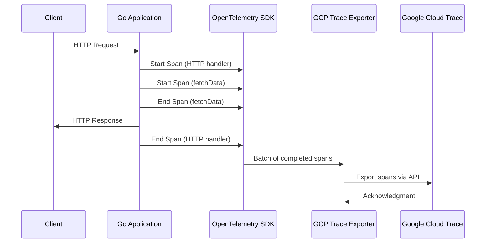

# How to Instrument a Go Application with OpenTelemetry and Export to Google Cloud Trace

Author: [nawazdhandala](https://www.github.com/nawazdhandala)

Tags: GCP, OpenTelemetry, Go, Cloud Trace, Distributed Tracing, Google Cloud

Description: A practical guide to instrumenting a Go application with OpenTelemetry and exporting traces to Google Cloud Trace for distributed tracing visibility.

---

If you are running Go services on Google Cloud and need visibility into how requests flow through your system, OpenTelemetry combined with Cloud Trace is one of the most straightforward ways to get there. OpenTelemetry gives you vendor-neutral instrumentation, and Cloud Trace gives you a managed backend to visualize and analyze your traces. In this post, I will show you how to wire them together step by step.

## Why OpenTelemetry for Go on GCP?

Google Cloud Trace has its own client libraries, but OpenTelemetry has become the standard for instrumentation. Using OpenTelemetry means your code is not locked into any specific backend. If you decide to switch to Jaeger, Zipkin, or another tracing tool later, you only need to swap the exporter - your instrumentation code stays the same.

## Prerequisites

- Go 1.21 or later installed
- A GCP project with Cloud Trace API enabled
- Application Default Credentials configured (run `gcloud auth application-default login`)

## Step 1: Set Up Your Go Module

Start with a fresh Go module or add to an existing one.

```bash
# Initialize a new Go module
mkdir myapp && cd myapp
go mod init example.com/myapp
```

## Step 2: Install Dependencies

You will need several OpenTelemetry packages plus the Google Cloud exporter.

```bash
# Install the OpenTelemetry SDK, API, and Google Cloud Trace exporter
go get go.opentelemetry.io/otel
go get go.opentelemetry.io/otel/sdk/trace
go get go.opentelemetry.io/otel/exporters/otlp/otlptrace
go get github.com/GoogleCloudPlatform/opentelemetry-operations-go/exporter/trace
go get go.opentelemetry.io/contrib/instrumentation/net/http/otelhttp
```

## Step 3: Initialize the Trace Exporter and Provider

This is the core setup. You need to create a Google Cloud Trace exporter and register it as the global trace provider.

```go
package main

import (
    "context"
    "log"
    "net/http"
    "os"
    "time"

    texporter "github.com/GoogleCloudPlatform/opentelemetry-operations-go/exporter/trace"
    "go.opentelemetry.io/contrib/instrumentation/net/http/otelhttp"
    "go.opentelemetry.io/otel"
    "go.opentelemetry.io/otel/attribute"
    sdktrace "go.opentelemetry.io/otel/sdk/trace"
    "go.opentelemetry.io/otel/trace"
)

// initTracer sets up the OpenTelemetry trace provider with the GCP exporter
func initTracer() (*sdktrace.TracerProvider, error) {
    // Read the GCP project ID from environment or metadata server
    projectID := os.Getenv("GOOGLE_CLOUD_PROJECT")

    // Create the Google Cloud Trace exporter
    exporter, err := texporter.New(texporter.WithProjectID(projectID))
    if err != nil {
        return nil, err
    }

    // Create a trace provider with a batch span processor
    // BatchSpanProcessor batches spans before sending to reduce overhead
    tp := sdktrace.NewTracerProvider(
        sdktrace.WithBatcher(exporter),
        sdktrace.WithSampler(sdktrace.AlwaysSample()),
    )

    // Register this as the global trace provider
    otel.SetTracerProvider(tp)
    return tp, nil
}
```

## Step 4: Create Your Application with Instrumentation

Now let us build a simple HTTP server that creates traces automatically.

```go
func main() {
    // Initialize the tracer - this must happen before any spans are created
    tp, err := initTracer()
    if err != nil {
        log.Fatalf("Failed to initialize tracer: %v", err)
    }
    // Ensure all pending spans are flushed on shutdown
    defer func() {
        ctx, cancel := context.WithTimeout(context.Background(), 5*time.Second)
        defer cancel()
        if err := tp.Shutdown(ctx); err != nil {
            log.Printf("Error shutting down tracer provider: %v", err)
        }
    }()

    // Get a named tracer instance
    tracer := otel.Tracer("example.com/myapp")

    // Handler with manual span creation
    handler := http.HandlerFunc(func(w http.ResponseWriter, r *http.Request) {
        // Start a child span for the business logic
        ctx, span := tracer.Start(r.Context(), "processRequest",
            trace.WithAttributes(
                attribute.String("http.method", r.Method),
                attribute.String("http.path", r.URL.Path),
            ),
        )
        defer span.End()

        // Simulate calling a downstream service
        result, err := fetchData(ctx, tracer)
        if err != nil {
            span.RecordError(err)
            http.Error(w, "Internal error", 500)
            return
        }

        w.Write([]byte(result))
    })

    // Wrap the handler with otelhttp for automatic HTTP instrumentation
    wrappedHandler := otelhttp.NewHandler(handler, "HTTP GET /")

    log.Println("Server starting on :8080")
    log.Fatal(http.ListenAndServe(":8080", wrappedHandler))
}

// fetchData simulates a downstream call with its own span
func fetchData(ctx context.Context, tracer trace.Tracer) (string, error) {
    // This span becomes a child of the parent span from the HTTP handler
    _, span := tracer.Start(ctx, "fetchData")
    defer span.End()

    // Simulate some work
    time.Sleep(50 * time.Millisecond)
    span.SetAttributes(attribute.String("data.source", "database"))

    return "Hello from traced endpoint", nil
}
```

## Step 5: Run and Test

Set your project ID and run the application.

```bash
# Set your GCP project and run the app
export GOOGLE_CLOUD_PROJECT="my-project-id"
go run main.go
```

In another terminal, send a few requests.

```bash
# Send some test requests to generate traces
curl http://localhost:8080/
curl http://localhost:8080/api/data
curl http://localhost:8080/health
```

## Step 6: View Traces in Cloud Console

Head to the Google Cloud Console, navigate to Trace, and you should see your traces appearing within a minute or two. Each trace will show the HTTP handler span as the parent with the `fetchData` span nested underneath it.

## Adding HTTP Client Instrumentation

If your service makes outbound HTTP calls, you want those traced too. Wrap your HTTP client with `otelhttp`.

```go
// Create an instrumented HTTP client for outbound requests
func newTracedHTTPClient() *http.Client {
    return &http.Client{
        // otelhttp.NewTransport wraps the default transport to create spans
        // for every outbound HTTP request automatically
        Transport: otelhttp.NewTransport(http.DefaultTransport),
    }
}

// Use the traced client for downstream calls
func callDownstreamService(ctx context.Context) (string, error) {
    client := newTracedHTTPClient()

    // The context carries the trace, so the outbound request
    // will be linked as a child span
    req, err := http.NewRequestWithContext(ctx, "GET", "https://api.example.com/data", nil)
    if err != nil {
        return "", err
    }

    resp, err := client.Do(req)
    if err != nil {
        return "", err
    }
    defer resp.Body.Close()

    return "response received", nil
}
```

## Configuring Sampling

In production, you probably do not want to trace every single request. Configure a sampler to control the ratio.

```go
// Use a probabilistic sampler that traces 10% of requests
tp := sdktrace.NewTracerProvider(
    sdktrace.WithBatcher(exporter),
    // Sample 10% of traces in production
    sdktrace.WithSampler(sdktrace.TraceIDRatioBased(0.1)),
)
```

For a more sophisticated approach, use a parent-based sampler that respects incoming trace context.

```go
// Parent-based sampler: if the incoming request has a sampled trace,
// continue sampling it. Otherwise, sample at 10%.
sampler := sdktrace.ParentBased(sdktrace.TraceIDRatioBased(0.1))
tp := sdktrace.NewTracerProvider(
    sdktrace.WithBatcher(exporter),
    sdktrace.WithSampler(sampler),
)
```

## Trace Flow Visualization

Here is how the trace data flows from your application to Cloud Trace.



## Troubleshooting Tips

If you are not seeing traces show up in Cloud Trace, check these things.

First, confirm the Cloud Trace API is enabled on your project. Second, verify your credentials are correct - the exporter needs permission to write traces. The `roles/cloudtrace.agent` role is sufficient. Third, make sure you are calling `tp.Shutdown()` or `tp.ForceFlush()` before your application exits, otherwise the last batch of spans might be lost.

You can also add a stdout exporter alongside the Cloud Trace exporter during development to see spans in your terminal.

```go
// Add a debug exporter that prints spans to stdout
import "go.opentelemetry.io/otel/exporters/stdout/stdouttrace"

stdoutExporter, _ := stdouttrace.New(stdouttrace.WithPrettyPrint())
tp := sdktrace.NewTracerProvider(
    sdktrace.WithBatcher(exporter),       // Cloud Trace exporter
    sdktrace.WithBatcher(stdoutExporter), // Debug output
)
```

## Wrapping Up

Setting up OpenTelemetry tracing in a Go application with Google Cloud Trace as the backend is pretty painless once you know the pieces involved. The Google Cloud exporter handles the translation from OpenTelemetry spans to Cloud Trace format, and the `otelhttp` middleware takes care of the repetitive HTTP instrumentation. From there, you can add custom spans wherever you need deeper visibility into your application's behavior. The key thing to remember is that context propagation makes everything work - always pass `context.Context` through your function calls so child spans are properly linked to their parents.
