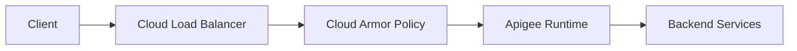

# How to Integrate Apigee with Google Cloud Armor for API-Level DDoS Protection

Author: [nawazdhandala](https://www.github.com/nawazdhandala)

Tags: GCP, Apigee, Cloud Armor, DDoS Protection, API Security

Description: Learn how to integrate Apigee API management with Google Cloud Armor to protect your APIs from DDoS attacks and malicious traffic at the edge.

---

If you run APIs in production, DDoS protection is not optional. Even a brief volumetric attack can overwhelm your backends and take your services offline. Google Cloud gives you two powerful tools that work together here: Apigee for API management and Cloud Armor for layer 7 DDoS mitigation. Combining them creates a defense-in-depth approach where malicious traffic gets filtered before it ever reaches your API proxies.

In this guide, I will walk through the architecture and step-by-step setup for putting Cloud Armor in front of your Apigee endpoints.

## Understanding the Architecture

The integration works by placing a Google Cloud External HTTP(S) Load Balancer in front of your Apigee environment. Cloud Armor security policies attach to that load balancer, which means traffic gets inspected and filtered at Google's edge network before it reaches Apigee.



The key insight is that Apigee X (the Google Cloud-native version) already uses a managed instance group behind a load balancer. You can attach Cloud Armor policies to this load balancer to get DDoS protection at the network edge.

## Prerequisites

Before you start, make sure you have:

- An Apigee X organization provisioned in your GCP project
- The Apigee environment group configured with hostnames
- Proper IAM permissions (at minimum, `roles/apigee.admin` and `roles/compute.securityAdmin`)
- The gcloud CLI installed and authenticated

## Step 1: Identify Your Apigee Load Balancer

When you provision Apigee X, Google creates a load balancer for the runtime. You need to identify the backend service associated with it.

This command lists the backend services in your project so you can find the Apigee one.

```bash
# List all backend services to find the Apigee-related one
gcloud compute backend-services list \
    --project=YOUR_PROJECT_ID \
    --format="table(name, backends[].group)"
```

Look for a backend service that references the Apigee managed instance group. The name usually contains "apigee" in it. Note this name down - you will need it when attaching the security policy.

## Step 2: Create a Cloud Armor Security Policy

Now create a Cloud Armor security policy that will serve as the container for your protection rules.

This creates a new Cloud Armor policy with Adaptive Protection enabled, which uses ML models to detect and mitigate L7 DDoS attacks automatically.

```yaml
# cloud-armor-policy.yaml
# Security policy configuration for Apigee DDoS protection
name: apigee-ddos-protection
description: "DDoS protection policy for Apigee API endpoints"
type: CLOUD_ARMOR
adaptiveProtectionConfig:
  layer7DdosDefenseConfig:
    enable: true
    ruleVisibility: STANDARD
```

```bash
# Create the security policy with Adaptive Protection
gcloud compute security-policies create apigee-ddos-protection \
    --description="DDoS protection for Apigee APIs" \
    --project=YOUR_PROJECT_ID

# Enable Adaptive Protection on the policy
gcloud compute security-policies update apigee-ddos-protection \
    --enable-layer7-ddos-defense \
    --project=YOUR_PROJECT_ID
```

Adaptive Protection is Google's ML-based system that learns your traffic patterns over time and automatically suggests or applies rules when it detects anomalous traffic spikes that look like DDoS attacks.

## Step 3: Add Rate Limiting Rules

Rate limiting is your first line of defense against API abuse. Cloud Armor lets you create throttle rules that limit requests per client.

This rule limits each IP address to 100 requests per minute across your API endpoints.

```bash
# Add a rate limiting rule - 100 requests per minute per IP
gcloud compute security-policies rules create 1000 \
    --security-policy=apigee-ddos-protection \
    --expression="true" \
    --action=throttle \
    --rate-limit-threshold-count=100 \
    --rate-limit-threshold-interval-sec=60 \
    --conform-action=allow \
    --exceed-action=deny-429 \
    --enforce-on-key=IP \
    --project=YOUR_PROJECT_ID
```

You can get more granular by rate limiting based on specific API paths. This rule applies a stricter limit to your authentication endpoint.

```bash
# Stricter rate limit for auth endpoints - 10 requests per minute
gcloud compute security-policies rules create 900 \
    --security-policy=apigee-ddos-protection \
    --expression="request.path.matches('/v1/auth.*')" \
    --action=throttle \
    --rate-limit-threshold-count=10 \
    --rate-limit-threshold-interval-sec=60 \
    --conform-action=allow \
    --exceed-action=deny-429 \
    --enforce-on-key=IP \
    --project=YOUR_PROJECT_ID
```

## Step 4: Add Geo-Blocking Rules

If your API is only meant to serve certain regions, you can block traffic from countries where you do not operate.

This rule denies traffic from specific country codes. Adjust the list based on your requirements.

```bash
# Block traffic from specific regions
gcloud compute security-policies rules create 800 \
    --security-policy=apigee-ddos-protection \
    --expression="origin.region_code == 'XX' || origin.region_code == 'YY'" \
    --action=deny-403 \
    --description="Block traffic from restricted regions" \
    --project=YOUR_PROJECT_ID
```

## Step 5: Add Bot Detection Rules

Cloud Armor includes pre-configured WAF rules that catch common attack patterns. These are useful for blocking bot traffic that targets APIs.

```bash
# Enable the SQL injection protection rule
gcloud compute security-policies rules create 700 \
    --security-policy=apigee-ddos-protection \
    --expression="evaluatePreconfiguredExpr('sqli-v33-stable')" \
    --action=deny-403 \
    --description="Block SQL injection attempts" \
    --project=YOUR_PROJECT_ID

# Enable the cross-site scripting protection rule
gcloud compute security-policies rules create 600 \
    --security-policy=apigee-ddos-protection \
    --expression="evaluatePreconfiguredExpr('xss-v33-stable')" \
    --action=deny-403 \
    --description="Block XSS attempts" \
    --project=YOUR_PROJECT_ID
```

## Step 6: Attach the Policy to the Apigee Backend Service

With all your rules configured, attach the security policy to the Apigee backend service.

```bash
# Attach the security policy to Apigee's backend service
gcloud compute backend-services update APIGEE_BACKEND_SERVICE_NAME \
    --security-policy=apigee-ddos-protection \
    --project=YOUR_PROJECT_ID
```

Replace `APIGEE_BACKEND_SERVICE_NAME` with the name you identified in Step 1.

## Step 7: Configure Apigee-Side Protections

Cloud Armor handles the edge protection, but you should also configure Apigee-level policies for defense in depth. Create a Spike Arrest policy in your Apigee proxy to add another layer of rate limiting.

This Apigee policy XML configures spike arrest to smooth out traffic bursts at the proxy level.

```xml
<!-- SpikeArrest policy for additional rate limiting -->
<SpikeArrest name="SA-RateLimit">
    <Rate>30pm</Rate>
    <Identifier ref="request.header.x-api-key"/>
    <MessageWeight ref="spike_weight"/>
    <UseEffectiveCount>true</UseEffectiveCount>
</SpikeArrest>
```

## Step 8: Set Up Monitoring and Alerting

You need visibility into what Cloud Armor is blocking. Set up a monitoring dashboard that tracks security policy actions.

```bash
# Create a log sink for Cloud Armor events
gcloud logging sinks create cloud-armor-api-logs \
    bigquery.googleapis.com/projects/YOUR_PROJECT_ID/datasets/security_logs \
    --log-filter='resource.type="http_load_balancer" AND jsonPayload.enforcedSecurityPolicy.name="apigee-ddos-protection"' \
    --project=YOUR_PROJECT_ID
```

You can also set up an alerting policy that notifies you when Cloud Armor blocks a surge of traffic.

```bash
# Create an alert for high block rates
gcloud alpha monitoring policies create \
    --notification-channels=YOUR_CHANNEL_ID \
    --display-name="Cloud Armor High Block Rate" \
    --condition-display-name="Blocked requests spike" \
    --condition-filter='resource.type="http_load_balancer" AND metric.type="loadbalancing.googleapis.com/https/request_count" AND metric.labels.response_code_class="400"' \
    --condition-threshold-value=1000 \
    --condition-threshold-duration=300s \
    --project=YOUR_PROJECT_ID
```

## Testing Your Protection

Before relying on your setup in production, test it. Use a tool like `hey` to generate controlled load.

```bash
# Generate a burst of traffic to test rate limiting
# This sends 200 requests with 10 concurrent connections
hey -n 200 -c 10 https://YOUR_APIGEE_HOSTNAME/v1/test
```

After running the test, check the Cloud Armor logs to verify that requests above your threshold were blocked with 429 responses.

## Things to Watch Out For

A few things I have learned from running this setup in production:

1. **Adaptive Protection needs baseline data.** It takes about a week of normal traffic patterns before the ML models can effectively detect anomalies. Do not expect it to work perfectly on day one.

2. **Rate limits need tuning.** Start with generous limits and tighten them based on actual traffic patterns. Being too aggressive will block legitimate API consumers.

3. **Cloud Armor logs can get expensive.** If you are logging every request, the volume from a busy API can push your Cloud Logging costs up fast. Use sampling or export to BigQuery with a retention policy.

4. **Coordinate with Apigee quotas.** Make sure your Cloud Armor rate limits and Apigee quota policies do not conflict. Cloud Armor should be your coarse-grained filter, and Apigee quotas should be your fine-grained, per-developer-app limits.

This integration gives you a solid multi-layered defense for your APIs. Cloud Armor handles the volumetric attacks at Google's edge, while Apigee manages the application-level API security. Together, they cover the full spectrum of threats your APIs face in production.
