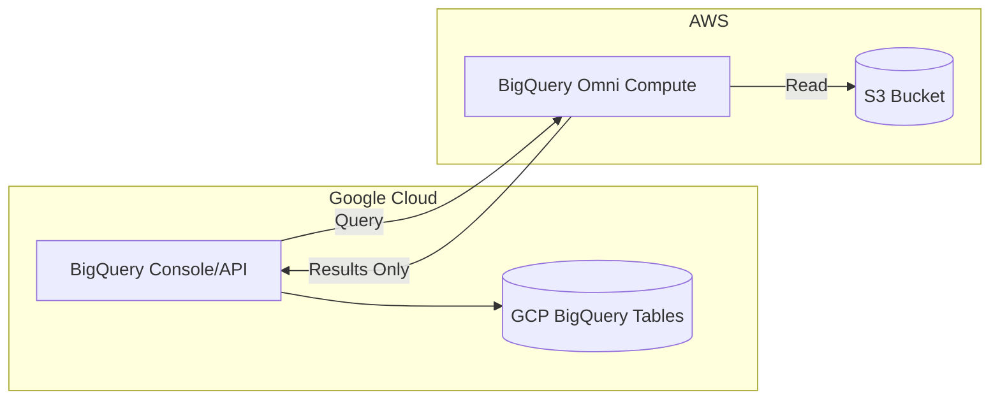

# How to Integrate AWS S3 with Google BigQuery for Cross-Cloud Analytics Using BigQuery Omni

Author: [nawazdhandala](https://www.github.com/nawazdhandala)

Tags: GCP, BigQuery, BigQuery Omni, AWS S3, Cross-Cloud Analytics

Description: Learn how to query data stored in AWS S3 directly from Google BigQuery using BigQuery Omni for cross-cloud analytics without moving your data.

---

Your data lives in AWS S3. Your analytics team prefers BigQuery. In the past, this meant building ETL pipelines to copy data from S3 into BigQuery - adding cost, complexity, and staleness. BigQuery Omni changes this by letting you query data in place, right where it sits in S3, using the same BigQuery SQL you already know.

In this post, I will show you how to set up BigQuery Omni to query AWS S3 data, including the cross-cloud connection setup, external table creation, and query patterns that work well in this architecture.

## What Is BigQuery Omni?

BigQuery Omni is a multi-cloud analytics solution that extends BigQuery's query engine to other clouds. Under the hood, it runs a BigQuery compute node in the same AWS region as your S3 data. Your data never leaves AWS - only the query results come back to GCP.



This means you get BigQuery's query power without the cost and latency of data movement.

## Step 1: Set Up the Cross-Cloud Connection

First, you need to create a connection between your GCP project and your AWS account. This involves creating a BigQuery connection and setting up an IAM role in AWS.

Create the BigQuery connection in GCP:

```bash
# Create a BigQuery connection for AWS
bq mk --connection \
  --connection_type=AWS \
  --location=aws-us-east-1 \
  --project_id=my-gcp-project \
  --properties='{"crossCloudProperties":{"serviceAccountId":"bq-omni@my-gcp-project.iam.gserviceaccount.com"}}' \
  my-aws-connection
```

Get the connection's identity to use in the AWS IAM policy:

```bash
# Retrieve the connection details
bq show --connection --location=aws-us-east-1 my-gcp-project.aws-us-east-1.my-aws-connection
```

This outputs an AWS identity ARN that you will use in the next step.

## Step 2: Configure AWS IAM for BigQuery Access

In your AWS account, create an IAM role that allows BigQuery Omni to read from your S3 bucket. Here is a CloudFormation template:

```yaml
# aws-cloudformation/bigquery-omni-role.yaml
AWSTemplateFormatVersion: '2010-09-09'
Description: IAM role for BigQuery Omni S3 access

Resources:
  BigQueryOmniRole:
    Type: AWS::IAM::Role
    Properties:
      RoleName: bigquery-omni-access
      AssumeRolePolicyDocument:
        Version: '2012-10-17'
        Statement:
          - Effect: Allow
            Principal:
              # Replace with the identity from the BigQuery connection
              Federated: 'accounts.google.com'
            Action: 'sts:AssumeRoleWithWebIdentity'
            Condition:
              StringEquals:
                'accounts.google.com:sub': '<GOOGLE_IDENTITY_FROM_CONNECTION>'

  S3ReadPolicy:
    Type: AWS::IAM::Policy
    Properties:
      PolicyName: bigquery-omni-s3-read
      Roles:
        - !Ref BigQueryOmniRole
      PolicyDocument:
        Version: '2012-10-17'
        Statement:
          # Allow listing the bucket
          - Effect: Allow
            Action:
              - 's3:ListBucket'
            Resource: 'arn:aws:s3:::my-analytics-bucket'
          # Allow reading objects
          - Effect: Allow
            Action:
              - 's3:GetObject'
            Resource: 'arn:aws:s3:::my-analytics-bucket/*'
```

Deploy this with the AWS CLI:

```bash
# Deploy the CloudFormation stack
aws cloudformation create-stack \
  --stack-name bigquery-omni-access \
  --template-body file://bigquery-omni-role.yaml \
  --capabilities CAPABILITY_NAMED_IAM
```

## Step 3: Update the BigQuery Connection with the AWS Role

Now update the BigQuery connection to reference the AWS IAM role:

```bash
# Update the connection with the AWS role ARN
bq update --connection \
  --connection_type=AWS \
  --location=aws-us-east-1 \
  --properties='{"crossCloudProperties":{"serviceAccountId":"bq-omni@my-gcp-project.iam.gserviceaccount.com"},"accessRole":{"iamRoleId":"arn:aws:iam::123456789012:role/bigquery-omni-access"}}' \
  my-gcp-project.aws-us-east-1.my-aws-connection
```

## Step 4: Create External Tables Over S3 Data

With the connection established, create BigQuery external tables that point to your S3 data:

```sql
-- Create a dataset in the AWS region
CREATE SCHEMA IF NOT EXISTS `my-gcp-project.aws_analytics`
OPTIONS (
  location = 'aws-us-east-1'
);

-- Create an external table over Parquet files in S3
CREATE EXTERNAL TABLE `my-gcp-project.aws_analytics.user_events`
WITH CONNECTION `my-gcp-project.aws-us-east-1.my-aws-connection`
OPTIONS (
  format = 'PARQUET',
  uris = ['s3://my-analytics-bucket/user-events/*.parquet']
);

-- For CSV files with a defined schema
CREATE EXTERNAL TABLE `my-gcp-project.aws_analytics.transactions` (
  transaction_id STRING,
  user_id STRING,
  amount FLOAT64,
  currency STRING,
  transaction_date DATE,
  status STRING
)
WITH CONNECTION `my-gcp-project.aws-us-east-1.my-aws-connection`
OPTIONS (
  format = 'CSV',
  uris = ['s3://my-analytics-bucket/transactions/year=*/month=*/*.csv'],
  skip_leading_rows = 1
);
```

## Step 5: Query S3 Data from BigQuery

Now you can query your S3 data using standard BigQuery SQL:

```sql
-- Simple aggregation query on S3 data
-- This runs in the AWS region and only returns results to GCP
SELECT
  DATE_TRUNC(transaction_date, MONTH) AS month,
  currency,
  COUNT(*) AS transaction_count,
  SUM(amount) AS total_amount,
  AVG(amount) AS avg_amount
FROM `my-gcp-project.aws_analytics.transactions`
WHERE transaction_date >= '2025-01-01'
GROUP BY month, currency
ORDER BY month DESC, total_amount DESC;
```

You can also join S3 data with GCP-native BigQuery tables. However, cross-cloud joins require data transfer, so be mindful of performance:

```sql
-- Cross-cloud join: S3 events with BigQuery customer data
-- The S3 data is processed in AWS, then results are joined in GCP
WITH aws_events AS (
  -- This subquery runs in AWS
  SELECT
    user_id,
    COUNT(*) AS event_count,
    MAX(event_timestamp) AS last_event
  FROM `my-gcp-project.aws_analytics.user_events`
  WHERE event_date >= '2025-12-01'
  GROUP BY user_id
)
SELECT
  c.customer_name,
  c.plan_type,
  e.event_count,
  e.last_event
FROM `my-gcp-project.gcp_data.customers` c
JOIN aws_events e ON c.user_id = e.user_id
ORDER BY e.event_count DESC
LIMIT 100;
```

## Optimizing Query Performance

BigQuery Omni queries run against S3, which has different performance characteristics than BigQuery's native storage. Here are tips to keep things fast:

**Use partitioned data.** If your S3 data is organized in Hive-style partitions, BigQuery can prune partitions:

```sql
-- Create an external table with Hive partitioning
CREATE EXTERNAL TABLE `my-gcp-project.aws_analytics.logs_partitioned`
WITH CONNECTION `my-gcp-project.aws-us-east-1.my-aws-connection`
OPTIONS (
  format = 'PARQUET',
  uris = ['s3://my-analytics-bucket/logs/*'],
  hive_partition_uri_prefix = 's3://my-analytics-bucket/logs/',
  require_hive_partition_filter = true
);

-- Queries must include partition filters, which improves performance
SELECT *
FROM `my-gcp-project.aws_analytics.logs_partitioned`
WHERE dt = '2025-12-15' AND region = 'us-east-1'
LIMIT 1000;
```

**Use Parquet or ORC format.** These columnar formats allow BigQuery to read only the columns needed for your query, reducing data scanned significantly.

**Pre-aggregate in AWS when possible.** For frequently run queries, consider creating materialized views or summary tables:

```sql
-- Create a BigLake-managed table in AWS to store pre-aggregated results
CREATE TABLE `my-gcp-project.aws_analytics.daily_summaries`
WITH CONNECTION `my-gcp-project.aws-us-east-1.my-aws-connection`
OPTIONS (
  format = 'PARQUET',
  uris = ['s3://my-analytics-bucket/summaries/']
) AS
SELECT
  event_date,
  event_type,
  COUNT(*) AS event_count,
  COUNT(DISTINCT user_id) AS unique_users
FROM `my-gcp-project.aws_analytics.user_events`
GROUP BY event_date, event_type;
```

## Cost Considerations

BigQuery Omni pricing is different from standard BigQuery:

- You pay for BigQuery Omni compute slots reserved in the AWS region
- There are no data transfer charges for queries (data stays in AWS)
- Cross-cloud result transfers incur standard egress charges
- S3 storage costs remain on your AWS bill

For predictable workloads, reservations work well. For ad-hoc queries, on-demand pricing is available but can get expensive with large scans.

## Monitoring Cross-Cloud Queries

Keep an eye on your BigQuery Omni usage:

```sql
-- Check recent BigQuery Omni query jobs
SELECT
  job_id,
  user_email,
  creation_time,
  total_bytes_processed,
  total_slot_ms,
  statement_type
FROM `my-gcp-project.region-aws-us-east-1`.INFORMATION_SCHEMA.JOBS
WHERE creation_time > TIMESTAMP_SUB(CURRENT_TIMESTAMP(), INTERVAL 24 HOUR)
ORDER BY creation_time DESC;
```

## Wrapping Up

BigQuery Omni bridges the gap between multi-cloud data storage and unified analytics. Instead of building expensive ETL pipelines to move data from S3 to BigQuery, you query it in place. The setup involves creating a cross-cloud connection, configuring AWS IAM permissions, and creating external tables - all of which you can do in under an hour.

For teams running analytics across AWS and GCP, this is one of the most practical multi-cloud patterns available. Your data stays where it is, your analysts use the tools they already know, and you avoid the cost and complexity of data replication.
