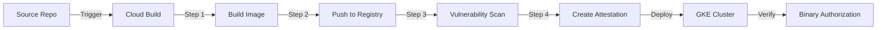

# How to Integrate Binary Authorization with Cloud Build CI/CD Pipelines

Author: [nawazdhandala](https://www.github.com/nawazdhandala)

Tags: GCP, Binary Authorization, Cloud Build, CI/CD, Container Security

Description: Learn how to integrate Binary Authorization attestation creation into your Cloud Build CI/CD pipeline so container images are automatically signed after successful builds.

---

If you are using Binary Authorization to protect your GKE clusters, the natural next step is integrating attestation creation directly into your CI/CD pipeline. Every image that comes out of Cloud Build should automatically get attested, so developers do not have to manually sign images before deploying.

The idea is simple: Cloud Build builds and pushes the image, then creates an attestation as the final build step. When the image is deployed to GKE, Binary Authorization verifies the attestation and admits the pod. No manual steps, no gaps.

Let me show you how to wire this up.

## Architecture



## Prerequisites

- Cloud Build API, Binary Authorization API, Container Analysis API, and Cloud KMS API enabled
- An attestor already created with a KMS key (see my earlier post on creating attestors)
- A GKE cluster with Binary Authorization enforcement enabled

```bash
# Enable required APIs
gcloud services enable \
  cloudbuild.googleapis.com \
  binaryauthorization.googleapis.com \
  containeranalysis.googleapis.com \
  cloudkms.googleapis.com \
  --project=my-project-id
```

## Step 1: Grant Cloud Build the Required Permissions

Cloud Build's service account needs permissions to create attestations and use the KMS signing key.

```bash
# Get the Cloud Build service account
PROJECT_NUMBER=$(gcloud projects describe my-project-id --format='value(projectNumber)')
CB_SA="${PROJECT_NUMBER}@cloudbuild.gserviceaccount.com"

# Grant permission to create attestations
gcloud container binauthz attestors add-iam-policy-binding build-attestor \
  --member="serviceAccount:${CB_SA}" \
  --role="roles/binaryauthorization.attestorsVerifier" \
  --project=my-project-id

# Grant permission to create Container Analysis notes/occurrences
gcloud projects add-iam-policy-binding my-project-id \
  --member="serviceAccount:${CB_SA}" \
  --role="roles/containeranalysis.notes.attacher"

# Grant permission to use the KMS signing key
gcloud kms keys add-iam-policy-binding build-signer \
  --location=global \
  --keyring=binauthz-keys \
  --member="serviceAccount:${CB_SA}" \
  --role="roles/cloudkms.signerVerifier" \
  --project=my-project-id
```

## Step 2: Create the Cloud Build Configuration

Here is a `cloudbuild.yaml` that builds an image, pushes it, and creates an attestation.

```yaml
# cloudbuild.yaml - Build, push, and attest a container image
steps:
  # Step 1: Build the container image
  - name: 'gcr.io/cloud-builders/docker'
    args:
      - 'build'
      - '-t'
      - 'gcr.io/$PROJECT_ID/my-app:$SHORT_SHA'
      - '-t'
      - 'gcr.io/$PROJECT_ID/my-app:latest'
      - '.'
    id: 'build-image'

  # Step 2: Push the image to Container Registry
  - name: 'gcr.io/cloud-builders/docker'
    args:
      - 'push'
      - 'gcr.io/$PROJECT_ID/my-app:$SHORT_SHA'
    id: 'push-image'
    waitFor: ['build-image']

  # Step 3: Get the image digest (needed for attestation)
  - name: 'gcr.io/cloud-builders/gcloud'
    entrypoint: 'bash'
    args:
      - '-c'
      - |
        # Retrieve the exact image digest after push
        gcloud container images describe \
          gcr.io/$PROJECT_ID/my-app:$SHORT_SHA \
          --format='value(image_summary.digest)' > /workspace/image_digest.txt
        echo "Image digest: $(cat /workspace/image_digest.txt)"
    id: 'get-digest'
    waitFor: ['push-image']

  # Step 4: Create the Binary Authorization attestation
  - name: 'gcr.io/cloud-builders/gcloud'
    entrypoint: 'bash'
    args:
      - '-c'
      - |
        # Sign the image with the build attestor
        DIGEST=$(cat /workspace/image_digest.txt)
        gcloud container binauthz attestations sign-and-create \
          --artifact-url="gcr.io/$PROJECT_ID/my-app@$${DIGEST}" \
          --attestor=build-attestor \
          --attestor-project=$PROJECT_ID \
          --keyversion-project=$PROJECT_ID \
          --keyversion-location=global \
          --keyversion-keyring=binauthz-keys \
          --keyversion-key=build-signer \
          --keyversion=1
    id: 'create-attestation'
    waitFor: ['get-digest']

  # Step 5: Deploy to GKE
  - name: 'gcr.io/cloud-builders/kubectl'
    entrypoint: 'bash'
    args:
      - '-c'
      - |
        # Deploy using the image digest for immutability
        DIGEST=$(cat /workspace/image_digest.txt)
        kubectl set image deployment/my-app \
          my-app=gcr.io/$PROJECT_ID/my-app@$${DIGEST}
    env:
      - 'CLOUDSDK_COMPUTE_ZONE=us-central1-a'
      - 'CLOUDSDK_CONTAINER_CLUSTER=secure-cluster'
    id: 'deploy'
    waitFor: ['create-attestation']

images:
  - 'gcr.io/$PROJECT_ID/my-app:$SHORT_SHA'
  - 'gcr.io/$PROJECT_ID/my-app:latest'
```

## Step 3: Add Vulnerability Scanning Gate

A more robust pipeline scans the image for vulnerabilities before attesting.

```yaml
# Extended cloudbuild.yaml with vulnerability scanning
steps:
  # Build and push steps same as above...
  - name: 'gcr.io/cloud-builders/docker'
    args: ['build', '-t', 'gcr.io/$PROJECT_ID/my-app:$SHORT_SHA', '.']
    id: 'build-image'

  - name: 'gcr.io/cloud-builders/docker'
    args: ['push', 'gcr.io/$PROJECT_ID/my-app:$SHORT_SHA']
    id: 'push-image'
    waitFor: ['build-image']

  # Wait for Container Analysis vulnerability scan to complete
  - name: 'gcr.io/cloud-builders/gcloud'
    entrypoint: 'bash'
    args:
      - '-c'
      - |
        # Wait for the vulnerability scan to finish (up to 5 minutes)
        echo "Waiting for vulnerability scan..."
        for i in $(seq 1 30); do
          SCAN_STATUS=$(gcloud artifacts docker images describe \
            gcr.io/$PROJECT_ID/my-app:$SHORT_SHA \
            --show-all-metadata \
            --format='value(discovery[0].discovery.analysisStatus)' 2>/dev/null)
          if [ "$SCAN_STATUS" = "FINISHED_SUCCESS" ]; then
            echo "Scan complete"
            break
          fi
          echo "Scan status: $SCAN_STATUS - waiting..."
          sleep 10
        done
    id: 'wait-for-scan'
    waitFor: ['push-image']

  # Check vulnerability scan results and fail if critical vulns found
  - name: 'gcr.io/cloud-builders/gcloud'
    entrypoint: 'bash'
    args:
      - '-c'
      - |
        # Check for critical vulnerabilities
        CRITICAL_COUNT=$(gcloud artifacts docker images describe \
          gcr.io/$PROJECT_ID/my-app:$SHORT_SHA \
          --show-all-metadata \
          --format='value(vulnz_summary.CRITICAL)' 2>/dev/null || echo "0")

        if [ "$CRITICAL_COUNT" != "0" ] && [ "$CRITICAL_COUNT" != "" ]; then
          echo "FAILED: Found $CRITICAL_COUNT critical vulnerabilities"
          exit 1
        fi
        echo "PASSED: No critical vulnerabilities found"
    id: 'check-vulns'
    waitFor: ['wait-for-scan']

  # Only attest if vulnerability scan passed
  - name: 'gcr.io/cloud-builders/gcloud'
    entrypoint: 'bash'
    args:
      - '-c'
      - |
        DIGEST=$(gcloud container images describe \
          gcr.io/$PROJECT_ID/my-app:$SHORT_SHA \
          --format='value(image_summary.digest)')
        gcloud container binauthz attestations sign-and-create \
          --artifact-url="gcr.io/$PROJECT_ID/my-app@$${DIGEST}" \
          --attestor=build-attestor \
          --attestor-project=$PROJECT_ID \
          --keyversion-project=$PROJECT_ID \
          --keyversion-location=global \
          --keyversion-keyring=binauthz-keys \
          --keyversion-key=build-signer \
          --keyversion=1
    id: 'create-attestation'
    waitFor: ['check-vulns']
```

## Step 4: Set Up the Cloud Build Trigger

Create a trigger that runs the pipeline on every push to the main branch.

```bash
# Create a Cloud Build trigger for the main branch
gcloud builds triggers create github \
  --repo-name=my-app-repo \
  --repo-owner=my-github-org \
  --branch-pattern="^main$" \
  --build-config=cloudbuild.yaml \
  --project=my-project-id
```

## Step 5: Using Artifact Registry Instead of Container Registry

If you are using Artifact Registry (the newer, recommended option):

```yaml
# Updated build step for Artifact Registry
steps:
  - name: 'gcr.io/cloud-builders/docker'
    args:
      - 'build'
      - '-t'
      - 'us-central1-docker.pkg.dev/$PROJECT_ID/my-repo/my-app:$SHORT_SHA'
      - '.'

  - name: 'gcr.io/cloud-builders/docker'
    args:
      - 'push'
      - 'us-central1-docker.pkg.dev/$PROJECT_ID/my-repo/my-app:$SHORT_SHA'

  - name: 'gcr.io/cloud-builders/gcloud'
    entrypoint: 'bash'
    args:
      - '-c'
      - |
        # Get digest from Artifact Registry
        DIGEST=$(gcloud artifacts docker images describe \
          us-central1-docker.pkg.dev/$PROJECT_ID/my-repo/my-app:$SHORT_SHA \
          --format='value(image_summary.digest)')
        gcloud container binauthz attestations sign-and-create \
          --artifact-url="us-central1-docker.pkg.dev/$PROJECT_ID/my-repo/my-app@$${DIGEST}" \
          --attestor=build-attestor \
          --attestor-project=$PROJECT_ID \
          --keyversion-project=$PROJECT_ID \
          --keyversion-location=global \
          --keyversion-keyring=binauthz-keys \
          --keyversion-key=build-signer \
          --keyversion=1
```

## Step 6: Verify the Pipeline

Run a test build and verify the attestation was created.

```bash
# Trigger a manual build
gcloud builds submit . \
  --config=cloudbuild.yaml \
  --project=my-project-id

# Check the build logs
gcloud builds list --limit=5 --project=my-project-id

# Verify the attestation exists
gcloud container binauthz attestations list \
  --attestor=build-attestor \
  --attestor-project=my-project-id \
  --project=my-project-id
```

## Troubleshooting

Common issues and fixes:

1. **Permission denied on KMS key**: Make sure the Cloud Build service account has `roles/cloudkms.signerVerifier` on the specific key, not just the keyring.

2. **Attestation already exists**: This happens if you rebuild the same image digest. Attestations are idempotent - same image plus same attestor equals one attestation.

3. **Image not found**: Make sure the push step completes before the attestation step. Use `waitFor` to enforce ordering.

4. **Digest format mismatch**: Always use `sha256:` prefixed digests. The `gcloud container images describe` command returns them in the correct format.

## Conclusion

Integrating Binary Authorization with Cloud Build automates the entire attestation workflow. Images get signed as part of the build pipeline, and the signing only happens if all previous stages (build, test, scan) pass. This means images that reach your GKE clusters have provably gone through your entire pipeline. No shortcuts, no manual steps, no unsigned images sneaking into production.
