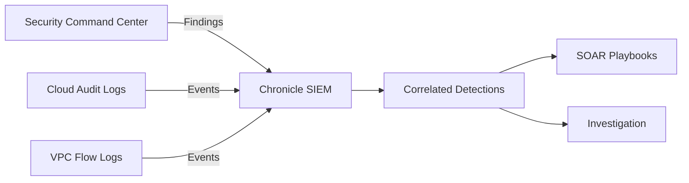
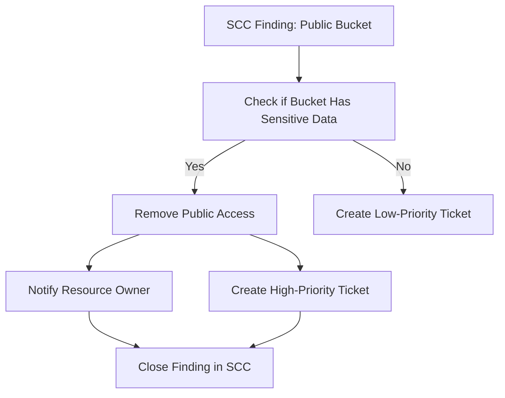

# How to Integrate Chronicle SIEM with Security Command Center Findings

Author: [nawazdhandala](https://www.github.com/nawazdhandala)

Tags: GCP, Chronicle SIEM, Security Command Center, SCC, Threat Detection

Description: Learn how to integrate Google Chronicle SIEM with Security Command Center to correlate cloud security findings with log-based detections for comprehensive threat visibility.

---

Google Cloud gives you two security products that complement each other well. Security Command Center (SCC) identifies misconfigurations, vulnerabilities, and threats in your GCP environment. Chronicle SIEM handles log-based threat detection and investigation. Integrating them means SCC findings flow into Chronicle, where they can be correlated with log events, enriched with context from other sources, and actioned through SOAR playbooks.

This guide covers how to set up the integration and get the most out of the combined data.

## Why Integrate SCC with Chronicle

On their own, each product has limitations. SCC finds things like "this storage bucket is publicly accessible" or "this VM has a known vulnerability," but it does not tell you whether anyone has actually exploited those issues. Chronicle sees the log traffic, but it might not know about the underlying vulnerability that makes a particular access attempt more concerning.

Together, you get the full picture. A finding from SCC about an exposed storage bucket, combined with Chronicle detecting unusual download patterns from that bucket, gives you high-confidence signal that something bad is happening.



## Prerequisites

Before starting, you need:

- Security Command Center Premium or Enterprise tier enabled
- Chronicle SIEM instance provisioned
- Organization-level IAM permissions for both products
- The Chronicle service account email (provided during Chronicle onboarding)

## Method 1: Direct Integration via SCC Exports

SCC can export findings directly to Chronicle. This is the simplest and recommended approach.

### Step 1: Enable the SCC Integration in Chronicle

In the Chronicle console, go to Settings, then SIEM Settings, then Integrations. Find Security Command Center and click Configure.

You will need to provide:
- Your GCP organization ID
- The project ID where SCC is activated

### Step 2: Grant Chronicle Access to SCC

The Chronicle service account needs permission to read SCC findings.

```bash
# Grant the Chronicle service account viewer access to SCC findings
gcloud organizations add-iam-policy-binding YOUR_ORG_ID \
    --member="serviceAccount:CHRONICLE_SERVICE_ACCOUNT@chronicle-prod.iam.gserviceaccount.com" \
    --role="roles/securitycenter.findingsViewer"
```

If you also want Chronicle to be able to update finding states (for example, marking a finding as resolved from a SOAR playbook), grant the editor role instead.

```bash
# Grant editor access if you need write capabilities
gcloud organizations add-iam-policy-binding YOUR_ORG_ID \
    --member="serviceAccount:CHRONICLE_SERVICE_ACCOUNT@chronicle-prod.iam.gserviceaccount.com" \
    --role="roles/securitycenter.findingsEditor"
```

### Step 3: Configure Finding Filters

You probably do not want every single SCC finding in Chronicle. Configure filters to send only the relevant categories.

In the integration settings, specify which finding categories to ingest:

- **THREAT** - Active threats detected by Event Threat Detection and Container Threat Detection
- **VULNERABILITY** - Vulnerability findings from Security Health Analytics and Web Security Scanner
- **MISCONFIGURATION** - Configuration issues found by Security Health Analytics
- **SCC_ERROR** - Errors in SCC configuration itself

For most security operations use cases, start with THREAT findings and expand from there.

## Method 2: Pub/Sub-Based Export

For more control over the pipeline, you can use SCC's Pub/Sub export feature to route findings through a Pub/Sub topic before they reach Chronicle.

### Step 1: Create a Pub/Sub Topic

```bash
# Create a Pub/Sub topic for SCC findings
gcloud pubsub topics create scc-findings-chronicle \
    --project=YOUR_PROJECT_ID

# Create a subscription for Chronicle
gcloud pubsub subscriptions create scc-findings-chronicle-sub \
    --topic=scc-findings-chronicle \
    --ack-deadline=60 \
    --project=YOUR_PROJECT_ID
```

### Step 2: Configure SCC Notifications

Set up SCC to publish findings to the Pub/Sub topic.

```bash
# Create a notification config that publishes findings to Pub/Sub
gcloud scc notifications create chronicle-integration \
    --organization=YOUR_ORG_ID \
    --pubsub-topic=projects/YOUR_PROJECT_ID/topics/scc-findings-chronicle \
    --filter='category="ACTIVE_SCAN_ATTACK" OR category="BRUTE_FORCE_SSH" OR category="CRYPTO_MINING" OR category="MALWARE" OR category="PERSISTENCE" OR severity="HIGH" OR severity="CRITICAL"'
```

The filter ensures only high-priority findings get sent. You can adjust this based on your needs.

### Step 3: Grant Permissions

SCC needs permission to publish to the Pub/Sub topic.

```bash
# Get the SCC service account
SCC_SA="service-org-YOUR_ORG_ID@gcp-sa-scc-notification.iam.gserviceaccount.com"

# Grant publish access
gcloud pubsub topics add-iam-policy-binding scc-findings-chronicle \
    --member="serviceAccount:$SCC_SA" \
    --role="roles/pubsub.publisher" \
    --project=YOUR_PROJECT_ID
```

### Step 4: Create the Chronicle Feed

In the Chronicle console, create a new feed:

- **Source Type**: Google Cloud Pub/Sub
- **Log Type**: GCP Security Command Center
- **Pub/Sub Subscription**: `projects/YOUR_PROJECT_ID/subscriptions/scc-findings-chronicle-sub`
- **Service Account**: Upload the Chronicle feed service account key

## Verifying the Integration

After setting up either method, verify that SCC findings are appearing in Chronicle.

Run a UDM search for SCC data.

```
metadata.product_name = "Security Command Center"
```

You should see findings appearing as UDM events. Each finding includes:

- The finding category and severity
- The affected resource (project, instance, bucket, etc.)
- The finding state (ACTIVE, INACTIVE, MUTED)
- Source-specific details

For a more specific search, look for threat-type findings.

```
metadata.product_name = "Security Command Center" AND security_result.severity = "HIGH"
```

## Writing Cross-Source Detection Rules

With SCC findings in Chronicle, you can write YARA-L rules that correlate findings with log events.

This rule detects when someone accesses a resource that SCC has flagged as publicly accessible.

```
rule access_to_public_resource {
    meta:
        author = "security-team"
        description = "Detects access to resources flagged as publicly accessible by SCC"
        severity = "HIGH"

    events:
        // SCC finding about public access
        $finding.metadata.product_name = "Security Command Center"
        $finding.metadata.product_event_type = "PUBLIC_BUCKET_ACL"
        $finding.target.resource.name = $resource_name

        // Actual access to that resource
        $access.metadata.event_type = "USER_RESOURCE_ACCESS"
        $access.target.resource.name = $resource_name
        $access.principal.ip != ""

    match:
        $resource_name over 24h

    condition:
        $finding and $access
}
```

Here is another rule that combines an SCC vulnerability finding with suspicious login activity targeting the vulnerable system.

```
rule exploitation_attempt_on_vulnerable_system {
    meta:
        author = "security-team"
        description = "Detects login attempts to systems flagged as vulnerable by SCC"
        severity = "CRITICAL"

    events:
        // SCC vulnerability finding
        $vuln.metadata.product_name = "Security Command Center"
        $vuln.security_result.category_details = "VULNERABILITY"
        $vuln.target.resource.name = $resource

        // Failed login attempts to the same resource
        $login.metadata.event_type = "USER_LOGIN"
        $login.security_result.action = "BLOCK"
        $login.target.hostname = $resource

    match:
        $resource over 1h

    condition:
        $vuln and #login >= 5
}
```

## Building SOAR Playbooks for SCC Findings

Automate responses to SCC findings using Chronicle SOAR. Here is a playbook flow for handling a critical misconfiguration finding.



The playbook would:

1. Receive the SCC finding from Chronicle
2. Query the Data Loss Prevention API to check if the bucket contains sensitive data
3. If sensitive data is present, automatically remove public access via the GCS API
4. Notify the resource owner via email or Slack
5. Create a ticket for follow-up
6. Update the SCC finding state to INACTIVE

## Monitoring the Integration

Set up a dashboard to track the health of your SCC-Chronicle integration.

Key metrics to watch:

- **Finding ingestion rate** - Are new findings appearing in Chronicle within minutes of being created in SCC?
- **Finding categories** - Which types of findings are you seeing most often?
- **Detection rule matches** - Are your cross-source rules firing?
- **Mean time to response** - How quickly are findings being addressed?

## Troubleshooting

**Findings not appearing in Chronicle**: Check the Pub/Sub subscription metrics. If messages are accumulating without being consumed, verify that the Chronicle feed is healthy and the service account credentials are valid.

**Findings appear but lack detail**: Make sure you are using the SCC Premium or Enterprise tier. The Standard tier has limited finding categories and less detail.

**Stale findings**: SCC findings have a state (ACTIVE/INACTIVE). If you are seeing old findings, check your notification filter to exclude INACTIVE findings.

Integrating SCC with Chronicle creates a feedback loop between configuration-based security (what is wrong with your environment) and activity-based security (what is actually happening). This combination significantly improves your ability to detect and respond to real threats rather than chasing individual alerts in isolation.
