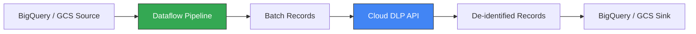

# How to Integrate Cloud DLP with Dataflow for Large-Scale Data De-Identification

Author: [nawazdhandala](https://www.github.com/nawazdhandala)

Tags: GCP, Cloud DLP, Dataflow, Apache Beam, Data Pipeline

Description: Learn how to build a Dataflow pipeline that integrates with Cloud DLP to de-identify sensitive data at scale across millions of records in BigQuery and Cloud Storage.

---

Cloud DLP works well for scanning individual tables or small batches of files, but what happens when you need to de-identify billions of rows in a data warehouse or process terabytes of log files? The built-in DLP job system has throughput limits, and API rate limits will slow you down if you call DLP record by record.

The answer is to integrate Cloud DLP with Dataflow. Dataflow (built on Apache Beam) handles the heavy lifting of reading, partitioning, and writing data at scale, while DLP handles the sensitive data detection and transformation. You batch records together, send them to the DLP API in chunks, and write the de-identified output in parallel.

## Architecture Overview

The pipeline flow looks like this:



Dataflow handles parallelism and scaling. You do not need to manage threads or worry about API rate limits - the pipeline batches records appropriately and Dataflow autoscales workers based on throughput.

## Prerequisites

- Cloud DLP API and Dataflow API enabled
- A DLP de-identification template (or inline config)
- Source data in BigQuery or Cloud Storage
- A GCS bucket for Dataflow staging
- Apache Beam Python SDK installed

## Step 1: Set Up the Project

Install the required packages:

```bash
# Install Apache Beam with GCP support and the DLP client
pip install apache-beam[gcp] google-cloud-dlp
```

## Step 2: Build a Basic DLP Dataflow Pipeline

Here is a Dataflow pipeline that reads from BigQuery, sends records to Cloud DLP for de-identification, and writes the results back to BigQuery:

```python
import apache_beam as beam
from apache_beam.options.pipeline_options import PipelineOptions
from google.cloud import dlp_v2
import json

class BatchAndDeidentify(beam.DoFn):
    """DoFn that batches records and sends them to Cloud DLP for de-identification."""

    def __init__(self, project_id, deidentify_template, inspect_template=None):
        self.project_id = project_id
        self.deidentify_template = deidentify_template
        self.inspect_template = inspect_template
        self.dlp_client = None

    def setup(self):
        # Initialize the DLP client once per worker
        self.dlp_client = dlp_v2.DlpServiceClient()

    def process(self, batch):
        """Process a batch of records through Cloud DLP."""

        if not batch:
            return

        # Convert the batch of dicts to a DLP table structure
        headers = list(batch[0].keys())
        rows = []
        for record in batch:
            row_values = []
            for header in headers:
                value = str(record.get(header, ""))
                row_values.append({"string_value": value})
            rows.append({"values": row_values})

        table = {
            "headers": [{"name": h} for h in headers],
            "rows": rows,
        }

        item = {"table": table}
        parent = f"projects/{self.project_id}/locations/global"

        # Build the request
        request = {
            "parent": parent,
            "deidentify_template_name": self.deidentify_template,
            "item": item,
        }

        if self.inspect_template:
            request["inspect_template_name"] = self.inspect_template

        # Call DLP to de-identify the batch
        response = self.dlp_client.deidentify_content(request=request)

        # Convert the DLP table response back to dicts
        result_table = response.item.table
        for row in result_table.rows:
            record = {}
            for i, header in enumerate(headers):
                record[header] = row.values[i].string_value
            yield record


def run_deidentification_pipeline(
    project_id,
    source_query,
    dest_table,
    deidentify_template,
    inspect_template=None,
    batch_size=500,
    temp_location="gs://my-project-dataflow-temp/staging",
):
    """Run a Dataflow pipeline that de-identifies BigQuery data using Cloud DLP."""

    pipeline_options = PipelineOptions(
        project=project_id,
        runner="DataflowRunner",
        temp_location=temp_location,
        region="us-central1",
        streaming=False,
        # Autoscaling settings
        autoscaling_algorithm="THROUGHPUT_BASED",
        max_num_workers=20,
    )

    with beam.Pipeline(options=pipeline_options) as pipeline:
        (
            pipeline
            # Read from BigQuery
            | "ReadFromBQ" >> beam.io.ReadFromBigQuery(
                query=source_query,
                use_standard_sql=True,
            )
            # Batch records together for efficient DLP API calls
            | "BatchRecords" >> beam.BatchElements(
                min_batch_size=100,
                max_batch_size=batch_size,
            )
            # De-identify each batch through Cloud DLP
            | "DeIdentify" >> beam.ParDo(
                BatchAndDeidentify(
                    project_id=project_id,
                    deidentify_template=deidentify_template,
                    inspect_template=inspect_template,
                )
            )
            # Write de-identified records to BigQuery
            | "WriteToBQ" >> beam.io.WriteToBigQuery(
                dest_table,
                write_disposition=beam.io.BigQueryDisposition.WRITE_TRUNCATE,
                create_disposition=beam.io.BigQueryDisposition.CREATE_IF_NEEDED,
            )
        )

# Run the pipeline
run_deidentification_pipeline(
    project_id="my-project",
    source_query="SELECT * FROM `my-project.raw_data.customers`",
    dest_table="my-project:clean_data.customers_deidentified",
    deidentify_template="projects/my-project/locations/global/deidentifyTemplates/standard-deid-v1",
    inspect_template="projects/my-project/locations/global/inspectTemplates/standard-pii-v1",
)
```

## Step 3: Handle Cloud Storage Files

For de-identifying files in Cloud Storage, read the files, send their content to DLP, and write the de-identified output:

```python
class DeidentifyFileContent(beam.DoFn):
    """De-identify text content from Cloud Storage files."""

    def __init__(self, project_id, deidentify_template, inspect_template):
        self.project_id = project_id
        self.deidentify_template = deidentify_template
        self.inspect_template = inspect_template
        self.dlp_client = None

    def setup(self):
        self.dlp_client = dlp_v2.DlpServiceClient()

    def process(self, element):
        """Process a single file's content through DLP."""
        file_path, content = element

        # DLP has a content size limit per request (0.5 MB for text)
        # Split large files into chunks
        chunk_size = 500000  # 500 KB
        chunks = [content[i:i+chunk_size]
                  for i in range(0, len(content), chunk_size)]

        deidentified_chunks = []
        parent = f"projects/{self.project_id}/locations/global"

        for chunk in chunks:
            response = self.dlp_client.deidentify_content(
                request={
                    "parent": parent,
                    "deidentify_template_name": self.deidentify_template,
                    "inspect_template_name": self.inspect_template,
                    "item": {"value": chunk},
                }
            )
            deidentified_chunks.append(response.item.value)

        # Reassemble the file
        deidentified_content = "".join(deidentified_chunks)

        # Change the output path to indicate de-identification
        output_path = file_path.replace("raw-data/", "deidentified-data/")

        yield (output_path, deidentified_content)


def run_gcs_deidentification_pipeline(project_id, source_pattern, dest_bucket):
    """De-identify text files from Cloud Storage."""

    pipeline_options = PipelineOptions(
        project=project_id,
        runner="DataflowRunner",
        temp_location=f"gs://{dest_bucket}/temp",
        region="us-central1",
    )

    deidentify_template = f"projects/{project_id}/locations/global/deidentifyTemplates/standard-deid-v1"
    inspect_template = f"projects/{project_id}/locations/global/inspectTemplates/standard-pii-v1"

    with beam.Pipeline(options=pipeline_options) as pipeline:
        (
            pipeline
            # Read file paths matching the pattern
            | "MatchFiles" >> beam.io.fileio.MatchFiles(source_pattern)
            | "ReadMatches" >> beam.io.fileio.ReadMatches()
            # Read each file's content
            | "ExtractContent" >> beam.Map(
                lambda f: (f.metadata.path, f.read_utf8())
            )
            # De-identify through Cloud DLP
            | "DeIdentify" >> beam.ParDo(
                DeidentifyFileContent(
                    project_id, deidentify_template, inspect_template
                )
            )
            # Write de-identified files
            | "WriteFiles" >> beam.Map(
                lambda x: write_to_gcs(x[0], x[1])
            )
        )
```

## Step 4: Optimize Batching for Throughput

The most important optimization is getting the batch size right. Too small and you waste API overhead. Too large and you hit the DLP request size limit (0.5 MB for content items).

```python
# Smart batching that respects DLP API limits
class SmartBatcher(beam.DoFn):
    """Batch records while respecting DLP API size limits."""

    MAX_BATCH_BYTES = 480000  # Stay under 0.5 MB limit
    MAX_BATCH_SIZE = 500       # Max records per batch

    def __init__(self):
        self.current_batch = []
        self.current_size = 0

    def process(self, record):
        record_size = len(json.dumps(record).encode('utf-8'))

        # Check if adding this record would exceed limits
        if (self.current_size + record_size > self.MAX_BATCH_BYTES or
                len(self.current_batch) >= self.MAX_BATCH_SIZE):
            # Emit the current batch and start a new one
            if self.current_batch:
                yield self.current_batch
            self.current_batch = [record]
            self.current_size = record_size
        else:
            self.current_batch.append(record)
            self.current_size += record_size

    def finish_bundle(self):
        # Emit any remaining records
        if self.current_batch:
            yield beam.utils.windowed_value.WindowedValue(
                self.current_batch,
                beam.utils.timestamp.MIN_TIMESTAMP,
                [beam.transforms.window.GlobalWindow()],
            )
            self.current_batch = []
            self.current_size = 0
```

## Step 5: Error Handling and Dead Letters

In production, some records will fail DLP processing. Handle this with a dead letter pattern:

```python
class DeidentifyWithDeadLetter(beam.DoFn):
    """De-identify with error handling - failed records go to dead letter."""

    DEAD_LETTER = "dead_letter"

    def __init__(self, project_id, template):
        self.project_id = project_id
        self.template = template
        self.dlp_client = None

    def setup(self):
        self.dlp_client = dlp_v2.DlpServiceClient()

    def process(self, batch):
        try:
            # Normal de-identification logic
            headers = list(batch[0].keys())
            rows = []
            for record in batch:
                values = [{"string_value": str(record.get(h, ""))}
                          for h in headers]
                rows.append({"values": values})

            table = {
                "headers": [{"name": h} for h in headers],
                "rows": rows,
            }

            parent = f"projects/{self.project_id}/locations/global"
            response = self.dlp_client.deidentify_content(
                request={
                    "parent": parent,
                    "deidentify_template_name": self.template,
                    "item": {"table": table},
                }
            )

            for row in response.item.table.rows:
                record = {}
                for i, header in enumerate(headers):
                    record[header] = row.values[i].string_value
                yield record

        except Exception as e:
            # Send failed records to dead letter output
            for record in batch:
                record["_error"] = str(e)
                yield beam.pvalue.TaggedOutput(self.DEAD_LETTER, record)
```

## Cost and Performance Tips

**Batch aggressively.** Each DLP API call has overhead. Sending 500 records per call is far more efficient than sending them one at a time. The `BatchElements` transform handles this automatically.

**Use templates.** Templates avoid sending the full inspection config with every API call, reducing request size and improving parsing time.

**Limit workers based on DLP quotas.** Cloud DLP has API rate limits. If you spin up too many Dataflow workers, you will hit rate limits and get errors. Set `max_num_workers` appropriately and implement retry logic with backoff.

**Sample for discovery, full scan for de-identification.** Use DLP inspection jobs with sampling to discover which tables have sensitive data. Then run the Dataflow pipeline only on tables that need de-identification.

## Summary

Integrating Cloud DLP with Dataflow gives you the ability to de-identify data at scale that would be impractical with the standard DLP job system. Use Dataflow's parallelism for reading and writing data, batch records for efficient DLP API calls, and implement dead letter patterns for error handling. This combination handles the heavy lifting of processing billions of records while Cloud DLP handles the sensitive data detection and transformation.
