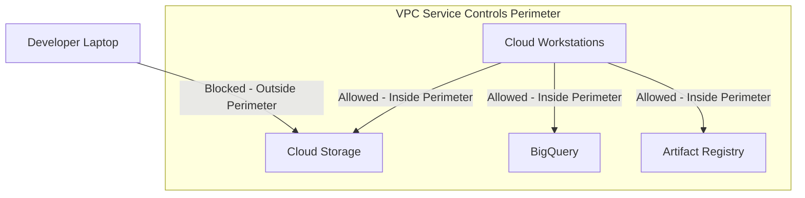

# How to Integrate Cloud Workstations with VPC Service Controls for Secure Development Environments

Author: [nawazdhandala](https://www.github.com/nawazdhandala)

Tags: GCP, Google Cloud, Cloud Workstations, VPC Service Controls, Security, Network Security

Description: Learn how to integrate Google Cloud Workstations with VPC Service Controls to create secure, isolated development environments that prevent data exfiltration.

---

When your developers work with sensitive data or proprietary code, you need more than just IAM policies to keep things secure. VPC Service Controls add a network-level security boundary around your Google Cloud resources, preventing data from leaving your defined perimeter even if someone has valid credentials. Integrating Cloud Workstations with VPC Service Controls means your developers can be productive while working inside a tightly controlled security boundary.

This is particularly important in regulated industries like finance and healthcare, where data residency and exfiltration prevention are not optional - they are compliance requirements.

## What VPC Service Controls Actually Do

Think of VPC Service Controls as a firewall for Google Cloud APIs. Normally, if someone has the right IAM permissions, they can access a GCS bucket from anywhere - their laptop, a coffee shop, or a VM in a different project. VPC Service Controls restrict API access to only come from approved sources within a defined perimeter.



When Cloud Workstations is inside the perimeter, developers can access protected resources from their workstation but cannot exfiltrate data to resources outside the perimeter.

## Prerequisites

Before starting, make sure you have:

- Organization-level access to configure VPC Service Controls
- An Access Context Manager policy at the organization level
- A Cloud Workstations cluster already set up
- The Security Admin and Access Context Manager Admin roles

## Step 1: Create an Access Context Manager Access Level

Access levels define the conditions under which access is allowed. For Cloud Workstations, you typically create an access level based on the corporate network or specific device attributes.

```bash
# Create an access level that allows access from corporate IP ranges
# This defines who can access resources inside the perimeter
gcloud access-context-manager levels create corp-network-access \
    --policy=ORGANIZATION_POLICY_ID \
    --title="Corporate Network Access" \
    --basic-level-spec=access-level-spec.yaml
```

The access level spec file defines the conditions:

```yaml
# access-level-spec.yaml
# Allow access from corporate IP ranges and trusted devices
- ipSubnetworks:
    - "203.0.113.0/24"    # Corporate office IP range
    - "198.51.100.0/24"   # VPN IP range
  devicePolicy:
    requireScreenlock: true
    allowedEncryptionStatuses:
      - ENCRYPTED
```

## Step 2: Create the VPC Service Controls Perimeter

Create a service perimeter that includes both the Cloud Workstations project and any other projects containing resources your developers need to access.

```bash
# Create a VPC Service Controls perimeter
# Include all projects that need to communicate with each other
gcloud access-context-manager perimeters create dev-perimeter \
    --policy=ORGANIZATION_POLICY_ID \
    --title="Development Environment Perimeter" \
    --resources="projects/workstations-project-number,projects/data-project-number,projects/artifact-project-number" \
    --restricted-services="storage.googleapis.com,bigquery.googleapis.com,artifactregistry.googleapis.com,workstations.googleapis.com" \
    --access-levels="accessPolicies/ORGANIZATION_POLICY_ID/accessLevels/corp-network-access"
```

Let me break down the key parameters:

**resources**: Every project that contains resources your developers need must be inside the perimeter. If your workstations are in one project and your data is in another, both projects need to be included.

**restricted-services**: These are the Google Cloud APIs that are restricted by the perimeter. Only requests originating from inside the perimeter (or matching an access level) can call these APIs.

**access-levels**: The access levels that allow exceptions. In this case, users on the corporate network can access the perimeter from outside (e.g., through the Cloud Console).

## Step 3: Configure the Workstation Cluster for Private Access

For maximum security, configure your workstation cluster to use private networking so workstations cannot reach the public internet:

```bash
# Create or update the workstation cluster with private networking
gcloud workstations clusters create secure-dev-cluster \
    --project=workstations-project \
    --region=us-central1 \
    --network=projects/workstations-project/global/networks/secure-vpc \
    --subnetwork=projects/workstations-project/regions/us-central1/subnetworks/workstations-subnet \
    --enable-private-endpoint
```

With private endpoint enabled, the workstation cluster's control plane is only accessible from within the VPC, adding another layer of protection.

## Step 4: Set Up Private Google Access

For workstations to access Google Cloud APIs without going through the public internet, enable Private Google Access on the subnet:

```bash
# Enable Private Google Access on the workstations subnet
# This allows workstations to access Google APIs through internal routes
gcloud compute networks subnets update workstations-subnet \
    --project=workstations-project \
    --region=us-central1 \
    --enable-private-google-access
```

Then configure DNS to route Google API traffic through the restricted VIP:

```bash
# Create a DNS zone for googleapis.com that resolves to the restricted VIP
gcloud dns managed-zones create googleapis-restricted \
    --project=workstations-project \
    --dns-name="googleapis.com." \
    --visibility="private" \
    --networks="projects/workstations-project/global/networks/secure-vpc" \
    --description="Route Google APIs through restricted VIP"

# Add a CNAME record for *.googleapis.com
gcloud dns record-sets create "*.googleapis.com." \
    --project=workstations-project \
    --zone=googleapis-restricted \
    --type=CNAME \
    --rrdatas="restricted.googleapis.com." \
    --ttl=300

# Add A records for restricted.googleapis.com
gcloud dns record-sets create "restricted.googleapis.com." \
    --project=workstations-project \
    --zone=googleapis-restricted \
    --type=A \
    --rrdatas="199.36.153.4,199.36.153.5,199.36.153.6,199.36.153.7" \
    --ttl=300
```

This ensures all API calls from workstations go through the restricted VIP, which enforces VPC Service Controls.

## Step 5: Configure Ingress and Egress Rules

Sometimes you need to allow specific cross-perimeter access. For example, your developers might need to pull container images from a public registry or access an external API during development.

```yaml
# ingress-policy.yaml
# Allow developers to access workstations from the Cloud Console
- ingressFrom:
    identityType: ANY_IDENTITY
    sources:
      - accessLevel: accessPolicies/POLICY_ID/accessLevels/corp-network-access
  ingressTo:
    operations:
      - serviceName: workstations.googleapis.com
        methodSelectors:
          - method: "*"
    resources:
      - projects/workstations-project-number
```

```yaml
# egress-policy.yaml
# Allow workstations to pull images from Docker Hub through a proxy
- egressFrom:
    identityType: ANY_IDENTITY
  egressTo:
    operations:
      - serviceName: artifactregistry.googleapis.com
        methodSelectors:
          - method: "*"
    resources:
      - projects/mirror-project-number  # Project hosting the Artifact Registry remote repository
```

Apply the ingress and egress policies:

```bash
# Update the perimeter with ingress and egress rules
gcloud access-context-manager perimeters update dev-perimeter \
    --policy=ORGANIZATION_POLICY_ID \
    --set-ingress-policies=ingress-policy.yaml \
    --set-egress-policies=egress-policy.yaml
```

## Step 6: Test the Integration

Verify that VPC Service Controls are working correctly by testing from both inside and outside the perimeter.

From inside a workstation (should succeed):

```bash
# Test accessing a protected GCS bucket from within a workstation
# This should succeed because the workstation is inside the perimeter
gsutil ls gs://protected-data-bucket/

# Test accessing BigQuery
bq ls protected-dataset
```

From outside the perimeter (should be blocked):

```bash
# From a developer's local laptop (outside corporate network)
# This should fail with a VPC Service Controls violation
gsutil ls gs://protected-data-bucket/
# Expected error: Request is prohibited by organization's policy.
# vpcServiceControlsUniqueIdentifier: <violation_id>
```

## Monitoring VPC Service Controls Violations

Set up alerts for VPC Service Controls violations to detect potential security issues:

```bash
# Create a log sink that captures VPC SC violations
gcloud logging sinks create vpc-sc-violations \
    --project=workstations-project \
    --log-filter='resource.type="audited_resource" AND protoPayload.metadata.violationReason="SERVICE_NOT_ALLOWED_FROM_VPC"' \
    --destination=pubsub.googleapis.com/projects/workstations-project/topics/vpc-sc-alerts
```

## Summary

Integrating Cloud Workstations with VPC Service Controls creates a development environment where your code and data stay within a controlled boundary. Developers work inside the perimeter through their workstations, accessing protected resources naturally, while the perimeter prevents data from being exfiltrated to unauthorized locations. The setup requires careful planning - every project and service your developers need must be inside the perimeter - but the security guarantees it provides are well worth the effort for organizations handling sensitive data.
