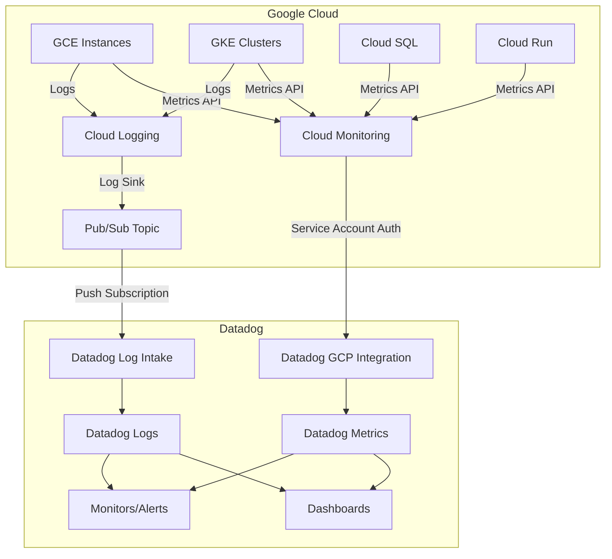

# How to Integrate Datadog with Google Cloud Platform Using the GCP Integration Tile

Author: [nawazdhandala](https://www.github.com/nawazdhandala)

Tags: GCP, Datadog, Integration, Cloud Monitoring, Observability, Google Cloud

Description: Step-by-step guide to integrating Datadog with Google Cloud Platform using the GCP integration tile for centralized monitoring and alerting.

---

Many organizations run on Google Cloud but use Datadog as their primary observability platform. The good news is that Datadog has a first-class integration with GCP that pulls in metrics from over 80 Google Cloud services, imports Cloud Logging logs, and correlates everything with your other infrastructure. In this post, I will walk through setting up the integration properly so you get the full value from both platforms.

## What the Integration Provides

The Datadog GCP integration gives you several things. It automatically collects metrics from Google Cloud services like Compute Engine, GKE, Cloud SQL, Cloud Run, Cloud Functions, Pub/Sub, and many more. It can forward Cloud Logging logs to Datadog. It enriches your Datadog infrastructure map with GCP resource information. And it lets you create Datadog monitors and dashboards using GCP metrics alongside metrics from your other cloud providers and on-premises infrastructure.

## Prerequisites

- A Datadog account with an active plan
- A GCP project with the services you want to monitor
- IAM admin permissions on the GCP project
- Access to the Datadog GCP integration tile

## Step 1: Create a GCP Service Account

Datadog needs a service account with specific permissions to read metrics and logs from your GCP project.

```bash
# Create a service account for Datadog
gcloud iam service-accounts create datadog-integration \
    --display-name="Datadog GCP Integration" \
    --project=my-gcp-project
```

Grant the necessary roles. Datadog needs read access to monitoring, compute, and optionally cloud asset inventory.

```bash
# Grant the monitoring viewer role - required for metric collection
gcloud projects add-iam-policy-binding my-gcp-project \
    --member="serviceAccount:datadog-integration@my-gcp-project.iam.gserviceaccount.com" \
    --role="roles/monitoring.viewer"

# Grant the compute viewer role - required for host metadata
gcloud projects add-iam-policy-binding my-gcp-project \
    --member="serviceAccount:datadog-integration@my-gcp-project.iam.gserviceaccount.com" \
    --role="roles/compute.viewer"

# Grant the Cloud Asset Viewer role - for resource discovery
gcloud projects add-iam-policy-binding my-gcp-project \
    --member="serviceAccount:datadog-integration@my-gcp-project.iam.gserviceaccount.com" \
    --role="roles/cloudasset.viewer"

# Grant the Browser role - for basic project info
gcloud projects add-iam-policy-binding my-gcp-project \
    --member="serviceAccount:datadog-integration@my-gcp-project.iam.gserviceaccount.com" \
    --role="roles/browser"
```

## Step 2: Generate a Service Account Key

Datadog needs a JSON key file to authenticate.

```bash
# Create and download the service account key
gcloud iam service-accounts keys create datadog-key.json \
    --iam-account=datadog-integration@my-gcp-project.iam.gserviceaccount.com
```

Keep this key file safe. You will upload it to Datadog in the next step.

## Step 3: Configure the Integration in Datadog

Open the Datadog web console and navigate to Integrations, then search for "Google Cloud Platform" and click on the integration tile.

Click "Add GCP Account" and either upload the JSON key file or paste its contents directly. Datadog will validate the credentials and begin collecting metrics.

You can also configure this via the Datadog API.

```bash
# Configure the integration via API
# First, read the service account key file
KEY_CONTENT=$(cat datadog-key.json)

# Create the integration via the Datadog API
curl -X POST "https://api.datadoghq.com/api/v1/integration/gcp" \
    -H "Content-Type: application/json" \
    -H "DD-API-KEY: ${DD_API_KEY}" \
    -H "DD-APPLICATION-KEY: ${DD_APP_KEY}" \
    -d "{
        \"type\": \"service_account\",
        \"project_id\": \"my-gcp-project\",
        \"private_key_id\": \"$(echo $KEY_CONTENT | jq -r .private_key_id)\",
        \"private_key\": $(echo $KEY_CONTENT | jq .private_key),
        \"client_email\": \"$(echo $KEY_CONTENT | jq -r .client_email)\",
        \"client_id\": \"$(echo $KEY_CONTENT | jq -r .client_id)\",
        \"auth_uri\": \"https://accounts.google.com/o/oauth2/auth\",
        \"token_uri\": \"https://oauth2.googleapis.com/token\",
        \"host_filters\": \"\"
    }"
```

## Step 4: Configure Host Filters (Optional)

If you only want to monitor specific GCE instances, use host filters to limit the scope.

In the Datadog GCP integration tile, you can set filters like:

```
# Only monitor instances with specific labels
tags:env:production

# Only monitor instances in specific zones
zone:us-central1-a,zone:us-central1-b

# Exclude development instances
-tags:env:development
```

## Step 5: Set Up Log Forwarding

To forward Google Cloud logs to Datadog, you need to set up a Pub/Sub topic and a push subscription that sends logs to Datadog's intake endpoint.

```bash
# Create a Pub/Sub topic for Datadog log forwarding
gcloud pubsub topics create datadog-logs-export \
    --project=my-gcp-project

# Create a push subscription that sends to Datadog
gcloud pubsub subscriptions create datadog-logs-subscription \
    --topic=datadog-logs-export \
    --push-endpoint="https://gcp-intake.logs.datadoghq.com/api/v2/logs?dd-api-key=${DD_API_KEY}&dd-protocol=gcp" \
    --ack-deadline=60 \
    --project=my-gcp-project

# Create a log sink that exports logs to the Pub/Sub topic
gcloud logging sinks create datadog-sink \
    pubsub.googleapis.com/projects/my-gcp-project/topics/datadog-logs-export \
    --log-filter='resource.type="gce_instance" OR resource.type="k8s_container" OR resource.type="cloud_run_revision"' \
    --project=my-gcp-project
```

The log sink's service account needs publish permission on the Pub/Sub topic.

```bash
# Get the sink's writer identity
SINK_SA=$(gcloud logging sinks describe datadog-sink \
    --project=my-gcp-project \
    --format="value(writerIdentity)")

# Grant publish permission to the sink's service account
gcloud pubsub topics add-iam-policy-binding datadog-logs-export \
    --member="$SINK_SA" \
    --role="roles/pubsub.publisher" \
    --project=my-gcp-project
```

## Integration Architecture

Here is how the data flows.



## Step 6: Verify the Integration

After setting up the integration, verify that metrics are flowing.

```bash
# Use the Datadog API to check GCP metrics are available
curl -G "https://api.datadoghq.com/api/v1/metrics" \
    -H "DD-API-KEY: ${DD_API_KEY}" \
    -H "DD-APPLICATION-KEY: ${DD_APP_KEY}" \
    --data-urlencode "from=$(date -v-1H +%s)" \
    --data-urlencode "host=my-gcp-instance"
```

In the Datadog console, navigate to Metrics Explorer and search for `gcp.` prefix metrics. You should see metrics like `gcp.compute.instance.cpu.utilization`, `gcp.gke.container.cpu.usage_time`, and others appearing within 5-10 minutes of configuring the integration.

## Step 7: Create a GCP Dashboard in Datadog

Here is a Terraform example for creating a Datadog dashboard with GCP metrics.

```hcl
resource "datadog_dashboard" "gcp_overview" {
  title       = "GCP Infrastructure Overview"
  description = "Overview of Google Cloud resources"
  layout_type = "ordered"

  widget {
    group_definition {
      title       = "Compute Engine"
      layout_type = "ordered"

      widget {
        timeseries_definition {
          title = "CPU Utilization by Instance"
          request {
            q = "avg:gcp.compute.instance.cpu.utilization{project_id:my-gcp-project} by {instance_name}"
            display_type = "line"
          }
        }
      }

      widget {
        timeseries_definition {
          title = "Network Traffic"
          request {
            q = "sum:gcp.compute.instance.network.received_bytes_count{project_id:my-gcp-project} by {instance_name}.as_rate()"
            display_type = "area"
          }
        }
      }
    }
  }

  widget {
    group_definition {
      title       = "GKE"
      layout_type = "ordered"

      widget {
        timeseries_definition {
          title = "Container CPU Usage"
          request {
            q = "avg:gcp.gke.container.cpu.usage_time{project_id:my-gcp-project} by {container_name}.as_rate()"
            display_type = "line"
          }
        }
      }

      widget {
        timeseries_definition {
          title = "Container Memory Usage"
          request {
            q = "avg:gcp.gke.container.memory.usage{project_id:my-gcp-project} by {container_name}"
            display_type = "line"
          }
        }
      }
    }
  }
}
```

## Step 8: Create Monitors on GCP Metrics

Set up Datadog monitors that alert on GCP metric thresholds.

```bash
# Create a Datadog monitor for GCE CPU utilization
curl -X POST "https://api.datadoghq.com/api/v1/monitor" \
    -H "Content-Type: application/json" \
    -H "DD-API-KEY: ${DD_API_KEY}" \
    -H "DD-APPLICATION-KEY: ${DD_APP_KEY}" \
    -d '{
        "type": "metric alert",
        "query": "avg(last_5m):avg:gcp.compute.instance.cpu.utilization{project_id:my-gcp-project} by {instance_name} > 0.8",
        "name": "GCP: High CPU Utilization",
        "message": "CPU utilization on {{instance_name.name}} is above 80%. Current value: {{value}}",
        "tags": ["env:production", "cloud:gcp"],
        "options": {
            "thresholds": {
                "critical": 0.8,
                "warning": 0.7
            },
            "notify_no_data": false,
            "renotify_interval": 60
        }
    }'
```

## Multi-Project Setup

If you have multiple GCP projects, add each one to the integration. You can also use organization-level service accounts.

```bash
# For organization-wide monitoring, create a service account at the org level
gcloud iam service-accounts create datadog-org-integration \
    --display-name="Datadog Org Integration" \
    --project=my-admin-project

# Grant organization-level viewer access
gcloud organizations add-iam-policy-binding $ORG_ID \
    --member="serviceAccount:datadog-org-integration@my-admin-project.iam.gserviceaccount.com" \
    --role="roles/monitoring.viewer"
```

## Wrapping Up

The Datadog GCP integration gives you a unified view of your Google Cloud infrastructure alongside everything else Datadog monitors. The setup involves creating a service account with the right permissions, configuring the integration tile in Datadog, and optionally setting up log forwarding via Pub/Sub. Once connected, you get automatic metric collection from all GCP services, host maps with GCP metadata, and the ability to build dashboards and alerts that span your entire infrastructure - not just Google Cloud. The whole process takes about 30 minutes and the metrics start flowing within 5-10 minutes of configuration.
