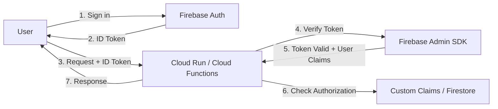

# How to Integrate Firebase Authentication with Google Cloud IAM for Backend Services

Author: [nawazdhandala](https://www.github.com/nawazdhandala)

Tags: GCP, Firebase Authentication, Cloud IAM, Backend Security, Google Cloud

Description: Learn how to use Firebase Authentication tokens to secure Google Cloud backend services like Cloud Run, Cloud Functions, and API Gateway with proper IAM integration.

---

Firebase Authentication handles user sign-in beautifully on the frontend. Users can log in with Google, email/password, phone number, or a dozen other providers, and your client app gets a JWT token. But what happens when that user needs to call your backend services running on Cloud Run or Cloud Functions? You need to verify that token on the backend and make authorization decisions.

This guide covers how to bridge Firebase Authentication with Google Cloud backend services, verify tokens properly, and implement role-based access control that works across the stack.

## The Architecture



The flow is:
1. User signs in via Firebase Auth on the client
2. Client receives an ID token (JWT)
3. Client includes the token in API requests to your backend
4. Backend verifies the token using the Firebase Admin SDK
5. Backend uses the user info and custom claims for authorization
6. Backend returns the response

## Setting Up Firebase Auth on the Client

First, set up authentication on the frontend:

```javascript
// Firebase Auth initialization (client-side)
import { initializeApp } from 'firebase/app';
import { getAuth, signInWithPopup, GoogleAuthProvider } from 'firebase/auth';

const firebaseConfig = {
  apiKey: "your-api-key",
  authDomain: "your-project.firebaseapp.com",
  projectId: "your-project",
};

const app = initializeApp(firebaseConfig);
const auth = getAuth(app);

// Sign in with Google
async function signIn() {
  const provider = new GoogleAuthProvider();
  const result = await signInWithPopup(auth, provider);
  return result.user;
}

// Get the ID token to send to your backend
async function getIdToken() {
  const user = auth.currentUser;
  if (!user) throw new Error('Not signed in');

  // Force refresh to get the latest token with updated claims
  const token = await user.getIdToken(true);
  return token;
}

// Make an authenticated API call
async function callApi(endpoint) {
  const token = await getIdToken();
  const response = await fetch(endpoint, {
    headers: {
      'Authorization': `Bearer ${token}`,
    },
  });
  return response.json();
}
```

## Verifying Firebase Tokens on Cloud Run

### Setting Up the Backend

Create a Cloud Run service that verifies Firebase tokens:

```javascript
// server.js - Cloud Run service with Firebase Auth verification
const express = require('express');
const admin = require('firebase-admin');

// Initialize Firebase Admin SDK
// When running on Cloud Run, it automatically uses the service account
admin.initializeApp();

const app = express();
app.use(express.json());

// Middleware to verify Firebase ID tokens
async function authenticateUser(req, res, next) {
  const authHeader = req.headers.authorization;

  if (!authHeader || !authHeader.startsWith('Bearer ')) {
    return res.status(401).json({ error: 'Missing or invalid authorization header' });
  }

  const idToken = authHeader.split('Bearer ')[1];

  try {
    // Verify the token and decode its claims
    const decodedToken = await admin.auth().verifyIdToken(idToken);
    req.user = decodedToken;
    next();
  } catch (error) {
    console.error('Token verification failed:', error.message);
    return res.status(401).json({ error: 'Invalid or expired token' });
  }
}

// Public endpoint - no auth required
app.get('/api/public', (req, res) => {
  res.json({ message: 'This is public data' });
});

// Protected endpoint - requires valid Firebase token
app.get('/api/profile', authenticateUser, (req, res) => {
  res.json({
    uid: req.user.uid,
    email: req.user.email,
    name: req.user.name,
    message: 'This is your profile data',
  });
});

// Admin-only endpoint - requires admin custom claim
app.get('/api/admin/users', authenticateUser, (req, res) => {
  if (!req.user.admin) {
    return res.status(403).json({ error: 'Admin access required' });
  }
  res.json({ users: ['user1@example.com', 'user2@example.com'] });
});

const port = process.env.PORT || 8080;
app.listen(port, () => {
  console.log(`Server running on port ${port}`);
});
```

### Deploy to Cloud Run

```bash
# Build and deploy
gcloud builds submit --tag gcr.io/my-project/auth-backend

gcloud run deploy auth-backend \
  --image=gcr.io/my-project/auth-backend \
  --region=us-central1 \
  --platform=managed \
  --allow-unauthenticated \
  --memory=256Mi
```

Note that we use `--allow-unauthenticated` because authentication is handled at the application level by verifying Firebase tokens, not at the Cloud Run IAM level.

## Custom Claims for Role-Based Access

Firebase Custom Claims let you embed role information directly in the ID token:

### Setting Custom Claims (Admin SDK)

```javascript
// set-claims.js - Script to set custom claims on a user
const admin = require('firebase-admin');
admin.initializeApp();

async function setAdminClaim(uid) {
  // Set the user as an admin
  await admin.auth().setCustomUserClaims(uid, {
    admin: true,
    role: 'admin',
    department: 'engineering',
  });

  console.log(`Admin claim set for user ${uid}`);
}

async function setUserRole(uid, role) {
  // Set a specific role
  const currentClaims = (await admin.auth().getUser(uid)).customClaims || {};
  await admin.auth().setCustomUserClaims(uid, {
    ...currentClaims,
    role: role,
  });

  console.log(`Role '${role}' set for user ${uid}`);
}

// Usage
setAdminClaim('user-uid-here');
setUserRole('another-uid', 'editor');
```

### Using Custom Claims in Cloud Functions

```javascript
// Cloud Function to set custom claims via an API call
// Only existing admins can promote other users
const functions = require('firebase-functions');
const admin = require('firebase-admin');
admin.initializeApp();

exports.setUserRole = functions.https.onCall(async (data, context) => {
  // Verify the caller is an admin
  if (!context.auth || !context.auth.token.admin) {
    throw new functions.https.HttpsError(
      'permission-denied',
      'Only admins can set user roles'
    );
  }

  const { targetUid, role } = data;

  // Validate the role
  const validRoles = ['viewer', 'editor', 'admin'];
  if (!validRoles.includes(role)) {
    throw new functions.https.HttpsError(
      'invalid-argument',
      `Invalid role. Must be one of: ${validRoles.join(', ')}`
    );
  }

  // Set the custom claim
  await admin.auth().setCustomUserClaims(targetUid, { role, admin: role === 'admin' });

  return { message: `Role '${role}' assigned to user ${targetUid}` };
});
```

### Checking Claims on the Client

```javascript
// Client-side: check if user has specific claims
import { getAuth } from 'firebase/auth';

async function checkUserRole() {
  const auth = getAuth();
  const user = auth.currentUser;

  if (!user) return null;

  // Get the token result which includes custom claims
  const tokenResult = await user.getIdTokenResult();
  return {
    isAdmin: tokenResult.claims.admin === true,
    role: tokenResult.claims.role || 'viewer',
  };
}
```

## Integrating with API Gateway

For more complex API management, use API Gateway with Firebase Auth:

```yaml
# api-config.yaml - API Gateway config with Firebase Auth
swagger: "2.0"
info:
  title: My API
  version: 1.0.0
host: my-api-gateway-hash.apigateway.my-project.cloud.goog
schemes:
  - https
securityDefinitions:
  firebase:
    authorizationUrl: ""
    flow: "implicit"
    type: "oauth2"
    x-google-issuer: "https://securetoken.google.com/my-project"
    x-google-jwks_uri: "https://www.googleapis.com/service_accounts/v1/metadata/x509/securetoken@system.gserviceaccount.com"
    x-google-audiences: "my-project"
paths:
  /api/profile:
    get:
      security:
        - firebase: []
      x-google-backend:
        address: https://auth-backend-xxxx.run.app
      responses:
        200:
          description: Success
  /api/public:
    get:
      x-google-backend:
        address: https://auth-backend-xxxx.run.app
      responses:
        200:
          description: Success
```

```bash
# Deploy the API Gateway config
gcloud api-gateway api-configs create my-config \
  --api=my-api \
  --openapi-spec=api-config.yaml \
  --project=my-project

# Create the gateway
gcloud api-gateway gateways create my-gateway \
  --api=my-api \
  --api-config=my-config \
  --location=us-central1 \
  --project=my-project
```

## Python Backend Example

If your backend is in Python:

```python
# main.py - Python Cloud Run service with Firebase Auth
from flask import Flask, request, jsonify
import firebase_admin
from firebase_admin import auth

# Initialize Firebase Admin SDK
firebase_admin.initialize_app()

app = Flask(__name__)

def verify_firebase_token(f):
    """Decorator to verify Firebase ID tokens."""
    from functools import wraps

    @wraps(f)
    def decorated(*args, **kwargs):
        auth_header = request.headers.get('Authorization', '')

        if not auth_header.startswith('Bearer '):
            return jsonify({'error': 'Missing authorization header'}), 401

        id_token = auth_header.split('Bearer ')[1]

        try:
            decoded_token = auth.verify_id_token(id_token)
            request.user = decoded_token
        except Exception as e:
            return jsonify({'error': f'Invalid token: {str(e)}'}), 401

        return f(*args, **kwargs)
    return decorated


def require_role(role):
    """Decorator to check custom claims for role-based access."""
    def decorator(f):
        from functools import wraps

        @wraps(f)
        def decorated(*args, **kwargs):
            user_role = request.user.get('role', 'viewer')
            if user_role != role and not request.user.get('admin', False):
                return jsonify({'error': f'Role "{role}" required'}), 403
            return f(*args, **kwargs)
        return decorated
    return decorator


@app.route('/api/profile')
@verify_firebase_token
def get_profile():
    return jsonify({
        'uid': request.user['uid'],
        'email': request.user.get('email'),
        'role': request.user.get('role', 'viewer'),
    })


@app.route('/api/admin/dashboard')
@verify_firebase_token
@require_role('admin')
def admin_dashboard():
    return jsonify({
        'message': 'Welcome to the admin dashboard',
        'stats': {'users': 150, 'active_today': 42},
    })


if __name__ == '__main__':
    app.run(host='0.0.0.0', port=8080)
```

## Security Best Practices

1. **Always verify tokens on the backend** - Never trust client-side claims alone. The backend must verify the token signature and expiration.

2. **Use custom claims sparingly** - Custom claims are embedded in every token. Keep them small (under 1000 bytes total). For complex permissions, store them in Firestore and look them up after token verification.

3. **Force token refresh after claim changes** - Custom claims do not take effect until the token is refreshed. On the client, call `getIdToken(true)` to force a refresh.

4. **Set token expiration handling** - Firebase ID tokens expire after 1 hour. Your client should handle token refresh before making API calls.

5. **Do not expose Firebase Admin credentials** - The Admin SDK should only run on the server. Never include admin credentials in client code.

6. **Use HTTPS everywhere** - Tokens are bearer tokens. Anyone who intercepts one can impersonate the user until it expires.

7. **Implement rate limiting** - Even authenticated users should be rate-limited to prevent abuse:

```javascript
// Simple rate limiting middleware
const rateLimit = require('express-rate-limit');

const apiLimiter = rateLimit({
  windowMs: 15 * 60 * 1000, // 15 minutes
  max: 100, // limit each user to 100 requests per window
  keyGenerator: (req) => req.user?.uid || req.ip,
});

app.use('/api/', apiLimiter);
```

## Wrapping Up

Firebase Authentication and Google Cloud IAM serve different but complementary purposes. Firebase Auth handles user-facing authentication (sign-in, sign-up, identity providers), while Cloud IAM handles service-to-service authentication and authorization. By verifying Firebase tokens on your Cloud Run or Cloud Functions backend and using custom claims for role-based access, you get a secure, scalable authentication system that works seamlessly across the stack.
