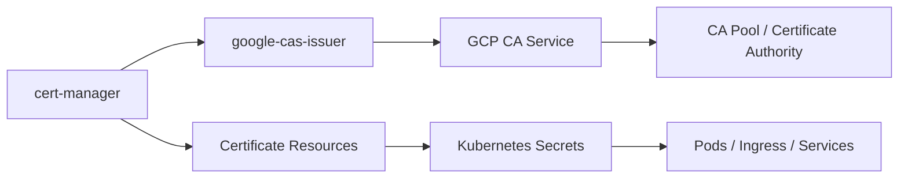

# How to Integrate GCP CA Service with cert-manager for Kubernetes

Author: [nawazdhandala](https://www.github.com/nawazdhandala)

Tags: GCP, Certificate Authority Service, cert-manager, Kubernetes, TLS

Description: A step-by-step guide to integrating Google Cloud CA Service with cert-manager in Kubernetes for automated certificate issuance and renewal for your workloads.

---

If you run workloads on Kubernetes, you have probably dealt with cert-manager for automating TLS certificate management. cert-manager works great with public CAs like Let's Encrypt, but when you need private certificates for internal services, service mesh mTLS, or internal APIs, you need a private CA backend.

GCP CA Service integrates with cert-manager through the `google-cas-issuer` plugin. This gives you automated private certificate issuance and renewal right from your Kubernetes cluster, backed by the same managed PKI that handles key storage, availability, and audit logging.

## Architecture

Here is how the components fit together:



cert-manager watches for Certificate resources in your cluster. When it sees one that uses a CA Service issuer, it calls the google-cas-issuer plugin, which requests a certificate from GCP CA Service. The signed certificate is stored as a Kubernetes Secret that your pods can mount.

## Prerequisites

- A GKE cluster (or any Kubernetes cluster with GCP credentials)
- cert-manager installed in the cluster
- A CA pool and certificate authority in GCP CA Service
- Workload Identity configured (for GKE)

## Step 1: Install cert-manager

If you do not have cert-manager installed yet:

```bash
# Install cert-manager using Helm
helm repo add jetstack https://charts.jetstack.io
helm repo update

helm install cert-manager jetstack/cert-manager \
  --namespace cert-manager \
  --create-namespace \
  --set installCRDs=true \
  --version v1.14.0
```

Verify it is running:

```bash
# Check cert-manager pods are running
kubectl get pods -n cert-manager
```

## Step 2: Install the google-cas-issuer Plugin

The google-cas-issuer is an external issuer for cert-manager that integrates with GCP CA Service:

```bash
# Install google-cas-issuer using Helm
helm repo add jetstack https://charts.jetstack.io

helm install google-cas-issuer jetstack/google-cas-issuer \
  --namespace cert-manager \
  --version v0.8.0
```

Or install from the release manifests:

```bash
# Install google-cas-issuer from GitHub releases
kubectl apply -f https://github.com/jetstack/google-cas-issuer/releases/download/v0.8.0/google-cas-issuer-v0.8.0.yaml
```

## Step 3: Configure GCP Authentication

The google-cas-issuer needs permissions to request certificates from CA Service. On GKE with Workload Identity, set this up:

```bash
# Create a GCP service account for cert-manager
gcloud iam service-accounts create cert-manager-cas \
  --display-name="cert-manager CA Service" \
  --project=PROJECT_ID

# Grant the CA Service certificate requester role
gcloud privateca pools add-iam-policy-binding subordinate-ca-pool \
  --location=us-central1 \
  --member="serviceAccount:cert-manager-cas@PROJECT_ID.iam.gserviceaccount.com" \
  --role="roles/privateca.certificateRequester" \
  --project=PROJECT_ID

# Bind the GCP service account to the Kubernetes service account
gcloud iam service-accounts add-iam-policy-binding \
  cert-manager-cas@PROJECT_ID.iam.gserviceaccount.com \
  --role="roles/iam.workloadIdentityUser" \
  --member="serviceAccount:PROJECT_ID.svc.id.goog[cert-manager/ksa-google-cas-issuer]" \
  --project=PROJECT_ID

# Annotate the Kubernetes service account
kubectl annotate serviceaccount ksa-google-cas-issuer \
  --namespace=cert-manager \
  iam.gke.io/gcp-service-account=cert-manager-cas@PROJECT_ID.iam.gserviceaccount.com
```

If you are not using Workload Identity, you can use a service account key:

```bash
# Create a key for the service account
gcloud iam service-accounts keys create cas-key.json \
  --iam-account=cert-manager-cas@PROJECT_ID.iam.gserviceaccount.com

# Create a Kubernetes secret with the key
kubectl create secret generic cas-credentials \
  --namespace=cert-manager \
  --from-file=credentials.json=cas-key.json
```

## Step 4: Create an Issuer Resource

Create a GoogleCASIssuer (namespaced) or GoogleCASClusterIssuer (cluster-wide) resource:

```yaml
# google-cas-issuer.yaml
# Cluster-wide issuer using GCP CA Service
apiVersion: cas-issuer.jetstack.io/v1beta1
kind: GoogleCASClusterIssuer
metadata:
  name: cas-cluster-issuer
spec:
  # Reference to the CA pool in GCP
  project: my-project
  location: us-central1
  caPoolId: subordinate-ca-pool
  # Optional: specify a particular CA in the pool
  # certificateAuthorityId: my-subordinate-ca
  # If using a service account key instead of Workload Identity
  # credentials:
  #   name: cas-credentials
  #   key: credentials.json
```

Apply it:

```bash
# Create the cluster issuer
kubectl apply -f google-cas-issuer.yaml

# Verify the issuer is ready
kubectl get googlecasclusterissuers
```

For a namespaced issuer:

```yaml
# namespaced-issuer.yaml
apiVersion: cas-issuer.jetstack.io/v1beta1
kind: GoogleCASIssuer
metadata:
  name: cas-issuer
  namespace: my-app
spec:
  project: my-project
  location: us-central1
  caPoolId: subordinate-ca-pool
```

## Step 5: Request Certificates

Now you can create Certificate resources that reference the CA Service issuer:

```yaml
# certificate.yaml
# Request a TLS certificate for an internal API service
apiVersion: cert-manager.io/v1
kind: Certificate
metadata:
  name: api-service-tls
  namespace: my-app
spec:
  # The Kubernetes secret where the cert will be stored
  secretName: api-service-tls-secret
  duration: 2160h     # 90 days
  renewBefore: 360h   # Renew 15 days before expiry
  isCA: false

  # Subject information
  commonName: api.internal.example.com
  dnsNames:
    - api.internal.example.com
    - api.my-app.svc.cluster.local

  # Private key configuration
  privateKey:
    algorithm: RSA
    size: 2048

  # Reference the CA Service issuer
  issuerRef:
    group: cas-issuer.jetstack.io
    kind: GoogleCASClusterIssuer
    name: cas-cluster-issuer
```

Apply and verify:

```bash
# Create the certificate request
kubectl apply -f certificate.yaml

# Check the certificate status
kubectl get certificate api-service-tls -n my-app

# Check the certificate request status
kubectl get certificaterequest -n my-app

# Verify the secret was created
kubectl get secret api-service-tls-secret -n my-app
```

## Step 6: Use the Certificate in Your Workloads

Mount the certificate secret in your pods:

```yaml
# deployment.yaml
apiVersion: apps/v1
kind: Deployment
metadata:
  name: api-service
  namespace: my-app
spec:
  replicas: 3
  selector:
    matchLabels:
      app: api-service
  template:
    metadata:
      labels:
        app: api-service
    spec:
      containers:
        - name: api
          image: my-registry/api-service:latest
          ports:
            - containerPort: 8443
          volumeMounts:
            # Mount the TLS certificate
            - name: tls-certs
              mountPath: /etc/tls
              readOnly: true
          env:
            - name: TLS_CERT_PATH
              value: /etc/tls/tls.crt
            - name: TLS_KEY_PATH
              value: /etc/tls/tls.key
            - name: CA_CERT_PATH
              value: /etc/tls/ca.crt
      volumes:
        - name: tls-certs
          secret:
            secretName: api-service-tls-secret
```

Or use it with an Ingress:

```yaml
# ingress.yaml
apiVersion: networking.k8s.io/v1
kind: Ingress
metadata:
  name: api-ingress
  namespace: my-app
  annotations:
    cert-manager.io/cluster-issuer: cas-cluster-issuer
spec:
  tls:
    - hosts:
        - api.internal.example.com
      secretName: api-ingress-tls
  rules:
    - host: api.internal.example.com
      http:
        paths:
          - path: /
            pathType: Prefix
            backend:
              service:
                name: api-service
                port:
                  number: 8443
```

With the annotation `cert-manager.io/cluster-issuer`, cert-manager automatically creates a Certificate resource and provisions the TLS secret.

## Step 7: Issue mTLS Client Certificates

For mutual TLS, issue client certificates that services use to authenticate:

```yaml
# client-certificate.yaml
apiVersion: cert-manager.io/v1
kind: Certificate
metadata:
  name: service-b-client-cert
  namespace: my-app
spec:
  secretName: service-b-client-tls
  duration: 720h       # 30 days
  renewBefore: 168h    # Renew 7 days before expiry
  isCA: false
  commonName: service-b.my-app.svc.cluster.local
  dnsNames:
    - service-b.my-app.svc.cluster.local
  usages:
    - client auth
    - digital signature
  privateKey:
    algorithm: ECDSA
    size: 256
  issuerRef:
    group: cas-issuer.jetstack.io
    kind: GoogleCASClusterIssuer
    name: cas-cluster-issuer
```

## Monitoring Certificate Lifecycle

Monitor certificate status and renewals:

```bash
# List all certificates and their status
kubectl get certificates --all-namespaces

# Check for certificates nearing expiry
kubectl get certificates --all-namespaces -o json | \
  jq '.items[] | {name: .metadata.name, namespace: .metadata.namespace, notAfter: .status.notAfter, renewalTime: .status.renewalTime}'
```

Set up alerts in your monitoring system for certificate expiry. cert-manager exposes Prometheus metrics that you can scrape:

```yaml
# ServiceMonitor for cert-manager metrics
apiVersion: monitoring.coreos.com/v1
kind: ServiceMonitor
metadata:
  name: cert-manager
  namespace: cert-manager
spec:
  selector:
    matchLabels:
      app.kubernetes.io/name: cert-manager
  endpoints:
    - port: http-metrics
      interval: 30s
```

## Troubleshooting

Common issues and how to fix them:

**Certificate stays in "Pending" state**: Check the CertificateRequest status for error messages. Usually this is a permissions issue - the service account does not have the `roles/privateca.certificateRequester` role on the CA pool.

```bash
# Check CertificateRequest status for errors
kubectl describe certificaterequest -n my-app
```

**Issuer not ready**: Verify the google-cas-issuer pod is running and check its logs:

```bash
# Check issuer pod logs
kubectl logs -n cert-manager -l app=google-cas-issuer
```

**Workload Identity not working**: Make sure the annotation on the Kubernetes service account is correct and the GCP IAM binding is in place.

## Summary

Integrating GCP CA Service with cert-manager gives you automated private certificate lifecycle management in Kubernetes. Install the google-cas-issuer plugin, create an issuer resource pointing to your CA pool, and request certificates through standard cert-manager Certificate resources. cert-manager handles renewal automatically, and CA Service handles the PKI infrastructure. This combination eliminates manual certificate management while giving you a production-grade private PKI backed by Google's managed infrastructure.
