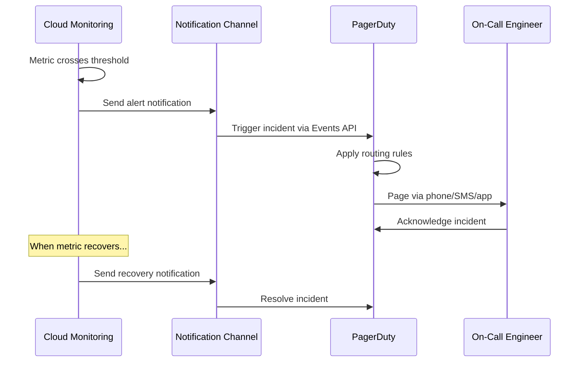
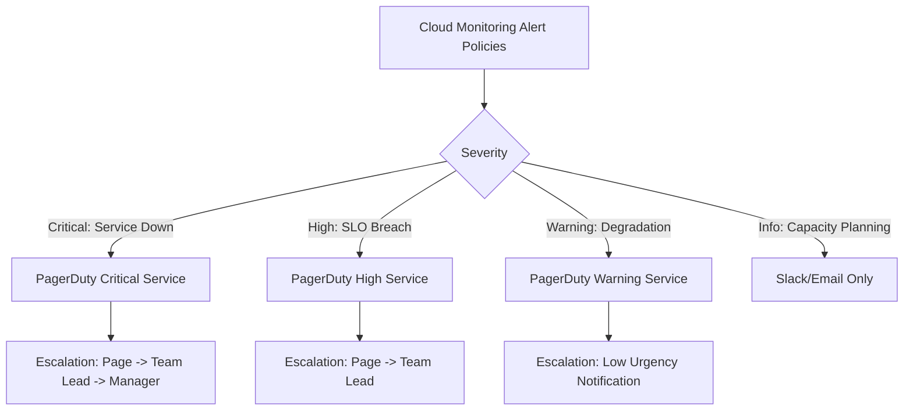

# How to Integrate PagerDuty with Google Cloud Monitoring Alert Policies

Author: [nawazdhandala](https://www.github.com/nawazdhandala)

Tags: GCP, PagerDuty, Cloud Monitoring, Alerting, Incident Management, Google Cloud

Description: A practical guide to integrating PagerDuty with Google Cloud Monitoring alert policies for automated incident management and on-call notification.

---

Google Cloud Monitoring can detect problems, but it cannot manage the incident response workflow on its own. PagerDuty fills that gap by taking alerts from Cloud Monitoring and routing them to the right on-call engineer with escalation policies, schedules, and acknowledgment tracking. In this post, I will show you how to connect the two systems so that Cloud Monitoring alerts automatically create PagerDuty incidents.

## How the Integration Works

When a Cloud Monitoring alert policy fires, it sends a notification to a notification channel. PagerDuty acts as one of these notification channels. The notification contains the alert details - what metric triggered, the current value, the threshold, and any documentation you have attached. PagerDuty receives this, creates an incident, and routes it according to your escalation policy.



## Prerequisites

- A PagerDuty account with admin access
- A Google Cloud project with Cloud Monitoring
- At least one alert policy (or you will create one)

## Step 1: Create a PagerDuty Service

In PagerDuty, create a service that will receive the Google Cloud alerts.

1. Go to Services in the PagerDuty dashboard
2. Click "New Service"
3. Name it something like "Google Cloud Production"
4. Assign it to the appropriate escalation policy
5. Under Integrations, select "Google Cloud Monitoring" as the integration type
6. Save the service

PagerDuty will generate an integration key (also called a routing key). Copy this key - you will need it in the next step.

## Step 2: Create the Notification Channel in Google Cloud

You can create the PagerDuty notification channel via the Console, gcloud, or API.

Using gcloud.

```bash
# Create a PagerDuty notification channel
# The service_key is the integration key from PagerDuty
gcloud monitoring channels create \
    --type=pagerduty \
    --display-name="PagerDuty - Production" \
    --channel-labels=service_key=YOUR_PAGERDUTY_INTEGRATION_KEY \
    --project=my-gcp-project
```

Using the API.

```bash
# Create the notification channel via REST API
curl -X POST \
    "https://monitoring.googleapis.com/v3/projects/my-gcp-project/notificationChannels" \
    -H "Authorization: Bearer $(gcloud auth print-access-token)" \
    -H "Content-Type: application/json" \
    -d '{
        "type": "pagerduty",
        "displayName": "PagerDuty - Production",
        "labels": {
            "service_key": "YOUR_PAGERDUTY_INTEGRATION_KEY"
        },
        "enabled": true
    }'
```

Note the channel ID returned - you will reference it in alert policies.

## Step 3: Verify the Channel

Send a test notification to confirm the integration works.

```bash
# List notification channels to get the channel ID
gcloud monitoring channels list \
    --project=my-gcp-project \
    --filter='displayName="PagerDuty - Production"'

# Send a verification notification
gcloud monitoring channels verify CHANNEL_ID \
    --project=my-gcp-project
```

Check PagerDuty to confirm the test incident was created.

## Step 4: Create Alert Policies with PagerDuty Notification

Now create alert policies that send notifications to PagerDuty.

```bash
# Get the full channel name
CHANNEL_NAME=$(gcloud monitoring channels list \
    --project=my-gcp-project \
    --filter='displayName="PagerDuty - Production"' \
    --format="value(name)")

# Create an alert policy with PagerDuty notification
gcloud monitoring policies create --policy-from-file=- << EOF
{
  "displayName": "High Error Rate - Production API",
  "conditions": [{
    "displayName": "Error rate above 1%",
    "conditionThreshold": {
      "filter": "metric.type=\"loadbalancing.googleapis.com/https/request_count\" AND metric.labels.response_code_class=\"500\" AND resource.type=\"https_lb_rule\"",
      "comparison": "COMPARISON_GT",
      "thresholdValue": 10,
      "duration": "300s",
      "aggregations": [{
        "alignmentPeriod": "60s",
        "perSeriesAligner": "ALIGN_RATE"
      }]
    }
  }],
  "combiner": "OR",
  "notificationChannels": ["$CHANNEL_NAME"],
  "documentation": {
    "content": "## High Error Rate Alert\n\n### What happened?\nThe production API error rate has exceeded 1% for more than 5 minutes.\n\n### What to do\n1. Check the [error dashboard](https://console.cloud.google.com/monitoring/dashboards)\n2. Look at recent deployments\n3. Check dependency health\n\n### Runbook\nhttps://runbooks.example.com/high-error-rate",
    "mimeType": "text/markdown"
  },
  "alertStrategy": {
    "autoClose": "1800s",
    "notificationRateLimit": {
      "period": "300s"
    }
  }
}
EOF
```

## Step 5: Create Multiple PagerDuty Channels for Different Severity Levels

In practice, you want different alert severities to go to different PagerDuty services or escalation policies.

```bash
# Create a PagerDuty channel for critical alerts (pages immediately)
gcloud monitoring channels create \
    --type=pagerduty \
    --display-name="PagerDuty - Critical" \
    --channel-labels=service_key=CRITICAL_SERVICE_INTEGRATION_KEY \
    --project=my-gcp-project

# Create a PagerDuty channel for warning alerts (lower urgency)
gcloud monitoring channels create \
    --type=pagerduty \
    --display-name="PagerDuty - Warnings" \
    --channel-labels=service_key=WARNING_SERVICE_INTEGRATION_KEY \
    --project=my-gcp-project
```

Then reference the appropriate channel in each alert policy.

```bash
# Critical alert - pages immediately via PagerDuty
CRITICAL_CHANNEL=$(gcloud monitoring channels list \
    --project=my-gcp-project \
    --filter='displayName="PagerDuty - Critical"' \
    --format="value(name)")

# Warning alert - lower urgency via PagerDuty
WARNING_CHANNEL=$(gcloud monitoring channels list \
    --project=my-gcp-project \
    --filter='displayName="PagerDuty - Warnings"' \
    --format="value(name)")
```

## Step 6: Configure with Terraform

Here is the complete Terraform setup.

```hcl
# PagerDuty notification channel for critical alerts
resource "google_monitoring_notification_channel" "pagerduty_critical" {
  display_name = "PagerDuty - Critical"
  type         = "pagerduty"
  project      = var.project_id

  labels = {
    service_key = var.pagerduty_critical_key
  }

  sensitive_labels {
    service_key = var.pagerduty_critical_key
  }
}

# PagerDuty notification channel for warnings
resource "google_monitoring_notification_channel" "pagerduty_warning" {
  display_name = "PagerDuty - Warnings"
  type         = "pagerduty"
  project      = var.project_id

  labels = {
    service_key = var.pagerduty_warning_key
  }

  sensitive_labels {
    service_key = var.pagerduty_warning_key
  }
}

# Critical alert policy - service down
resource "google_monitoring_alert_policy" "service_down" {
  display_name = "Service Down - Immediate Page"
  project      = var.project_id
  combiner     = "OR"

  conditions {
    display_name = "Uptime check failing"
    condition_threshold {
      filter          = "metric.type=\"monitoring.googleapis.com/uptime_check/check_passed\" AND resource.type=\"uptime_url\""
      comparison      = "COMPARISON_LT"
      threshold_value = 1
      duration        = "300s"

      aggregations {
        alignment_period   = "60s"
        per_series_aligner = "ALIGN_NEXT_OLDER"
        cross_series_reducer = "REDUCE_COUNT_FALSE"
      }
    }
  }

  notification_channels = [
    google_monitoring_notification_channel.pagerduty_critical.id
  ]

  documentation {
    content   = "The service uptime check is failing. The service may be completely down."
    mime_type = "text/markdown"
  }

  alert_strategy {
    auto_close = "1800s"
  }
}

# Warning alert policy - elevated latency
resource "google_monitoring_alert_policy" "high_latency" {
  display_name = "High Latency - Warning"
  project      = var.project_id
  combiner     = "OR"

  conditions {
    display_name = "P95 latency above 1s"
    condition_monitoring_query_language {
      query    = "fetch https_lb_rule::loadbalancing.googleapis.com/https/total_latencies | group_by [], percentile(val(), 95) | every 1m | condition val() > 1000 'ms'"
      duration = "600s"
    }
  }

  notification_channels = [
    google_monitoring_notification_channel.pagerduty_warning.id
  ]

  documentation {
    content   = "P95 latency has exceeded 1 second for more than 10 minutes."
    mime_type = "text/markdown"
  }

  alert_strategy {
    auto_close = "3600s"
  }
}
```

## Step 7: Enrich Alert Notifications

The documentation field in alert policies is sent to PagerDuty as incident details. Use it to include runbook links, dashboard links, and initial troubleshooting steps.

```json
{
  "documentation": {
    "content": "## Alert: High Error Rate\n\n**Service:** Production API\n**Impact:** Users may be seeing errors\n\n### Quick Links\n- [Error Dashboard](https://console.cloud.google.com/monitoring/dashboards/my-dashboard)\n- [Recent Deployments](https://console.cloud.google.com/deploy)\n- [Runbook](https://wiki.example.com/runbooks/high-error-rate)\n\n### Immediate Steps\n1. Check if the error rate is affecting all regions\n2. Look at the error breakdown by endpoint\n3. Check if a recent deployment correlates with the error spike\n4. Check dependent service health",
    "mimeType": "text/markdown"
  }
}
```

## Alert Routing Architecture

Here is a recommended alert routing setup.



## Auto-Resolution

Cloud Monitoring automatically sends resolution notifications when the alert condition clears. PagerDuty receives these and resolves the incident. Make sure the `autoClose` setting in your alert strategy matches your expected recovery time.

```bash
# The autoClose setting determines when Cloud Monitoring auto-resolves
# Set it based on expected recovery patterns
"alertStrategy": {
    "autoClose": "1800s"  # Auto-close after 30 minutes of recovery
}
```

## Testing the Integration

Test the full path from alert to PagerDuty incident.

```bash
# Create a test alert policy that triggers immediately
gcloud monitoring policies create --policy-from-file=- << 'EOF'
{
  "displayName": "TEST - Integration Verification (delete after test)",
  "conditions": [{
    "displayName": "Always true condition",
    "conditionThreshold": {
      "filter": "metric.type=\"compute.googleapis.com/instance/cpu/utilization\"",
      "comparison": "COMPARISON_GT",
      "thresholdValue": 0,
      "duration": "0s",
      "aggregations": [{
        "alignmentPeriod": "60s",
        "perSeriesAligner": "ALIGN_MEAN"
      }]
    }
  }],
  "combiner": "OR",
  "notificationChannels": ["CHANNEL_NAME"]
}
EOF

# After verifying, delete the test policy
gcloud monitoring policies delete POLICY_ID --project=my-gcp-project
```

## Wrapping Up

Integrating PagerDuty with Google Cloud Monitoring is straightforward - create a PagerDuty service with the Google Cloud integration, create a notification channel in Cloud Monitoring with the integration key, and reference that channel in your alert policies. The real work is in designing the right alert routing - which alerts page immediately, which create low-urgency notifications, and which just go to Slack. Use the documentation field generously to give on-call engineers the context they need to respond quickly. And always test the integration before relying on it for production incident response.
