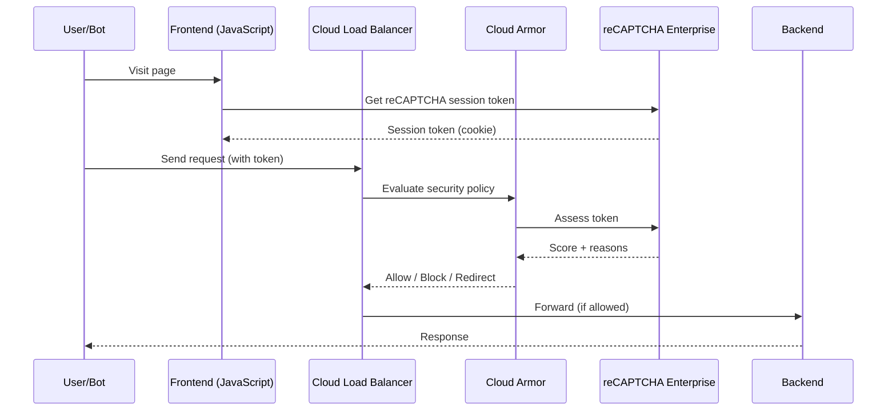

# How to Integrate reCAPTCHA Enterprise with Google Cloud Armor for Bot Management

Author: [nawazdhandala](https://www.github.com/nawazdhandala)

Tags: GCP, reCAPTCHA Enterprise, Cloud Armor, Bot Management, WAF

Description: Learn how to integrate reCAPTCHA Enterprise with Google Cloud Armor to create bot management policies that automatically block or challenge suspicious traffic at the edge.

---

Using reCAPTCHA Enterprise in your application code works, but it means bot traffic still reaches your servers. The bot request arrives, your backend calls the reCAPTCHA API, gets a low score, and then rejects the request. That is wasted compute, bandwidth, and latency.

A better approach is to push bot detection to the edge by integrating reCAPTCHA Enterprise with Cloud Armor. Cloud Armor evaluates reCAPTCHA tokens at the load balancer level, before traffic ever reaches your backend. Bots get blocked at the network edge, saving your servers from processing malicious requests.

## How the Integration Works

The flow combines reCAPTCHA action tokens or session tokens with Cloud Armor security policies:



There are two token types for WAF integration:

- **Session tokens**: Set as a cookie, automatically included with every request. Good for continuous protection.
- **Action tokens**: Generated for specific user actions (login, checkout). Good for protecting critical endpoints.

## Prerequisites

- A GCP project with both Cloud Armor and reCAPTCHA Enterprise APIs enabled
- An external HTTP(S) load balancer with backend services
- Cloud Armor Admin and reCAPTCHA Enterprise Admin roles

## Step 1: Create a WAF Site Key

WAF integration requires a specific type of reCAPTCHA key:

```bash
# Create a WAF-type reCAPTCHA Enterprise key for Cloud Armor integration
gcloud recaptcha keys create \
  --display-name="Cloud Armor WAF Key" \
  --web \
  --integration-type=SCORE \
  --waf-feature=SESSION_TOKEN \
  --waf-service=CA \
  --domains="example.com,www.example.com" \
  --project=PROJECT_ID
```

The `--waf-feature` flag specifies the token type:

- `SESSION_TOKEN` for session-based protection
- `ACTION_TOKEN` for action-specific protection
- `CHALLENGE_PAGE` for showing a challenge page to suspicious users

The `--waf-service=CA` tells reCAPTCHA this key is for Cloud Armor integration.

Save the key ID from the output.

## Step 2: Add the Session Token Script to Your Frontend

For session token integration, add the reCAPTCHA JavaScript that sets a session cookie:

```html
<!-- Load reCAPTCHA Enterprise session token script -->
<script src="https://www.google.com/recaptcha/enterprise.js?render=YOUR_WAF_SITE_KEY&waf=session" async defer></script>
```

This script automatically creates a `recaptcha-ca-t` cookie on the user's browser. Cloud Armor reads this cookie from incoming requests.

For action tokens on specific pages:

```html
<script src="https://www.google.com/recaptcha/enterprise.js?render=YOUR_WAF_SITE_KEY&waf=session"></script>

<script>
// Generate an action token when the user clicks login
async function handleLogin() {
    grecaptcha.enterprise.ready(async function() {
        const token = await grecaptcha.enterprise.execute('YOUR_WAF_SITE_KEY', {
            action: 'login'
        });

        // Include the action token as a request header
        const response = await fetch('/api/login', {
            method: 'POST',
            headers: {
                'X-Recaptcha-Token': token,
                'Content-Type': 'application/json',
            },
            body: JSON.stringify({
                username: document.getElementById('username').value,
                password: document.getElementById('password').value,
            }),
        });
    });
}
</script>
```

## Step 3: Create a Cloud Armor Security Policy

Now create a Cloud Armor security policy that evaluates reCAPTCHA tokens:

```bash
# Create a Cloud Armor security policy
gcloud compute security-policies create recaptcha-bot-policy \
  --description="Bot management policy with reCAPTCHA Enterprise" \
  --project=PROJECT_ID

# Associate the reCAPTCHA key with the security policy
gcloud compute security-policies update recaptcha-bot-policy \
  --recaptcha-redirect-site-key=YOUR_WAF_SITE_KEY \
  --project=PROJECT_ID
```

## Step 4: Add Bot Management Rules

Now add rules to the security policy that take action based on reCAPTCHA scores:

```bash
# Rule 1: Block requests with very low scores (likely bots)
gcloud compute security-policies rules create 1000 \
  --security-policy=recaptcha-bot-policy \
  --expression="recaptcha.score < 0.2" \
  --action=deny-403 \
  --description="Block high-confidence bots" \
  --project=PROJECT_ID

# Rule 2: Redirect suspicious requests to a reCAPTCHA challenge page
gcloud compute security-policies rules create 2000 \
  --security-policy=recaptcha-bot-policy \
  --expression="recaptcha.score < 0.5" \
  --action=redirect \
  --redirect-type=GOOGLE_RECAPTCHA \
  --description="Challenge suspicious traffic" \
  --project=PROJECT_ID

# Rule 3: Allow good traffic through
gcloud compute security-policies rules create 3000 \
  --security-policy=recaptcha-bot-policy \
  --expression="recaptcha.score >= 0.5" \
  --action=allow \
  --description="Allow likely human traffic" \
  --project=PROJECT_ID
```

The `redirect` action with `GOOGLE_RECAPTCHA` type shows an interstitial challenge page. Users who pass the challenge get a new token with a higher score and are allowed through.

## Step 5: Add Action-Specific Rules

You can create rules that target specific reCAPTCHA actions:

```bash
# Block bots specifically on the login endpoint
gcloud compute security-policies rules create 1500 \
  --security-policy=recaptcha-bot-policy \
  --expression="recaptcha.action == 'login' && recaptcha.score < 0.4" \
  --action=deny-403 \
  --description="Block bots on login" \
  --project=PROJECT_ID

# Stricter rules for checkout (financial risk)
gcloud compute security-policies rules create 1600 \
  --security-policy=recaptcha-bot-policy \
  --expression="recaptcha.action == 'checkout' && recaptcha.score < 0.6" \
  --action=redirect \
  --redirect-type=GOOGLE_RECAPTCHA \
  --description="Challenge suspicious checkout attempts" \
  --project=PROJECT_ID
```

## Step 6: Attach the Policy to Your Backend Service

Apply the security policy to your load balancer's backend service:

```bash
# Attach the security policy to a backend service
gcloud compute backend-services update my-web-backend \
  --security-policy=recaptcha-bot-policy \
  --global \
  --project=PROJECT_ID
```

## Step 7: Combine with Other Cloud Armor Rules

reCAPTCHA rules work alongside other Cloud Armor rules. Here is a complete policy that combines bot management with other protections:

```bash
# Rate limiting rule - applies before reCAPTCHA evaluation
gcloud compute security-policies rules create 500 \
  --security-policy=recaptcha-bot-policy \
  --expression="true" \
  --action=rate-based-ban \
  --rate-limit-threshold-count=100 \
  --rate-limit-threshold-interval-sec=60 \
  --ban-duration-sec=600 \
  --description="Rate limit all traffic" \
  --project=PROJECT_ID

# Block known bad IP ranges
gcloud compute security-policies rules create 600 \
  --security-policy=recaptcha-bot-policy \
  --src-ip-ranges="198.51.100.0/24" \
  --action=deny-403 \
  --description="Block known malicious IPs" \
  --project=PROJECT_ID

# Geographic restriction
gcloud compute security-policies rules create 700 \
  --security-policy=recaptcha-bot-policy \
  --expression="origin.region_code != 'US' && origin.region_code != 'CA'" \
  --action=deny-403 \
  --description="Only allow US and Canada" \
  --project=PROJECT_ID

# reCAPTCHA bot detection (lower priority, evaluated after above rules)
gcloud compute security-policies rules create 1000 \
  --security-policy=recaptcha-bot-policy \
  --expression="recaptcha.score < 0.2" \
  --action=deny-403 \
  --description="Block confirmed bots" \
  --project=PROJECT_ID
```

## Terraform Configuration

Here is the full setup in Terraform:

```hcl
# reCAPTCHA Enterprise WAF key
resource "google_recaptcha_enterprise_key" "waf_key" {
  display_name = "Cloud Armor WAF Key"
  project      = var.project_id

  web_settings {
    integration_type = "SCORE"
    allowed_domains  = ["example.com", "www.example.com"]
  }

  waf_settings {
    waf_feature = "SESSION_TOKEN"
    waf_service = "CA"
  }
}

# Cloud Armor security policy with reCAPTCHA
resource "google_compute_security_policy" "bot_policy" {
  name    = "recaptcha-bot-policy"
  project = var.project_id

  recaptcha_options_config {
    redirect_site_key = google_recaptcha_enterprise_key.waf_key.id
  }

  # Block confirmed bots
  rule {
    action   = "deny(403)"
    priority = 1000
    match {
      expr {
        expression = "recaptcha.score < 0.2"
      }
    }
    description = "Block confirmed bots"
  }

  # Challenge suspicious traffic
  rule {
    action   = "redirect"
    priority = 2000
    match {
      expr {
        expression = "recaptcha.score < 0.5"
      }
    }
    redirect_options {
      type = "GOOGLE_RECAPTCHA"
    }
    description = "Challenge suspicious traffic"
  }

  # Default allow
  rule {
    action   = "allow"
    priority = 2147483647
    match {
      versioned_expr = "SRC_IPS_V1"
      config {
        src_ip_ranges = ["*"]
      }
    }
    description = "Default allow"
  }
}
```

## Monitoring Bot Traffic

After deployment, monitor the effectiveness through Cloud Armor logs:

```bash
# View Cloud Armor logs showing reCAPTCHA evaluations
gcloud logging read '
  resource.type="http_load_balancer" AND
  jsonPayload.enforcedSecurityPolicy.name="recaptcha-bot-policy"
' --project=PROJECT_ID --limit=50
```

Look at the `recaptchaActionToken` and `recaptchaSessionToken` fields in the logs to see scores and how rules were applied.

## Summary

Integrating reCAPTCHA Enterprise with Cloud Armor pushes bot detection to the edge, blocking malicious traffic before it reaches your servers. Create a WAF-type site key, add the session token script to your frontend, create Cloud Armor rules based on reCAPTCHA scores, and combine with rate limiting and IP-based rules for layered protection. The challenge page redirect feature provides a graceful fallback for borderline requests, letting legitimate users through while stopping automated traffic.
