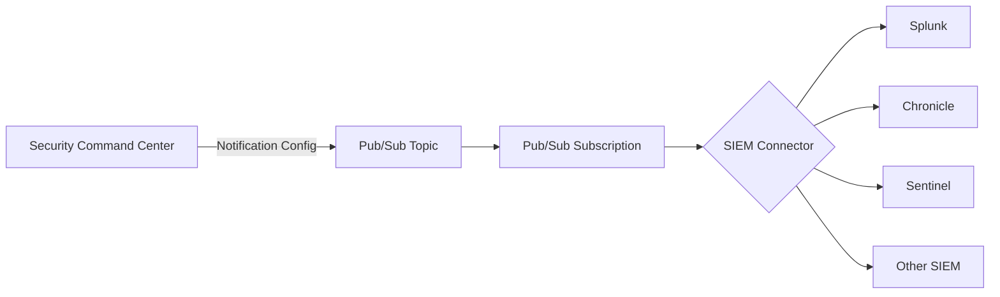

# How to Integrate Security Command Center with SIEM Tools via Pub/Sub

Author: [nawazdhandala](https://www.github.com/nawazdhandala)

Tags: GCP, Security Command Center, SIEM, Pub/Sub, Cloud Security

Description: A practical guide to integrating Google Cloud Security Command Center with SIEM tools like Splunk, Chronicle, and Sentinel using Pub/Sub as the message broker.

---

Most security teams do not live in the Google Cloud Console. They live in their SIEM - whether that is Splunk, Chronicle, Microsoft Sentinel, or something else. If your organization runs workloads on GCP, you need Security Command Center findings flowing into whatever SIEM your SOC team uses. Otherwise, GCP security alerts exist in a silo that nobody monitors.

The integration path is consistent regardless of which SIEM you use: Security Command Center publishes findings to Pub/Sub, and then your SIEM pulls from that Pub/Sub subscription. The SIEM-specific part is just the last mile - how you get data from Pub/Sub into the tool.

Let me walk through the full setup.

## Architecture

Here is how the data flows:



## Step 1: Set Up the Pub/Sub Infrastructure

Create a dedicated topic and subscription for your SIEM integration.

```bash
# Create the Pub/Sub topic for SIEM integration
gcloud pubsub topics create scc-siem-feed \
  --project=my-security-project

# Create a pull subscription (most SIEM connectors use pull mode)
gcloud pubsub subscriptions create scc-siem-subscription \
  --topic=scc-siem-feed \
  --ack-deadline=120 \
  --message-retention-duration=7d \
  --project=my-security-project
```

I set a 7-day message retention so that if your SIEM connector goes down for a weekend, you do not lose findings. The 120-second ack deadline gives the connector enough time to process each message.

## Step 2: Grant SCC Permission to Publish

```bash
# Get your org ID
ORG_ID=$(gcloud organizations list --format="value(ID)" --limit=1)

# Grant SCC the ability to publish to the topic
gcloud pubsub topics add-iam-policy-binding scc-siem-feed \
  --member="serviceAccount:service-org-${ORG_ID}@security-center-api.iam.gserviceaccount.com" \
  --role="roles/pubsub.publisher" \
  --project=my-security-project
```

## Step 3: Create the SCC Notification Config

Configure SCC to push findings to the topic. For SIEM integration, you typically want all findings since the SIEM will handle filtering and correlation.

```bash
# Export all active findings to the SIEM topic
gcloud scc notifications create siem-export \
  --organization=$ORG_ID \
  --pubsub-topic=projects/my-security-project/topics/scc-siem-feed \
  --filter='state="ACTIVE"'
```

## Step 4: Create a Service Account for the SIEM

Your SIEM connector needs a service account to pull messages from Pub/Sub.

```bash
# Create a service account for the SIEM connector
gcloud iam service-accounts create siem-connector \
  --display-name="SIEM Pub/Sub Connector" \
  --project=my-security-project

# Grant it permission to subscribe and consume messages
gcloud pubsub subscriptions add-iam-policy-binding scc-siem-subscription \
  --member="serviceAccount:siem-connector@my-security-project.iam.gserviceaccount.com" \
  --role="roles/pubsub.subscriber" \
  --project=my-security-project

# Create and download a key for the service account
gcloud iam service-accounts keys create siem-key.json \
  --iam-account=siem-connector@my-security-project.iam.gserviceaccount.com
```

Keep that key file secure. It is the credential your SIEM uses to authenticate with GCP.

## Integration with Splunk

Splunk has a Google Cloud Platform add-on that can pull directly from Pub/Sub.

1. Install the "Splunk Add-on for Google Cloud Platform" from Splunkbase
2. Configure the add-on with the service account key
3. Set up a Pub/Sub input pointing to your subscription

In Splunk, configure the input like this:

```
[pubsub://scc-findings]
google_credentials_name = gcp_siem_connector
google_project_id = my-security-project
google_subscriptions = scc-siem-subscription
index = gcp_security
sourcetype = google:gcp:scc:finding
```

Once data flows, create Splunk alerts for high-severity findings:

```spl
# Splunk search to alert on critical SCC findings
index=gcp_security sourcetype="google:gcp:scc:finding"
| spath output=severity path=finding.severity
| spath output=category path=finding.category
| where severity="CRITICAL" OR severity="HIGH"
| stats count by category, severity
| sort -count
```

## Integration with Chronicle

Chronicle (Google's own SIEM) has native integration with SCC. You can set it up directly without the Pub/Sub middleman, but the Pub/Sub approach gives you more control.

For Chronicle, use the Chronicle Forwarder:

```yaml
# Chronicle forwarder configuration
collectors:
  - pubsub:
      subscription:
        project_id: my-security-project
        subscription_id: scc-siem-subscription
      log_type: GCP_SECURITY_COMMAND_CENTER
      service_account_key: /path/to/siem-key.json
```

## Integration with Microsoft Sentinel

Microsoft Sentinel has a GCP connector that pulls SCC findings via Pub/Sub.

1. In the Azure Portal, go to Microsoft Sentinel > Data connectors
2. Search for "Google Cloud Platform Security Command Center"
3. Configure the connector with your GCP project ID and service account credentials
4. Map the Pub/Sub subscription

Alternatively, use a Logic App to pull from Pub/Sub:

```json
{
  "trigger": {
    "type": "Recurrence",
    "recurrence": {
      "frequency": "Minute",
      "interval": 1
    }
  },
  "actions": {
    "Pull_PubSub_Messages": {
      "type": "Http",
      "inputs": {
        "method": "POST",
        "uri": "https://pubsub.googleapis.com/v1/projects/my-security-project/subscriptions/scc-siem-subscription:pull",
        "body": {
          "maxMessages": 100
        },
        "authentication": {
          "type": "ManagedServiceIdentity"
        }
      }
    }
  }
}
```

## Integration with Generic SIEMs

For any SIEM that can receive syslog or HTTP webhooks, use a Cloud Function as a bridge.

```python
import base64
import json
import requests

# Webhook URL for your SIEM's HTTP event collector
SIEM_WEBHOOK = "https://my-siem.example.com/api/events"
SIEM_API_KEY = "your-api-key"

def forward_to_siem(event, context):
    """Forward SCC findings from Pub/Sub to a generic SIEM via webhook."""

    # Decode the Pub/Sub message
    raw_data = base64.b64decode(event['data']).decode('utf-8')
    finding_data = json.loads(raw_data)

    finding = finding_data.get('finding', {})

    # Transform into a format your SIEM expects
    siem_event = {
        'source': 'gcp-scc',
        'event_type': 'security_finding',
        'severity': finding.get('severity', 'UNKNOWN'),
        'category': finding.get('category', ''),
        'resource': finding.get('resourceName', ''),
        'description': finding.get('description', ''),
        'timestamp': finding.get('eventTime', ''),
        'raw': finding_data
    }

    # Post to SIEM webhook
    headers = {
        'Authorization': f'Bearer {SIEM_API_KEY}',
        'Content-Type': 'application/json'
    }
    response = requests.post(SIEM_WEBHOOK, json=siem_event, headers=headers)
    response.raise_for_status()

    return "OK"
```

## Testing the Integration

After setting everything up, verify data is flowing end to end.

```bash
# Check that messages are being published to the topic
gcloud pubsub topics list-subscriptions scc-siem-feed \
  --project=my-security-project

# Pull a test message to verify format
gcloud pubsub subscriptions pull scc-siem-subscription \
  --project=my-security-project \
  --limit=1 \
  --format=json
```

## Monitoring the Pipeline

Set up monitoring to ensure your SIEM integration stays healthy.

```bash
# Create an alert policy for subscription backlog
gcloud monitoring policies create \
  --notification-channels=CHANNEL_ID \
  --display-name="SCC SIEM Subscription Backlog" \
  --condition-display-name="Messages piling up" \
  --condition-filter='resource.type="pubsub_subscription" AND metric.type="pubsub.googleapis.com/subscription/num_undelivered_messages"' \
  --condition-threshold-value=1000 \
  --condition-threshold-duration=300s \
  --project=my-security-project
```

If messages start piling up in the subscription, it means your SIEM connector is not keeping up or has stopped working.

## Conclusion

Integrating SCC with your SIEM is a fundamental piece of cloud security operations. The Pub/Sub layer makes it SIEM-agnostic - you set up the GCP side once, and then connect whatever SIEM your team uses on the other end. The key is to monitor the pipeline health, keep the service account credentials rotated, and make sure your SIEM team knows how to interpret the SCC finding format. Once this pipeline is running, your SOC gets real-time visibility into GCP security events alongside everything else they monitor.
