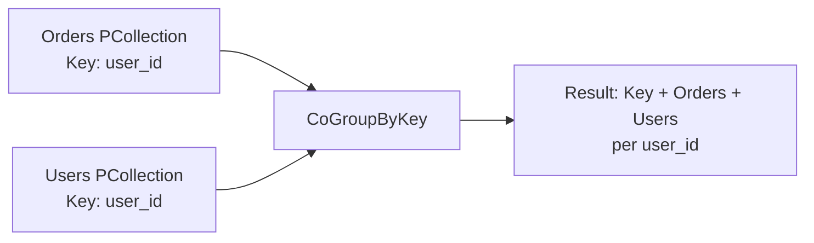

# How to Join Two PCollections in Apache Beam Using CoGroupByKey

Author: [nawazdhandala](https://www.github.com/nawazdhandala)

Tags: GCP, Google Cloud Dataflow, Apache Beam, Data Joins, CoGroupByKey

Description: Learn how to join two PCollections in Apache Beam using CoGroupByKey for implementing inner joins, left joins, and multi-way joins in Dataflow pipelines.

---

Joining datasets is a fundamental data processing operation. In a relational database, you write a SQL JOIN statement. In Apache Beam, the equivalent operation is `CoGroupByKey`. It takes two or more keyed PCollections and groups all values by key, giving you access to values from both collections for each key.

While the concept is simple, the implementation has nuances that are easy to get wrong. Let me show you how to do it correctly for different join types.

## How CoGroupByKey Works

`CoGroupByKey` takes multiple `KV` PCollections that share the same key type and produces a single PCollection where each element contains the key and an iterable of values from each input.

Think of it like a SQL `FULL OUTER JOIN` at the core, with your DoFn logic determining whether it behaves like an inner join, left join, or something else.



## Basic Inner Join

Here is a complete example that joins orders with user profiles.

```java
// Define TupleTags for each input collection
final TupleTag<Order> ordersTag = new TupleTag<Order>() {};
final TupleTag<UserProfile> usersTag = new TupleTag<UserProfile>() {};

// Key both collections by user_id
PCollection<KV<String, Order>> keyedOrders = orders
    .apply("KeyOrdersByUser", MapElements.via(
        new SimpleFunction<Order, KV<String, Order>>() {
            @Override
            public KV<String, Order> apply(Order order) {
                return KV.of(order.getUserId(), order);
            }
        }));

PCollection<KV<String, UserProfile>> keyedUsers = users
    .apply("KeyUsersByUser", MapElements.via(
        new SimpleFunction<UserProfile, KV<String, UserProfile>>() {
            @Override
            public KV<String, UserProfile> apply(UserProfile user) {
                return KV.of(user.getUserId(), user);
            }
        }));

// Perform the CoGroupByKey
PCollection<KV<String, CoGbkResult>> joined = KeyedPCollectionTuple
    .of(ordersTag, keyedOrders)
    .and(usersTag, keyedUsers)
    .apply("JoinOrdersAndUsers", CoGroupByKey.create());

// Process the joined result - inner join logic
PCollection<EnrichedOrder> enrichedOrders = joined
    .apply("InnerJoin", ParDo.of(
        new DoFn<KV<String, CoGbkResult>, EnrichedOrder>() {
            @ProcessElement
            public void processElement(ProcessContext c) {
                String userId = c.element().getKey();
                CoGbkResult result = c.element().getValue();

                // Get values from each side
                Iterable<Order> userOrders = result.getAll(ordersTag);
                Iterable<UserProfile> userProfiles = result.getAll(usersTag);

                // Get the user profile (should be exactly one)
                UserProfile profile = null;
                for (UserProfile p : userProfiles) {
                    profile = p;
                    break;  // Take the first (and presumably only) profile
                }

                // Inner join: only output if both sides have data
                if (profile != null) {
                    for (Order order : userOrders) {
                        c.output(new EnrichedOrder(order, profile));
                    }
                }
                // Orders without matching users are dropped (inner join)
            }
        }));
```

## Left Join

A left join keeps all records from the left collection, even if there is no match on the right side.

```java
// Left join: keep all orders, even without matching user profiles
PCollection<EnrichedOrder> leftJoined = joined
    .apply("LeftJoin", ParDo.of(
        new DoFn<KV<String, CoGbkResult>, EnrichedOrder>() {
            @ProcessElement
            public void processElement(ProcessContext c) {
                String userId = c.element().getKey();
                CoGbkResult result = c.element().getValue();

                Iterable<Order> userOrders = result.getAll(ordersTag);
                Iterable<UserProfile> userProfiles = result.getAll(usersTag);

                // Get profile, or use a default
                UserProfile profile = null;
                for (UserProfile p : userProfiles) {
                    profile = p;
                    break;
                }

                // Output all orders regardless of whether we found a profile
                for (Order order : userOrders) {
                    if (profile != null) {
                        c.output(new EnrichedOrder(order, profile));
                    } else {
                        // No matching profile - use default values
                        c.output(new EnrichedOrder(order,
                            UserProfile.unknown(userId)));
                    }
                }
            }
        }));
```

## Full Outer Join

A full outer join keeps records from both sides, even when there is no match.

```java
// Full outer join: keep everything from both sides
PCollection<JoinedRecord> fullOuter = joined
    .apply("FullOuterJoin", ParDo.of(
        new DoFn<KV<String, CoGbkResult>, JoinedRecord>() {
            @ProcessElement
            public void processElement(ProcessContext c) {
                String userId = c.element().getKey();
                CoGbkResult result = c.element().getValue();

                List<Order> orderList = new ArrayList<>();
                for (Order o : result.getAll(ordersTag)) {
                    orderList.add(o);
                }

                List<UserProfile> profileList = new ArrayList<>();
                for (UserProfile p : result.getAll(usersTag)) {
                    profileList.add(p);
                }

                if (!orderList.isEmpty() && !profileList.isEmpty()) {
                    // Both sides have data - produce matched records
                    for (Order order : orderList) {
                        c.output(new JoinedRecord(userId, order, profileList.get(0)));
                    }
                } else if (!orderList.isEmpty()) {
                    // Only orders exist - no matching user
                    for (Order order : orderList) {
                        c.output(JoinedRecord.orderOnly(userId, order));
                    }
                } else {
                    // Only profiles exist - no orders
                    for (UserProfile profile : profileList) {
                        c.output(JoinedRecord.profileOnly(userId, profile));
                    }
                }
            }
        }));
```

## Multi-Way Joins

CoGroupByKey supports joining more than two collections. Just add more tags.

```java
// Three-way join: orders + users + products
final TupleTag<Order> ordersTag = new TupleTag<Order>() {};
final TupleTag<UserProfile> usersTag = new TupleTag<UserProfile>() {};
final TupleTag<Product> productsTag = new TupleTag<Product>() {};

// All three collections keyed by product_id for this example
PCollection<KV<String, CoGbkResult>> threeWayJoin = KeyedPCollectionTuple
    .of(ordersTag, keyedOrders)
    .and(usersTag, keyedUsers)
    .and(productsTag, keyedProducts)
    .apply("ThreeWayJoin", CoGroupByKey.create());

threeWayJoin.apply("ProcessJoin", ParDo.of(
    new DoFn<KV<String, CoGbkResult>, FullRecord>() {
        @ProcessElement
        public void processElement(ProcessContext c) {
            CoGbkResult result = c.element().getValue();

            Iterable<Order> orders = result.getAll(ordersTag);
            Iterable<UserProfile> users = result.getAll(usersTag);
            Iterable<Product> products = result.getAll(productsTag);

            // Process the three-way join result
            // ...
        }
    }));
```

## Performance Considerations

CoGroupByKey triggers a shuffle operation. All data for a given key must be sent to the same worker. This has important implications.

**Hot keys are dangerous.** If one key has millions of values on one side, that single key's data must fit in memory on one worker. A user with 10 million orders will cause problems.

```java
// Monitor for hot keys by adding a counter
@ProcessElement
public void processElement(ProcessContext c) {
    CoGbkResult result = c.element().getValue();

    long orderCount = 0;
    for (Order o : result.getAll(ordersTag)) {
        orderCount++;
    }

    // Log a warning for keys with unexpectedly many values
    if (orderCount > 100000) {
        LOG.warn("Hot key detected: {} with {} orders",
            c.element().getKey(), orderCount);
        hotKeyCounter.inc();
    }
}
```

**Key cardinality matters.** Joining on a low-cardinality key (like country code with only ~200 values) means all data gets concentrated on a few workers. If possible, join on a higher-cardinality key.

**Prefer side inputs for small-to-large joins.** If one collection is small enough to fit in memory (a few GB), use it as a side input instead of CoGroupByKey. Side inputs avoid the shuffle entirely.

```java
// For small lookup tables, side inputs are faster than CoGroupByKey
PCollectionView<Map<String, UserProfile>> usersView = keyedUsers
    .apply("AsMap", View.asMap());

PCollection<EnrichedOrder> enriched = orders
    .apply("LookupUser", ParDo.of(
        new DoFn<Order, EnrichedOrder>() {
            @ProcessElement
            public void processElement(ProcessContext c) {
                Order order = c.element();
                Map<String, UserProfile> users = c.sideInput(usersView);
                UserProfile profile = users.get(order.getUserId());
                if (profile != null) {
                    c.output(new EnrichedOrder(order, profile));
                }
            }
        }).withSideInputs(usersView));
```

## Windowed Joins in Streaming

In streaming pipelines, both PCollections must have compatible windows for CoGroupByKey to work. Elements are only joined within the same window.

```java
// Both sides must be windowed the same way for streaming joins
PCollection<KV<String, Order>> windowedOrders = keyedOrders
    .apply("WindowOrders", Window.into(
        FixedWindows.of(Duration.standardMinutes(5))));

PCollection<KV<String, UserProfile>> windowedUsers = keyedUsers
    .apply("WindowUsers", Window.into(
        FixedWindows.of(Duration.standardMinutes(5))));

// Now CoGroupByKey joins within each 5-minute window
PCollection<KV<String, CoGbkResult>> windowedJoin = KeyedPCollectionTuple
    .of(ordersTag, windowedOrders)
    .and(usersTag, windowedUsers)
    .apply("WindowedJoin", CoGroupByKey.create());
```

Be careful with windowed joins in streaming. If user profile updates arrive in a different window than the orders, they will not join. You may need to use session windows or global windows with triggers depending on your use case.

CoGroupByKey is the workhorse for joining data in Apache Beam. It is more verbose than a SQL JOIN, but it gives you complete control over join semantics. For production pipelines, always handle the cases where one side might be empty, monitor for hot keys, and consider side inputs when one collection is significantly smaller than the other.
