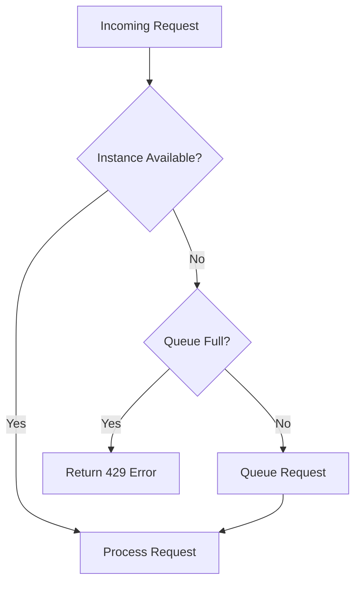

# How to Limit Cloud Run Autoscaling Max Instances to Control Costs During Traffic Spikes

Author: [nawazdhandala](https://www.github.com/nawazdhandala)

Tags: GCP, Cloud Run, Autoscaling, Cost Control, Max Instances, Google Cloud

Description: Learn how to set Cloud Run max instances to control costs during traffic spikes and prevent runaway scaling from draining your budget.

---

Cloud Run autoscaling is a double-edged sword. On one hand, it scales up automatically when traffic increases, keeping your service responsive. On the other hand, an unexpected traffic spike - whether from a viral post, a bot attack, or a misconfigured client - can spin up hundreds of instances and generate a surprise bill.

Setting a max instances limit gives you a safety net. It caps how many instances Cloud Run can create, putting a ceiling on your costs even in worst-case scenarios. This guide covers how to choose the right limit, configure it, and handle the trade-offs.

## The Cost Risk

Let me put this in concrete numbers. Say your Cloud Run service uses 1 vCPU and 512 MiB of memory per instance. Without a max instances limit, Cloud Run can scale to 1000 instances (the default maximum). If all 1000 instances run for just one hour:

- 1000 instances x 1 vCPU x 3600 seconds = 3,600,000 vCPU-seconds
- At roughly $0.000024 per vCPU-second = about $86 per hour
- If the spike lasts 8 hours, that is around $690

That is for a single service. If you have multiple services scaling simultaneously, the numbers add up fast. A max instances limit of 50 instead of 1000 would cap that same hour at about $4.30.

## Setting Max Instances

### Using gcloud CLI

```bash
# Deploy with a max instances limit
gcloud run deploy my-service \
  --image=us-central1-docker.pkg.dev/MY_PROJECT/my-repo/my-app:latest \
  --region=us-central1 \
  --max-instances=50

# Update an existing service
gcloud run services update my-service \
  --region=us-central1 \
  --max-instances=50
```

### Using Service YAML

```yaml
# service.yaml - Cloud Run service with max instances limit
apiVersion: serving.knative.dev/v1
kind: Service
metadata:
  name: my-service
spec:
  template:
    metadata:
      annotations:
        # Limit to 50 instances maximum
        autoscaling.knative.dev/maxScale: "50"
    spec:
      containers:
        - image: us-central1-docker.pkg.dev/MY_PROJECT/my-repo/my-app:latest
          resources:
            limits:
              cpu: "1"
              memory: 512Mi
```

### Using Terraform

```hcl
# Cloud Run service with autoscaling limits
resource "google_cloud_run_v2_service" "my_service" {
  name     = "my-service"
  location = "us-central1"

  template {
    scaling {
      min_instance_count = 0
      max_instance_count = 50
    }

    containers {
      image = "us-central1-docker.pkg.dev/my-project/my-repo/my-app:latest"
      resources {
        limits = {
          cpu    = "1"
          memory = "512Mi"
        }
      }
    }
  }
}
```

## Choosing the Right Limit

The right max instances value depends on your traffic patterns, budget, and tolerance for request queuing. Here is a framework for deciding.

### Calculate from Expected Traffic

Start with your peak expected traffic:

1. **Peak requests per second (RPS)**: What is the highest legitimate traffic you expect?
2. **Average request duration**: How long does each request take to process?
3. **Concurrency setting**: How many requests can one instance handle simultaneously?

The formula:

```
Max instances = (Peak RPS x Average Duration) / Concurrency
```

Example: 500 RPS, 200ms average duration, concurrency of 80:

```
Max instances = (500 x 0.2) / 80 = 1.25 = 2 instances
```

Add a buffer (2-3x) for safety:

```
Recommended max instances = 2 x 3 = 6 instances
```

### Calculate from Budget

Work backward from your budget:

```bash
# Monthly budget: $100
# Cost per instance per hour (1 vCPU, 512 MiB): ~$0.086/hour
# Hours in a month: 730
# Max instances running 24/7: $100 / ($0.086 x 730) = ~1.6

# But instances do not run 24/7 - assume 20% average utilization:
# Max instances: $100 / ($0.086 x 730 x 0.2) = ~8 instances
```

So a budget of $100/month supports roughly 8 max instances assuming 20% average utilization.

### Common Baselines

Here are starting points for different service types:

| Service Type | Suggested Max Instances |
|-------------|------------------------|
| Internal API (low traffic) | 5-10 |
| Public API (moderate traffic) | 20-50 |
| Web frontend | 10-30 |
| Background worker | 5-20 |
| High-traffic API | 50-200 |

## What Happens When You Hit the Limit

When Cloud Run reaches the max instances limit and all instances are at full concurrency, new requests queue up. If the queue gets too long, requests start receiving 429 (Too Many Requests) errors.

The request flow looks like this:



To handle this gracefully in your client:

```python
# client.py - Handle 429 responses from Cloud Run with exponential backoff
import requests
import time

def call_service_with_retry(url, payload, max_retries=3):
    """Call a Cloud Run service with exponential backoff on 429 errors."""
    for attempt in range(max_retries):
        response = requests.post(url, json=payload)

        if response.status_code == 429:
            # Service is at capacity - back off and retry
            wait_time = (2 ** attempt) + 1  # 2s, 5s, 9s
            print(f"Service at capacity, retrying in {wait_time}s (attempt {attempt + 1})")
            time.sleep(wait_time)
            continue

        return response

    raise Exception(f"Service at capacity after {max_retries} retries")
```

## Combining Max Instances with Other Settings

Max instances works best when combined with other scaling controls:

```bash
# Full autoscaling configuration
gcloud run deploy my-service \
  --image=us-central1-docker.pkg.dev/MY_PROJECT/my-repo/my-app:latest \
  --region=us-central1 \
  --min-instances=1 \
  --max-instances=50 \
  --concurrency=80 \
  --cpu=1 \
  --memory=512Mi
```

- **min-instances**: Keeps warm instances to avoid cold starts
- **max-instances**: Caps scaling for cost control
- **concurrency**: Controls how many requests each instance handles

These three settings together define your scaling envelope:

- Minimum throughput: `min-instances x concurrency` requests
- Maximum throughput: `max-instances x concurrency` requests
- With concurrency 80 and max instances 50: up to 4,000 concurrent requests

## Setting Up Budget Alerts

Max instances is your first line of defense. Budget alerts are your second:

```bash
# Create a budget alert (using the billing API or console)
gcloud billing budgets create \
  --billing-account=BILLING_ACCOUNT_ID \
  --display-name="Cloud Run Budget" \
  --budget-amount=100 \
  --threshold-rules=percent=50 \
  --threshold-rules=percent=80 \
  --threshold-rules=percent=100
```

You can also set up alerts on the instance count metric:

```bash
# Create an alert when instance count exceeds a threshold
gcloud alpha monitoring policies create \
  --display-name="High Instance Count Alert" \
  --condition-display-name="Cloud Run instances > 40" \
  --condition-filter='resource.type="cloud_run_revision" AND metric.type="run.googleapis.com/container/instance_count"' \
  --condition-threshold-value=40 \
  --condition-threshold-comparison=COMPARISON_GT
```

## Per-Service Limits

Set different limits for different services based on their importance and cost profile:

```bash
# Critical production API - higher limit
gcloud run services update production-api \
  --region=us-central1 \
  --max-instances=100

# Internal tooling - lower limit
gcloud run services update internal-tool \
  --region=us-central1 \
  --max-instances=5

# Background worker - moderate limit
gcloud run services update worker \
  --region=us-central1 \
  --max-instances=20
```

## Monitoring Scaling Behavior

Track how your service scales to know if your limits are appropriate:

```bash
# View instance count over time
gcloud logging read '
  resource.type="cloud_run_revision"
  AND resource.labels.service_name="my-service"
  AND metric.type="run.googleapis.com/container/instance_count"
' --limit=20

# Check for 429 errors (indicates hitting the limit)
gcloud logging read '
  resource.type="cloud_run_revision"
  AND resource.labels.service_name="my-service"
  AND httpRequest.status=429
' --limit=20
```

If you frequently see 429 errors during normal traffic, your max instances limit is too low. If you never get close to the limit, you could lower it to reduce your maximum possible spend.

## Emergency Response

If a traffic spike is hitting your limit and causing 429 errors for legitimate users:

```bash
# Temporarily increase the limit
gcloud run services update my-service \
  --region=us-central1 \
  --max-instances=200
```

After the spike, lower it back:

```bash
# Return to normal limit
gcloud run services update my-service \
  --region=us-central1 \
  --max-instances=50
```

## Summary

Setting a max instances limit on Cloud Run is one of the simplest and most effective cost control measures you can implement. Calculate a reasonable limit based on your expected traffic and budget, set it on every service, and combine it with budget alerts for defense in depth. The trade-off is that extreme traffic spikes might cause 429 errors, but that is almost always preferable to an unbounded cloud bill. Review and adjust the limits periodically as your traffic patterns change.
