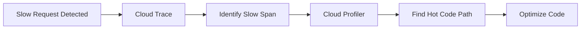

# How to Link Cloud Profiler Flame Graphs with Cloud Trace Spans on GCP

Author: [nawazdhandala](https://www.github.com/nawazdhandala)

Tags: GCP, Cloud Profiler, Cloud Trace, Flame Graphs, Performance, Observability

Description: Learn how to connect Cloud Profiler flame graphs with Cloud Trace spans to get a complete view of application performance on Google Cloud Platform.

---

Performance debugging on GCP often involves two separate tools: Cloud Trace for understanding request latency and Cloud Profiler for understanding where CPU time and memory are spent. Trace tells you that a request took 500ms, and Profiler tells you that 60% of your CPU time is spent in a particular function. But using them separately means you are always missing half the picture.

Linking these two tools together gives you the ability to go from a slow trace span to the exact code path that caused it. This post shows how to set up both tools and connect them for a complete performance debugging workflow.

## Cloud Trace vs Cloud Profiler

Before diving in, let us clarify what each tool does.

**Cloud Trace** captures distributed traces - it follows a request as it travels through your services, recording timing information at each step. A trace consists of spans, where each span represents an operation (an HTTP call, a database query, a function execution). Trace is great for answering "which part of the request lifecycle is slow?"

**Cloud Profiler** uses statistical sampling to build flame graphs of your application's CPU usage, memory allocation, and other resource consumption. Profiler runs continuously with minimal overhead and is great for answering "which functions are using the most resources?"

The connection between them: when a trace shows a slow span, you can use Profiler's flame graph for the same service and time period to understand exactly which code is consuming the time.



## Setting Up Cloud Trace

First, enable the Trace API and instrument your application. Here is a Python example using the OpenTelemetry SDK, which is the recommended approach:

```bash
# Enable the Cloud Trace API
gcloud services enable cloudtrace.googleapis.com --project=my-project

# Install the required packages
pip install opentelemetry-api opentelemetry-sdk opentelemetry-exporter-gcp-trace
```

Instrument your application:

```python
from opentelemetry import trace
from opentelemetry.sdk.trace import TracerProvider
from opentelemetry.sdk.trace.export import BatchSpanProcessor
from opentelemetry.exporter.cloud_trace import CloudTraceSpanExporter
from opentelemetry.sdk.resources import Resource

def setup_tracing():
    """Initialize OpenTelemetry tracing with Cloud Trace exporter."""
    # Create a resource that identifies this service
    resource = Resource.create({
        "service.name": "order-service",
        "service.version": "1.0.0",
    })

    # Set up the tracer provider
    provider = TracerProvider(resource=resource)

    # Export spans to Cloud Trace
    exporter = CloudTraceSpanExporter(project_id="my-project")
    processor = BatchSpanProcessor(exporter)
    provider.add_span_processor(processor)

    trace.set_tracer_provider(provider)
    return trace.get_tracer("order-service")

# Initialize tracing at application startup
tracer = setup_tracing()

# Use the tracer in your code
def process_order(order_id):
    """Process an order with tracing instrumentation."""
    with tracer.start_as_current_span("process_order") as span:
        span.set_attribute("order.id", order_id)

        # Database query
        with tracer.start_as_current_span("fetch_order_from_db"):
            order = db.fetch_order(order_id)

        # Payment processing
        with tracer.start_as_current_span("process_payment") as payment_span:
            payment_span.set_attribute("payment.amount", order.total)
            result = payment_service.charge(order)

        # Inventory update
        with tracer.start_as_current_span("update_inventory"):
            inventory_service.reserve(order.items)

        return result
```

## Setting Up Cloud Profiler

Cloud Profiler requires minimal setup. Add the profiling agent to your application:

```bash
# Install the Cloud Profiler agent
pip install google-cloud-profiler
```

Initialize the profiler at application startup:

```python
import googlecloudprofiler

def setup_profiler():
    """Initialize Cloud Profiler for continuous profiling."""
    try:
        googlecloudprofiler.start(
            service="order-service",
            service_version="1.0.0",
            project_id="my-project",
            # Enable different profile types
            verbose=0,
        )
        print("Cloud Profiler initialized")
    except (ValueError, NotImplementedError) as e:
        print(f"Could not initialize Cloud Profiler: {e}")

# Call at application startup
setup_profiler()
```

For Go applications, the setup is similar:

```go
package main

import (
    "cloud.google.com/go/profiler"
    "log"
)

func initProfiler() {
    // Configure and start the profiler
    cfg := profiler.Config{
        Service:        "order-service",
        ServiceVersion: "1.0.0",
        ProjectID:      "my-project",
        // MutexProfiling enables contention profiling
        MutexProfiling: true,
    }

    if err := profiler.Start(cfg); err != nil {
        log.Fatalf("Failed to start profiler: %v", err)
    }
}
```

## Connecting Traces and Profiles

The connection between Cloud Trace and Cloud Profiler happens through shared metadata: the service name and the time window. When you find a slow span in Cloud Trace, you can look at the corresponding Cloud Profiler data for the same service during the same time period.

Here is the workflow:

**Step 1: Find a slow trace in Cloud Trace.**

Go to the Cloud Console, navigate to Trace, and look at the latency distribution. Click on a slow trace to see its spans. Identify the span that is taking the most time.

```bash
# You can also query traces programmatically
gcloud trace traces list \
  --project=my-project \
  --filter='span:"process_payment" AND latency>"500ms"' \
  --limit=10
```

**Step 2: Note the service name and time window.**

When you click on a slow span, note the service name (for example, "order-service") and the timestamp. You need a time window around that timestamp - typically a few minutes on either side.

**Step 3: Open Cloud Profiler for the same service and time.**

Navigate to Cloud Profiler in the Console. Select the same service ("order-service") and adjust the time range to match the period of the slow trace. The flame graph will show you which functions consumed the most CPU during that time.

**Step 4: Correlate the flame graph with the trace span.**

If the slow span was "process_payment" and the flame graph shows that 40% of CPU time was in a JSON serialization function within the payment processing code, you have found your bottleneck.

## Adding Custom Span Attributes for Better Correlation

To make the connection between traces and profiles easier, add attributes to your spans that match profiler labels:

```python
import os

def process_order(order_id):
    """Process an order with enriched span attributes."""
    with tracer.start_as_current_span("process_order") as span:
        # Add attributes that help correlate with profiler data
        span.set_attribute("service.name", "order-service")
        span.set_attribute("service.version", "1.0.0")
        span.set_attribute("host.name", os.environ.get("HOSTNAME", "unknown"))
        span.set_attribute("order.id", order_id)

        # The function name in the span helps you find it in the flame graph
        with tracer.start_as_current_span("db_query.fetch_order") as db_span:
            db_span.set_attribute("db.system", "postgresql")
            db_span.set_attribute("db.statement", "SELECT * FROM orders WHERE id = ?")
            order = db.fetch_order(order_id)

        return order
```

## Automating the Correlation

You can build a script that automatically links slow traces to profiler data:

```python
from google.cloud import trace_v2
from datetime import datetime, timedelta

def find_slow_traces_and_profile(project_id, service_name, min_latency_ms=500):
    """Find slow traces and link them to profiler data."""
    trace_client = trace_v2.TraceServiceClient()

    # Query for slow traces in the last hour
    now = datetime.utcnow()
    start_time = now - timedelta(hours=1)

    # List traces that exceed the latency threshold
    traces = trace_client.list_traces(
        request={
            "project_id": project_id,
            "start_time": start_time,
            "end_time": now,
            "filter": f'span_name:"{service_name}" AND latency>"{min_latency_ms}ms"',
        }
    )

    for t in traces:
        # Find the slowest span in each trace
        slowest_span = None
        max_duration = 0

        for span in t.spans:
            duration = (span.end_time - span.start_time).total_seconds() * 1000
            if duration > max_duration:
                max_duration = duration
                slowest_span = span

        if slowest_span:
            print(f"\nSlow trace: {t.trace_id}")
            print(f"  Slowest span: {slowest_span.display_name.value}")
            print(f"  Duration: {max_duration:.0f}ms")
            print(f"  Time: {slowest_span.start_time}")
            print(f"  Profiler link: https://console.cloud.google.com/profiler/"
                  f"{service_name};timespan={slowest_span.start_time.isoformat()}"
                  f"?project={project_id}")

find_slow_traces_and_profile("my-project", "order-service", min_latency_ms=500)
```

## Best Practices for Using Both Tools Together

1. **Use the same service name** in both Trace and Profiler. This is the primary link between the two.

2. **Include function names in span names.** When a span is named `db_query.fetch_order`, you can quickly find `fetch_order` in the flame graph.

3. **Profile in production.** Cloud Profiler has very low overhead (typically under 5% CPU). Running it in production gives you flame graphs that reflect real workloads, not synthetic benchmarks.

4. **Use the Profiler comparison feature.** You can compare flame graphs between two time periods. Compare the period when traces were slow versus when they were fast to spot the difference.

5. **Add version labels.** Both tools support version labels. When a new deployment causes latency regression, you can compare the flame graph of the new version against the old one.

## Summary

Cloud Trace and Cloud Profiler are more powerful together than either one alone. Trace tells you where time is being spent at the request level, and Profiler tells you where time is being spent at the code level. By using the same service name and time window, you can move seamlessly from a slow trace to the exact line of code that is causing the problem. Set up both tools on your critical services and practice the correlation workflow - it turns performance debugging from guesswork into a systematic process.
