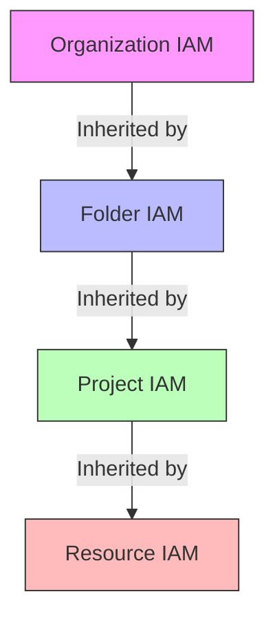

# How to Manage IAM Roles and Permissions at the Organization Level in GCP

Author: [nawazdhandala](https://www.github.com/nawazdhandala)

Tags: GCP, IAM, Organization, Permissions, Security, Google Cloud

Description: A practical guide to managing IAM roles and permissions at the Google Cloud organization level for consistent access control across all projects and folders.

---

IAM at the project level works fine when you have five projects. When you have fifty, managing permissions on each project individually becomes a full-time job and a constant source of security gaps. Organization-level IAM lets you set permissions once and have them cascade down to every folder and project in your hierarchy. Done right, it gives you consistent access control with minimal maintenance. Done wrong, it gives everyone too much access to everything.

This guide covers how to structure IAM at the organization level, the key roles to understand, and the patterns that keep your environment secure without creating a permissions bottleneck.

## How IAM Inheritance Works

IAM in GCP follows an additive inheritance model. Permissions granted at a higher level automatically apply to all resources below:



Key rules:
- Permissions are additive - you cannot remove an inherited permission at a lower level
- A user with Viewer at the organization level has Viewer on every project
- More specific roles at lower levels add to (not replace) inherited roles
- Deny policies (a newer feature) can override inherited allow policies

## Essential Organization-Level Roles

### Roles You Should Assign at the Org Level

```bash
# Organization Administrator - manages the org structure itself
gcloud organizations add-iam-policy-binding ORGANIZATION_ID \
  --member="group:org-admins@example.com" \
  --role="roles/resourcemanager.organizationAdmin"

# Organization Viewer - read-only view of the entire org
gcloud organizations add-iam-policy-binding ORGANIZATION_ID \
  --member="group:security-team@example.com" \
  --role="roles/resourcemanager.organizationViewer"

# Billing Account Administrator - manages billing for all projects
gcloud organizations add-iam-policy-binding ORGANIZATION_ID \
  --member="group:billing-admins@example.com" \
  --role="roles/billing.admin"

# Security Center Admin - manages Security Command Center
gcloud organizations add-iam-policy-binding ORGANIZATION_ID \
  --member="group:security-team@example.com" \
  --role="roles/securitycenter.admin"

# Logs Viewer - view audit logs across all projects
gcloud organizations add-iam-policy-binding ORGANIZATION_ID \
  --member="group:audit-team@example.com" \
  --role="roles/logging.viewer"
```

### Roles You Should NOT Assign at the Org Level

Avoid granting these at the organization level because they give too broad access:

- `roles/editor` - Edit access to everything in the organization
- `roles/owner` - Full control of everything
- `roles/compute.admin` - Admin access to all Compute Engine resources in every project
- `roles/storage.admin` - Admin access to all Cloud Storage buckets in every project

These roles should be granted at the folder or project level instead.

## Using Google Groups for IAM

Never bind IAM roles to individual user accounts at the organization level. Always use Google Groups:

```bash
# Good: Use groups
gcloud organizations add-iam-policy-binding ORGANIZATION_ID \
  --member="group:platform-team@example.com" \
  --role="roles/resourcemanager.folderViewer"

# Bad: Individual users at org level
# gcloud organizations add-iam-policy-binding ORGANIZATION_ID \
#   --member="user:john@example.com" \
#   --role="roles/resourcemanager.folderViewer"
```

Benefits of using groups:
- Onboarding: Add the new person to the group, they get all the right permissions
- Offboarding: Remove the person from the group, permissions are revoked immediately
- Auditing: You can see who is in each group and what that group has access to
- Scalability: One IAM binding serves any number of group members

### Recommended Group Structure

```
org-admins@example.com          - Organization administrators
security-team@example.com      - Security and compliance
billing-admins@example.com     - Financial administrators
audit-team@example.com         - Audit and compliance reviewers
all-engineers@example.com      - All engineering staff
sre-team@example.com           - Site reliability engineers
backend-team@example.com       - Backend engineering
frontend-team@example.com      - Frontend engineering
data-team@example.com          - Data engineering and analytics
```

## Folder-Level IAM Patterns

The most effective IAM strategy uses folders to create access boundaries:

### Production Folder - Restricted Access

```bash
PROD_FOLDER="folders/123456789"

# Only SRE and senior engineers can access production
gcloud resource-manager folders add-iam-policy-binding $PROD_FOLDER \
  --member="group:sre-team@example.com" \
  --role="roles/editor"

gcloud resource-manager folders add-iam-policy-binding $PROD_FOLDER \
  --member="group:senior-engineers@example.com" \
  --role="roles/viewer"
```

### Non-Production Folder - Broader Access

```bash
NON_PROD_FOLDER="folders/987654321"

# All engineers can work in non-production
gcloud resource-manager folders add-iam-policy-binding $NON_PROD_FOLDER \
  --member="group:all-engineers@example.com" \
  --role="roles/editor"
```

### Sandbox Folder - Self-Service

```bash
SANDBOX_FOLDER="folders/111222333"

# Engineers can create and manage their own sandbox projects
gcloud resource-manager folders add-iam-policy-binding $SANDBOX_FOLDER \
  --member="group:all-engineers@example.com" \
  --role="roles/resourcemanager.projectCreator"

gcloud resource-manager folders add-iam-policy-binding $SANDBOX_FOLDER \
  --member="group:all-engineers@example.com" \
  --role="roles/editor"
```

## Custom Roles

When predefined roles grant too many or too few permissions, create custom roles:

```bash
# Create a custom role for developers who need to view but not modify production
gcloud iam roles create productionViewer \
  --organization=ORGANIZATION_ID \
  --title="Production Viewer" \
  --description="Read-only access to production resources with log access" \
  --permissions=compute.instances.get,compute.instances.list,logging.logEntries.list,monitoring.timeSeries.list \
  --stage=GA
```

Apply the custom role:

```bash
gcloud resource-manager folders add-iam-policy-binding $PROD_FOLDER \
  --member="group:all-engineers@example.com" \
  --role="organizations/ORGANIZATION_ID/roles/productionViewer"
```

### Using Terraform for Custom Roles

```hcl
# Define a custom role at the organization level
resource "google_organization_iam_custom_role" "production_viewer" {
  role_id     = "productionViewer"
  org_id      = "ORGANIZATION_ID"
  title       = "Production Viewer"
  description = "Read-only access to production resources"
  permissions = [
    "compute.instances.get",
    "compute.instances.list",
    "compute.disks.get",
    "compute.disks.list",
    "logging.logEntries.list",
    "logging.logs.list",
    "monitoring.timeSeries.list",
    "monitoring.metricDescriptors.list",
  ]
}

# Bind the custom role to a folder
resource "google_folder_iam_binding" "prod_viewer" {
  folder = google_folder.production.name
  role   = google_organization_iam_custom_role.production_viewer.id
  members = [
    "group:all-engineers@example.com",
  ]
}
```

## IAM Deny Policies

Deny policies are a newer feature that lets you explicitly deny permissions, overriding any allow policies. This is useful for creating guardrails:

```bash
# Create a deny policy that prevents anyone from deleting projects in production
gcloud iam policies create deny-project-deletion \
  --attachment-point="cloudresourcemanager.googleapis.com/folders/PROD_FOLDER_ID" \
  --kind=denypolicies \
  --policy-file=deny-policy.json
```

```json
{
  "displayName": "Deny Project Deletion in Production",
  "rules": [
    {
      "denyRule": {
        "deniedPrincipals": [
          "principalSet://goog/public:all"
        ],
        "exceptionPrincipals": [
          "principalSet://goog/group/org-admins@example.com"
        ],
        "deniedPermissions": [
          "cloudresourcemanager.googleapis.com/projects.delete"
        ]
      }
    }
  ]
}
```

This denies project deletion for everyone except the org-admins group, regardless of what IAM roles they have.

## Auditing IAM

Regularly audit who has access to what:

```bash
# View the IAM policy at the organization level
gcloud organizations get-iam-policy ORGANIZATION_ID \
  --format=json

# Search for a specific user's permissions across the org
gcloud asset search-all-iam-policies \
  --scope=organizations/ORGANIZATION_ID \
  --query="policy:john@example.com" \
  --format="table(resource, policy.bindings.role, policy.bindings.members)"
```

### Automated IAM Audit with BigQuery

Export IAM policies to BigQuery for analysis:

```bash
# Export organization IAM data to BigQuery using Cloud Asset Inventory
gcloud asset export \
  --organization=ORGANIZATION_ID \
  --content-type=iam-policy \
  --output-bigquery-dataset=projects/my-project/datasets/asset_inventory \
  --output-bigquery-table=iam_policies
```

Then query for overly permissive bindings:

```sql
-- Find all Editor and Owner role bindings at high levels
SELECT
  name AS resource,
  binding.role,
  member
FROM
  `my-project.asset_inventory.iam_policies`,
  UNNEST(iam_policy.bindings) AS binding,
  UNNEST(binding.members) AS member
WHERE
  binding.role IN ('roles/editor', 'roles/owner')
  AND name LIKE 'organizations/%' OR name LIKE 'folders/%'
ORDER BY
  binding.role, resource
```

## IAM Recommender

Google provides automated recommendations for removing unused permissions:

```bash
# List IAM recommendations for the organization
gcloud recommender recommendations list \
  --recommender=google.iam.policy.Recommender \
  --organization=ORGANIZATION_ID \
  --location=global \
  --format="table(description, primaryImpact)"
```

The IAM Recommender analyzes actual permission usage over 90 days and suggests removing roles that have not been used, or replacing broad roles with narrower ones.

## Best Practices Summary

1. **Use groups, never individual users** - This is the single most important IAM practice.

2. **Grant at the highest appropriate level** - If a group needs the same access across all projects in a folder, grant at the folder level.

3. **Prefer predefined roles** - Custom roles require maintenance when new permissions are added to GCP services.

4. **Audit quarterly** - Run the IAM Recommender and review bindings at least every quarter.

5. **Use deny policies for guardrails** - Prevent destructive actions in production regardless of IAM roles.

6. **Document your IAM strategy** - Write down which groups get which roles at which level. This document is your IAM source of truth.

7. **Separate duties** - Billing admins should not be project editors. Security viewers should not have write access.

## Wrapping Up

Organization-level IAM is the backbone of security in GCP. By using the resource hierarchy, Google Groups, and the principle of least privilege, you can build an access model that is both secure and manageable. The key is to invest time upfront in designing your group structure and folder hierarchy, then let inheritance do the heavy lifting. Regular audits and the IAM Recommender keep permissions clean as your organization evolves.
