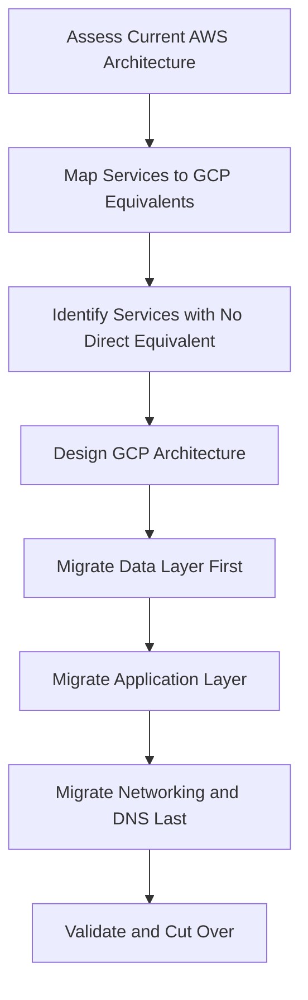

# How to Map AWS Services to GCP Equivalents During Cloud Migration

Author: [nawazdhandala](https://www.github.com/nawazdhandala)

Tags: GCP, AWS, Cloud Migration, Google Cloud Platform, Multi-Cloud

Description: A practical guide to mapping AWS services to their Google Cloud Platform equivalents during cloud migration, covering compute, storage, networking, databases, and more.

---

Migrating from AWS to Google Cloud Platform is one of those projects that sounds straightforward on paper but gets complicated fast. The biggest challenge is not the actual migration itself - it is figuring out which GCP service replaces which AWS service, and understanding where the differences actually matter.

I have been through this process multiple times, and the mapping is rarely one-to-one. Let me walk you through the key service equivalents and the gotchas you should watch out for.

## Compute Services

The most obvious mapping is EC2 to Compute Engine. Both give you virtual machines, but there are differences in how you configure them. GCP uses custom machine types, which means you can pick exact CPU and memory combinations rather than being locked into predefined instance types.

Here is a quick reference table for compute services:

| AWS Service | GCP Equivalent | Notes |
|---|---|---|
| EC2 | Compute Engine | Custom machine types available |
| Lambda | Cloud Functions / Cloud Run | Cloud Run handles containers |
| ECS/EKS | Google Kubernetes Engine (GKE) | GKE is more mature |
| Elastic Beanstalk | App Engine | PaaS offering |
| Fargate | Cloud Run | Serverless containers |
| Batch | Cloud Batch | Batch processing |

One thing that catches people off guard is that GCP does not have a direct equivalent to EC2 Auto Scaling Groups as a standalone service. Instead, you use Managed Instance Groups (MIGs) in Compute Engine, which handle autoscaling, health checks, and rolling updates.

## Storage Services

Storage mapping is relatively clean, but the pricing models differ significantly.

| AWS Service | GCP Equivalent | Notes |
|---|---|---|
| S3 | Cloud Storage | Similar bucket-based storage |
| EBS | Persistent Disks | Attached to VMs |
| EFS | Filestore | Managed NFS |
| Glacier | Cloud Storage Archive | Storage class, not separate service |
| S3 Transfer Acceleration | Storage Transfer Service | Different approach |

A key difference: GCP Cloud Storage uses storage classes (Standard, Nearline, Coldline, Archive) within the same bucket, while AWS treats Glacier as a separate service. This makes lifecycle management simpler in GCP.

The following gcloud command creates a bucket with a lifecycle rule that moves objects to Coldline after 30 days:

```bash
# Create a Cloud Storage bucket with lifecycle management
# Objects automatically move to Coldline storage after 30 days
gsutil mb -l us-central1 gs://my-migrated-bucket

# Create a lifecycle configuration file
cat > lifecycle.json << 'EOF'
{
  "lifecycle": {
    "rule": [
      {
        "action": {"type": "SetStorageClass", "storageClass": "COLDLINE"},
        "condition": {"age": 30}
      }
    ]
  }
}
EOF

# Apply the lifecycle policy to the bucket
gsutil lifecycle set lifecycle.json gs://my-migrated-bucket
```

## Database Services

This is where things get interesting. AWS has more database-specific services, while GCP consolidates some functionality.

| AWS Service | GCP Equivalent | Notes |
|---|---|---|
| RDS | Cloud SQL | MySQL, PostgreSQL, SQL Server |
| Aurora | AlloyDB / Cloud SQL | AlloyDB is PostgreSQL-compatible |
| DynamoDB | Firestore / Bigtable | Depends on use case |
| ElastiCache | Memorystore | Redis and Memcached |
| Redshift | BigQuery | Very different architecture |
| Neptune | Not directly equivalent | Use JanusGraph on GKE |
| DocumentDB | Firestore | Native document database |

The biggest gotcha here is Redshift to BigQuery. They are both analytics databases, but BigQuery is serverless and uses a completely different pricing model based on bytes scanned. You will need to rethink your query patterns and potentially restructure your data.

## Networking Services

Networking is where GCP and AWS differ the most architecturally. GCP uses a global VPC model, while AWS VPCs are regional.

| AWS Service | GCP Equivalent | Notes |
|---|---|---|
| VPC | VPC | GCP VPCs are global |
| Route 53 | Cloud DNS | DNS management |
| CloudFront | Cloud CDN | Content delivery |
| ELB/ALB/NLB | Cloud Load Balancing | Global by default |
| Direct Connect | Cloud Interconnect | Dedicated connectivity |
| VPN Gateway | Cloud VPN | Site-to-site VPN |
| Transit Gateway | Network Connectivity Center | Hub-and-spoke networking |

The global VPC in GCP is a significant architectural difference. In AWS, if you need resources in multiple regions to communicate, you set up VPC peering or Transit Gateway. In GCP, subnets within the same VPC can span regions automatically.

Here is how you would create a VPC with subnets in two regions:

```bash
# Create a custom VPC network
# GCP VPCs are global - subnets are regional
gcloud compute networks create my-vpc \
    --subnet-mode=custom

# Create a subnet in us-central1
gcloud compute networks subnets create us-subnet \
    --network=my-vpc \
    --region=us-central1 \
    --range=10.0.1.0/24

# Create a subnet in europe-west1 within the same VPC
# These subnets can communicate without peering
gcloud compute networks subnets create eu-subnet \
    --network=my-vpc \
    --region=europe-west1 \
    --range=10.0.2.0/24
```

## Security and Identity

| AWS Service | GCP Equivalent | Notes |
|---|---|---|
| IAM | Cloud IAM | Different permission model |
| Cognito | Identity Platform | User authentication |
| KMS | Cloud KMS | Key management |
| Secrets Manager | Secret Manager | Secret storage |
| GuardDuty | Security Command Center | Threat detection |
| WAF | Cloud Armor | Web application firewall |

GCP IAM works differently from AWS IAM. In AWS, you attach policies to users, groups, or roles. In GCP, you grant roles to principals (users, service accounts, groups) at different levels of the resource hierarchy (organization, folder, project, resource). This hierarchy-based approach means permissions can be inherited downward.

## DevOps and CI/CD

| AWS Service | GCP Equivalent | Notes |
|---|---|---|
| CodeBuild | Cloud Build | Build service |
| CodePipeline | Cloud Build triggers | CI/CD pipelines |
| CodeDeploy | Cloud Deploy | Deployment automation |
| CloudFormation | Deployment Manager / Terraform | IaC tools |
| CloudWatch | Cloud Monitoring + Cloud Logging | Split into two services |
| X-Ray | Cloud Trace | Distributed tracing |

## Migration Strategy

When planning your migration, do not try to migrate everything at once. Here is a practical approach:



Start with a pilot project - pick one service or application that is relatively self-contained and migrate that first. This gives your team hands-on experience with GCP tooling before tackling the critical workloads.

## Tools That Help

Google provides several migration tools:

- **Migrate to Virtual Machines** - for VM-based workloads from AWS EC2
- **Migrate to Containers** - to containerize existing workloads during migration
- **Storage Transfer Service** - for bulk data transfer from S3 to Cloud Storage
- **Database Migration Service** - for migrating databases to Cloud SQL or AlloyDB

The Database Migration Service supports continuous replication, which means you can keep your AWS database in sync with Cloud SQL during the migration window and cut over when ready.

## Common Pitfalls

A few things that consistently trip teams up during AWS-to-GCP migrations:

1. **IAM model differences** - GCP service accounts are per-project, not per-account. Plan your project structure carefully.
2. **Networking architecture** - Do not try to replicate your AWS multi-VPC design in GCP. Take advantage of the global VPC model.
3. **Pricing model changes** - GCP uses sustained use discounts automatically, but committed use discounts require upfront planning.
4. **API differences** - If you are using AWS SDKs extensively, you will need to rewrite those integrations.

The best advice I can give is to resist the temptation to do a lift-and-shift. Take the migration as an opportunity to rethink your architecture and take advantage of GCP-native features like BigQuery, GKE Autopilot, and Cloud Run. The effort pays off in the long run.
