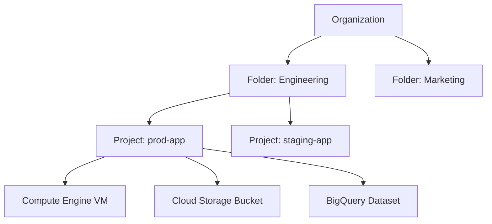

# How to Master IAM Concepts for the Google Cloud Associate Cloud Engineer Certification

Author: [nawazdhandala](https://www.github.com/nawazdhandala)

Tags: GCP, IAM, Certification, Associate Cloud Engineer, Security, Access Control

Description: Deep dive into Google Cloud IAM concepts including roles, policies, service accounts, and best practices that are essential for passing the Associate Cloud Engineer certification exam.

---

IAM (Identity and Access Management) is the backbone of security on Google Cloud, and it shows up in roughly 20% of the Associate Cloud Engineer exam questions. But it is not just about memorizing role names. The exam tests whether you understand how IAM actually works - how policies inherit through the resource hierarchy, when to use service accounts vs. user accounts, and how to apply the principle of least privilege in real scenarios.

Here is a thorough walkthrough of everything you need to know about IAM for the ACE exam.

## The Resource Hierarchy

Before you can understand IAM, you need to understand the GCP resource hierarchy. Policies set at a higher level are inherited by all resources below it.



IAM policies can be set at any level:

- **Organization**: Applies to everything in the organization
- **Folder**: Applies to all projects in the folder
- **Project**: Applies to all resources in the project
- **Resource**: Applies to a single resource (not all resources support this)

Policies are additive. If you grant someone Viewer at the organization level and Editor at the project level, they have Editor access in that project and Viewer everywhere else. You cannot remove a permission granted at a higher level by setting a policy at a lower level (with the exception of deny policies, which are a newer feature).

## Members (Principals)

IAM policies bind members to roles. The types of members are:

- **Google Account**: A personal email (user@gmail.com) or a Google Workspace email (user@company.com)
- **Service Account**: An account for applications, not humans (my-app@my-project.iam.gserviceaccount.com)
- **Google Group**: A group email that contains multiple members (team@company.com)
- **Google Workspace Domain**: Every user in the organization (company.com)
- **allAuthenticatedUsers**: Any Google account (use with extreme caution)
- **allUsers**: Anyone on the internet, including unauthenticated users (almost never what you want)

For the exam, know when to use each type. Google Groups are the recommended way to manage access for teams because you can add or remove people from the group without changing IAM policies.

## Roles

Roles are collections of permissions. There are three types:

### Basic Roles (Primitive Roles)

These are the original roles and they are very broad:

- **Viewer**: Read-only access to all resources
- **Editor**: Read-write access to all resources (but cannot manage IAM)
- **Owner**: Full control including IAM management and billing

The exam will test whether you know that basic roles are too permissive for production. They grant access to every service in the project. Use predefined or custom roles instead.

### Predefined Roles

Google provides hundreds of predefined roles for specific services. Examples:

```
roles/compute.instanceAdmin    - Full control of Compute Engine instances
roles/storage.objectViewer     - Read-only access to Cloud Storage objects
roles/cloudsql.client          - Connect to Cloud SQL instances
roles/container.developer      - Access to GKE resources (no admin)
roles/logging.viewer           - Read-only access to logs
```

These follow the format `roles/service.roleName`. Know the common predefined roles for Compute Engine, Cloud Storage, GKE, Cloud SQL, and BigQuery.

### Custom Roles

When predefined roles do not fit, you can create custom roles with specific permissions:

```bash
# Create a custom role with specific permissions
gcloud iam roles create customStorageReader \
  --project=my-project \
  --title="Custom Storage Reader" \
  --description="Can list and read objects but not delete them" \
  --permissions=storage.objects.get,storage.objects.list,storage.buckets.list \
  --stage=GA
```

Know that custom roles can be created at the organization or project level, and that some permissions cannot be used in custom roles.

## Service Accounts

Service accounts are critical for the exam. They are used by applications, VMs, and GCP services to authenticate and authorize API calls.

### Types of Service Accounts

**User-managed service accounts**: You create these for your applications.

```bash
# Create a service account for your application
gcloud iam service-accounts create my-app-sa \
  --display-name="My Application Service Account"

# Grant it a specific role
gcloud projects add-iam-policy-binding my-project \
  --member="serviceAccount:my-app-sa@my-project.iam.gserviceaccount.com" \
  --role="roles/storage.objectViewer"
```

**Default service accounts**: GCP creates these automatically when you enable certain APIs (like the Compute Engine default service account). These are often overprivileged - they typically have the Editor role by default.

**Google-managed service accounts**: Used by GCP services internally (like the Cloud Build service account). You generally do not manage these directly.

### Service Account Keys

Service accounts can authenticate using keys or through workload identity:

```bash
# Create a key file (avoid this in production - use workload identity instead)
gcloud iam service-accounts keys create key.json \
  --iam-account=my-app-sa@my-project.iam.gserviceaccount.com
```

For the exam, know that:
- Key files should be avoided when possible because they are hard to manage and rotate
- On Compute Engine, use the VM's attached service account instead of key files
- On GKE, use Workload Identity to link Kubernetes service accounts to GCP service accounts
- Service account keys should be rotated regularly

### Service Account Impersonation

One service account can impersonate another if it has the `roles/iam.serviceAccountTokenCreator` role. This is useful for cross-project access and testing.

```bash
# Grant impersonation permission
gcloud iam service-accounts add-iam-policy-binding target-sa@project-b.iam.gserviceaccount.com \
  --member="serviceAccount:source-sa@project-a.iam.gserviceaccount.com" \
  --role="roles/iam.serviceAccountTokenCreator"
```

## IAM Policies

An IAM policy is a JSON document that binds members to roles:

```json
{
  "bindings": [
    {
      "role": "roles/storage.objectViewer",
      "members": [
        "user:alice@company.com",
        "group:data-team@company.com",
        "serviceAccount:my-app@my-project.iam.gserviceaccount.com"
      ]
    },
    {
      "role": "roles/storage.objectAdmin",
      "members": [
        "user:bob@company.com"
      ],
      "condition": {
        "title": "Only staging bucket",
        "expression": "resource.name.startsWith('projects/_/buckets/staging-')"
      }
    }
  ]
}
```

Notice the condition on the second binding - IAM Conditions let you grant access based on resource attributes, request time, or other factors.

## Common Exam Scenarios

Here are scenarios that frequently appear on the exam:

### Scenario 1: Granting minimum access

"A developer needs to view logs in Cloud Logging but should not be able to modify anything."

Answer: Grant `roles/logging.viewer` at the project level.

```bash
gcloud projects add-iam-policy-binding my-project \
  --member="user:developer@company.com" \
  --role="roles/logging.viewer"
```

### Scenario 2: Application accessing Cloud Storage

"A Compute Engine VM needs to read objects from a Cloud Storage bucket."

Answer: Create a service account with `roles/storage.objectViewer`, attach it to the VM.

```bash
# Attach a service account when creating the VM
gcloud compute instances create my-vm \
  --service-account=my-app-sa@my-project.iam.gserviceaccount.com \
  --scopes=cloud-platform \
  --zone=us-central1-a
```

### Scenario 3: Cross-project access

"A service in Project A needs to write to a BigQuery dataset in Project B."

Answer: Grant the service account from Project A the `roles/bigquery.dataEditor` role in Project B.

```bash
gcloud projects add-iam-policy-binding project-b \
  --member="serviceAccount:service@project-a.iam.gserviceaccount.com" \
  --role="roles/bigquery.dataEditor"
```

### Scenario 4: Temporary access

"A contractor needs access to a project for 30 days."

Answer: Use IAM Conditions with a time-based expression.

## Best Practices for the Exam

1. **Prefer predefined roles over basic roles**: The exam almost always expects you to choose the most restrictive role that works.
2. **Use groups for team access**: Instead of granting roles to individual users, use Google Groups.
3. **Use service accounts for applications**: Never use personal credentials in application code.
4. **Avoid service account keys**: Use attached service accounts on Compute Engine and Workload Identity on GKE.
5. **Apply policies at the right level**: Do not grant organization-wide access when project-level access is sufficient.
6. **Know the audit tools**: `gcloud projects get-iam-policy` shows who has access. Policy Analyzer helps find unused permissions.

## Practice Commands

Run these commands repeatedly until they are second nature:

```bash
# View IAM policy for a project
gcloud projects get-iam-policy my-project

# Add a role binding
gcloud projects add-iam-policy-binding my-project \
  --member="user:dev@company.com" \
  --role="roles/viewer"

# Remove a role binding
gcloud projects remove-iam-policy-binding my-project \
  --member="user:dev@company.com" \
  --role="roles/viewer"

# List service accounts
gcloud iam service-accounts list

# List roles available for a project
gcloud iam roles list --project=my-project
```

## Wrapping Up

IAM is foundational to everything on GCP, and the ACE exam reflects that. Focus on understanding the resource hierarchy and policy inheritance, know the difference between basic, predefined, and custom roles, and practice creating and managing service accounts. The exam questions are scenario-based, so work through practical examples rather than just memorizing role names. If you can confidently answer "who should have access to what, and how do I set that up" for any given scenario, you are well prepared for the IAM portion of the exam.
