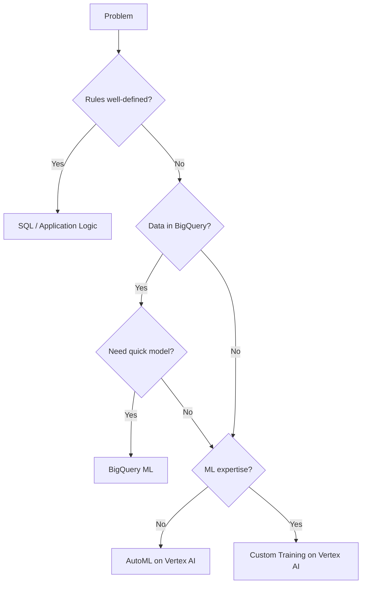

# How to Master Machine Learning and Vertex AI Topics for the GCP Professional Data Engineer Exam

Author: [nawazdhandala](https://www.github.com/nawazdhandala)

Tags: GCP, Vertex AI, Machine Learning, Certification, Professional Data Engineer, AutoML, MLOps

Description: Study guide for machine learning and Vertex AI topics on the Google Cloud Professional Data Engineer exam covering model training, deployment, feature engineering, and MLOps on GCP.

---

Machine learning shows up on the GCP Professional Data Engineer exam more than most people expect. You do not need to be an ML expert, but you do need to understand how to build, deploy, and manage ML workflows on GCP. The exam tests whether you can select the right ML approach for a given scenario, set up proper data pipelines for training, and operationalize models in production.

This guide covers the ML and Vertex AI topics you are likely to encounter, with a focus on practical knowledge over theory.

## When to Use ML vs. Other Approaches

The exam sometimes gives you a scenario where ML is not the right answer. Know when simpler approaches work:

- **Rule-based logic**: If the business rules are well-defined and do not change, use SQL or application code.
- **BigQuery ML**: If you need a quick model without leaving SQL and your data is already in BigQuery.
- **AutoML**: If you need a custom model but do not have ML expertise on the team.
- **Custom training on Vertex AI**: If you need full control over the model architecture, hyperparameters, and training process.



## BigQuery ML

BigQuery ML lets you train models using SQL. The exam tests whether you know which model types are available and when to use them.

```sql
-- Create a logistic regression model to predict customer churn
CREATE OR REPLACE MODEL my_dataset.churn_model
OPTIONS(
  model_type='LOGISTIC_REG',
  input_label_cols=['churned'],
  -- Automatically split data for training and evaluation
  data_split_method='AUTO_SPLIT',
  -- Enable regularization to prevent overfitting
  l2_reg=0.01,
  max_iterations=20
) AS
SELECT
  total_purchases,
  days_since_last_purchase,
  avg_order_value,
  support_tickets_count,
  account_age_days,
  churned  -- Label column (0 or 1)
FROM my_dataset.customer_features
WHERE signup_date > '2024-01-01';

-- Evaluate the model
SELECT *
FROM ML.EVALUATE(MODEL my_dataset.churn_model);

-- Make predictions on new data
SELECT *
FROM ML.PREDICT(MODEL my_dataset.churn_model,
  (SELECT * FROM my_dataset.new_customers)
);
```

BigQuery ML model types to know:
- **LINEAR_REG**: Linear regression for numeric predictions
- **LOGISTIC_REG**: Classification (binary or multi-class)
- **KMEANS**: Clustering (unsupervised)
- **MATRIX_FACTORIZATION**: Recommendation systems
- **ARIMA_PLUS**: Time series forecasting
- **BOOSTED_TREE_CLASSIFIER/REGRESSOR**: Gradient boosted trees
- **DNN_CLASSIFIER/REGRESSOR**: Deep neural networks
- **TENSORFLOW**: Import custom TensorFlow models

## Vertex AI Overview

Vertex AI is the unified ML platform on GCP. For the exam, understand the key components:

### Datasets and Data Labeling

Before training, you need labeled data. Vertex AI provides:
- **Managed datasets**: Store and version your training data
- **Data Labeling Service**: Human labeling workforce for images, text, and video

### AutoML

AutoML trains models without code. Support for:
- **Image classification and object detection**
- **Text classification, extraction, and sentiment**
- **Tabular regression and classification**
- **Video classification and tracking**

```bash
# Create a tabular dataset in Vertex AI
gcloud ai datasets create \
  --region=us-central1 \
  --display-name=customer-churn \
  --metadata-schema-uri=gs://google-cloud-aiplatform/schema/dataset/metadata/tabular_1.0.0.yaml

# Import data from BigQuery
gcloud ai datasets import customer-churn \
  --region=us-central1 \
  --import-schema-uri=gs://google-cloud-aiplatform/schema/dataset/ioformat/tabular_io_format_1.0.0.yaml \
  --source=bq://my-project.my_dataset.training_data
```

### Custom Training

For full control, use custom training jobs:

```python
# training_script.py - Custom model training on Vertex AI
import argparse
import pandas as pd
from sklearn.ensemble import GradientBoostingClassifier
from sklearn.model_selection import train_test_split
from sklearn.metrics import accuracy_score
from google.cloud import storage, bigquery
import joblib
import os

def train_model(args):
    """Train a custom model and save to GCS."""

    # Load data from BigQuery
    client = bigquery.Client()
    query = f"SELECT * FROM {args.training_data}"
    df = client.query(query).to_dataframe()

    # Split features and labels
    X = df.drop(columns=['churned'])
    y = df['churned']
    X_train, X_test, y_train, y_test = train_test_split(
        X, y, test_size=0.2, random_state=42
    )

    # Train the model
    model = GradientBoostingClassifier(
        n_estimators=args.n_estimators,
        learning_rate=args.learning_rate,
        max_depth=args.max_depth,
    )
    model.fit(X_train, y_train)

    # Evaluate
    predictions = model.predict(X_test)
    accuracy = accuracy_score(y_test, predictions)
    print(f'Accuracy: {accuracy}')

    # Save the model to the output directory
    model_path = os.path.join(args.model_dir, 'model.joblib')
    joblib.dump(model, model_path)

if __name__ == '__main__':
    parser = argparse.ArgumentParser()
    parser.add_argument('--training-data', required=True)
    parser.add_argument('--model-dir', default=os.environ.get('AIP_MODEL_DIR'))
    parser.add_argument('--n-estimators', type=int, default=100)
    parser.add_argument('--learning-rate', type=float, default=0.1)
    parser.add_argument('--max-depth', type=int, default=3)
    args = parser.parse_args()
    train_model(args)
```

Submit the training job:

```bash
# Submit a custom training job to Vertex AI
gcloud ai custom-jobs create \
  --region=us-central1 \
  --display-name=churn-model-training \
  --worker-pool-spec=machine-type=n1-standard-4,replica-count=1,container-image-uri=us-docker.pkg.dev/my-project/ml/training:latest \
  --args="--training-data=my-project.my_dataset.training_data,--n-estimators=200,--learning-rate=0.05"
```

### Model Deployment and Prediction

After training, deploy the model for online or batch predictions:

```bash
# Upload the model to Model Registry
gcloud ai models upload \
  --region=us-central1 \
  --display-name=churn-model-v1 \
  --container-image-uri=us-docker.pkg.dev/vertex-ai/prediction/sklearn-cpu.1-0:latest \
  --artifact-uri=gs://my-bucket/models/churn-model/

# Create an endpoint
gcloud ai endpoints create \
  --region=us-central1 \
  --display-name=churn-prediction-endpoint

# Deploy the model to the endpoint
gcloud ai endpoints deploy-model ENDPOINT_ID \
  --region=us-central1 \
  --model=MODEL_ID \
  --display-name=churn-v1 \
  --machine-type=n1-standard-2 \
  --min-replica-count=1 \
  --max-replica-count=5 \
  --traffic-split=0=100
```

## Feature Store

Vertex AI Feature Store is a centralized repository for ML features. For the exam, know why it matters:

- **Feature consistency**: Same features used in training and serving
- **Feature reuse**: Teams can share features across models
- **Point-in-time lookups**: Avoid data leakage during training by getting features as they were at a specific time

```bash
# Create a feature store
gcloud ai featurestores create my-feature-store \
  --region=us-central1 \
  --online-serving-config=fixed-node-count=1

# Create an entity type (like a table for a specific entity)
gcloud ai featurestores entity-types create customer \
  --featurestore=my-feature-store \
  --region=us-central1 \
  --description="Customer features for ML models"

# Create features within the entity type
gcloud ai featurestores entity-types features create total_purchases \
  --featurestore=my-feature-store \
  --entity-type=customer \
  --region=us-central1 \
  --value-type=INT64
```

## MLOps with Vertex AI Pipelines

The exam tests MLOps concepts - automating the ML lifecycle:

```python
# vertex_pipeline.py - Example Vertex AI Pipeline using Kubeflow SDK
from kfp.v2 import dsl, compiler
from google_cloud_pipeline_components.v1.dataset import TabularDatasetCreateOp
from google_cloud_pipeline_components.v1.automl.training_job import AutoMLTabularTrainingJobRunOp

@dsl.pipeline(name='churn-prediction-pipeline')
def churn_pipeline(
    project: str,
    region: str,
    training_data_uri: str,
):
    # Step 1: Create dataset
    dataset_op = TabularDatasetCreateOp(
        project=project,
        display_name='churn-dataset',
        bq_source=training_data_uri,
    )

    # Step 2: Train model with AutoML
    training_op = AutoMLTabularTrainingJobRunOp(
        project=project,
        display_name='churn-automl',
        optimization_prediction_type='classification',
        dataset=dataset_op.outputs['dataset'],
        target_column='churned',
        training_fraction_split=0.8,
        validation_fraction_split=0.1,
        test_fraction_split=0.1,
    )

# Compile the pipeline
compiler.Compiler().compile(
    pipeline_func=churn_pipeline,
    package_path='churn_pipeline.json'
)
```

## Common Exam Scenarios

### Scenario 1: Quick Model Prototyping

"A data analyst who knows SQL needs to build a churn prediction model. They do not have ML expertise."

Answer: BigQuery ML. The analyst can train a logistic regression or boosted tree model using SQL without leaving their familiar environment.

### Scenario 2: Image Classification

"A retail company needs to classify product images into categories. They have 10,000 labeled images."

Answer: AutoML Vision on Vertex AI. It handles model architecture, hyperparameter tuning, and deployment.

### Scenario 3: Production ML Pipeline

"An ML team needs to retrain their model weekly, evaluate it against the current production model, and deploy it automatically if it performs better."

Answer: Vertex AI Pipelines with automated training, evaluation, and conditional deployment steps. Use the Model Registry to track versions.

### Scenario 4: Feature Consistency

"The team is seeing different predictions in production than in testing because features are computed differently."

Answer: Vertex AI Feature Store. Centralize feature computation so the same features are used for both training and serving.

## Key Points for the Exam

1. BigQuery ML is for analysts who want ML without leaving SQL.
2. AutoML is for teams without deep ML expertise who need custom models.
3. Custom training on Vertex AI is for ML engineers who need full control.
4. Feature Store solves the training-serving skew problem.
5. Vertex AI Pipelines automate the ML lifecycle (MLOps).
6. Know the difference between online prediction (low latency, one at a time) and batch prediction (high throughput, many at once).
7. Model monitoring detects data drift and concept drift in production.

## Wrapping Up

The ML portion of the PDE exam tests whether you can design end-to-end ML workflows on GCP. Know the spectrum of ML options from BigQuery ML to custom training on Vertex AI, understand when to use each, and be familiar with MLOps concepts like pipeline automation, feature stores, and model monitoring. Practice running at least one BigQuery ML model and one Vertex AI training job so the concepts are concrete rather than abstract.
