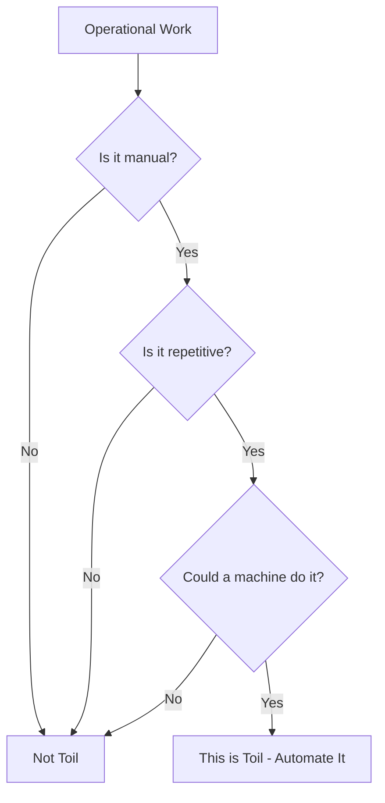

# How to Measure and Reduce Operational Toil Using Google Cloud Automation Tools

Author: [nawazdhandala](https://www.github.com/nawazdhandala)

Tags: GCP, SRE, Toil, Automation, Cloud Operations, DevOps, Google Cloud

Description: Learn how to systematically measure operational toil and reduce it using Google Cloud automation tools like Cloud Functions, Workflows, and Cloud Scheduler.

---

Toil is the operational work that is manual, repetitive, automatable, tactical, and scales linearly with service growth. Restarting pods, rotating certificates, responding to the same alerts, manually scaling resources - these are all toil. Google's SRE practice says engineering teams should spend no more than 50% of their time on toil. The rest should go to engineering work that permanently reduces future toil. This guide shows you how to measure your toil and systematically eliminate it using Google Cloud automation tools.

## What Qualifies as Toil

Not all operational work is toil. Toil has specific characteristics:

- **Manual**: A human has to do it
- **Repetitive**: It happens over and over
- **Automatable**: A machine could do it
- **Tactical**: It is reactive, not strategic
- **No lasting value**: It does not permanently improve the system
- **Scales with service**: More traffic or users means more of this work

Incident response is not toil (it requires judgment). But manually restarting a service after every deployment is toil (it is mechanical and automatable).



## Step 1: Measure Your Current Toil

Before you can reduce toil, you need to know where it is. Create a toil tracking system:

```python
# toil_tracker.py - Track and measure operational toil
from google.cloud import bigquery, firestore
from datetime import datetime
import json

bq_client = bigquery.Client()
db = firestore.Client()

def log_toil_event(event):
    """Log a toil event for measurement and prioritization.
    Team members log these as they encounter repetitive operational work."""

    record = {
        "timestamp": datetime.utcnow().isoformat(),
        "engineer": event["engineer"],
        "task_description": event["description"],
        "category": event["category"],  # e.g., "restart", "scaling", "cert_rotation", "data_fix"
        "service": event["service"],
        "duration_minutes": event["duration_minutes"],
        "frequency": event["frequency"],  # e.g., "daily", "weekly", "per_deployment"
        "automatable": event.get("automatable", True),
        "automation_effort_hours": event.get("automation_effort_hours", 0),
    }

    # Store in BigQuery for analysis
    table_ref = bq_client.dataset("sre_metrics").table("toil_events")
    bq_client.insert_rows_json(table_ref, [record])

    # Also store in Firestore for the team dashboard
    db.collection("toil_events").add(record)

    return record


# Example: Log a toil event
log_toil_event({
    "engineer": "alice@company.com",
    "description": "Manually cleared disk space on staging server",
    "category": "maintenance",
    "service": "staging-api",
    "duration_minutes": 15,
    "frequency": "weekly",
    "automatable": True,
    "automation_effort_hours": 4,
})
```

Create BigQuery views to analyze toil patterns:

```sql
-- Weekly toil summary by category
CREATE OR REPLACE VIEW `your-project.sre_metrics.weekly_toil_summary` AS
SELECT
    DATE_TRUNC(PARSE_TIMESTAMP('%Y-%m-%dT%H:%M:%S', timestamp), WEEK) AS week,
    category,
    COUNT(*) AS occurrence_count,
    SUM(duration_minutes) AS total_minutes,
    COUNT(DISTINCT engineer) AS engineers_affected,
    COUNT(DISTINCT service) AS services_affected,
    -- Calculate annualized cost (assuming all occurrences continue at same rate)
    SUM(duration_minutes) * 52 / COUNT(DISTINCT DATE(PARSE_TIMESTAMP('%Y-%m-%dT%H:%M:%S', timestamp))) AS annualized_minutes
FROM `your-project.sre_metrics.toil_events`
GROUP BY 1, 2
ORDER BY total_minutes DESC;

-- Top toil reduction opportunities
-- Ranked by time saved vs. automation effort
CREATE OR REPLACE VIEW `your-project.sre_metrics.toil_reduction_priorities` AS
SELECT
    task_description,
    category,
    service,
    COUNT(*) AS occurrences_last_90_days,
    SUM(duration_minutes) AS total_minutes_last_90_days,
    AVG(automation_effort_hours) AS avg_automation_effort_hours,
    -- ROI: annualized time saved / automation effort
    ROUND(
        (SUM(duration_minutes) * 4 / 60) / NULLIF(AVG(automation_effort_hours), 0),
        2
    ) AS roi_ratio
FROM `your-project.sre_metrics.toil_events`
WHERE PARSE_TIMESTAMP('%Y-%m-%dT%H:%M:%S', timestamp)
    > TIMESTAMP_SUB(CURRENT_TIMESTAMP(), INTERVAL 90 DAY)
AND automatable = TRUE
GROUP BY 1, 2, 3
HAVING occurrences_last_90_days >= 3
ORDER BY roi_ratio DESC;
```

## Step 2: Automate Certificate Rotation

Certificate rotation is one of the most common toil items. Automate it with Cloud Scheduler and Cloud Functions:

```python
# cert_rotation.py - Automated certificate rotation
import functions_framework
from google.cloud import secretmanager, compute_v1
from cryptography import x509
from cryptography.x509.oid import NameOID
from cryptography.hazmat.primitives import hashes, serialization
from cryptography.hazmat.primitives.asymmetric import rsa
from datetime import datetime, timedelta

secret_client = secretmanager.SecretManagerServiceClient()

@functions_framework.http
def rotate_certificates(request):
    """Automatically rotate TLS certificates before they expire.
    Checks expiry dates and generates new certs when needed."""

    project_id = "your-project-id"
    certificates_to_check = [
        {"secret_name": "api-tls-cert", "service": "api-service"},
        {"secret_name": "web-tls-cert", "service": "web-service"},
    ]

    results = []
    for cert_info in certificates_to_check:
        secret_name = f"projects/{project_id}/secrets/{cert_info['secret_name']}/versions/latest"

        try:
            # Get the current certificate
            response = secret_client.access_secret_version(name=secret_name)
            cert_pem = response.payload.data

            # Parse and check expiry
            cert = x509.load_pem_x509_certificate(cert_pem)
            days_until_expiry = (cert.not_valid_after_utc - datetime.utcnow()).days

            if days_until_expiry < 30:
                # Generate a new certificate
                new_cert, new_key = generate_new_certificate(cert_info["service"])

                # Store in Secret Manager as a new version
                parent = f"projects/{project_id}/secrets/{cert_info['secret_name']}"
                secret_client.add_secret_version(
                    parent=parent,
                    payload={"data": new_cert},
                )

                results.append({
                    "service": cert_info["service"],
                    "action": "rotated",
                    "old_expiry_days": days_until_expiry,
                })
            else:
                results.append({
                    "service": cert_info["service"],
                    "action": "no_action",
                    "days_until_expiry": days_until_expiry,
                })
        except Exception as e:
            results.append({
                "service": cert_info["service"],
                "action": "error",
                "error": str(e),
            })

    return {"results": results}, 200
```

Schedule it to run daily:

```bash
# Check certificates daily at 3 AM
gcloud scheduler jobs create http cert-rotation-check \
    --schedule="0 3 * * *" \
    --uri="https://REGION-PROJECT.cloudfunctions.net/rotate-certificates" \
    --http-method=POST \
    --time-zone="UTC"
```

## Step 3: Automate Disk Cleanup

Another common toil source - running out of disk space:

```python
# disk_cleanup.py - Automated disk space management
import functions_framework
from google.cloud import compute_v1, monitoring_v3
import json

@functions_framework.http
def cleanup_disks(request):
    """Automatically clean up disk space when usage exceeds thresholds.
    Targets log files, temp files, and old artifacts."""

    # Query Cloud Monitoring for instances with high disk usage
    query_client = monitoring_v3.QueryServiceClient()

    # Find instances where disk usage is above 80%
    # In practice, use MQL or the Monitoring API to query disk metrics

    actions_taken = []

    # Common cleanup actions that can be automated
    cleanup_commands = [
        # Clear old container images
        "docker system prune -f --filter 'until=72h'",
        # Rotate and compress old logs
        "find /var/log -name '*.log' -mtime +7 -exec gzip {} \\;",
        # Clear package manager caches
        "apt-get clean",
        # Remove old temporary files
        "find /tmp -mtime +3 -delete",
    ]

    # Execute cleanup via OS Config or SSH
    # This is a simplified example - use OS Config Agent in production
    for instance in get_high_disk_instances():
        result = execute_cleanup(instance, cleanup_commands)
        actions_taken.append({
            "instance": instance,
            "space_freed_gb": result["space_freed_gb"],
        })

        # Log the toil reduction
        log_toil_event({
            "engineer": "automation",
            "description": f"Automated disk cleanup on {instance}",
            "category": "maintenance",
            "service": instance,
            "duration_minutes": 0,  # Automated - no human time
            "frequency": "as_needed",
        })

    return json.dumps({"actions": actions_taken}), 200
```

## Step 4: Automate Scaling Decisions

Manual scaling is pure toil. Replace it with autoscaling policies:

```bash
# Configure Cloud Run autoscaling based on metrics
gcloud run services update my-service \
    --min-instances=2 \
    --max-instances=100 \
    --concurrency=80 \
    --cpu-throttling \
    --region=us-central1

# For GKE, use Horizontal Pod Autoscaler
# This YAML defines autoscaling based on CPU and custom metrics
```

```yaml
# hpa.yaml - Horizontal Pod Autoscaler for GKE
apiVersion: autoscaling/v2
kind: HorizontalPodAutoscaler
metadata:
  name: api-server-hpa
spec:
  scaleTargetRef:
    apiVersion: apps/v1
    kind: Deployment
    name: api-server
  minReplicas: 3
  maxReplicas: 50
  metrics:
    - type: Resource
      resource:
        name: cpu
        target:
          type: Utilization
          averageUtilization: 70
    - type: Pods
      pods:
        metric:
          name: requests_per_second
        target:
          type: AverageValue
          averageValue: "100"
  behavior:
    scaleUp:
      stabilizationWindowSeconds: 60
      policies:
        - type: Pods
          value: 5
          periodSeconds: 60
    scaleDown:
      stabilizationWindowSeconds: 300
      policies:
        - type: Pods
          value: 2
          periodSeconds: 120
```

## Step 5: Automate Alert Response with Cloud Workflows

For alerts that always require the same response, automate the entire remediation:

```yaml
# auto_remediation.yaml - Cloud Workflow for automated alert response
main:
  params: [alert]
  steps:
    - identify_issue:
        switch:
          - condition: ${alert.condition_name == "high_error_rate"}
            next: handle_high_error_rate
          - condition: ${alert.condition_name == "high_memory"}
            next: handle_high_memory
          - condition: ${alert.condition_name == "certificate_expiring"}
            next: handle_cert_expiry

    - handle_high_error_rate:
        steps:
          - check_recent_deploy:
              call: http.get
              args:
                url: https://api.internal/deployments/recent
              result: recent_deploy
          - rollback_if_needed:
              switch:
                - condition: ${recent_deploy.body.deployed_within_hours < 2}
                  steps:
                    - rollback:
                        call: http.post
                        args:
                          url: https://api.internal/deployments/rollback
                    - notify_team:
                        call: http.post
                        args:
                          url: https://hooks.slack.com/services/YOUR/WEBHOOK
                          body:
                            text: "Auto-rollback triggered due to high error rate after recent deploy"

    - handle_high_memory:
        steps:
          - restart_service:
              call: http.post
              args:
                url: https://api.internal/services/restart
                body:
                  service: ${alert.resource_name}
          - notify:
              call: http.post
              args:
                url: https://hooks.slack.com/services/YOUR/WEBHOOK
                body:
                  text: "Auto-restarted ${alert.resource_name} due to high memory usage"
```

## Step 6: Track Toil Reduction Over Time

Measure the impact of your automation efforts:

```sql
-- Track toil reduction over time
-- Compare automated vs manual toil events
SELECT
    DATE_TRUNC(PARSE_TIMESTAMP('%Y-%m-%dT%H:%M:%S', timestamp), MONTH) AS month,
    COUNTIF(engineer != 'automation') AS manual_toil_events,
    COUNTIF(engineer = 'automation') AS automated_events,
    SUM(IF(engineer != 'automation', duration_minutes, 0)) AS manual_toil_minutes,
    -- Calculate the percentage of toil that is now automated
    ROUND(
        COUNTIF(engineer = 'automation') /
        NULLIF(COUNT(*), 0) * 100, 1
    ) AS automation_rate_pct
FROM `your-project.sre_metrics.toil_events`
GROUP BY 1
ORDER BY 1;
```

## Setting Toil Reduction Targets

A practical approach:

1. Measure your current toil percentage (hours spent on toil / total hours)
2. Set a quarterly target to reduce it by 10-15 percentage points
3. Prioritize automation by ROI (time saved / effort to automate)
4. Assign each automation project to a specific engineer
5. Review progress monthly in your team retrospective

## Monitoring

Use OneUptime to monitor your automation systems themselves. Automated certificate rotation that silently fails is worse than manual rotation because nobody knows it happened. Set up alerts for automation failures, track automation success rates, and maintain a dashboard that shows your toil metrics trending downward.

## Summary

Measuring and reducing toil is a continuous process, not a one-time project. Start by tracking every piece of toil your team does, calculate the ROI of automating each one, and work through the list starting with the highest-ROI items. Google Cloud provides the automation building blocks - Cloud Functions for event-driven automation, Cloud Workflows for multi-step remediation, Cloud Scheduler for periodic tasks, and Monitoring for triggering automated responses. The goal is not zero toil (that is unrealistic) but a sustainable level where your team spends most of their time on engineering work that makes the system permanently better.
