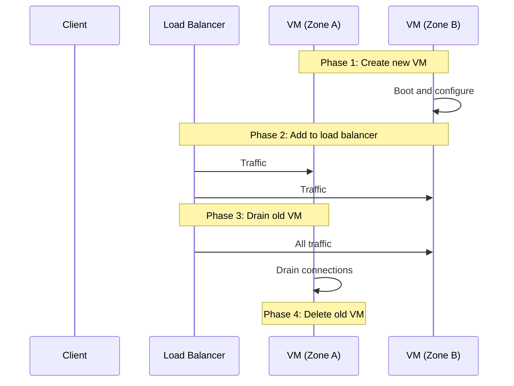

# How to Migrate a Compute Engine Instance to a Different Zone with Minimal Downtime

Author: [nawazdhandala](https://www.github.com/nawazdhandala)

Tags: GCP, Compute Engine, Migration, Zone Migration, Cloud Infrastructure

Description: A practical guide to migrating Compute Engine instances between zones with minimal downtime using move operations, snapshots, and managed instance groups.

---

There are several reasons you might need to move a Compute Engine instance to a different zone. Maybe you are consolidating resources, responding to a zone-level issue, or deploying closer to your users. Whatever the reason, you want to do it with as little downtime as possible.

GCP offers a built-in move operation for this, but it has limitations. In this post, I will cover the official move method, the manual snapshot-and-recreate approach, and some strategies for achieving near-zero downtime.

## Method 1: Using gcloud compute instances move

The simplest approach is the built-in move command. It handles stopping the VM, snapshotting the disks, recreating the VM in the target zone, and cleaning up the old resources.

```bash
# Move an instance from one zone to another
# This will cause downtime while the VM is stopped, moved, and restarted
gcloud compute instances move my-vm \
    --zone=us-central1-a \
    --destination-zone=us-central1-b
```

What happens behind the scenes:

1. The VM is stopped
2. Snapshots are taken of all attached disks
3. New disks are created from those snapshots in the destination zone
4. A new VM is created in the destination zone with the same configuration
5. The old VM and disks are deleted
6. The new VM is started

The total downtime depends on your disk sizes. For a VM with a 10 GB boot disk, expect about 5-10 minutes. For larger disks, it could be 20-30 minutes or more.

**Important limitations:**

- The VM must be stopped or running (not in a suspended or terminated state)
- It does not work with local SSDs (data on local SSDs is lost)
- The destination zone must be in the same region
- Static external IPs are preserved, but ephemeral IPs will change

## Method 2: Manual Snapshot and Recreate

For more control over the process, or when moving between regions, you can do it manually.

**Step 1: Capture the VM configuration**

```bash
# Export the current VM configuration for reference
gcloud compute instances describe my-vm \
    --zone=us-central1-a \
    --format=json > vm-config.json
```

**Step 2: Create snapshots of all disks**

```bash
# Create a snapshot of the boot disk
gcloud compute disks snapshot my-vm \
    --zone=us-central1-a \
    --snapshot-names=my-vm-boot-snapshot

# If you have additional data disks, snapshot those too
gcloud compute disks snapshot my-data-disk \
    --zone=us-central1-a \
    --snapshot-names=my-data-disk-snapshot
```

**Step 3: Create new disks from snapshots in the target zone**

```bash
# Create the boot disk in the new zone from the snapshot
gcloud compute disks create my-vm-boot \
    --zone=us-east1-b \
    --source-snapshot=my-vm-boot-snapshot

# Create the data disk in the new zone
gcloud compute disks create my-data-disk-new \
    --zone=us-east1-b \
    --source-snapshot=my-data-disk-snapshot
```

**Step 4: Create the new VM with the restored disks**

```bash
# Create the new VM using the disk created from the snapshot
gcloud compute instances create my-vm-new \
    --zone=us-east1-b \
    --machine-type=e2-medium \
    --disk=name=my-vm-boot,boot=yes,auto-delete=yes \
    --disk=name=my-data-disk-new,auto-delete=yes
```

**Step 5: Verify and clean up**

```bash
# Verify the new VM is working
gcloud compute ssh my-vm-new --zone=us-east1-b

# Once verified, delete the old VM and snapshots
gcloud compute instances delete my-vm --zone=us-central1-a --quiet
gcloud compute snapshots delete my-vm-boot-snapshot my-data-disk-snapshot --quiet
```

## Method 3: Near-Zero Downtime with DNS and Load Balancing

If your workload cannot tolerate minutes of downtime, the approach changes. Instead of moving the VM, you create a second instance in the target zone, shift traffic, and then decommission the old one.



Here is the practical implementation:

```bash
# Step 1: Create the new VM in the target zone
gcloud compute instances create my-vm-zone-b \
    --zone=us-central1-b \
    --machine-type=e2-medium \
    --image-family=my-app \
    --tags=http-server

# Step 2: Wait for the new VM to pass health checks
# (Your load balancer will do this automatically)

# Step 3: Remove the old VM from the load balancer backend
gcloud compute backend-services remove-backend my-backend-service \
    --instance-group=my-ig-zone-a \
    --instance-group-zone=us-central1-a \
    --global

# Step 4: Wait for connections to drain (give it a few minutes)
sleep 180

# Step 5: Delete the old VM
gcloud compute instances delete my-vm-zone-a \
    --zone=us-central1-a --quiet
```

## Method 4: Using Managed Instance Groups

If you are already using managed instance groups (and you should be for stateless workloads), zone migration is even simpler. Use a regional MIG that automatically distributes instances across zones.

```bash
# Create a regional managed instance group that spans multiple zones
gcloud compute instance-groups managed create my-regional-mig \
    --template=my-app-template \
    --size=3 \
    --region=us-central1
```

With a regional MIG, your instances are automatically distributed across zones. If you want to move away from a specific zone, you can configure zone selection:

```bash
# Update the MIG to only use specific zones
gcloud compute instance-groups managed update my-regional-mig \
    --region=us-central1 \
    --target-distribution-shape=ANY \
    --zones=us-central1-b,us-central1-c,us-central1-f
```

## Preserving the External IP Address

If your VM has a static external IP, you can reassign it to the new VM:

```bash
# First, note the current static IP
gcloud compute addresses list

# After creating the new VM, assign the static IP to it
gcloud compute instances delete-access-config my-vm-old \
    --zone=us-central1-a \
    --access-config-name="external-nat"

gcloud compute instances add-access-config my-vm-new \
    --zone=us-central1-b \
    --address=35.192.x.x
```

Note that the static IP must be in the same region as the new VM. If you are moving between regions, you will need a new IP address and must update DNS records.

## Handling Stateful Workloads

Stateful workloads like databases are the hardest to migrate. Here is a general approach for a PostgreSQL database:

```bash
# 1. Set up streaming replication to the new zone
# 2. On the new VM in the target zone, configure it as a replica
# 3. Monitor replication lag until it is caught up
# 4. Promote the replica to primary
# 5. Update your application's connection string
# 6. Decommission the old primary
```

For managed databases like Cloud SQL, use the built-in migration features instead of moving VMs.

## Terraform Approach

In Terraform, changing the zone triggers a destroy and recreate. To handle this gracefully:

```hcl
# Use lifecycle to prevent Terraform from destroying the old instance
# before the new one is ready
resource "google_compute_instance" "app" {
  name         = "my-vm"
  machine_type = "e2-medium"
  zone         = "us-central1-b"  # Changed from us-central1-a

  boot_disk {
    initialize_params {
      image = "debian-cloud/debian-12"
    }
  }

  network_interface {
    network = "default"
    access_config {}
  }

  # This creates the new instance before destroying the old one
  lifecycle {
    create_before_destroy = true
  }
}
```

## Wrapping Up

The right migration strategy depends on your downtime tolerance and workload type. For simple VMs where a few minutes of downtime is acceptable, the built-in `gcloud compute instances move` command works well. For production workloads that need minimal disruption, use the load balancer approach or regional managed instance groups. For stateful workloads, plan carefully and use replication where possible. The key takeaway is that zone migrations should be planned for from the start - if you design your architecture with regional resources and load balancers, moving between zones becomes a non-event.
