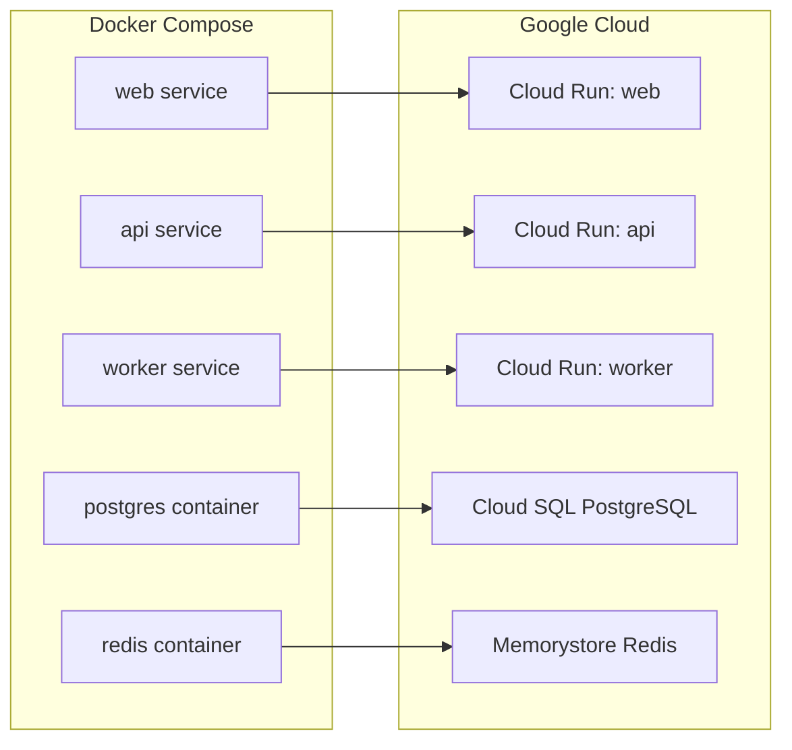

# How to Migrate a Docker Compose Application to Multiple Cloud Run Services

Author: [nawazdhandala](https://www.github.com/nawazdhandala)

Tags: GCP, Cloud Run, Docker Compose, Migration, Microservices, Google Cloud

Description: Learn how to migrate a multi-container Docker Compose application to separate Cloud Run services with managed alternatives for databases and caches.

---

Docker Compose is great for local development - you define your services, databases, and caches in a single YAML file and run everything with one command. But when it is time to move to production on Google Cloud, you need a different approach. Cloud Run does not run Docker Compose files directly.

The migration is not a one-to-one mapping. Some of your Compose services become Cloud Run services. Others - like databases and Redis - become managed GCP services. This guide walks through a real migration from a typical Docker Compose setup to a production Cloud Run architecture.

## A Typical Docker Compose Application

Let us start with a common Docker Compose setup - a web application with an API server, a background worker, a PostgreSQL database, and a Redis cache:

```yaml
# docker-compose.yml - Typical multi-service application
version: "3.8"

services:
  web:
    build: ./web
    ports:
      - "3000:3000"
    environment:
      - API_URL=http://api:8080
      - REDIS_URL=redis://redis:6379
    depends_on:
      - api
      - redis

  api:
    build: ./api
    ports:
      - "8080:8080"
    environment:
      - DATABASE_URL=postgresql://postgres:password@db:5432/myapp
      - REDIS_URL=redis://redis:6379
    depends_on:
      - db
      - redis

  worker:
    build: ./worker
    environment:
      - DATABASE_URL=postgresql://postgres:password@db:5432/myapp
      - REDIS_URL=redis://redis:6379
      - QUEUE_NAME=tasks
    depends_on:
      - db
      - redis

  db:
    image: postgres:15
    volumes:
      - postgres_data:/var/lib/postgresql/data
    environment:
      - POSTGRES_DB=myapp
      - POSTGRES_PASSWORD=password

  redis:
    image: redis:7
    volumes:
      - redis_data:/data

volumes:
  postgres_data:
  redis_data:
```

## Migration Map

Here is how each Compose service maps to GCP:



Application services (web, api, worker) become Cloud Run services. Stateful services (PostgreSQL, Redis) become managed GCP services. You should not run databases on Cloud Run because Cloud Run instances are ephemeral and have no persistent storage.

## Step 1: Set Up Managed Services

### Cloud SQL for PostgreSQL

```bash
# Create a Cloud SQL PostgreSQL instance
gcloud sql instances create myapp-db \
  --database-version=POSTGRES_15 \
  --tier=db-f1-micro \
  --region=us-central1 \
  --root-password=your-strong-password

# Create the database
gcloud sql databases create myapp --instance=myapp-db

# Create an application user
gcloud sql users create app_user \
  --instance=myapp-db \
  --password=app-user-password
```

### Memorystore for Redis

```bash
# Create a Memorystore Redis instance
gcloud redis instances create myapp-redis \
  --size=1 \
  --region=us-central1 \
  --redis-version=redis_7_0 \
  --network=default

# Get the Redis IP address
gcloud redis instances describe myapp-redis \
  --region=us-central1 \
  --format="get(host)"
```

Memorystore is a private service that only accepts connections from within the VPC. Your Cloud Run services will need VPC egress configured.

## Step 2: Prepare Container Images

Each service needs its own Dockerfile. You likely already have these from your Compose setup. Build and push them:

```bash
# Create an Artifact Registry repository
gcloud artifacts repositories create myapp \
  --repository-format=docker \
  --location=us-central1

# Build and push each service image
gcloud builds submit ./web \
  --tag us-central1-docker.pkg.dev/$(gcloud config get-value project)/myapp/web:latest

gcloud builds submit ./api \
  --tag us-central1-docker.pkg.dev/$(gcloud config get-value project)/myapp/api:latest

gcloud builds submit ./worker \
  --tag us-central1-docker.pkg.dev/$(gcloud config get-value project)/myapp/worker:latest
```

## Step 3: Store Secrets

Move database passwords and other secrets to Secret Manager:

```bash
# Store the database connection string as a secret
echo -n "postgresql://app_user:app-user-password@/myapp?host=/cloudsql/PROJECT_ID:us-central1:myapp-db" | \
  gcloud secrets create db-url --data-file=-

# Store the Redis URL
REDIS_HOST=$(gcloud redis instances describe myapp-redis --region=us-central1 --format="get(host)")
echo -n "redis://${REDIS_HOST}:6379" | \
  gcloud secrets create redis-url --data-file=-
```

## Step 4: Set Up VPC Networking

Cloud Run services need VPC access to reach Memorystore and optionally Cloud SQL:

```bash
# Create a subnet for Cloud Run (if not using an existing one)
gcloud compute networks subnets create cloud-run-subnet \
  --network=default \
  --region=us-central1 \
  --range=10.10.0.0/24
```

## Step 5: Deploy the API Service

The API service is the core backend. It connects to both Cloud SQL and Memorystore:

```bash
# Deploy the API service
gcloud run deploy api \
  --image=us-central1-docker.pkg.dev/$(gcloud config get-value project)/myapp/api:latest \
  --region=us-central1 \
  --add-cloudsql-instances=$(gcloud config get-value project):us-central1:myapp-db \
  --set-secrets="DATABASE_URL=db-url:latest,REDIS_URL=redis-url:latest" \
  --network=default \
  --subnet=cloud-run-subnet \
  --vpc-egress=private-ranges-only \
  --cpu=1 \
  --memory=512Mi \
  --min-instances=1 \
  --allow-unauthenticated
```

The `--add-cloudsql-instances` flag sets up the Cloud SQL Auth Proxy sidecar, which handles authentication and encryption to Cloud SQL automatically.

## Step 6: Deploy the Web Frontend

The web service calls the API. It needs the API URL as an environment variable:

```bash
# Get the API service URL
API_URL=$(gcloud run services describe api --region=us-central1 --format="get(status.url)")

# Deploy the web frontend
gcloud run deploy web \
  --image=us-central1-docker.pkg.dev/$(gcloud config get-value project)/myapp/web:latest \
  --region=us-central1 \
  --set-env-vars="API_URL=${API_URL}" \
  --set-secrets="REDIS_URL=redis-url:latest" \
  --network=default \
  --subnet=cloud-run-subnet \
  --vpc-egress=private-ranges-only \
  --cpu=1 \
  --memory=512Mi \
  --allow-unauthenticated
```

## Step 7: Deploy the Worker Service

The worker processes background tasks. It does not serve HTTP traffic but needs a health check endpoint. It also needs always-on CPU since it runs continuously:

```bash
# Deploy the worker service
gcloud run deploy worker \
  --image=us-central1-docker.pkg.dev/$(gcloud config get-value project)/myapp/worker:latest \
  --region=us-central1 \
  --add-cloudsql-instances=$(gcloud config get-value project):us-central1:myapp-db \
  --set-secrets="DATABASE_URL=db-url:latest,REDIS_URL=redis-url:latest" \
  --set-env-vars="QUEUE_NAME=tasks" \
  --network=default \
  --subnet=cloud-run-subnet \
  --vpc-egress=private-ranges-only \
  --cpu=1 \
  --memory=512Mi \
  --cpu-always-allocated \
  --min-instances=1 \
  --no-allow-unauthenticated
```

The `--cpu-always-allocated` flag keeps CPU active between requests so the worker can process queue items continuously.

## Step 8: Update Application Code

There are a few code changes needed for the Cloud Run environment.

### Database Connection

With Cloud SQL Auth Proxy, the connection string uses a Unix socket:

```python
# Cloud SQL connection using Unix socket
import os
import sqlalchemy

def get_db_connection():
    """Connect to Cloud SQL via the Auth Proxy Unix socket."""
    db_url = os.environ["DATABASE_URL"]

    # Cloud SQL Auth Proxy provides a Unix socket at this path
    # The connection string format includes ?host=/cloudsql/INSTANCE_CONNECTION_NAME
    engine = sqlalchemy.create_engine(db_url)
    return engine
```

### Service-to-Service Communication

In Docker Compose, services call each other by name (e.g., `http://api:8080`). In Cloud Run, each service has its own URL. Update your code to use environment variables for service URLs:

```python
# Before (Docker Compose): hardcoded service names
API_URL = "http://api:8080"

# After (Cloud Run): URL from environment variable
API_URL = os.environ["API_URL"]
```

For internal service calls, use proper authentication:

```python
# Authenticated call between Cloud Run services
import google.auth.transport.requests
import google.oauth2.id_token
import requests

def call_api(endpoint, data):
    """Call the API service with authentication."""
    api_url = os.environ["API_URL"]
    url = f"{api_url}{endpoint}"

    # Get an ID token for the target service
    auth_req = google.auth.transport.requests.Request()
    token = google.oauth2.id_token.fetch_id_token(auth_req, api_url)

    headers = {"Authorization": f"Bearer {token}"}
    return requests.post(url, json=data, headers=headers)
```

## Step 9: Set Up Pub/Sub for Worker Communication

In Docker Compose, the web/API services communicate with the worker through Redis queues. On Cloud Run, you can continue using Redis for queuing or switch to Pub/Sub for better reliability:

```bash
# Create a Pub/Sub topic for tasks
gcloud pubsub topics create tasks

# Create a push subscription that targets the worker
gcloud pubsub subscriptions create tasks-sub \
  --topic=tasks \
  --push-endpoint="https://worker-xxxxx-uc.a.run.app/process" \
  --push-auth-service-account=pubsub-invoker@$(gcloud config get-value project).iam.gserviceaccount.com \
  --ack-deadline=120
```

## Maintaining Local Development

After migrating to Cloud Run, you can still use Docker Compose for local development. Keep your `docker-compose.yml` as-is and use environment variable overrides for production:

```yaml
# docker-compose.override.yml - Local development overrides
version: "3.8"

services:
  api:
    environment:
      - DATABASE_URL=postgresql://postgres:password@db:5432/myapp
      - REDIS_URL=redis://redis:6379
      - ENVIRONMENT=development
```

In production, these values come from Secret Manager and environment variables set during Cloud Run deployment.

## Summary

Migrating from Docker Compose to Cloud Run involves mapping each service to the right GCP resource. Application containers become Cloud Run services, databases become Cloud SQL, and Redis becomes Memorystore. The key code changes are updating service URLs to use environment variables instead of container names, setting up VPC networking for private services, and adding authentication for service-to-service calls. Keep your Docker Compose setup for local development and use Cloud Run for production - the same application code runs in both environments with different configuration.
