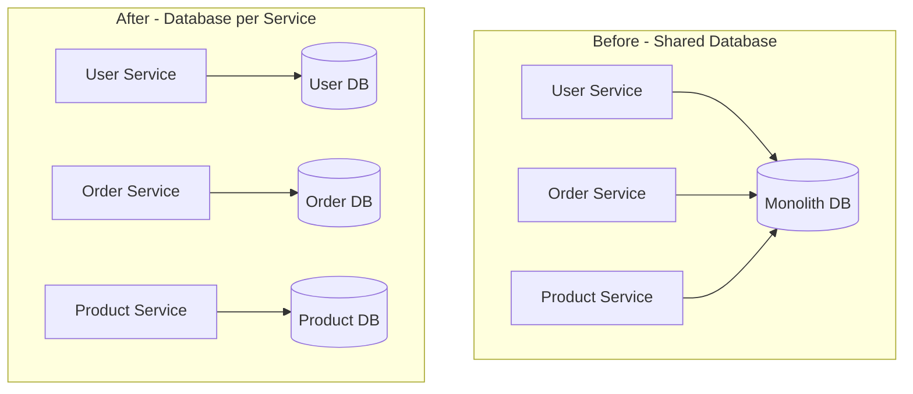

# How to Migrate a Monolithic Database to Microservice-Specific Databases on Cloud SQL

Author: [nawazdhandala](https://www.github.com/nawazdhandala)

Tags: GCP, Cloud SQL, Microservices, Database, Migration

Description: Learn how to decompose a single monolithic database into separate microservice-owned databases on Google Cloud SQL step by step.

---

When you break a monolith into microservices, the hardest part is not splitting the code - it is splitting the database. A monolithic application typically has one large database with dozens or hundreds of tables, and those tables are connected through foreign keys, joins, stored procedures, and shared sequences. Giving each microservice its own database on Cloud SQL is the right architectural goal, but getting there without breaking everything requires careful planning and execution.

## Why Separate Databases Matter

Microservices that share a database are not really microservices. They are a distributed monolith where any schema change can break multiple services, any performance problem in one table affects all services, and you cannot scale databases independently.

Each microservice should own its data:



## Step 1 - Map Tables to Services

Start by categorizing every table in your monolithic database by which service should own it:

```sql
-- List all tables and their approximate sizes
SELECT
    table_name,
    pg_size_pretty(pg_total_relation_size(table_name::regclass)) AS total_size,
    (SELECT count(*) FROM information_schema.columns WHERE columns.table_name = tables.table_name) AS column_count
FROM information_schema.tables
WHERE table_schema = 'public'
    AND table_type = 'BASE TABLE'
ORDER BY pg_total_relation_size(table_name::regclass) DESC;

-- Check foreign key dependencies between tables
SELECT
    tc.table_name AS source_table,
    kcu.column_name AS source_column,
    ccu.table_name AS target_table,
    ccu.column_name AS target_column
FROM information_schema.table_constraints tc
JOIN information_schema.key_column_usage kcu
    ON tc.constraint_name = kcu.constraint_name
JOIN information_schema.constraint_column_usage ccu
    ON tc.constraint_name = ccu.constraint_name
WHERE tc.constraint_type = 'FOREIGN KEY'
ORDER BY tc.table_name;
```

Create a mapping document:

```yaml
# Database decomposition mapping
services:
  user-service:
    tables:
      - users
      - user_profiles
      - user_preferences
      - user_sessions
      - roles
      - user_roles
    cross_references:
      - "orders.user_id references users.id"
      - "reviews.user_id references users.id"

  order-service:
    tables:
      - orders
      - order_items
      - order_status_history
      - shipping_addresses
    cross_references:
      - "order_items.product_id references products.id"
      - "orders.user_id references users.id"

  product-service:
    tables:
      - products
      - categories
      - product_images
      - product_reviews
      - inventory
    cross_references:
      - "product_reviews.user_id references users.id"
```

## Step 2 - Identify and Break Foreign Key Dependencies

Cross-service foreign keys are the main challenge. You need to replace them with application-level references:

```sql
-- Before: The orders table has a foreign key to users
CREATE TABLE orders (
    id SERIAL PRIMARY KEY,
    user_id INTEGER REFERENCES users(id),  -- Cross-service FK
    product_id INTEGER REFERENCES products(id),  -- Cross-service FK
    total DECIMAL(10,2),
    status VARCHAR(20),
    created_at TIMESTAMP DEFAULT CURRENT_TIMESTAMP
);

-- After: The orders table stores user_id and product_id as plain integers
-- Referential integrity is handled by the application, not the database
CREATE TABLE orders (
    id SERIAL PRIMARY KEY,
    user_id INTEGER NOT NULL,      -- No FK - just a reference
    product_id INTEGER NOT NULL,   -- No FK - just a reference
    total DECIMAL(10,2),
    status VARCHAR(20),
    created_at TIMESTAMP DEFAULT CURRENT_TIMESTAMP
);

-- Create an index for efficient lookups by user_id
CREATE INDEX idx_orders_user_id ON orders(user_id);
CREATE INDEX idx_orders_product_id ON orders(product_id);
```

## Step 3 - Create Cloud SQL Instances

Create separate Cloud SQL instances for each microservice:

```bash
# User Service database
gcloud sql instances create user-db \
  --database-version POSTGRES_15 \
  --tier db-custom-2-8192 \
  --region us-central1 \
  --availability-type REGIONAL \
  --storage-type SSD \
  --storage-size 20GB \
  --storage-auto-increase

gcloud sql databases create users --instance user-db

# Order Service database
gcloud sql instances create order-db \
  --database-version POSTGRES_15 \
  --tier db-custom-4-16384 \
  --region us-central1 \
  --availability-type REGIONAL \
  --storage-type SSD \
  --storage-size 50GB \
  --storage-auto-increase

gcloud sql databases create orders --instance order-db

# Product Service database
gcloud sql instances create product-db \
  --database-version POSTGRES_15 \
  --tier db-custom-2-8192 \
  --region us-central1 \
  --availability-type REGIONAL \
  --storage-type SSD \
  --storage-size 30GB \
  --storage-auto-increase

gcloud sql databases create products --instance product-db
```

## Step 4 - Replace Joins with API Calls

Queries that join across service boundaries need to be replaced with API calls:

```python
# Before: A single SQL query that joins orders with users and products
# SELECT o.id, o.total, u.name, u.email, p.name as product_name
# FROM orders o
# JOIN users u ON o.user_id = u.id
# JOIN order_items oi ON oi.order_id = o.id
# JOIN products p ON oi.product_id = p.id
# WHERE o.id = 123;

# After: Multiple API calls to compose the data
async def get_order_details(order_id):
    # Get the order from the order service database
    order = await order_db.fetch_one(
        "SELECT id, user_id, total, status, created_at FROM orders WHERE id = $1",
        order_id
    )

    # Get order items
    items = await order_db.fetch_all(
        "SELECT product_id, quantity, price FROM order_items WHERE order_id = $1",
        order_id
    )

    # Fetch user details from the User Service (HTTP call)
    user = await http_client.get(f"http://user-service/api/users/{order['user_id']}")

    # Fetch product details from the Product Service (batch call for efficiency)
    product_ids = [item["product_id"] for item in items]
    products = await http_client.post(
        "http://product-service/api/products/batch",
        json={"ids": product_ids}
    )

    # Combine the data in the application layer
    products_map = {p["id"]: p for p in products}
    return {
        "order_id": order["id"],
        "total": float(order["total"]),
        "status": order["status"],
        "customer": {
            "name": user["name"],
            "email": user["email"]
        },
        "items": [
            {
                "product_name": products_map[item["product_id"]]["name"],
                "quantity": item["quantity"],
                "price": float(item["price"])
            }
            for item in items
        ]
    }
```

## Step 5 - Data Denormalization

To avoid excessive cross-service calls, denormalize data that is frequently accessed together:

```python
# Instead of calling the user service every time you need the customer name,
# store a copy of the name in the order

# Order Service schema with denormalized customer info
# CREATE TABLE orders (
#     id SERIAL PRIMARY KEY,
#     user_id INTEGER NOT NULL,
#     customer_name VARCHAR(255),  -- Denormalized from User Service
#     customer_email VARCHAR(255), -- Denormalized from User Service
#     total DECIMAL(10,2),
#     status VARCHAR(20)
# );

# When an order is created, copy the customer info
async def create_order(order_data):
    # Get current customer info from User Service
    customer = await http_client.get(
        f"http://user-service/api/users/{order_data['customer_id']}"
    )

    # Store the order with denormalized customer data
    await order_db.execute("""
        INSERT INTO orders (user_id, customer_name, customer_email, total, status)
        VALUES ($1, $2, $3, $4, 'pending')
    """, order_data['customer_id'], customer['name'], customer['email'],
         order_data['total'])
```

Keep denormalized data in sync using events:

```python
# User Service publishes events when user data changes
publisher.publish(
    'user-events',
    json.dumps({
        "event_type": "user.updated",
        "user_id": user_id,
        "changes": {"name": new_name, "email": new_email}
    }).encode('utf-8')
)

# Order Service subscribes to user update events
def handle_user_updated(message):
    event = json.loads(message.data.decode('utf-8'))
    if event["event_type"] == "user.updated":
        # Update denormalized customer info in all their orders
        order_db.execute("""
            UPDATE orders
            SET customer_name = $1, customer_email = $2
            WHERE user_id = $3
        """, event["changes"].get("name"), event["changes"].get("email"),
             event["user_id"])
    message.ack()
```

## Step 6 - Migrate Data Incrementally

Use a phased approach to migrate data from the monolith database to service-specific databases:

```bash
# Phase 1: Copy data to the new database while the monolith still uses the old one
pg_dump -h monolith-db -t users -t user_profiles -t user_preferences \
  --data-only monolith_app | psql -h user-db users

# Phase 2: Set up change data capture to sync ongoing changes
# Use Debezium or custom triggers to capture writes in the monolith
# and replay them to the new service databases

# Phase 3: Switch the service to read from its own database
# Phase 4: Switch the service to write to its own database
# Phase 5: Stop syncing and remove the tables from the monolith
```

## Step 7 - Handle Distributed Transactions

Without a shared database, you cannot use database transactions that span services. Use the Saga pattern instead:

```python
# Saga for order creation
# Instead of: BEGIN; INSERT order; UPDATE inventory; INSERT payment; COMMIT;
# Use: Create order -> Reserve inventory -> Process payment
# If any step fails, compensate the previous steps

async def create_order_saga(order_data):
    order_id = None
    inventory_reserved = False

    try:
        # Step 1: Create the order
        order_id = await order_service.create_order(order_data)

        # Step 2: Reserve inventory
        await inventory_service.reserve(order_data["items"])
        inventory_reserved = True

        # Step 3: Process payment
        await payment_service.charge(order_data["customer_id"], order_data["total"])

        # All steps succeeded - confirm the order
        await order_service.confirm_order(order_id)

    except Exception as e:
        # Compensate: undo completed steps in reverse order
        if inventory_reserved:
            await inventory_service.release(order_data["items"])
        if order_id:
            await order_service.cancel_order(order_id)
        raise e
```

## Common Pitfalls

- **Moving all tables at once.** Migrate one service's tables at a time. Start with the least connected tables.
- **Not handling eventual consistency.** With separate databases, data will be temporarily inconsistent. Design your application to handle this gracefully.
- **Over-denormalizing.** Copy only the data you frequently need. Not everything needs to be denormalized.
- **Ignoring data migration time.** Large tables take time to copy. Plan for the migration window.
- **Shared sequences.** If multiple services need unique IDs, use UUIDs instead of auto-incrementing sequences tied to a single database.

Database decomposition is the hardest part of a microservices migration. Take it slowly, migrate one service at a time, and keep the monolith database running as a fallback until you are confident each service's database is working correctly.
