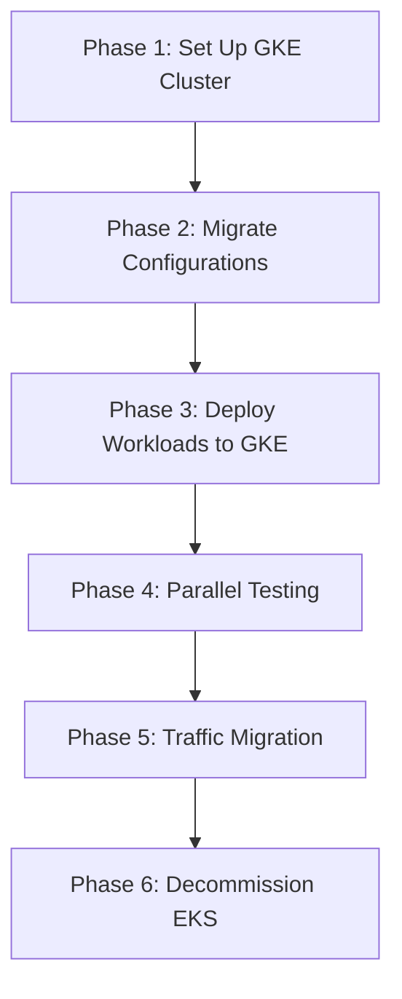

# How to Migrate Amazon EKS Clusters to Google Kubernetes Engine with Minimal Downtime

Author: [nawazdhandala](https://www.github.com/nawazdhandala)

Tags: GCP, GKE, EKS, Kubernetes, Migration

Description: Migrate your Amazon EKS clusters to Google Kubernetes Engine with minimal downtime using a parallel-run strategy and gradual traffic shifting.

---

Migrating Kubernetes clusters between cloud providers is one of the more challenging infrastructure migrations you can undertake. Unlike migrating a database or object storage, a Kubernetes cluster is a living system with applications, networking, storage, secrets, and observability stacks that all need to move together.

The good news is that Kubernetes itself is portable by design. Your YAML manifests, Helm charts, and container images work on any Kubernetes distribution. The hard parts are the cloud-specific integrations - load balancers, storage classes, IAM, and monitoring.

In this post, I will walk through a practical strategy for migrating from EKS to GKE with minimal downtime.

## Migration Strategy

The approach I recommend is a parallel-run migration. You stand up the GKE cluster alongside EKS, deploy your workloads to both, verify everything works, and then gradually shift traffic from EKS to GKE. This minimizes risk because you can always fall back to EKS if something goes wrong.



## Phase 1: Set Up the GKE Cluster

Create a GKE cluster that matches your EKS cluster configuration:

```hcl
# gke-cluster.tf
# GKE cluster matching EKS cluster specifications

resource "google_container_cluster" "primary" {
  name     = "production-cluster"
  location = var.region
  project  = var.project_id

  # Use a separately managed node pool
  remove_default_node_pool = true
  initial_node_count       = 1

  # Network configuration
  network    = google_compute_network.vpc.name
  subnetwork = google_compute_subnetwork.gke_subnet.name

  # Enable Workload Identity (replaces IRSA from EKS)
  workload_identity_config {
    workload_pool = "${var.project_id}.svc.id.goog"
  }

  # Private cluster for security
  private_cluster_config {
    enable_private_nodes    = true
    enable_private_endpoint = false
    master_ipv4_cidr_block  = "172.16.0.0/28"
  }

  # Enable network policies
  network_policy {
    enabled  = true
    provider = "CALICO"
  }

  # Release channel for auto-upgrades
  release_channel {
    channel = "REGULAR"
  }

  # Match your EKS cluster version
  min_master_version = "1.28"
}

# Node pool matching EKS node group
resource "google_container_node_pool" "primary_nodes" {
  name     = "primary-pool"
  location = var.region
  cluster  = google_container_cluster.primary.name
  project  = var.project_id

  autoscaling {
    min_node_count = 3
    max_node_count = 20
  }

  node_config {
    # Match your EKS instance types
    machine_type = "e2-standard-4"  # Equivalent to m5.xlarge
    disk_size_gb = 100
    disk_type    = "pd-ssd"

    # Workload Identity
    workload_metadata_config {
      mode = "GKE_METADATA"
    }

    oauth_scopes = [
      "https://www.googleapis.com/auth/cloud-platform"
    ]

    labels = {
      environment = "production"
      migrated    = "from-eks"
    }
  }
}
```

## Phase 2: Migrate Configurations

Export your EKS configurations and translate them for GKE.

This script exports all Kubernetes resources from EKS:

```bash
#!/bin/bash
# export-eks-resources.sh
# Export all Kubernetes resources from EKS for migration

EXPORT_DIR="./eks-export"
mkdir -p "$EXPORT_DIR"

# List of resource types to export
RESOURCES=(
  "deployments"
  "statefulsets"
  "daemonsets"
  "services"
  "configmaps"
  "secrets"
  "ingresses"
  "networkpolicies"
  "horizontalpodautoscalers"
  "poddisruptionbudgets"
  "serviceaccounts"
  "roles"
  "rolebindings"
  "clusterroles"
  "clusterrolebindings"
)

# Export each resource type from each namespace
for ns in $(kubectl get namespaces -o jsonpath='{.items[*].metadata.name}'); do
  # Skip system namespaces
  if [[ "$ns" == "kube-system" || "$ns" == "kube-public" || "$ns" == "kube-node-lease" ]]; then
    continue
  fi

  mkdir -p "$EXPORT_DIR/$ns"

  for resource in "${RESOURCES[@]}"; do
    kubectl get "$resource" -n "$ns" -o yaml > "$EXPORT_DIR/$ns/$resource.yaml" 2>/dev/null
  done
done

echo "Export complete. Resources saved to $EXPORT_DIR"
```

Now translate AWS-specific configurations to GCP equivalents:

```python
# translate_manifests.py
# Translates AWS-specific Kubernetes manifests to GCP equivalents
import yaml
import re
import os
import sys

def translate_manifest(manifest):
    """Translate AWS-specific Kubernetes resources for GKE."""
    kind = manifest.get('kind', '')

    # Translate annotations
    translate_annotations(manifest)

    # Translate service account IRSA to Workload Identity
    if kind == 'ServiceAccount':
        translate_service_account(manifest)

    # Translate storage classes
    if kind == 'PersistentVolumeClaim':
        translate_storage_class(manifest)

    # Translate ingress annotations
    if kind == 'Ingress':
        translate_ingress(manifest)

    # Translate service load balancer annotations
    if kind == 'Service':
        translate_service(manifest)

    # Replace ECR image references with Artifact Registry
    translate_image_references(manifest)

    return manifest


def translate_service_account(sa):
    """Convert IRSA annotations to Workload Identity annotations."""
    annotations = sa.get('metadata', {}).get('annotations', {})

    # Replace IRSA annotation with Workload Identity annotation
    if 'eks.amazonaws.com/role-arn' in annotations:
        role_arn = annotations.pop('eks.amazonaws.com/role-arn')
        # Map to GCP service account
        gcp_sa = map_aws_role_to_gcp_sa(role_arn)
        annotations['iam.gke.io/gcp-service-account'] = gcp_sa

    sa.setdefault('metadata', {})['annotations'] = annotations


def translate_ingress(ingress):
    """Convert ALB ingress annotations to GKE ingress annotations."""
    annotations = ingress.get('metadata', {}).get('annotations', {})

    # Map common ALB annotations to GKE equivalents
    alb_to_gke = {
        'kubernetes.io/ingress.class': 'kubernetes.io/ingress.class',
        'alb.ingress.kubernetes.io/scheme': None,  # GKE uses internal annotation differently
        'alb.ingress.kubernetes.io/certificate-arn': None,  # Use Google-managed certs
    }

    # Replace ingress class
    if annotations.get('kubernetes.io/ingress.class') == 'alb':
        annotations['kubernetes.io/ingress.class'] = 'gce'

    # Add GKE-specific annotations
    annotations['kubernetes.io/ingress.global-static-ip-name'] = 'web-static-ip'

    ingress.setdefault('metadata', {})['annotations'] = annotations


def translate_service(service):
    """Convert AWS service annotations to GCP equivalents."""
    annotations = service.get('metadata', {}).get('annotations', {})

    # Replace NLB annotations with GCP equivalents
    aws_annotations = [k for k in annotations if 'aws' in k.lower()]
    for ann in aws_annotations:
        del annotations[ann]

    # Add GCP internal load balancer annotation if needed
    if 'internal' in str(annotations):
        annotations['cloud.google.com/load-balancer-type'] = 'Internal'

    service.setdefault('metadata', {})['annotations'] = annotations


def translate_storage_class(pvc):
    """Map AWS storage classes to GCP equivalents."""
    storage_class_map = {
        'gp2': 'standard',
        'gp3': 'standard',
        'io1': 'premium-rwo',
        'io2': 'premium-rwo',
    }

    spec = pvc.get('spec', {})
    current_class = spec.get('storageClassName', '')

    if current_class in storage_class_map:
        spec['storageClassName'] = storage_class_map[current_class]


def translate_image_references(manifest):
    """Replace ECR image URLs with Artifact Registry URLs."""
    spec = manifest.get('spec', {})
    template = spec.get('template', {}).get('spec', {})

    for container in template.get('containers', []):
        image = container.get('image', '')
        # Replace ECR URL pattern with Artifact Registry
        if '.dkr.ecr.' in image:
            # Extract image name and tag
            parts = image.split('/')
            image_name_tag = parts[-1]
            container['image'] = (
                f"us-docker.pkg.dev/my-project/my-repo/{image_name_tag}"
            )


def map_aws_role_to_gcp_sa(role_arn):
    """Map an AWS IAM role ARN to a GCP service account email."""
    # Extract the role name from the ARN
    role_name = role_arn.split('/')[-1]
    # Convention: use the same name for the GCP service account
    return f"{role_name}@my-project.iam.gserviceaccount.com"


def process_directory(input_dir, output_dir):
    """Process all YAML files in a directory."""
    os.makedirs(output_dir, exist_ok=True)

    for root, dirs, files in os.walk(input_dir):
        for filename in files:
            if filename.endswith('.yaml') or filename.endswith('.yml'):
                input_path = os.path.join(root, filename)
                rel_path = os.path.relpath(input_path, input_dir)
                output_path = os.path.join(output_dir, rel_path)

                os.makedirs(os.path.dirname(output_path), exist_ok=True)

                with open(input_path, 'r') as f:
                    documents = list(yaml.safe_load_all(f))

                translated = []
                for doc in documents:
                    if doc:
                        translated.append(translate_manifest(doc))

                with open(output_path, 'w') as f:
                    yaml.dump_all(translated, f, default_flow_style=False)

                print(f"Translated: {rel_path}")


if __name__ == '__main__':
    process_directory('./eks-export', './gke-manifests')
```

## Phase 3: Migrate Container Images

Move your container images from ECR to Artifact Registry:

```bash
# Migrate images from ECR to Artifact Registry
# First, authenticate to both registries
aws ecr get-login-password --region us-east-1 | \
  docker login --username AWS --password-stdin 123456789.dkr.ecr.us-east-1.amazonaws.com

gcloud auth configure-docker us-docker.pkg.dev

# Use crane for efficient image copying without pulling/pushing
crane copy \
  123456789.dkr.ecr.us-east-1.amazonaws.com/my-app:latest \
  us-docker.pkg.dev/my-project/my-repo/my-app:latest
```

## Phase 4: Deploy and Test on GKE

Deploy your translated manifests to GKE and run verification:

```bash
# Apply namespaces first
kubectl apply -f gke-manifests/namespaces.yaml --context gke-context

# Apply configurations and secrets
kubectl apply -f gke-manifests/configmaps/ --context gke-context
kubectl apply -f gke-manifests/secrets/ --context gke-context

# Apply workloads
kubectl apply -f gke-manifests/deployments/ --context gke-context

# Verify all pods are running
kubectl get pods --all-namespaces --context gke-context | grep -v Running
```

## Phase 5: Traffic Migration

Use DNS-based traffic shifting to gradually move traffic from EKS to GKE:

```hcl
# dns-migration.tf
# Weighted DNS routing for gradual traffic migration

resource "google_dns_record_set" "app" {
  name         = "app.example.com."
  type         = "A"
  ttl          = 60  # Low TTL for faster switching
  managed_zone = google_dns_managed_zone.example.name

  routing_policy {
    wrr {
      # Start with 10% to GKE
      weight  = 10
      rrdatas = [google_compute_global_address.gke_lb.address]
    }
    wrr {
      # 90% still going to EKS
      weight  = 90
      rrdatas = [data.aws_lb.eks_lb.dns_name]
    }
  }
}
```

Gradually increase the GKE weight from 10% to 25%, 50%, 75%, and finally 100% as you gain confidence.

## Phase 6: Verification and Cleanup

After running at 100% on GKE for a sufficient period (I recommend at least a week), decommission the EKS cluster:

```bash
# Final verification
kubectl get pods --all-namespaces --context gke-context | grep -v Running

# Check no traffic is going to EKS
# Monitor EKS load balancer metrics for zero requests

# Delete EKS cluster when ready
eksctl delete cluster --name production-cluster --region us-east-1
```

## Wrapping Up

Migrating from EKS to GKE is a significant undertaking, but the parallel-run approach makes it manageable. The key is to take it in phases: stand up the new cluster, translate your manifests, move your images, test thoroughly, and shift traffic gradually. Do not try to do a big-bang cutover. The ability to fall back to EKS at any point gives you the confidence to move forward without risking downtime for your users.
