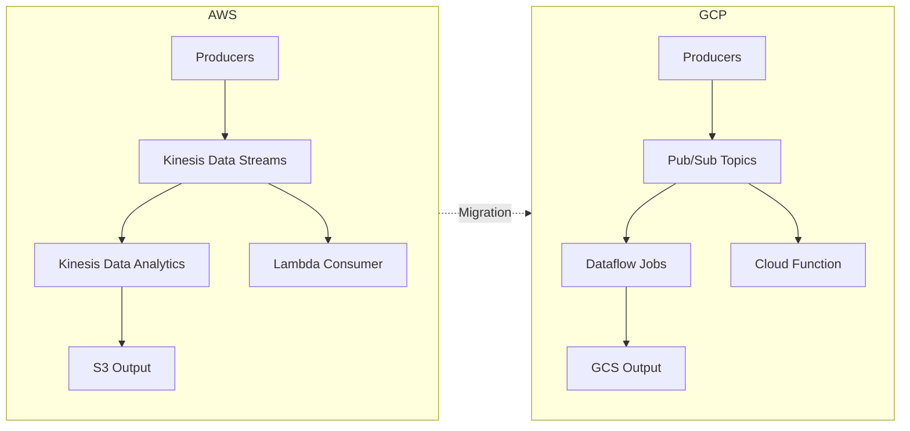

# How to Migrate Amazon Kinesis Data Streams to Google Cloud Pub/Sub and Dataflow

Author: [nawazdhandala](https://www.github.com/nawazdhandala)

Tags: GCP, Google Cloud Pub/Sub, Dataflow, AWS Kinesis, Stream Processing, Cloud Migration

Description: A step-by-step guide to migrating Amazon Kinesis Data Streams to Google Cloud Pub/Sub and Dataflow for real-time stream processing workloads.

---

Amazon Kinesis Data Streams and Google Cloud Pub/Sub are both managed streaming services, but they have fundamentally different architectures. Kinesis uses a shard-based model where you provision throughput capacity. Pub/Sub is a serverless messaging service that auto-scales without shard management. When you factor in stream processing, Kinesis Data Analytics maps to Google Cloud Dataflow.

This guide covers migrating both the streaming infrastructure and the processing logic.

## Architectural Differences That Matter

Before starting, understand what changes between the two platforms:

- Kinesis shards have a fixed read/write throughput. Pub/Sub topics auto-scale - no capacity planning needed.
- Kinesis retains data for 24 hours by default (up to 365 days). Pub/Sub retains unacknowledged messages for 7 days by default (up to 31 days).
- Kinesis consumers track their position using sequence numbers. Pub/Sub uses subscriptions with automatic acknowledgment tracking.
- Kinesis uses partition keys for ordering within shards. Pub/Sub provides ordering keys for ordered delivery within subscriptions.
- Kinesis Data Analytics uses SQL or Apache Flink. Dataflow uses Apache Beam.



## Step 1: Inventory Your Kinesis Streams

Document every stream, its shard count, producers, and consumers.

```bash
# List all Kinesis streams
aws kinesis list-streams --output table

# Get details for each stream
aws kinesis describe-stream-summary \
  --stream-name my-event-stream \
  --query 'StreamDescriptionSummary.{
    Name:StreamName,
    Shards:OpenShardCount,
    Retention:RetentionPeriodHours,
    EncryptionType:EncryptionType
  }'

# List all Kinesis Data Analytics applications
aws kinesisanalyticsv2 list-applications \
  --query 'ApplicationSummaries[*].{Name:ApplicationName,Status:ApplicationStatus}'
```

## Step 2: Create Pub/Sub Topics and Subscriptions

For each Kinesis stream, create a corresponding Pub/Sub topic. For each consumer application, create a subscription.

```bash
# Create a Pub/Sub topic (equivalent to a Kinesis stream)
gcloud pubsub topics create my-event-stream

# Create a pull subscription for batch consumers
gcloud pubsub subscriptions create my-event-stream-processor \
  --topic=my-event-stream \
  --ack-deadline=60 \
  --message-retention-duration=7d \
  --expiration-period=never

# Create an ordered subscription if your Kinesis stream uses partition keys for ordering
gcloud pubsub subscriptions create my-event-stream-ordered \
  --topic=my-event-stream \
  --enable-message-ordering \
  --ack-deadline=60
```

If you have multiple consumers reading the same Kinesis stream (fan-out), create a separate subscription for each consumer. Each subscription gets its own copy of the messages - unlike Kinesis where you need enhanced fan-out or careful iterator management.

## Step 3: Migrate Producer Code

Kinesis producers use the PutRecord or PutRecords API. Pub/Sub uses a publisher client.

Here is a Python producer migration example:

```python
# Old Kinesis producer code
import boto3
import json

kinesis = boto3.client('kinesis')

def send_to_kinesis(event):
    # Put a record into the Kinesis stream with a partition key
    kinesis.put_record(
        StreamName='my-event-stream',
        Data=json.dumps(event),
        PartitionKey=event['user_id']
    )

# New Pub/Sub publisher code
from google.cloud import pubsub_v1
import json

publisher = pubsub_v1.PublisherClient()
topic_path = publisher.topic_path('my-project', 'my-event-stream')

def send_to_pubsub(event):
    # Publish a message to the Pub/Sub topic
    # ordering_key preserves ordering like Kinesis partition keys
    data = json.dumps(event).encode('utf-8')
    future = publisher.publish(
        topic_path,
        data,
        ordering_key=event['user_id'],  # equivalent to partition key
        event_type=event.get('type', 'unknown')  # custom attributes
    )
    future.result()  # block until published
```

For high-throughput producers, configure batching:

```python
# Configure batching for high-throughput publishing
from google.cloud.pubsub_v1.types import BatchSettings

batch_settings = BatchSettings(
    max_messages=500,       # batch up to 500 messages
    max_bytes=1024 * 1024,  # or 1MB, whichever comes first
    max_latency=0.05        # or 50ms latency
)

publisher = pubsub_v1.PublisherClient(batch_settings=batch_settings)
```

## Step 4: Migrate Consumer Code

Kinesis consumers use the GetRecords API or the Kinesis Client Library (KCL). Pub/Sub consumers use pull or push subscriptions.

```python
# Old Kinesis consumer using KCL pattern
import boto3

kinesis = boto3.client('kinesis')

def process_kinesis_records():
    shard_iterator = kinesis.get_shard_iterator(
        StreamName='my-event-stream',
        ShardId='shardId-000000000000',
        ShardIteratorType='LATEST'
    )['ShardIterator']

    while True:
        response = kinesis.get_records(ShardIterator=shard_iterator)
        for record in response['Records']:
            process(record['Data'])
        shard_iterator = response['NextShardIterator']

# New Pub/Sub subscriber code
from google.cloud import pubsub_v1
from concurrent.futures import TimeoutError

subscriber = pubsub_v1.SubscriberClient()
subscription_path = subscriber.subscription_path('my-project', 'my-event-stream-processor')

def callback(message):
    # Process the message and acknowledge it
    try:
        process(message.data)
        message.ack()
    except Exception as e:
        # Negative acknowledgment triggers redelivery
        message.nack()

# Start streaming pull (blocking)
streaming_pull = subscriber.subscribe(subscription_path, callback=callback)

try:
    streaming_pull.result()
except TimeoutError:
    streaming_pull.cancel()
    streaming_pull.result()
```

## Step 5: Migrate Stream Processing to Dataflow

If you use Kinesis Data Analytics for stream processing, migrate that logic to Dataflow using Apache Beam.

Here is an example converting a Kinesis Analytics SQL query into a Beam pipeline:

```python
# Apache Beam pipeline for Dataflow
# Equivalent to a Kinesis Data Analytics application
import apache_beam as beam
from apache_beam.options.pipeline_options import PipelineOptions
from apache_beam.transforms.window import FixedWindows
import json

class ParseEvent(beam.DoFn):
    """Parse JSON events from Pub/Sub messages."""
    def process(self, element):
        event = json.loads(element.decode('utf-8'))
        yield event

class FormatOutput(beam.DoFn):
    """Format aggregated results for output."""
    def process(self, element):
        key, count = element
        yield json.dumps({'event_type': key, 'count': count})

def run():
    options = PipelineOptions(
        runner='DataflowRunner',
        project='my-project',
        region='us-central1',
        streaming=True,
        temp_location='gs://my-bucket/temp'
    )

    with beam.Pipeline(options=options) as pipeline:
        # Read from Pub/Sub, window, aggregate, write to GCS
        (pipeline
         | 'ReadFromPubSub' >> beam.io.ReadFromPubSub(
             subscription='projects/my-project/subscriptions/my-event-stream-processor')
         | 'ParseJSON' >> beam.ParDo(ParseEvent())
         | 'Window' >> beam.WindowInto(FixedWindows(60))  # 1-minute windows
         | 'ExtractType' >> beam.Map(lambda e: (e['type'], 1))
         | 'CountByType' >> beam.CombinePerKey(sum)
         | 'Format' >> beam.ParDo(FormatOutput())
         | 'WriteToGCS' >> beam.io.WriteToText(
             'gs://my-output-bucket/aggregated',
             file_name_suffix='.json'))

if __name__ == '__main__':
    run()
```

Deploy this to Dataflow:

```bash
# Submit the Dataflow job
python beam_pipeline.py \
  --runner=DataflowRunner \
  --project=my-project \
  --region=us-central1 \
  --streaming \
  --temp_location=gs://my-bucket/temp \
  --job_name=event-aggregation
```

## Step 6: Run Both Systems in Parallel

During migration, run both Kinesis and Pub/Sub simultaneously. Dual-write from your producers to both systems and compare outputs.

```python
def send_event(event):
    """Dual-write to both Kinesis and Pub/Sub during migration."""
    # Write to the existing Kinesis stream
    send_to_kinesis(event)
    # Also write to the new Pub/Sub topic
    send_to_pubsub(event)
```

Monitor both pipelines for a few days and compare results to verify the Pub/Sub and Dataflow path produces identical output.

## Step 7: Set Up Monitoring

Replace your CloudWatch Kinesis metrics with Cloud Monitoring equivalents:

```bash
# Create an alert for Pub/Sub unacked message age
gcloud monitoring policies create \
  --notification-channels=projects/my-project/notificationChannels/12345 \
  --display-name="Pub/Sub Consumer Lag" \
  --condition-display-name="Old unacked messages" \
  --condition-filter='resource.type="pubsub_subscription" AND metric.type="pubsub.googleapis.com/subscription/oldest_unacked_message_age"' \
  --condition-threshold-value=300 \
  --condition-threshold-comparison=COMPARISON_GT
```

Key metrics to track:

- `pubsub.googleapis.com/subscription/num_undelivered_messages` - backlog size
- `pubsub.googleapis.com/subscription/oldest_unacked_message_age` - consumer lag
- `pubsub.googleapis.com/topic/send_request_count` - publish rate

## Summary

The migration from Kinesis to Pub/Sub and Dataflow is primarily about moving from a shard-based model to a serverless one. You gain automatic scaling and simpler fan-out, but you lose fine-grained ordering guarantees and the exact shard-level parallelism control. Plan for a parallel-run period to validate data integrity, and take the opportunity to simplify your stream processing logic as you rewrite it in Apache Beam.
